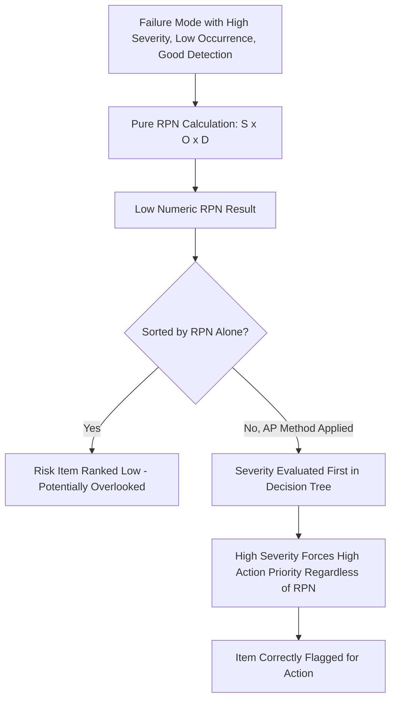

## Limitations and Criticisms of RPN

### Definition and Purpose

This topic examines the well-documented methodological weaknesses of the Risk Priority Number (RPN) as a risk-prioritization metric in FMEA. While RPN remains widely used due to its simplicity and long history, quality engineering literature and the AIAG-VDA handbook itself have identified structural flaws in the multiplicative S × O × D approach that can lead to misprioritized corrective action, particularly for safety-relevant failure modes.

### Mathematical and Statistical Criticisms

#### Non-Uniqueness of RPN Values

Because RPN is a product of three ordinal scales, many different S/O/D combinations can yield an identical numeric result despite representing fundamentally different risk profiles.

$$RPN = S \times O \times D$$

For example, on a 1–10 scale:

- $S=9, O=2, D=3 \Rightarrow RPN = 54$ (hazardous effect, rare cause, decent detection)
- $S=3, O=6, D=3 \Rightarrow RPN = 54$ (minor effect, moderate cause, decent detection)

Both items receive identical priority ranking despite one involving a potentially safety-critical outcome and the other a minor quality issue — a frequently cited structural weakness of pure RPN ranking.

#### Ordinal Scales Treated as Ratio Data

Severity, Occurrence, and Detection ratings are ordinal (rank-order) scales — a rating of 8 is understood to represent "worse than 4," but not necessarily "twice as bad." Multiplying three ordinal scales together produces a number that lacks a defensible quantitative interpretation; an RPN of 400 is not meaningfully "twice as risky" as an RPN of 200 in any measurable physical sense, even though the arithmetic implies proportionality.

#### Discontinuous/Uneven Distribution of Possible RPN Values

On a 1–10 scale, RPN can take 1,000 theoretical values, but the actual achievable products are not evenly distributed — certain RPN values are mathematically impossible or far more common than others, creating gaps and clusters that distort perceived risk-ranking granularity.

#### Insensitivity to Severity at the Extremes

A small change in Occurrence or Detection can shift RPN by the same absolute or proportional amount regardless of how catastrophic the Severity is, meaning the formula doesn't inherently weight safety-critical severity levels more heavily than routine ones — a concern especially relevant in safety-critical industries where high severity should dominate prioritization decisions.

### Practical/Organizational Criticisms

#### Threshold Gaming

When organizations set a fixed RPN action threshold (e.g., "RPN > 150 requires corrective action"), teams face an incentive — consciously or not — to adjust individual S, O, or D scores downward just enough to fall below the threshold, undermining the integrity of the rating exercise (see common rating biases and inconsistencies).

#### False Precision

Presenting RPN as a single three-digit number creates an illusion of quantitative rigor that the underlying ordinal, subjectively-rated inputs don't support, potentially misleading stakeholders (including auditors and management) into treating RPN differences as more meaningful than the rating methodology can defensibly justify.

#### Masking of High-Severity/Low-Occurrence Risks

A catastrophic-severity failure mode with low historical occurrence and good detection can produce a low RPN that ranks below numerous minor, frequently-occurring nuisance issues — even though from a risk-management and liability standpoint, the catastrophic item likely warrants continued monitoring or design-level mitigation regardless of its numeric rank.

#### Equal Weighting Assumption

Multiplying all three factors with equal mathematical weight assumes Severity, Occurrence, and Detection contribute equally to overall risk significance — an assumption not supported by how most safety and regulatory frameworks (which typically prioritize severity/hazard level above likelihood or detectability) actually approach risk.

#### Inconsistent Application Across Teams

Because RPN depends entirely on the consistency of the underlying S/O/D ratings, any drift in how different teams interpret the rating criteria produces RPN values that aren't truly comparable across the organization, even though the numbers appear directly comparable at face value (see calibrating ratings across teams).

### Industry and Standards Response

#### AIAG-VDA Action Priority (AP) Method

The AIAG-VDA 1st edition (2019) handbook formally moved away from RPN-only prioritization, introducing the **Action Priority (AP)** framework — a structured decision-tree that evaluates Severity first, then Occurrence, then Detection, and assigns each failure mode/cause a High/Medium/Low priority category. This approach explicitly prevents a high-severity item from being deprioritized purely due to a numerically low product, directly addressing the "masking" criticism above.

#### Continued Use of RPN Alongside AP

Many organizations continue calculating RPN for legacy reporting, trending over time, or contractual/customer-specific requirements, even where AP governs the actual go/no-go prioritization decision — reflecting RPN's persistence as a familiar, easily-trended metric despite its documented weaknesses.

#### Alternative and Supplementary Metrics

Some organizations supplement or replace RPN with:

- **Criticality Analysis** (as in FMECA — Failure Mode, Effects, and Criticality Analysis), which separates severity classification from a distinct probability-of-occurrence criticality matrix rather than a single multiplied score
- **Risk matrices** (Severity × Occurrence only, presented as a 2D heat map) that visually communicate risk without the false precision of a three-factor product
- **Weighted scoring models** that apply different mathematical weights to S, O, and D rather than equal multiplication

### Example

**Comparison of two failure modes under pure RPN vs. AP logic:**

| Failure Mode | Severity | Occurrence | Detection | RPN | AP Category (AIAG-VDA logic) |
| --- | --- | --- | --- | --- | --- |
| A: Brake line corrosion leading to failure | 10 | 2 | 3 | 60 | High (severity 9-10 drives High regardless of low RPN) |
| B: Dashboard trim rattle | 3 | 7 | 4 | 84 | Low/Medium (low severity caps priority even with higher RPN) |

Under pure RPN ranking, Failure Mode B (RPN 84) would appear higher priority than Failure Mode A (RPN 60), despite A involving a potential safety-of-life consequence — illustrating precisely the masking effect that motivated the shift toward Action Priority logic.

### Common Pitfalls

- Relying exclusively on RPN sort order without reviewing individual Severity ratings for high-severity items with deceptively low RPN
- Setting rigid, uniform RPN action thresholds across product lines with very different risk profiles
- Presenting RPN to stakeholders as a precise, ratio-scale risk quantity rather than an ordinal prioritization aid
- Ignoring AIAG-VDA's explicit guidance to move toward Action Priority methodology in applicable industries/programs
- Allowing RPN threshold proximity to influence individual S/O/D rating honesty (reverse-engineering scores)

### Diagram: RPN Masking Effect vs. Action Priority Correction (svg_diagram)

**Related Topics**

- Calculating the risk priority number
- Action Priority (AP) tables and methodology
- Severity rating scales and criteria
- Occurrence rating scales and criteria
- Detection rating scales and criteria
- FMECA and criticality analysis as alternative frameworks
- Common rating biases and inconsistencies
- Risk matrix approaches to failure prioritization