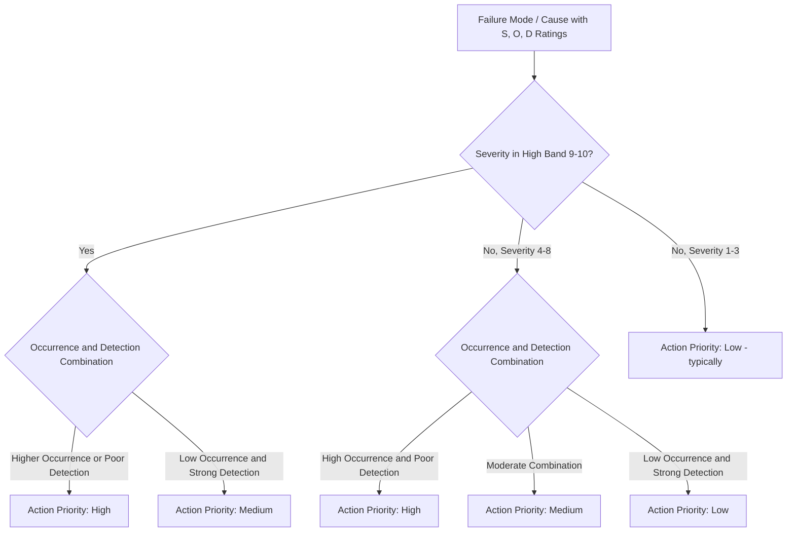

## AIAG VDA Action Priority Tables

### Definition and Purpose

The Action Priority (AP) table is the risk-prioritization method introduced in the AIAG-VDA FMEA Handbook (1st edition, 2019), developed jointly by the Automotive Industry Action Group (AIAG) and the German Association of the Automotive Industry (Verband der Automobilindustrie/VDA) to harmonize FMEA practices between North American and European automotive suppliers. AP replaces the traditional multiplicative Risk Priority Number (RPN) approach with a structured decision-tree that evaluates Severity, Occurrence, and Detection in a fixed priority sequence, assigning each failure mode/cause combination a categorical priority level — High, Medium, or Low — rather than relying solely on a numeric product.

### Why AP Was Introduced

- **Addresses RPN masking**: Pure RPN multiplication can produce a low score for a high-severity, low-occurrence, well-detected failure mode, causing safety-relevant risks to rank below minor nuisance issues (see limitations and criticisms of RPN)
- **Enforces severity-first logic**: AP is structured so that high Severity ratings (9–10, associated with safety/regulatory effects) cannot be arithmetically diluted by favorable Occurrence or Detection scores — a high-severity item is guaranteed to receive at minimum a Medium, and typically a High, priority
- **Harmonizes AIAG and VDA methodologies**: Prior to 2019, AIAG (4th edition) and VDA used separately evolved FMEA formats and terminology; the AP table is part of a broader harmonization that also standardized the 7-step FMEA process, form structure, and rating scale language
- **Reduces threshold gaming**: Because AP doesn't rely on a single multiplied number crossed against a fixed threshold, it removes some of the incentive to adjust individual ratings just to stay under an RPN cutoff

### AP Table Structure

The AP table is a decision-tree/lookup table (not a formula) that maps combinations of Severity, Occurrence, and Detection ratings to one of three priority categories:

- **High (H)**: Highest priority for engineering/team action; requires the team to identify actions to reduce risk or provide justification if no action is taken
- **Medium (M)**: Priority for engineering/team action at the team's discretion, based on capability and resources
- **Low (L)**: Lowest priority for engineering/team action; team may determine action is not needed

The table's internal logic evaluates dimensions in this sequence:

1. **Severity is checked first** — high severity (9–10) routes toward High priority almost regardless of Occurrence/Detection, reflecting the automotive industry's emphasis on safety and regulatory compliance
2. **Occurrence is checked second** — within a given severity band, higher occurrence pushes priority upward
3. **Detection is checked third** — within a given severity/occurrence combination, poor detection (high D rating) pushes priority upward, since undetectable failures pose disproportionate risk of reaching the customer

### Representative AP Logic (Simplified Illustration)

The actual AIAG-VDA handbook publishes separate, detailed AP tables for Design FMEA and Process FMEA with specific S/O/D combinations mapped to H/M/L. The general logic pattern is illustrated below (values are representative of the pattern, not a verbatim reproduction of the published table):

| Severity | Occurrence | Detection | Action Priority |
| --- | --- | --- | --- |
| 9–10 | 4–10 | any | High |
| 9–10 | 2–3 | 5–10 | High |
| 9–10 | 2–3 | 1–4 | Medium |
| 9–10 | 1 | any | Medium/Low (per specific table) |
| 4–8 | 4–10 | 5–10 | High |
| 4–8 | 4–10 | 1–4 | Medium |
| 4–8 | 1–3 | any | Medium/Low |
| 1–3 | any | any | Low (typically) |

**Note [Unverified]:** The exact cutoffs, boundary values, and cell-by-cell assignments in the official AIAG-VDA AP tables are precisely defined in the published handbook and differ between the Design FMEA and Process FMEA versions; teams implementing AP should reference the current official AIAG-VDA handbook tables directly for the authoritative cell values rather than relying on a reconstructed approximation.

### How AP Differs from RPN in Practice

| Aspect | RPN | Action Priority (AP) |
| --- | --- | --- |
| Output | Continuous numeric score (1–1000) | Categorical (High/Medium/Low) |
| Calculation method | Multiplication of S × O × D | Decision-tree/lookup table |
| Severity weighting | Equal weight to O and D | Weighted first/dominant in decision logic |
| Threshold setting | Organization defines numeric cutoff | Categories are pre-defined by the table itself |
| Risk of masking high severity | Present (see limitations and criticisms of RPN) | Mitigated by severity-first logic |
| Ease of trending over time | Simple (numeric average/distribution) | Requires categorical tracking (count per category) |

### Using AP in Practice

**Key Points**

- Look up each failure mode/cause's assigned S, O, and D ratings against the official published AP table to determine High/Medium/Low
- **High priority** items require the team to either identify and implement risk-reducing actions or explicitly document engineering justification for why no action is being taken — "no action with no justification" is not acceptable for High-priority items under the AIAG-VDA methodology
- **Medium priority** items are addressed at the team's discretion, informed by resource availability and program timing
- **Low priority** items generally do not require action, though the team may still choose to act if practical
- AP category, not raw RPN, should govern the review/escalation decision when both are calculated in parallel
- AP assignment should be re-evaluated any time S, O, or D ratings change following a corrective action, the same as RPN would be recalculated

### Example

**Failure Mode:** Weld joint fracture on structural bracket

**Severity:** 9 (hazardous, with warning)

**Cause 1:** Insufficient weld penetration — Occurrence: 4, Detection: 7

**AP Result:** High — severity in the 9–10 band combined with occurrence ≥ 4 routes to High priority regardless of the specific detection value, consistent with the severity-first decision logic.

**Cause 2:** Incorrect robotic welding parameters — Occurrence: 2, Detection: 3

**AP Result:** Medium — the same high severity combined with low occurrence and strong automated detection results in a lower category than Cause 1, though still elevated relative to a low-severity effect at the same occurrence/detection levels, since severity remains in the high band.

This mirrors the RPN example in calculating the risk priority number, but the categorical AP output more directly signals that Cause 1 demands mandatory action consideration due to its severity, independent of the precise numeric RPN gap between the two causes.

### Relationship to Special Characteristics

Failure modes/causes with Severity ratings of 9–10 are often flagged with special characteristic symbols (e.g., safety-related characteristics) in AIAG-VDA documentation, and these typically correlate with automatic High AP classification, reinforcing the linkage between safety-critical severity and mandatory action review.

### Common Pitfalls

- Attempting to approximate or reconstruct the official AP table from memory rather than referencing the current published AIAG-VDA handbook tables, risking incorrect priority assignments
- Continuing to sort and prioritize purely by RPN when AP is the mandated methodology for the program/customer
- Treating Medium and Low priority items as requiring no documentation at all, when the team's rationale for not acting should still be traceable
- Failing to distinguish that AP tables differ between Design FMEA and Process FMEA versions
- Not re-evaluating AP category after corrective actions change the underlying S/O/D ratings

### Diagram: Action Priority Decision Logic (svg_diagram)

**Related Topics**

- Calculating the risk priority number
- Limitations and criticisms of RPN
- Severity rating scales and criteria
- Occurrence rating scales and criteria
- Detection rating scales and criteria
- Special characteristics and safety classification symbols
- AIAG-VDA 7-step FMEA process harmonization
- Design FMEA vs. Process FMEA differences in AP tables