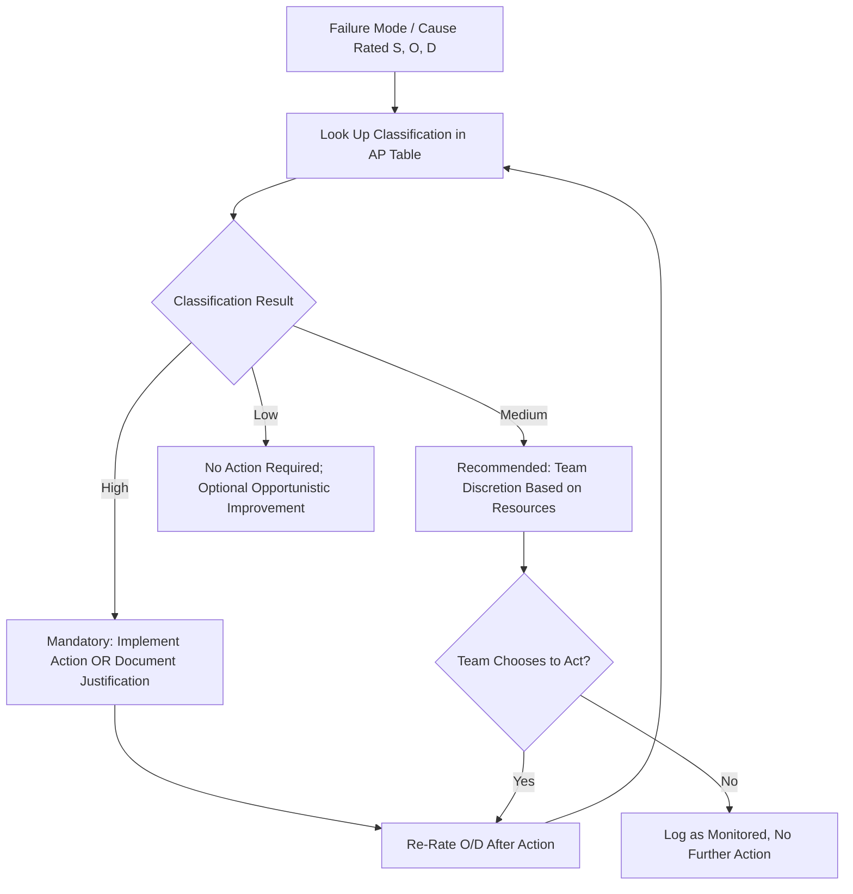

## High Medium and Low Priority Classification

### Definition and Purpose

High, Medium, and Low (H/M/L) priority classification is the categorical output of the AIAG-VDA Action Priority (AP) method, replacing a single continuous RPN number with a three-tier classification that directly signals the urgency and mandatory nature of follow-up action for each failure mode/cause combination. This classification is the practical decision-making layer that translates Severity, Occurrence, and Detection ratings into a clear action expectation for the FMEA team.

### Purpose of the Three-Tier Structure

- **Provides an unambiguous action signal**: Unlike a numeric RPN that requires interpretation against a threshold, H/M/L communicates directly what level of response is expected
- **Enforces accountability at the High tier**: The AIAG-VDA methodology requires that High-priority items receive either a documented risk-reduction action or explicit engineering justification for taking no action — silence is not an acceptable response for High items
- **Preserves team judgment at Medium and Low tiers**: Medium and Low categories intentionally leave room for team discretion based on resource availability, program timing, and practical constraints, rather than mandating action universally
- **Simplifies management reporting and trending**: Counting the number of open High-priority items across a program is a simpler, more directly actionable management metric than tracking an average or distribution of numeric RPN values

### Definitions of Each Priority Level

#### High (H)

Assigned when the combination of Severity, Occurrence, and Detection indicates the failure mode/cause represents a significant risk requiring attention — most commonly driven by high Severity (9–10, associated with safety or regulatory effects) combined with any meaningful Occurrence, or by high Occurrence combined with poor Detection even at moderate Severity levels.

**Required response:** The team must identify and implement actions to reduce Severity, Occurrence, or improve Detection, or formally document the engineering rationale for why no further action is being taken (e.g., the risk has already been mitigated to the practical limit of current technology, or additional action isn't feasible within program constraints). An unaddressed, undocumented High-priority item is considered a gap in the FMEA.

#### Medium (M)

Assigned when the risk combination is elevated but not at the level requiring mandatory action — typically moderate Severity with moderate-to-high Occurrence, or high Severity paired with strong existing prevention/detection controls that meaningfully reduce residual risk.

**Required response:** Action is recommended and left to team discretion, weighed against engineering resources, program timeline, and cost/benefit considerations. Teams are encouraged, but not mandated, to pursue improvement.

#### Low (L)

Assigned when Severity is low, or when Occurrence and Detection combine favorably enough that the residual risk is considered acceptable without further action — commonly at low Severity (1–3) regardless of Occurrence/Detection, since minor effects rarely warrant escalation.

**Required response:** No action required; the team may still choose to pursue improvement opportunistically (e.g., during an unrelated design refresh) but is not obligated to.

### How Classification Is Determined

Classification follows the Severity-first decision-tree logic of the official AIAG-VDA AP tables (see AIAG VDA action priority tables):

**Key Points**

1. Severity is evaluated first — the 9–10 band is treated distinctly from 4–8 and 1–3 bands, reflecting the automotive industry's emphasis on safety/regulatory consequences
2. Within a severity band, Occurrence is evaluated second — higher occurrence generally pushes classification upward within that band
3. Within a severity/occurrence combination, Detection is evaluated third — poor detection (high D rating) pushes classification upward, since an undetectable failure poses disproportionate risk regardless of how rarely it occurs
4. The specific cell-by-cell boundaries are defined in the official published AP tables and differ between Design FMEA and Process FMEA versions

### Illustrative Classification Pattern

| Severity Band | Occurrence | Detection | Typical Classification |
| --- | --- | --- | --- |
| 9–10 (safety/regulatory) | Moderate–High | any | High |
| 9–10 (safety/regulatory) | Low | Poor | High or Medium |
| 9–10 (safety/regulatory) | Low | Strong | Medium |
| 4–8 (functional) | High | Poor | High |
| 4–8 (functional) | Moderate | Moderate | Medium |
| 4–8 (functional) | Low | Strong | Low or Medium |
| 1–3 (minor/cosmetic) | any | any | Low |

**Note [Unverified]:** Precise boundary values are defined in the current official AIAG-VDA handbook tables; the pattern above illustrates the general severity-first logic rather than reproducing exact published cell assignments.

### Managing Classified Items

**Key Points**

- **Track High-priority item closure rate** as a core FMEA program health metric — an FMEA with a large, aging backlog of open High items signals inadequate resourcing or follow-through
- **Require documented justification for accepted High-priority risk**: If a High item is closed without a corrective action, the FMEA record should capture the engineering rationale (e.g., "risk mitigated to design limit; further reduction not technically feasible")
- **Use Medium/Low counts for trend awareness, not mandatory tracking**: Since these tiers don't require action, tracking their volume is useful for spotting systemic quality trends but shouldn't be treated as equivalent to open High-item backlogs
- **Re-classify after corrective action**: Once an action changes Occurrence or Detection ratings, the item should be re-evaluated against the AP table to confirm its classification has actually moved (e.g., from High to Medium)
- **Escalate stalled High items**: Organizations often set a maximum allowable time for a High-priority item to remain open before management escalation is triggered

### Example

**Failure Mode:** Weld joint fracture on structural bracket, Severity 9

**Cause 1:** Insufficient weld penetration — Occurrence 4, Detection 7

**Classification: High** — Severity in the 9–10 band combined with elevated occurrence and weak detection places this firmly in the mandatory-action tier.

**Cause 2:** Incorrect robotic welding parameters — Occurrence 2, Detection 3

**Classification: Medium** — Same high severity, but low occurrence combined with strong automated detection meaningfully reduces the residual risk, placing it below the mandatory-action threshold while still warranting team consideration.

**Team response:** Cause 1 requires a documented corrective action (e.g., implementing an automated penetration-depth sensor) or explicit justification if no action is taken; Cause 2 is logged for team discretion and may be addressed opportunistically during the next fixture redesign cycle.

### Relationship to RPN Reporting

Organizations that calculate both RPN and AP typically use AP as the governing action-decision criterion while retaining RPN for legacy trending or customer-specific reporting requirements (see limitations and criticisms of RPN). A well-run FMEA program avoids the failure mode where a Medium-or-Low-AP item happens to have a numerically high RPN and gets mistakenly escalated, or conversely, a High-AP item has a modest RPN and gets deprioritized — AP classification should take precedence in the actual action-planning decision.

### Common Pitfalls

- Treating Medium-priority items as optional to the point of never revisiting them, allowing moderate risks to persist indefinitely
- Closing High-priority items without documented justification when no corrective action is taken
- Reverting to RPN-based prioritization when AP is the program's mandated methodology, creating inconsistent decision-making
- Failing to re-run the classification after a corrective action changes underlying ratings, leaving stale High classifications on closed-out risks
- Applying Design FMEA classification boundaries to a Process FMEA (or vice versa) without using the correct table for the FMEA type

### Diagram: Priority Classification and Response Workflow (svg_diagram)

**Related Topics**

- AIAG VDA action priority tables
- Calculating the risk priority number
- Limitations and criticisms of RPN
- Severity rating scales and criteria
- Occurrence rating scales and criteria
- Detection rating scales and criteria
- Tracking and closing corrective actions in FMEA
- Design FMEA vs. Process FMEA differences in AP tables