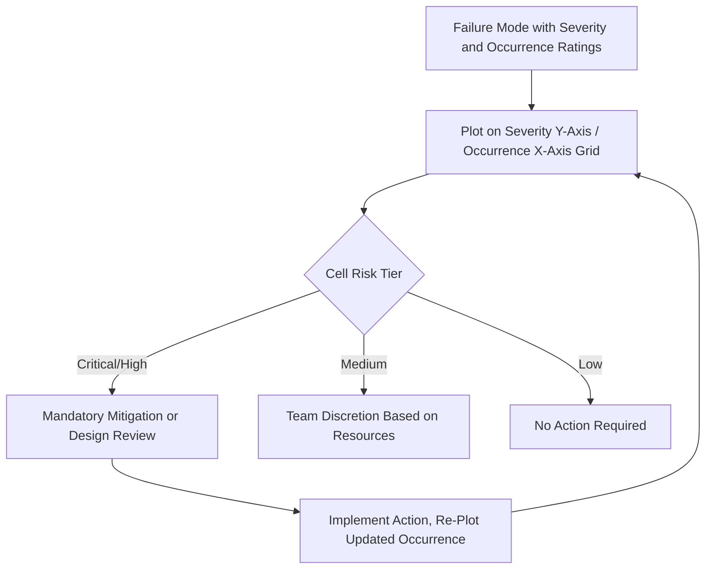

## Risk Matrices of Severity Versus Occurrence

### Definition and Purpose

A Severity-versus-Occurrence risk matrix is a two-dimensional visual tool that plots the Severity rating against the Occurrence rating on separate axes, using a grid of color-coded or labeled cells to communicate the relative risk level of a failure mode without requiring a multiplied numeric score like RPN. This approach is widely used as a complement or alternative to RPN and Action Priority tables, particularly in industries such as aerospace, defense, and medical devices, where risk matrices are a long-established standard for hazard communication (e.g., MIL-STD-882, ISO 14971).

### Why Use a Two-Factor Matrix Instead of a Three-Factor Score

- **Visual clarity**: A 2D grid is immediately interpretable at a glance, unlike a numeric RPN list that requires sorting and threshold interpretation to communicate risk
- **Avoids the masking problem inherent in multiplication**: Plotting Severity and Occurrence as independent axes preserves both dimensions visibly, rather than collapsing them into a single number where a high-severity/low-occurrence item can look numerically similar to a low-severity/high-occurrence item (see limitations and criticisms of RPN)
- **Aligns with established safety engineering practice**: Many safety and systems engineering standards outside the automotive FMEA tradition (aerospace, defense, medical) use Severity × Occurrence (sometimes called Severity × Probability) matrices as their primary risk communication tool, making this format a natural bridge when FMEA results need to feed into a broader system safety assessment
- **Detection is often handled separately**: Because Detection reflects control effectiveness rather than inherent risk, some frameworks intentionally exclude it from the primary risk matrix and address detection controls as a separate mitigation layer rather than folding it into the prioritization grid

### Matrix Structure

**Key Points**

- **Vertical axis**: Severity, typically ordered from low (bottom) to high (top), using either the FMEA's native 1–10 (or 1–5) scale or a condensed qualitative band (e.g., Negligible/Minor/Major/Critical/Catastrophic)
- **Horizontal axis**: Occurrence (sometimes labeled Probability or Likelihood), typically ordered from low (left) to high (right), using the same native scale or a condensed qualitative band (e.g., Improbable/Remote/Occasional/Probable/Frequent)
- **Cells**: Each intersection of a severity band and occurrence band is assigned a risk level, usually color-coded — commonly green (acceptable), yellow (review/mitigate), and red (unacceptable/mandatory action), sometimes with an added orange tier for four-level granularity
- **Diagonal risk gradient**: Risk level typically increases toward the upper-right of the matrix (high severity, high occurrence) and decreases toward the lower-left (low severity, low occurrence), though the exact cell boundaries are organization- or standard-defined rather than universal

### Illustrative 5×5 Risk Matrix

| Severity ↓ / Occurrence → | Improbable (1) | Remote (2) | Occasional (3) | Probable (4) | Frequent (5) |
| --- | --- | --- | --- | --- | --- |
| Catastrophic (5) | Medium | High | High | Critical | Critical |
| Critical (4) | Low | Medium | High | High | Critical |
| Major (3) | Low | Medium | Medium | High | High |
| Minor (2) | Low | Low | Medium | Medium | High |
| Negligible (1) | Low | Low | Low | Medium | Medium |

**Note [Unverified]:** Cell boundaries, color bands, and the number of risk tiers vary significantly across organizations and standards (MIL-STD-882 uses a different structure than ISO 14971 medical device matrices, for example); the table above illustrates the general diagonal-gradient pattern common to most implementations rather than a specific published standard's exact matrix.

### Relationship to FMEA and Action Priority

A Severity/Occurrence matrix can be used in place of, or alongside, RPN and Action Priority (AP) classification:

- **As a visual front-end to FMEA data**: Failure modes from a completed FMEA worksheet can be plotted onto the matrix using their existing Severity and Occurrence ratings, providing a portfolio-level visual summary that's easier for management review than scanning a long RPN-sorted table
- **As an independent risk-acceptance tool**: In system safety engineering (particularly aerospace/defense), the Severity/Occurrence matrix is often the primary risk acceptance mechanism, with FMEA serving as the underlying analysis that feeds the matrix rather than the matrix being an FMEA byproduct
- **Detection handled as mitigation evidence, not a matrix axis**: Instead of multiplying Detection into a combined score, some frameworks record detection/existing controls as supporting justification for why a cell's risk is acceptable (e.g., "plotted as High Occurrence but risk is accepted because detection control X reduces the practical residual likelihood")

### Constructing an Organization-Specific Matrix

**Key Points**

1. Decide whether to reuse the FMEA's existing Severity/Occurrence rating scales directly, or condense them into fewer qualitative bands for visual simplicity
2. Define the number of risk tiers (commonly 3–5: Low/Medium/High, or Low/Medium/High/Critical) based on how much distinction the organization needs for decision-making
3. Assign each severity-occurrence cell to a risk tier, typically following a diagonal gradient but adjusted to reflect organizational risk tolerance (e.g., some organizations treat any Catastrophic severity cell as High or Critical regardless of occurrence, similar to the severity-first logic used in Action Priority tables)
4. Define the required response for each tier (e.g., Critical = mandatory design change; High = documented mitigation required; Medium = team discretion; Low = no action required)
5. Validate the matrix against representative historical failure modes before formal adoption
6. Publish the matrix as a controlled reference alongside the organization's rating scale criteria (see customizing rating tables for an organization)

### Example

**Failure Mode:** Weld joint fracture on structural bracket

**Severity:** 9 (Catastrophic/Hazardous band)

**Occurrence:** 4 (Occasional band)

**Matrix placement:** Upper-middle region of the matrix — high severity combined with moderate occurrence plots into the High or Critical tier depending on the organization's specific cell assignment, visually flagging this item for mandatory review even before a detection control is considered.

**Failure Mode:** Dashboard trim rattle

**Severity:** 3 (Minor band)

**Occurrence:** 7 (Probable/Frequent band)

**Matrix placement:** Lower-right region — despite high occurrence, low severity keeps this item in the Low or Medium tier, illustrating how the matrix visually communicates that frequent-but-minor issues don't warrant the same urgency as rare-but-severe ones, directly addressing the RPN masking problem from the opposite direction.

### Common Pitfalls

- Building a matrix with inconsistent granularity between axes (e.g., a 10-point severity axis against a 3-point occurrence axis), making cell assignment arbitrary
- Failing to define a clear, documented response requirement for each risk tier, leaving the matrix as a visualization without actionable consequence
- Treating the matrix and RPN/AP as fully independent systems rather than ensuring they're both derived from the same underlying, calibrated Severity and Occurrence ratings
- Omitting detection considerations entirely without an alternative mechanism to capture and credit existing control effectiveness
- Using a generic, unvalidated matrix template without adjusting cell risk-tier boundaries to reflect the organization's actual risk tolerance and historical experience

### Diagram: Severity vs. Occurrence Risk Matrix Placement (svg_diagram)

**Related Topics**

- Severity rating scales and criteria
- Occurrence rating scales and criteria
- AIAG VDA action priority tables
- Limitations and criticisms of RPN
- Customizing rating tables for an organization
- FMECA and criticality analysis frameworks
- System safety hazard analysis (MIL-STD-882, ISO 14971)
- Visual risk communication for management review

**Related Topics**

- Severity rating scales and criteria
- Occurrence rating scales and criteria
- Detection rating scales and criteria
- AIAG VDA action priority tables
- Calculating the risk priority number