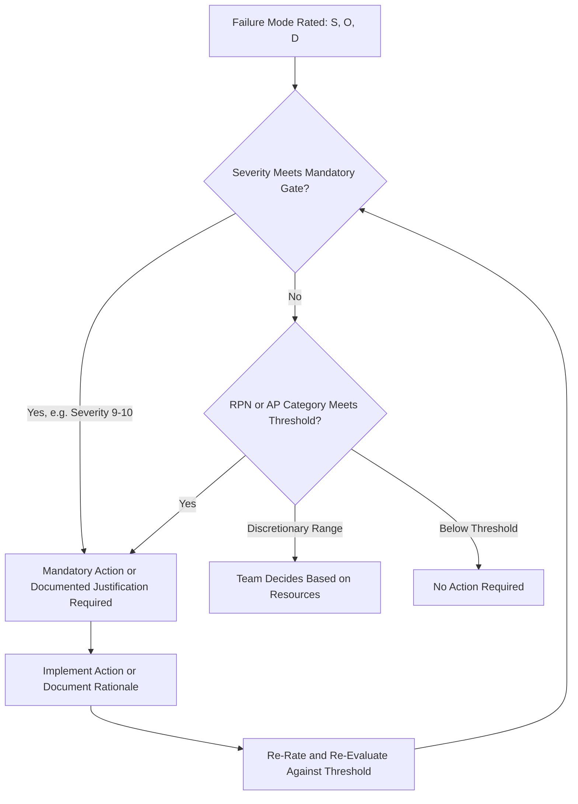

## Setting Thresholds for Required Action

### Definition and Purpose

Setting thresholds for required action is the organizational process of defining the specific criteria — whether numeric (RPN), categorical (Action Priority tier), or matrix-based — that trigger a mandatory response to a failure mode identified in an FMEA. A threshold transforms a risk assessment from a passive documentation exercise into an active decision-making tool by specifying exactly when a team is obligated to act, escalate, or document a formal justification for inaction.

### Why Thresholds Are Necessary

- **Converts assessment into action**: Without a defined threshold, an FMEA can become a static record of ratings that never drives actual engineering or process change
- **Provides consistency across teams**: A documented threshold prevents individual teams from applying inconsistent personal judgment about what "warrants action," reducing the rating biases discussed in common rating biases and inconsistencies
- **Supports audit and regulatory defensibility**: Quality system standards (IATF 16949, ISO 9001, ISO 14971 for medical devices) expect organizations to demonstrate that identified risks are systematically evaluated against defined criteria and addressed, not left to ad hoc judgment
- **Enables resource prioritization**: With finite engineering capacity, thresholds ensure the most significant risks are addressed first, rather than teams working through an FMEA list in arbitrary order
- **Creates accountability and traceability**: A clear threshold, paired with a requirement to document action or justification, creates an auditable trail showing that high-risk items received deliberate consideration

### Approaches to Threshold Setting

#### 1. Fixed Numeric RPN Threshold

The traditional approach: define a single RPN value (e.g., "RPN > 100 requires corrective action") above which action is mandatory.

**Key Points**

- Simple to communicate and implement
- Vulnerable to the masking and gaming weaknesses documented in limitations and criticisms of RPN — a fixed cutoff doesn't distinguish between a high-severity/low-RPN item and a low-severity/high-RPN item
- Often supplemented with a secondary rule such as "any Severity ≥ 9 requires action regardless of RPN" to compensate for this weakness

#### 2. Severity-Gated Threshold

A hybrid approach where a high Severity rating (typically 9–10, associated with safety/regulatory effects) triggers mandatory action independent of the RPN or Occurrence/Detection values, while lower-severity items use a standard RPN or combined threshold.

**Key Points**

- Directly addresses RPN's tendency to mask high-severity/low-occurrence risks
- Commonly implemented as: "If Severity ≥ 9, action is mandatory. Otherwise, apply RPN threshold of [X]."
- Serves as a bridge between traditional RPN practice and full Action Priority adoption

#### 3. AIAG-VDA Action Priority (AP) Categorical Threshold

Rather than a numeric cutoff, the threshold is defined by AP category: High priority mandates action or documented justification; Medium is discretionary; Low requires no action (see AIAG VDA action priority tables and high medium and low priority classification).

**Key Points**

- Removes the need to set an arbitrary numeric cutoff, since the AP table's decision-tree logic already encodes a severity-first threshold structure
- Increasingly the preferred approach in automotive and industries adopting the harmonized AIAG-VDA methodology
- Requires the organization to adopt the full AP table methodology rather than a simplified numeric rule

#### 4. Risk Matrix Tier Threshold

Using a Severity-versus-Occurrence matrix (see risk matrices of severity versus occurrence), the threshold is defined by which color-coded/labeled tier a failure mode falls into (e.g., red/Critical requires mandatory mitigation, yellow/Medium is discretionary, green/Low requires no action).

**Key Points**

- Common in aerospace, defense, and medical device industries with established risk-matrix traditions
- Allows visual, portfolio-level threshold communication in addition to individual failure-mode decisions

### Factors Influencing Threshold Placement

**Key Points**

- **Regulatory and safety context**: Safety-critical industries (automotive, aerospace, medical) generally set stricter, lower thresholds — or severity-gated mandatory action regardless of other factors — reflecting lower risk tolerance
- **Product maturity and field history**: New, unproven designs/processes may warrant more conservative (stricter) thresholds until sufficient field data validates actual performance
- **Engineering and resource capacity**: An overly strict threshold that generates more mandatory actions than the organization can realistically resource undermines the credibility of the threshold and encourages the gaming behaviors described in common rating biases and inconsistencies
- **Customer and contractual requirements**: Automotive OEMs and other customers may specify required thresholds or methodologies (RPN cutoff, AP methodology, specific matrix) as part of program requirements, overriding internal organizational defaults
- **Historical outcome data**: Organizations with mature field-failure and warranty data can calibrate thresholds against actual downstream consequences, rather than setting them purely by convention

### Threshold Governance Workflow

**Key Points**

1. Determine the prioritization methodology in use (RPN, severity-gated RPN, AP, or risk matrix) based on industry standard, customer requirement, or organizational policy
2. Define the specific threshold value(s) or category boundaries appropriate to the chosen methodology
3. Document the threshold and required response for each tier in the organization's FMEA procedure/work instruction
4. Pilot the threshold against representative historical FMEAs to check that it produces a reasonable, resourceable volume of mandatory actions
5. Formalize and communicate the threshold to all FMEA teams, integrating it into training
6. Periodically review threshold effectiveness — are mandatory-action items being closed in a reasonable time, and is the threshold catching known field issues in retrospective review?
7. Adjust thresholds as data maturity, regulatory requirements, or organizational risk tolerance evolve

### Example

**Organizational policy (severity-gated hybrid):**

- Any failure mode/cause with Severity ≥ 9 requires mandatory action or documented engineering justification, regardless of RPN
- For Severity 4–8, RPN ≥ 120 requires mandatory action; RPN 60–119 is recommended at team discretion; RPN < 60 requires no action
- For Severity 1–3, no mandatory threshold applies; action is always at team discretion

**Application:**

- Weld joint fracture, Severity 9, RPN 252 → Mandatory action (severity gate triggers regardless of RPN value)
- Sensor drift causing minor calibration error, Severity 5, RPN 140 → Mandatory action (RPN exceeds the 120 threshold for this severity band)
- Dashboard trim rattle, Severity 3, RPN 84 → No mandatory threshold; team discretion applies despite a relatively high RPN number, since severity is low

### Common Pitfalls

- Setting a single, uniform numeric threshold across products/programs with very different risk profiles or regulatory requirements
- Relying purely on RPN thresholds without a severity gate, allowing high-severity/low-RPN items to be missed (see limitations and criticisms of RPN)
- Setting thresholds so strict that the volume of mandatory actions exceeds realistic engineering capacity, encouraging rating manipulation to avoid triggering the threshold
- Failing to document the rationale for threshold placement, weakening audit defensibility
- Never revisiting thresholds after initial setting, even as field data, product maturity, or regulatory context changes
- Allowing customer-mandated thresholds and internal organizational thresholds to conflict without a clear resolution policy

### Diagram: Threshold Decision and Escalation Flow (svg_diagram)

**Related Topics**

- Calculating the risk priority number
- Limitations and criticisms of RPN
- AIAG VDA action priority tables
- High medium and low priority classification
- Risk matrices of severity versus occurrence
- Severity rating scales and criteria
- Common rating biases and inconsistencies
- Tracking and closing corrective actions in FMEA