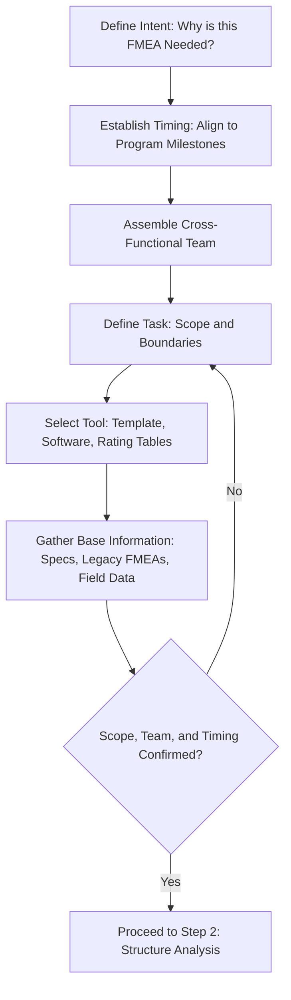

## Step One Planning and Preparation

### Definition and Purpose

Planning and Preparation is the first of the seven steps in the AIAG-VDA harmonized FMEA methodology (2019), establishing the scope, timing, resources, and analytical approach before any technical failure-mode analysis begins. This step exists because FMEA quality is heavily dependent on how well-bounded and well-resourced the analysis is from the outset — an FMEA with an undefined scope or an under-resourced team tends to produce inconsistent, incomplete, or unfocused results regardless of how rigorously later steps are executed.

### Position in the Seven-Step Process

The AIAG-VDA methodology structures FMEA into seven sequential steps:

1. **Planning and Preparation** (this topic)
2. Structure Analysis
3. Function Analysis
4. Failure Analysis
5. Risk Analysis
6. Optimization
7. Results Documentation

Planning and Preparation is deliberately positioned first because decisions made here — project scope, team composition, timing, and the "5T" framework (described below) — directly constrain and inform every subsequent step.

### The 5T Framework

AIAG-VDA structures Planning and Preparation around five core planning questions, commonly referred to as the "5T":

#### 1. Intent (Why)

Defines the purpose and objective of the FMEA — is it a new design/process FMEA, an update to an existing FMEA due to a design change, a response to a field failure, or a customer-mandated requirement? The stated intent shapes scope and depth.

#### 2. Timing (When)

Establishes the FMEA's schedule relative to the broader product development or process design timeline. FMEA is most effective when conducted early enough to influence design/process decisions before they're finalized — a defining principle of FMEA as a preventive rather than reactive tool. Timing is typically anchored to program milestones (e.g., concept freeze, design freeze, process validation).

#### 3. Team (Who)

Identifies the cross-functional participants required for a comprehensive analysis — typically including design engineering, manufacturing/process engineering, quality, reliability, materials, and service/field support representatives, along with a trained facilitator. Team composition should match the FMEA's scope; a Design FMEA requires strong design engineering representation, while a Process FMEA requires strong manufacturing/process engineering representation.

#### 4. Task (What)

Defines the specific scope of the FMEA — which system, subsystem, component, or process is being analyzed, and explicitly what is included versus excluded from the boundary. A poorly bounded scope is one of the most common causes of stalled or unfocused FMEAs.

#### 5. Tool (How)

Establishes the methodology, software, template, and documentation standard to be used — e.g., AIAG-VDA standard form, organization-specific customized rating tables (see customizing rating tables for an organization), and any FMEA software platform.

### Base Information Gathering

**Key Points**

- Collect relevant reference documents before the analysis begins: system requirements, design specifications, process flow diagrams, prior/legacy FMEAs for similar products or processes, customer requirements, lessons-learned databases, and known field-failure or warranty data
- Identify applicable regulatory, safety, and customer-specific requirements relevant to the scope
- Determine whether the FMEA is a **new/from-scratch** analysis, a **carryover/foundation FMEA** adapted from a similar prior program, or a **revision** to an existing FMEA due to a design or process change
- Establish which FMEA type applies: Design FMEA (DFMEA), Process FMEA (PFMEA), System FMEA, or other variant, since this determines which subsequent structure/function/failure analysis approach is used

### Scope Definition Best Practices

**Key Points**

- Define the analysis boundary explicitly — what is inside scope (the system/component/process under analysis) versus outside scope (interfacing systems, upstream/downstream processes treated as given inputs)
- Use a block diagram, process flow diagram, or boundary diagram to visually communicate scope to the team, reducing ambiguity during later structure analysis
- Avoid scope creep by documenting explicitly excluded interfaces or functions and referring disputes back to this boundary definition throughout the analysis
- Align scope granularity with the FMEA's intent — a system-level FMEA requires a broader, shallower scope, while a component-level FMEA requires a narrower, deeper scope

### Team Formation Considerations

**Key Points**

- Assign a trained facilitator, distinct from the primary design/process owner, to guide the session, manage group dynamics, and mitigate the biases discussed in common rating biases and inconsistencies
- Ensure representation from every function that will be affected by, or has knowledge relevant to, the system/process under analysis
- Include personnel with direct field/service experience where available, since they often surface failure modes not visible from a purely design or manufacturing perspective
- Establish session cadence and duration upfront (e.g., weekly two-hour sessions until completion) to maintain team engagement and momentum
- Confirm management support and protected time for participants, since FMEA sessions frequently lose effectiveness when treated as lowest-priority meetings

### Example

**Scenario:** A Tier 1 automotive supplier is developing a new electronic power steering control module.

**Intent:** New Design FMEA required for a new product introduction; no directly applicable legacy FMEA exists, though a related prior-generation module FMEA will be used as reference.

**Timing:** FMEA kickoff scheduled to align with the design concept freeze milestone, approximately 6 months before production tooling commitment.

**Team:** Design engineering (lead), electrical/software engineering, manufacturing engineering, quality engineering, reliability engineering, and a trained FMEA facilitator.

**Task:** Scope bounded to the control module hardware and embedded software; interfaces to the vehicle's broader steering system and CAN bus network are treated as defined inputs/outputs, not analyzed in depth within this FMEA.

**Tool:** AIAG-VDA standard DFMEA form template, using the organization's customized Severity/Occurrence/Detection rating tables and FMEA software platform for documentation.

### Common Pitfalls

- Starting failure-mode analysis before scope, team, and timing are clearly defined, leading to unfocused or incomplete sessions
- Assembling a team without adequate cross-functional representation, missing failure modes visible only from certain disciplines' perspectives
- Scheduling the FMEA too late in the development timeline to meaningfully influence design or process decisions, reducing it to a documentation exercise rather than a preventive tool
- Failing to define explicit scope boundaries, causing the team to repeatedly debate what is and isn't included during later steps
- Reusing a legacy/carryover FMEA without validating that its scope, team, and assumptions still apply to the current program
- Underestimating the facilitator's role, allowing an untrained or conflicted facilitator to run sessions, increasing susceptibility to groupthink and authority bias

### Diagram: Planning and Preparation Workflow (svg_diagram)

**Related Topics**

- Structure analysis in the seven-step method
- Function analysis in the seven-step method
- Customizing rating tables for an organization
- Common rating biases and inconsistencies
- Design FMEA vs. Process FMEA scope differences
- Carryover and foundation FMEA practices
- FMEA facilitation techniques and team dynamics
- Aligning FMEA timing with product development milestones