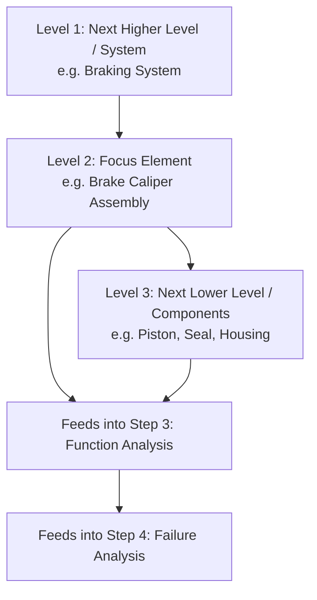

## Step Two Structure Analysis

### Definition and Purpose

Structure Analysis is the second step in the AIAG-VDA harmonized FMEA methodology, in which the system, subsystem, component, or process defined in the Planning and Preparation step is decomposed into a hierarchical structure of its constituent elements. This step establishes the physical or procedural architecture that all subsequent function, failure, and risk analysis will be organized around, ensuring the FMEA systematically covers every relevant element rather than relying on ad hoc, unstructured brainstorming.

### Position in the Seven-Step Process

1. Planning and Preparation
2. **Structure Analysis** (this topic)
3. Function Analysis
4. Failure Analysis
5. Risk Analysis
6. Optimization
7. Results Documentation

Structure Analysis directly feeds Function Analysis (step 3), since functions are assigned to structural elements, which in turn feeds Failure Analysis (step 4), since failure modes are the inability of a structural element to deliver its assigned function. The quality and completeness of the structure defined in this step therefore bounds the completeness of everything that follows.

### The Three-Level Structure Concept

AIAG-VDA structure analysis organizes elements into a three-level hierarchy for each area of the system:

#### Level 1: Next Higher Level / System Level

The parent system, assembly, or process that the item under analysis belongs to — provides context for why the item under analysis exists and what larger function it supports.

#### Level 2: Focus Element / Item Under Analysis

The specific component, subsystem, or process step that is the actual subject of the FMEA — this is the element whose functions and failure modes will be analyzed in depth.

#### Level 3: Next Lower Level / Component Level

The constituent parts, characteristics, or sub-steps that make up the focus element — provides the granularity needed to trace failure modes down to specific causes in later steps.

This three-level structure is applied consistently across both Design FMEA (physical system/subsystem/component hierarchy) and Process FMEA (process/operation/process step hierarchy), with the specific terminology adapted to each context.

### Structure Analysis for Design FMEA

**Key Points**

- Level 1 (System): The overall vehicle system, product, or assembly the component belongs to (e.g., "Braking System")
- Level 2 (Subsystem/Focus Item): The specific subsystem or component under analysis (e.g., "Brake Caliper Assembly")
- Level 3 (Component/Characteristic): The individual parts or characteristics making up the focus item (e.g., "Caliper Piston," "Piston Seal," "Caliper Housing")
- Structure is typically visualized using a **block diagram** or **boundary diagram** showing physical connections and interfaces between elements
- Interfaces to adjacent systems outside the defined scope (from Planning and Preparation) are shown but not analyzed in depth, maintaining the scope boundary

### Structure Analysis for Process FMEA

**Key Points**

- Level 1 (Process/System): The overall manufacturing process or process family (e.g., "Brake Caliper Machining Line")
- Level 2 (Operation/Focus Item): The specific process step or operation under analysis (e.g., "CNC Bore Machining Operation")
- Level 3 (Process Element/4M Category): The elements that make up or influence the operation, typically organized using the **4M** (or 6M) framework — Machine, Man (Personnel), Material, Method (and sometimes Milieu/Environment, Measurement)
- Structure is typically visualized using a **process flow diagram**, showing sequential operations and their relationships

### The 4M/6M Framework for Process Structure

When decomposing a process operation to Level 3, elements are commonly categorized as:

| Category | Description | Example |
| --- | --- | --- |
| Machine | Equipment, tooling, fixtures used in the operation | CNC machine, welding fixture |
| Man (Personnel) | Operator actions, skill, training | Operator loading part into fixture |
| Material | Incoming material or component characteristics | Raw casting dimensional variation |
| Method | Work instructions, process parameters, sequence | Torque specification, cycle time |
| Milieu (Environment) | Environmental conditions affecting the process | Temperature, humidity, contamination |
| Measurement | Inspection/gauging methods and their capability | Gauge calibration, measurement system |

Not every FMEA uses all six categories; many organizations use the simplified 4M (Machine, Man, Material, Method) as sufficient granularity for most process FMEAs.

### Visualization Tools

**Key Points**

- **Block Diagrams**: Used primarily in Design FMEA to show physical relationships, interfaces, and boundaries between system elements — nodes represent components/subsystems, connections represent physical or energy/signal interfaces
- **Boundary Diagrams**: A refined block diagram variant that explicitly distinguishes in-scope elements from interfacing/out-of-scope elements, reinforcing the scope boundary established in Planning and Preparation
- **Process Flow Diagrams**: Used primarily in Process FMEA to show the sequential flow of operations, from raw material/incoming part through each processing step to finished output
- **Structure Trees**: A hierarchical tree diagram explicitly showing the Level 1/2/3 relationships in outline or tree form, often used as the direct input format for FMEA software tools

### Example

**Scenario:** Process FMEA for a CNC bore machining operation within a brake caliper manufacturing line.

**Level 1 (Process):** Brake Caliper Machining Line — the overall multi-station manufacturing process

**Level 2 (Focus Operation):** CNC Bore Machining Operation — the specific station under analysis

**Level 3 (Process Elements, 4M):**

- Machine: CNC lathe, boring tool, fixture
- Man: Machine operator performing load/unload and in-process inspection
- Material: Incoming rough-cast caliper housing blank
- Method: Programmed boring cycle parameters (feed rate, spindle speed, depth)

This structure directly enables Function Analysis (step 3) to assign functions to each Level 3 element (e.g., "fixture holds casting in correct orientation within ±0.05mm"), which in turn enables Failure Analysis (step 4) to identify failure modes as the inability of each element to deliver its assigned function (e.g., "fixture clamping pressure inconsistent, causing bore misalignment").

### Common Pitfalls

- Skipping formal structure decomposition and jumping directly to brainstorming failure modes, resulting in inconsistent coverage and missed elements
- Defining Level 2 (focus item) too broadly, making function and failure analysis unwieldy and difficult to trace to specific causes
- Failing to maintain consistency between the structure diagram and the actual FMEA worksheet rows, causing elements to be analyzed inconsistently or omitted
- Omitting the Level 1 (next higher level) context, losing sight of why the focus item's functions matter to the larger system
- Using a Design FMEA structure approach (physical block diagram) for a Process FMEA, or vice versa, rather than the appropriate structure type for the FMEA being performed
- Not revisiting the structure diagram when scope or design changes occur mid-program, leaving the FMEA structure out of sync with the actual product/process

### Diagram: Three-Level Structure Analysis Hierarchy (svg_diagram)

**Related Topics**

- Step one planning and preparation
- Function analysis in the seven-step method
- Failure analysis in the seven-step method
- Design FMEA vs. Process FMEA structural differences
- 4M/6M framework for process element categorization
- Block diagrams and boundary diagrams
- Process flow diagram development
- Scope boundary definition in FMEA planning