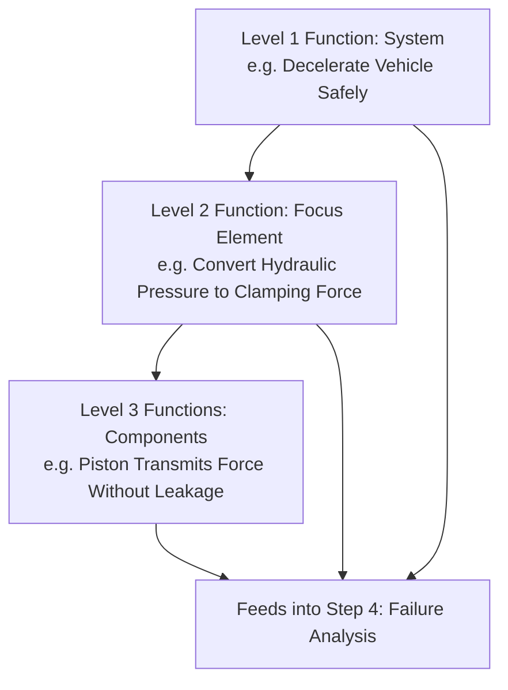

## Step Three Function Analysis

### Definition and Purpose

Function Analysis is the third step in the AIAG-VDA harmonized FMEA methodology, in which each structural element identified during Structure Analysis (step 2) is assigned its intended function(s) — the specific requirement, purpose, or performance characteristic the element must deliver. This step establishes the reference standard against which failure will be defined in the next step: a failure mode is formally defined as the inability of an element to fulfill its assigned function, so incomplete or vague function definitions directly translate into incomplete or vague failure mode identification.

### Position in the Seven-Step Process

1. Planning and Preparation
2. Structure Analysis
3. **Function Analysis** (this topic)
4. Failure Analysis
5. Risk Analysis
6. Optimization
7. Results Documentation

Function Analysis sits directly between Structure Analysis and Failure Analysis, translating the "what exists" (structure) into "what it must do" (function), which then enables "how it could fail to do it" (failure analysis) in step 4.

### The Function Net / Function Tree Concept

AIAG-VDA formalizes function assignment using a **Function Net** (or Function Tree/Function Structure), which mirrors the three-level structure hierarchy established in step 2, with each structural level receiving corresponding functional requirements:

#### Level 1 Function (System/Next Higher Level)

The overall function or requirement of the parent system that provides context for why the focus element exists (e.g., "Braking System decelerates vehicle safely on driver command").

#### Level 2 Function (Focus Element)

The specific function(s) the item under analysis must perform, typically derived from requirements documents, specifications, or customer/regulatory requirements (e.g., "Brake Caliper Assembly converts hydraulic pressure into clamping force on brake rotor").

#### Level 3 Function (Component/Process Element)

The specific functions of each constituent part or process element that collectively enable the Level 2 function (e.g., "Caliper Piston transmits hydraulic force to brake pad without leakage").

This creates a **function net** where each level's function is a decomposition of the level above it, and satisfying all Level 3 functions collectively enables the Level 2 function, which in turn supports the Level 1 function.

### Sources for Function Definitions

**Key Points**

- **Requirements and specifications documents**: Engineering drawings, design specifications, functional requirements documents
- **Customer requirements**: Voice-of-customer inputs, customer-specific requirements documents, regulatory/legal requirements applicable to the product
- **Process requirements**: Process specifications, work instructions, control plans (for Process FMEA function definitions)
- **Interface requirements**: Functions related to how the element interacts with adjoining systems/components identified in the structure/boundary diagram
- **Characteristics and parameters**: Dimensional, material, electrical, or performance characteristics with defined tolerances or acceptance criteria that constitute measurable function requirements

### Function Analysis for Design FMEA

**Key Points**

- Functions describe what the component/subsystem must physically or functionally accomplish, often stated with a measurable parameter and target/tolerance (e.g., "maintain hydraulic seal at pressures up to 150 bar")
- Well-written functions are specific and verifiable, avoiding vague language ("work correctly") in favor of quantifiable requirements where possible
- Functions should reflect requirements at each of the three structural levels, not just the primary/obvious function of the focus item
- Secondary and parasitic functions (unintended but relevant functional behaviors, such as noise, vibration, or thermal characteristics) should also be captured where they matter to the customer or system performance

### Function Analysis for Process FMEA

**Key Points**

- Functions describe the purpose of each process operation and its constituent 4M elements (Machine, Man, Material, Method), typically framed around what the operation must achieve in terms of product characteristics or process outcomes (e.g., "boring operation achieves bore diameter of 45.00mm ± 0.02mm")
- Process functions often directly reference control plan characteristics and specifications, since these represent the measurable outcome the operation is responsible for delivering
- Functions at the Level 3 (4M element) level describe what each Machine/Man/Material/Method element must contribute for the operation's Level 2 function to be achieved (e.g., "fixture holds casting in fixed orientation within ±0.05mm to enable correct boring location")

### Visualization: Function Net Structure

Similar to the structure tree from step 2, the function net is often documented as a parallel hierarchical diagram, sometimes combined with the structure tree into a single structure-function table showing each element alongside its assigned function(s).

### Example

**Scenario:** Continuing the CNC bore machining Process FMEA example from Structure Analysis.

**Level 1 Function (Process):** Brake Caliper Machining Line produces finished caliper housings meeting all dimensional and material specifications for assembly.

**Level 2 Function (Focus Operation):** CNC Bore Machining Operation achieves internal bore diameter of 45.00mm ± 0.02mm with surface finish Ra ≤ 1.6 μm.

**Level 3 Functions (Process Elements, 4M):**

- Machine: CNC lathe/boring tool maintains spindle concentricity within specified tolerance throughout the cycle
- Man: Operator correctly loads casting into fixture and verifies correct part orientation before cycle start
- Material: Incoming rough-cast housing blank provides sufficient machining stock (minimum 2mm) at the bore location
- Method: Programmed boring cycle parameters (feed rate, spindle speed, tool path) deliver specified bore diameter and surface finish

This function net directly enables Failure Analysis (step 4) to identify failure modes as the inability of each element to deliver its stated function — for example, "bore diameter exceeds 45.02mm tolerance" becomes a failure mode directly traceable to the Level 2 function it violates, with causes traceable to specific Level 3 element failures (e.g., "spindle concentricity drift" under Machine).

### Common Pitfalls

- Writing vague, unmeasurable function statements ("component works properly") instead of specific, verifiable requirements, which makes subsequent failure mode identification equally vague
- Only defining the primary/obvious function of an element while omitting secondary functions, interface functions, or parasitic characteristics relevant to the customer
- Failing to maintain the parent-child relationship between function levels, breaking the traceability chain from system function down to component function
- Copying functions from a legacy/carryover FMEA without validating they still apply to the current design or process
- Confusing a function statement with a failure mode statement (e.g., writing "does not leak" as a function, when the function should be the positive requirement "maintains hydraulic seal," with "leaks" reserved as the failure mode in step 4)
- Not aligning Process FMEA functions with the corresponding control plan characteristics, creating disconnects between the FMEA and downstream process control documentation

### Diagram: Function Net Hierarchy (svg_diagram)

**Related Topics**

- Step two structure analysis
- Failure analysis in the seven-step method
- Step one planning and preparation
- Design FMEA vs. Process FMEA function definition differences
- Control plan alignment with Process FMEA functions
- Requirements and specification traceability in FMEA
- 4M/6M framework for process element categorization
- Writing measurable, verifiable function statements