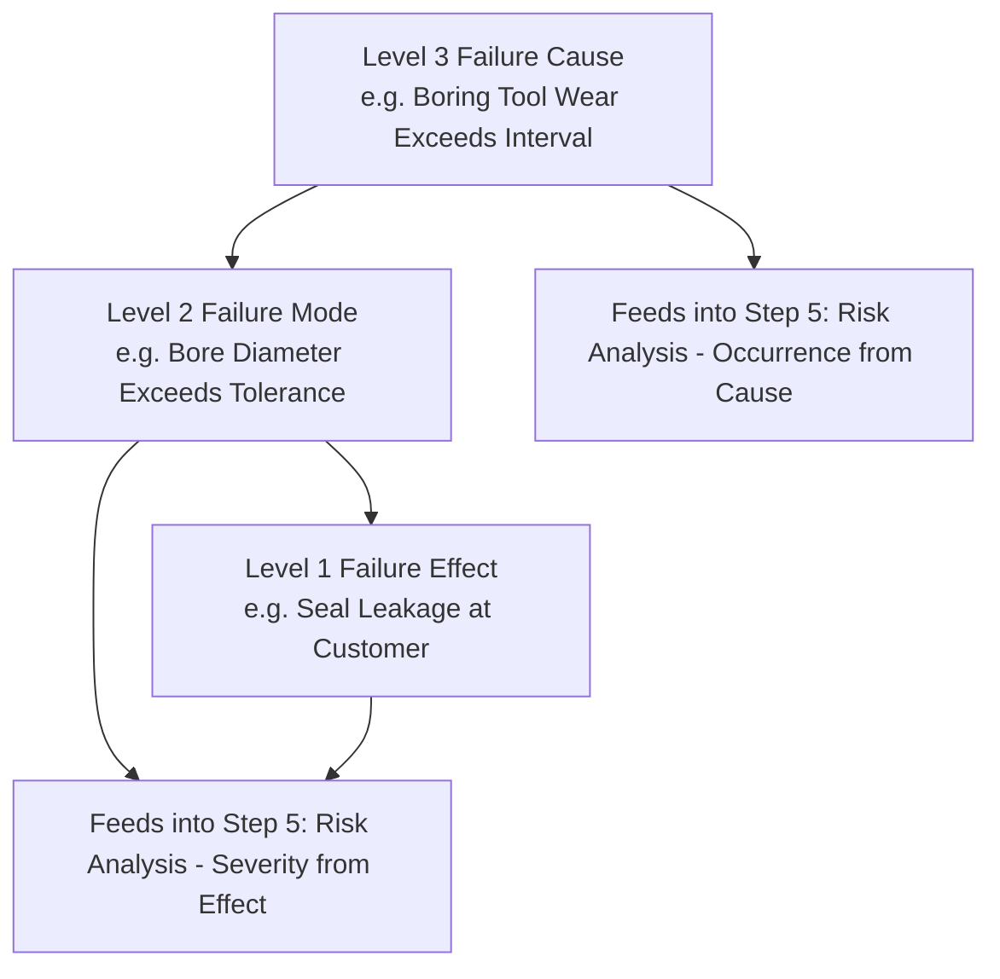

## Step Four Failure Analysis

### Definition and Purpose

Failure Analysis is the fourth step in the AIAG-VDA harmonized FMEA methodology, in which each function identified during Function Analysis (step 3) is systematically examined for the ways it could fail to be delivered. This step formally identifies the **failure mode**, **failure effect**, and **failure cause** for every function at every structural level, establishing the complete failure chain that Risk Analysis (step 5) will subsequently rate for Severity, Occurrence, and Detection.

### Position in the Seven-Step Process

1. Planning and Preparation
2. Structure Analysis
3. Function Analysis
4. **Failure Analysis** (this topic)
5. Risk Analysis
6. Optimization
7. Results Documentation

Failure Analysis directly converts the function net from step 3 into a structured set of failure chains, which are then individually rated in Risk Analysis. Because each function can fail in multiple distinct ways, and each failure mode can arise from multiple distinct causes, this step often produces significantly more rows/entries than the structure and function steps that preceded it.

### The Failure Chain: Effect, Mode, Cause

AIAG-VDA structures failure analysis around a three-part **failure chain**, mirroring the three-level structure/function hierarchy:

#### Failure Effect (Level 1 — linked to the higher-level function)

The consequence experienced at the next higher level (system, end user, or next process operation) when the failure mode occurs. The failure effect is what gets rated for Severity (see severity rating scales and criteria).

#### Failure Mode (Level 2 — linked to the focus element's function)

The specific way in which the focus element fails to deliver its assigned function — stated as the negation or degradation of the Level 2 function defined in step 3 (e.g., if the function is "maintain hydraulic seal," the failure mode is "hydraulic seal leaks").

#### Failure Cause (Level 3 — linked to the component/process element function)

The specific, root-level reason why the failure mode occurs, traced to a Level 3 structural/functional element (e.g., "piston seal material degraded due to incompatible fluid chemistry"). The failure cause is what gets rated for Occurrence (see occurrence rating scales and criteria).

This three-part chain — **Cause → Mode → Effect** — is the core analytical unit that carries through into Risk Analysis, where each unique cause (with its associated mode and effect) receives its own Severity, Occurrence, and Detection ratings.

### Deriving Failure Modes from Functions

**Key Points**

- A failure mode is identified by asking, for each function defined in step 3: "In what ways could this function fail to be achieved?"
- Common failure mode categories include: **loss of function** (complete failure), **degraded function** (partial/reduced performance), **intermittent function** (inconsistent performance), **unintended function** (function occurs when it shouldn't), and **delayed function** (function occurs later than required)
- Every function identified in step 3 should be systematically checked against these categories to ensure comprehensive failure mode coverage, rather than relying solely on unstructured brainstorming
- Failure modes should be stated as physical or observable conditions, not as vague generalizations (e.g., "bore diameter exceeds tolerance" rather than "part is bad")

### Tracing Failure Effects Upward

**Key Points**

- A failure mode's effect is traced to the next higher structural level — for a component-level failure mode, the effect may cascade through the subsystem level up to the end-user/system level
- A single failure mode can have multiple effects at different levels (a local effect at the immediate next level, and an end effect at the system/customer level); AIAG-VDA typically requires documenting effects at multiple relevant levels, with Severity assigned based on the worst credible end effect
- For Process FMEA, effects may need to be traced both to the **next operation** (local, in-plant consequence) and to the **end customer** (final product consequence), since these can differ significantly in severity

### Tracing Failure Causes Downward

**Key Points**

- A failure cause is identified by asking, for each failure mode: "What could cause this failure mode to occur?"
- Causes should be traced to the Level 3 structural/functional element (component characteristic, or 4M process element) to ensure they are specific and actionable rather than restatements of the failure mode itself
- A single failure mode frequently has multiple distinct causes, each of which is evaluated and rated independently in Risk Analysis (since Occurrence and Detection can differ significantly between causes even when Severity, tied to the shared effect, remains constant)
- Root-cause techniques such as the 5 Whys or fishbone/Ishikawa analysis are commonly used to ensure causes are traced to a sufficiently specific, actionable level rather than stopping at a symptom

### Example

**Scenario:** Continuing the CNC bore machining Process FMEA example from Function Analysis.

**Function (Level 2):** CNC Bore Machining Operation achieves internal bore diameter of 45.00mm ± 0.02mm.

**Failure Mode:** Bore diameter exceeds 45.02mm (oversized bore)

**Failure Effect (traced upward):**

- Local effect (next operation): Piston seal assembly cannot achieve proper interference fit, detected at downstream assembly station
- End effect (customer): If undetected, results in hydraulic seal leakage at the customer, degrading brake performance

**Failure Causes (traced downward, multiple distinct causes):**

- Cause 1: Boring tool wear exceeding replacement interval, traced to the Machine element
- Cause 2: Incorrect tool offset programmed after tool change, traced to the Method element
- Cause 3: Spindle thermal expansion during extended production runs, traced to the Machine element

Each of these three causes shares the same failure mode and effect (and therefore the same Severity rating) but will likely receive different Occurrence and Detection ratings in Risk Analysis, since they arise from different mechanisms with different likelihoods and different existing controls.

### Relationship to Prevention and Detection Controls

Failure Analysis also typically identifies, for each cause, whether **current prevention controls** (design or process elements intended to prevent the cause from occurring) and **current detection controls** (inspection, testing, or monitoring intended to catch the cause or failure mode before escape) already exist. These identified controls become the direct basis for the Occurrence and Detection ratings assigned in the next step, Risk Analysis.

### Common Pitfalls

- Stating a failure mode as a restatement of the failure cause, collapsing the analytical distinction between "what failed" and "why it failed"
- Identifying only the most obvious failure mode per function while missing degraded, intermittent, or unintended-function variants
- Failing to trace failure effects to the true end customer/system level, understating potential Severity by stopping the effect chain too early
- Stopping cause identification at a symptom level (e.g., "part out of tolerance") rather than tracing to a specific, actionable root cause
- Treating a failure mode with multiple distinct causes as a single row, losing the ability to assign differentiated Occurrence/Detection ratings per cause
- Not cross-referencing failure modes against the function net from step 3, resulting in incomplete coverage of all defined functions

### Diagram: Failure Chain Structure (svg_diagram)

**Related Topics**

- Step three function analysis
- Step two structure analysis
- Severity rating scales and criteria
- Occurrence rating scales and criteria
- Detection rating scales and criteria
- Risk analysis in the seven-step method
- Root cause analysis techniques: 5 Whys and fishbone diagrams
- Prevention controls vs. detection controls in FMEA