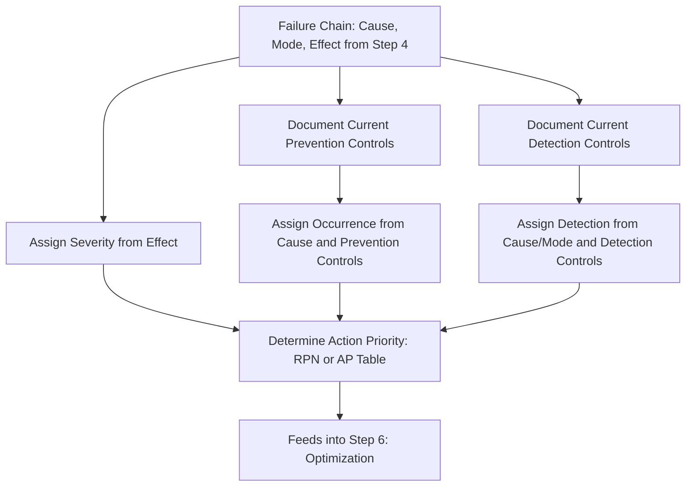

## Step Five Risk Analysis

### Definition and Purpose

Risk Analysis is the fifth step in the AIAG-VDA harmonized FMEA methodology, in which each failure chain (cause, mode, effect) identified during Failure Analysis (step 4) is evaluated and rated for Severity, Occurrence, and Detection, and the current prevention and detection controls are formally documented. This step transforms the qualitative failure analysis into a quantified/categorized risk assessment that directly determines which items require action in the subsequent Optimization step.

### Position in the Seven-Step Process

1. Planning and Preparation
2. Structure Analysis
3. Function Analysis
4. Failure Analysis
5. **Risk Analysis** (this topic)
6. Optimization
7. Results Documentation

Risk Analysis consumes the failure chains produced in step 4 and produces the prioritized risk output (via Action Priority classification) that directly drives the action-planning work of step 6, Optimization.

### Core Components of Risk Analysis

#### 1. Current Prevention Controls

Documentation of design or process controls already in place that are intended to prevent the failure cause from occurring — for example, a design standard, a validated material specification, a mistake-proofed fixture, or a statistical process control system. Current prevention controls form the basis for the Occurrence rating.

#### 2. Current Detection Controls

Documentation of design or process controls already in place that are intended to detect the cause or the resulting failure mode before it escapes to the next operation or the end customer — for example, an inspection step, a functional test, an automated gauge, or a warning system. Current detection controls form the basis for the Detection rating.

#### 3. Severity Rating (S)

Assigned based on the worst credible failure effect identified in step 4, using the organization's Severity rating table (see severity rating scales and criteria). Severity is assigned once per unique effect and applies consistently to every cause that produces that effect.

#### 4. Occurrence Rating (O)

Assigned based on the likelihood of the specific failure cause occurring, considering the effectiveness of current prevention controls (see occurrence rating scales and criteria). Occurrence is rated independently for each distinct cause identified in step 4, since different causes of the same failure mode can have very different likelihoods.

#### 5. Detection Rating (D)

Assigned based on the effectiveness of current detection controls in catching the cause or failure mode before escape (see detection rating scales and criteria). Detection is rated independently for each cause/control combination, since different causes may be caught by different controls with different effectiveness.

#### 6. Action Priority (AP) Determination

Using the organization's chosen prioritization methodology — traditional RPN calculation, the AIAG-VDA Action Priority table, or a risk matrix — each rated cause/mode/effect combination is classified to determine whether it requires mandatory action, discretionary action, or no action (see AIAG VDA action priority tables, calculating the risk priority number, and high medium and low priority classification).

### Risk Analysis Workflow

**Key Points**

1. For each failure chain (cause → mode → effect) from step 4, identify and document current prevention controls associated with the cause
2. Identify and document current detection controls associated with the cause and/or failure mode
3. Assign the Severity rating based on the effect, referencing the organization's severity criteria table
4. Assign the Occurrence rating based on the cause and the effectiveness of documented prevention controls
5. Assign the Detection rating based on the cause/failure mode and the effectiveness of documented detection controls
6. Calculate RPN and/or determine Action Priority classification using the organization's defined methodology
7. Repeat for every distinct cause identified in Failure Analysis, since each cause receives its own O and D ratings even when Severity is shared across causes of the same effect
8. Sort or filter the completed risk analysis to identify items requiring action, feeding directly into step 6, Optimization

### Distinguishing Prevention from Detection Controls

A common point of confusion in this step is correctly categorizing existing controls:

| Control Type | Purpose | Rating Affected | Example |
| --- | --- | --- | --- |
| Prevention Control | Stops the cause from occurring in the first place | Occurrence | Poka-yoke fixture design, validated material spec, design standard |
| Detection Control | Catches the cause or failure mode after it has occurred, before escape | Detection | Visual inspection, automated gauge, functional test, end-of-line check |

Misclassifying a detection control as a prevention control (or vice versa) leads to an incorrectly inflated or deflated rating on the wrong dimension — a persistent source of the cross-dimensional contamination bias discussed in common rating biases and inconsistencies.

### Example

**Scenario:** Continuing the CNC bore machining Process FMEA example from Failure Analysis.

**Failure Effect:** Hydraulic seal leakage at customer (traced from oversized bore)

**Severity Rating: 8** (loss of primary braking performance function, not immediately hazardous but significant functional degradation)

**Cause 1:** Boring tool wear exceeding replacement interval

- Current Prevention Control: Documented tool-change interval based on historical wear data
- Current Detection Control: Manual visual inspection of bore diameter, sampling-based (1 in 20 parts)
- Occurrence Rating: 4 (moderate — prevention control exists but relies on interval adherence rather than direct monitoring)
- Detection Rating: 7 (weak — sampling-based manual inspection has low probability of catching an out-of-spec part between samples)
- RPN: $8 \times 4 \times 7 = 224$

**Cause 2:** Incorrect tool offset programmed after tool change

- Current Prevention Control: Standardized tool-change work instruction with operator sign-off
- Current Detection Control: Automated in-process bore diameter gauge with alarm, 100% inspection
- Occurrence Rating: 3 (moderate-low — procedural control exists but relies on operator compliance)
- Detection Rating: 2 (strong — automated 100% inspection with alarm provides near-certain detection)
- RPN: $8 \times 3 \times 2 = 48$

Both causes share the same Severity (8) since they produce the same failure effect, but differ substantially in Occurrence and Detection based on the strength of their respective current controls — directly illustrating why Risk Analysis rates each cause independently rather than assigning a single risk score per failure mode.

### Output Feeding Into Optimization

The completed Risk Analysis, with Severity, Occurrence, Detection, and resulting Action Priority classification documented for every cause, becomes the direct input to step 6 (Optimization), where High-priority items are addressed through specific design or process actions intended to reduce Occurrence (via improved prevention), improve Detection (via improved controls), or in rare cases reduce Severity (via a design change that alters the consequence itself).

### Common Pitfalls

- Rating Occurrence or Detection without first documenting the specific current controls the rating is based on, making the rating unsubstantiated (see common rating biases and inconsistencies)
- Misclassifying a detection control as a prevention control, improperly lowering the Occurrence rating for a cause that isn't actually being prevented
- Assigning a single RPN or rating set per failure mode rather than per individual cause, losing the differentiation needed to prioritize the highest-risk cause specifically
- Rating Severity inconsistently across causes that share the same failure effect, when Severity should remain constant for a given effect regardless of which cause produced it
- Failing to link the Risk Analysis output directly to Action Priority classification, leaving the FMEA as a rated but unprioritized list
- Not reflecting genuinely new or unvalidated controls with appropriately conservative ratings, understating residual risk

### Diagram: Risk Analysis Step Workflow (svg_diagram)

**Related Topics**

- Step four failure analysis
- Severity rating scales and criteria
- Occurrence rating scales and criteria
- Detection rating scales and criteria
- Calculating the risk priority number
- AIAG VDA action priority tables
- Optimization in the seven-step method
- Common rating biases and inconsistencies