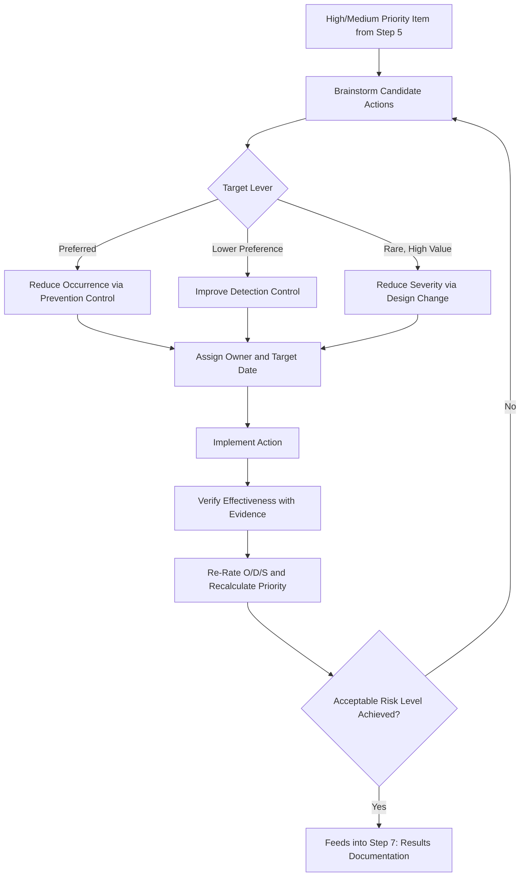

## Step Six Optimization

### Definition and Purpose

Optimization is the sixth step in the AIAG-VDA harmonized FMEA methodology, in which the team identifies, assigns, implements, and verifies specific actions to reduce risk for failure chains classified as requiring attention during Risk Analysis (step 5). This step is where FMEA transitions from analysis to actual risk reduction — it is the step where the FMEA delivers tangible engineering or process value, converting the prioritized list of risks from step 5 into implemented design or process improvements.

### Position in the Seven-Step Process

1. Planning and Preparation
2. Structure Analysis
3. Function Analysis
4. Failure Analysis
5. Risk Analysis
6. **Optimization** (this topic)
7. Results Documentation

Optimization directly consumes the Action Priority classifications and rated failure chains from Risk Analysis, and its outcomes (implemented actions with re-rated Occurrence/Detection, and in rare cases Severity) feed into the final Results Documentation step.

### The Three Levers of Risk Reduction

Optimization actions target one (or more) of the three risk dimensions, though each lever has different feasibility and different priority in practice:

#### 1. Reducing Severity (Least Common, Highest Value)

Severity can only be reduced through a fundamental design change that alters the actual consequence of the failure — not through better detection or prevention of the cause. For example, adding a mechanical safety interlock that changes a failure's consequence from "amputation" to "no injury" reduces Severity. Because this typically requires a design-level change, Severity reduction is pursued far less often than Occurrence or Detection improvement, but delivers the most fundamental risk reduction when feasible.

#### 2. Reducing Occurrence (Preferred Lever)

Occurrence is reduced by improving prevention controls — the design or process elements that stop the cause from happening in the first place. Examples include improved material selection, tighter process capability, mistake-proofing (poka-yoke), design margin increases, or more robust process parameters. AIAG-VDA and most quality methodologies treat Occurrence reduction as preferable to Detection improvement, since preventing a failure from happening is inherently more effective than catching it after the fact.

#### 3. Improving Detection (Lower Preference, Often Necessary)

Detection is improved by adding or strengthening controls that catch the cause or failure mode before it escapes — examples include upgrading from sampling-based to 100% automated inspection, adding an automated gauge with alarm, or implementing an additional functional test. Detection improvement is generally considered a lower-preference lever than Occurrence reduction, since it doesn't prevent the underlying cause, but is often the most practical near-term action, particularly when Occurrence reduction requires a longer-lead design change.

### Optimization Workflow

**Key Points**

1. Filter the Risk Analysis output to identify items classified as High priority (mandatory action or documented justification) and Medium priority (discretionary action) items the team elects to address
2. For each item, brainstorm candidate actions targeting Occurrence reduction, Detection improvement, or (where feasible) Severity reduction
3. Evaluate candidate actions for technical feasibility, cost, timeline, and expected risk-reduction impact
4. Select and formally assign each action with a **responsible owner** and a **target completion date**
5. Implement the selected actions (design changes, process changes, control additions)
6. **Re-evaluate and re-rate** the affected Occurrence, Detection, and (rarely) Severity ratings following implementation, based on verified evidence that the action was effective — not merely on the expectation that it will work
7. Recalculate RPN and/or re-determine Action Priority classification using the updated ratings
8. Confirm the item's new classification has actually moved to an acceptable level; if not, additional action may be required
9. For High-priority items where no action is taken, formally document the engineering justification for accepting the risk as-is

### Action Assignment and Tracking

**Key Points**

- Every action requires a named responsible individual, not a functional group, to ensure accountability
- Target dates should be realistic and tied to relevant program milestones (e.g., before design freeze, before process validation)
- Actions should be tracked to closure using a formal tracking mechanism (action log, FMEA software module, or integrated program management tool)
- Status should be visible and reviewed at a defined cadence (e.g., weekly or biweekly FMEA team review) until all mandatory actions are closed
- "Closed" status should require verification evidence (test data, validated process capability study, inspection record) — not simply a statement that the action was completed

### Distinguishing Planned Actions from Existing Controls

A critical discipline in Optimization is not to confuse a **planned** action with an **existing** control already documented in Risk Analysis:

- Ratings in step 5 (Risk Analysis) reflect only controls that exist **today**
- A planned action's expected benefit should not be reflected in the rating until it is actually implemented and verified
- Only after implementation and verification should the Occurrence, Detection, or Severity rating be revised to reflect the new, improved state
- This discipline prevents the FMEA from showing an artificially low residual risk based on actions that haven't actually been completed yet

### Example

**Scenario:** Continuing the CNC bore machining Process FMEA example from Risk Analysis.

**Cause 1 (from Risk Analysis):** Boring tool wear exceeding replacement interval — Severity 8, Occurrence 4, Detection 7, RPN 224, classified High priority.

**Candidate actions considered:**

- Reduce Occurrence: Implement tool-wear sensor with predictive replacement alert (targets prevention, addresses root cause)
- Improve Detection: Upgrade from sampling-based manual inspection to 100% automated in-process bore gauge (targets detection, doesn't address root cause)

**Selected action:** Both actions selected — tool-wear sensor implementation (Owner: Process Engineer, Target: before next production run) and automated gauge upgrade (Owner: Quality Engineer, Target: concurrent with sensor implementation), since combining Occurrence reduction with Detection improvement provides the most robust risk reduction.

**Post-implementation re-rating:**

- Occurrence re-rated: 4 → 2 (validated via 3 months of production data showing zero tool-wear-related bore deviations after sensor implementation)
- Detection re-rated: 7 → 2 (automated 100% gauge with alarm verified via gauge R&R study)
- New RPN: $8 \times 2 \times 2 = 32$, down from 224
- New Action Priority classification: Low (down from High), confirming the risk has been meaningfully reduced and verified with evidence, not merely projected

### Common Pitfalls

- Selecting only Detection improvements when Occurrence reduction is technically feasible, missing the more fundamental risk-reduction opportunity
- Re-rating Occurrence or Detection based on an action's expected benefit before it has actually been implemented and verified
- Assigning actions without a specific responsible owner or target date, resulting in actions that never close
- Closing an action based on completion alone, without verification evidence that the action actually achieved the intended risk reduction
- Failing to formally document engineering justification when a High-priority item is left without action
- Treating Optimization as a one-time pass rather than an iterative cycle — if a re-rated item still doesn't reach an acceptable classification, further action is required
- Not communicating action status and closure back to affected stakeholders (design, manufacturing, quality) outside the immediate FMEA team

### Diagram: Optimization Action Cycle (svg_diagram)

**Related Topics**

- Step five risk analysis
- Results documentation in the seven-step method
- Calculating the risk priority number
- AIAG VDA action priority tables
- High medium and low priority classification
- Setting thresholds for required action
- Occurrence rating scales and criteria
- Detection rating scales and criteria