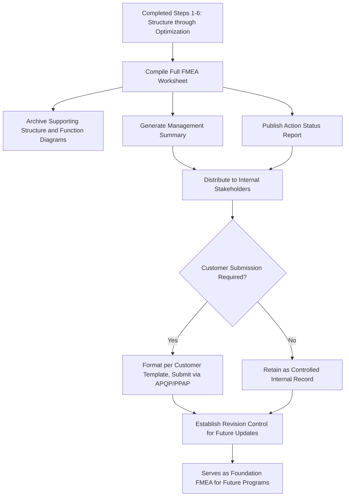

## Step Seven Results Documentation

### Definition and Purpose

Results Documentation is the seventh and final step in the AIAG-VDA harmonized FMEA methodology, in which the complete FMEA analysis — structure, function, failure analysis, risk ratings, and optimization actions — is formally compiled, communicated, and archived as a controlled quality record. This step ensures the FMEA's findings are captured in a form that supports internal review, customer submission, audit evidence, and future reuse as a foundation/carryover FMEA for related programs.

### Position in the Seven-Step Process

1. Planning and Preparation
2. Structure Analysis
3. Function Analysis
4. Failure Analysis
5. Risk Analysis
6. Optimization
7. **Results Documentation** (this topic)

Results Documentation is not merely an administrative closeout — AIAG-VDA treats it as a distinct analytical step because a poorly documented FMEA fails to deliver value even if the preceding six steps were performed rigorously. Documentation quality directly determines whether the analysis can be effectively communicated, audited, reused, or maintained as a living document.

### Core Components of Results Documentation

#### 1. Completed FMEA Worksheet/Form

The full structured record capturing every element from Structure Analysis through Optimization — structure hierarchy, functions, failure chains (cause/mode/effect), current prevention/detection controls, Severity/Occurrence/Detection ratings, RPN and/or Action Priority classification, assigned actions, owners, target dates, and post-action re-ratings, typically maintained in the standardized AIAG-VDA form format or equivalent FMEA software platform.

#### 2. Executive/Management Summary

A condensed summary highlighting the highest-priority findings, key risks identified, actions taken, and overall risk posture — intended for stakeholders who need the conclusions without reviewing the full line-by-line worksheet, such as program management or customer quality representatives.

#### 3. Action Status Report

A tracked list of all assigned Optimization actions with current status (open, in progress, closed, verified), owner, and target/actual completion dates — often maintained as a living document updated between formal FMEA review cycles.

#### 4. Supporting Diagrams

The structure diagrams (block/boundary diagrams or process flow diagrams from Structure Analysis) and function nets (from Function Analysis) archived alongside the worksheet, since these provide essential context for interpreting the failure analysis and are frequently required as part of a complete submission package.

#### 5. Revision History

A documented record of changes to the FMEA over time — what changed, why, when, and by whom — particularly important for FMEAs that are revised due to design changes, field issues, or customer requests, and essential for demonstrating the FMEA is being maintained as a living document rather than a one-time exercise.

### Documentation Standards and Formats

**Key Points**

- The AIAG-VDA handbook provides standardized form layouts for Design FMEA and Process FMEA, structured to capture the 7-step data model consistently across organizations and customers
- Organizations may use dedicated FMEA software platforms that auto-generate documentation outputs from the structured data entered during steps 1–6, reducing manual compilation effort and improving consistency
- Customer-specific formats or submission requirements (particularly common in automotive OEM relationships) may require translating the internal FMEA record into a specific customer-mandated template
- Documentation should maintain traceability back to the structure/function/failure chain established in earlier steps — a reviewer should be able to trace any rated risk item back to its originating function and structural element

### Communication and Distribution

**Key Points**

- **Internal stakeholders**: Design/process engineering, quality, manufacturing, and program management typically require access to the full worksheet and action status
- **Management review**: Program or quality management typically receives the summary-level view, focused on open High-priority items and overall risk trend
- **Customer submission**: Where contractually required (common in automotive, aerospace, and medical device supply chains), a formatted FMEA extract or full worksheet is submitted as part of Advanced Product Quality Planning (APQP) or equivalent program gate deliverables
- **Cross-functional teams for related programs**: The completed FMEA, particularly its structure and function analysis, often becomes reference material for other teams working on similar systems or processes

### Maintaining the FMEA as a Living Document

**Key Points**

- Results Documentation is not a final, static output — AIAG-VDA emphasizes that FMEAs should be revisited and updated whenever the design or process changes, a new failure mode is identified (e.g., through field data or a customer complaint), or a corrective action from a different quality process (such as a problem-solving investigation) reveals a gap in the original analysis
- Establishing a clear **document control and revision process** ensures updates are captured, reviewed, and re-approved rather than made informally outside the controlled record
- Foundation/carryover FMEAs — where a completed FMEA serves as the starting point for a similar future program — depend heavily on the quality and completeness of this step, since a poorly documented FMEA is difficult to reuse accurately (see step one planning and preparation)

### Example

**Scenario:** Completing documentation for the CNC bore machining Process FMEA carried through the prior six-step examples.

**FMEA Worksheet:** Full record showing the structure (Brake Caliper Machining Line → CNC Bore Machining Operation → Machine/Man/Material/Method elements), functions at each level, failure chains for the oversized-bore failure mode with its two causes, original and post-action Severity/Occurrence/Detection ratings, and the two Optimization actions (tool-wear sensor and automated gauge) with their owners, target dates, and closure verification evidence.

**Management Summary:** Highlights that the highest-priority risk identified (oversized bore leading to potential seal leakage) was reduced from RPN 224/High priority to RPN 32/Low priority through combined Occurrence and Detection improvements, both verified and closed prior to production launch.

**Revision History:** Documents the original FMEA baseline date, the date the tool-wear sensor and gauge actions were verified and ratings updated, and notes this FMEA will serve as the foundation FMEA for the next-generation caliper machining line program.

**Customer Submission:** Relevant extract formatted per the OEM customer's required FMEA submission template, provided as part of the program's Production Part Approval Process (PPAP) documentation package.

### Common Pitfalls

- Treating documentation as a final, one-time administrative task rather than a living record requiring ongoing revision control
- Failing to maintain traceability from rated risk items back to their originating structure/function/failure chain, making the worksheet difficult to audit or interpret later
- Archiving the worksheet without the supporting structure diagrams and function nets, losing essential context for future reuse
- Leaving action status information stale or disconnected from the master FMEA record, so the documented risk level no longer reflects actual current status
- Submitting an internally-formatted FMEA to a customer without translating it into their required template, risking rejection or delayed program approval
- Not establishing a clear revision/document control process, making it difficult to demonstrate to auditors that the FMEA has been properly maintained over the product/process lifecycle

### Diagram: Results Documentation Components and Flow (svg_diagram)

**Related Topics**

- Step six optimization
- Step one planning and preparation
- Step two structure analysis
- Step three function analysis
- Step four failure analysis
- Step five risk analysis
- Foundation and carryover FMEA practices
- Document control and revision management in quality systems