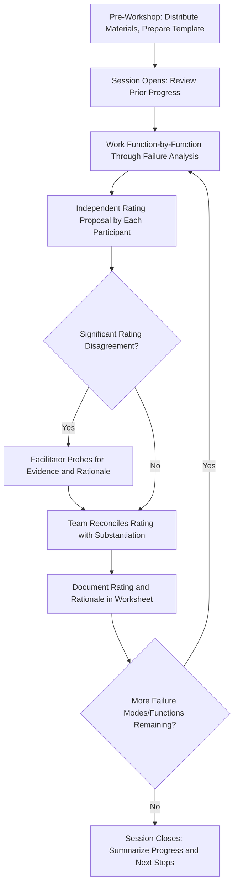

## Running Effective FMEA Workshops

### Definition and Purpose

Running effective FMEA workshops refers to the facilitation practices, session structuring, and team management techniques that determine whether an FMEA session produces a rigorous, well-substantiated analysis or a superficial, inconsistent one. Because FMEA is fundamentally a group judgment exercise conducted across the seven-step method, workshop quality is often the single largest determinant of FMEA output quality — the same rating scales and structured methodology can produce very different results depending on how well the session itself is run.

### Why Workshop Facilitation Matters

- **FMEA quality depends on group judgment**: Unlike a purely data-driven analysis, Severity/Occurrence/Detection ratings and failure mode identification rely heavily on team knowledge and consensus, making session dynamics directly consequential to output quality
- **Poor facilitation amplifies known biases**: Groupthink, authority bias, optimism bias, and rating compression (see common rating biases and inconsistencies) are all more likely to dominate an unstructured or poorly facilitated session
- **Time is a scarce, contested resource**: Cross-functional participants often view FMEA sessions as lower priority than their primary responsibilities, making efficient, well-structured sessions essential to sustained engagement
- **Poorly run workshops undermine the FMEA's credibility**: A rushed or superficial session produces a document that stakeholders (including auditors and customers) recognize as low-quality, undermining trust in the broader FMEA program

### Pre-Workshop Preparation

**Key Points**

- Confirm the workshop's scope, team composition, and objectives are already established from Planning and Preparation (step one planning and preparation) before scheduling sessions
- Distribute relevant reference materials (specifications, prior FMEAs, structure/function diagrams if already drafted) to participants in advance so session time isn't consumed by first-time reading
- Prepare the FMEA worksheet/software template in advance, pre-populated with known structure and function information where available, so the session focuses on failure analysis and risk rating rather than administrative setup
- Schedule sessions with sufficient duration and frequency to maintain momentum — very short, infrequent sessions tend to lose continuity, while marathon sessions tend to produce rating fatigue and compressed judgment
- Confirm management sponsorship and protected time for participants, since inconsistent attendance is one of the most common causes of stalled FMEA workshops

### Facilitator Role and Responsibilities

**Key Points**

- **Neutral guide, not content expert**: An effective facilitator manages the process and group dynamics rather than driving technical content, reducing the risk of authority bias dominating the discussion
- **Elicits input from all disciplines**: Actively solicits perspectives from quieter or less senior participants, since valuable failure modes and causes are often known only to specific functions (e.g., field service, machine operators) who may not naturally dominate discussion
- **Challenges unsubstantiated ratings**: Asks for evidence or rationale behind proposed Severity/Occurrence/Detection ratings rather than accepting the first number offered, directly countering the optimism and detection-overconfidence biases discussed in common rating biases and inconsistencies
- **Manages time and scope discipline**: Keeps discussion focused on the defined structure/function/failure chain, redirecting tangential debates (e.g., disputes about unrelated design decisions) to separate follow-up conversations
- **Documents in real time**: Captures failure modes, causes, effects, and ratings directly into the worksheet during the session, allowing the team to see and validate the emerging record live rather than reconstructing it afterward

### Structured Session Techniques

#### Independent-Then-Discuss Rating

Rather than open discussion immediately producing a group number, participants independently propose a rating first (verbally in turn, on paper, or via a polling tool), which are then revealed together and discussed — reducing the anchoring effect of the first-spoken opinion (see calibrating ratings across teams for the same technique applied to cross-team calibration).

#### Structured Brainstorming per Function

Working systematically through each function identified in step 3 (Function Analysis), rather than open-ended brainstorming across the whole system at once, ensures comprehensive coverage and prevents the discussion from concentrating disproportionately on a few memorable or recent failure modes.

#### Timeboxing Individual Items

Setting a rough time limit per failure mode/cause discussion (e.g., 5–10 minutes) prevents a single contentious item from consuming disproportionate session time at the expense of covering the full scope; unresolved items can be flagged for follow-up research rather than debated indefinitely in the room.

#### Parking Lot for Off-Scope Issues

Maintaining a visible "parking lot" list for valid but out-of-scope issues (design concerns unrelated to the current FMEA boundary, process improvement ideas, etc.) allows the team to acknowledge and capture them without derailing the current session's focus.

### Managing Group Dynamics

**Key Points**

- **Countering groupthink**: Explicitly invite dissenting or minority views before finalizing a rating, and be alert to premature consensus, especially when senior participants speak first
- **Balancing participation**: Redirect discussion away from dominant voices and toward quieter participants who may hold relevant but unstated knowledge, particularly manufacturing/field personnel who often have direct failure experience
- **Managing disagreement constructively**: Frame rating disagreement as a signal to seek additional data or clarify criteria rather than as a conflict to be resolved by compromise or averaging (see calibrating ratings across teams for how documented disagreement should drive criteria refinement)
- **Sustaining engagement across a multi-session FMEA**: For FMEAs spanning many sessions, periodically summarize progress and remaining scope to maintain team motivation and shared situational awareness
- **Managing remote/hybrid participation**: When team members join virtually, ensure the shared worksheet is visible to all participants in real time and explicitly solicit input from remote attendees, who can be inadvertently sidelined in a room-dominated discussion

### Common Workshop Formats

| Format | Description | Best Suited For |
| --- | --- | --- |
| Single intensive session | One extended session (e.g., full day) covering the entire scope | Small, well-bounded scopes with a highly available team |
| Recurring short sessions | Regular shorter sessions (e.g., weekly 90 minutes) over several weeks | Larger scopes, teams with limited availability per session |
| Pre-work plus review session | Individual/small-group pre-work on structure/function, followed by a full-team review and risk-rating session | Experienced teams familiar with the methodology, time-constrained schedules |
| Hybrid remote/in-person | Mix of co-located and virtual participants using shared digital worksheet tools | Distributed teams, multi-site programs |

### Example

**Scenario:** A cross-functional team is conducting a Process FMEA workshop for a new assembly line, with participants from process engineering, quality, manufacturing, and a machine operator representative.

**Facilitation approach:** The facilitator opens each session by reviewing progress against the function net from the prior session, then works function-by-function through failure mode identification. For each candidate failure mode, participants privately write down a proposed Occurrence rating before discussing as a group. When the operator representative and the process engineer's initial estimates differ by more than two points, the facilitator pauses to ask what specific experience or data underlies each estimate, uncovering that the operator has observed a wear pattern not yet reflected in the process engineer's assumptions — leading to a revised, better-substantiated rating and a new candidate failure cause added to the worksheet.

**Outcome:** The structured, independent-rating approach surfaces field-relevant knowledge that a purely open-discussion format, dominated by the more senior process engineer's initial estimate, would likely have missed.

### Common Pitfalls

- Allowing sessions to run without a neutral facilitator, permitting technical content ownership to blend with process facilitation and increasing susceptibility to authority bias
- Skipping pre-workshop preparation, forcing session time to be spent on administrative setup rather than analysis
- Permitting a small number of participants to dominate discussion, silencing valuable input from quieter or less senior team members
- Allowing rating discussions to proceed via open group consensus without an independent-first step, reintroducing anchoring bias
- Letting scope creep or off-topic debates consume session time without a parking-lot mechanism to redirect them
- Scheduling sessions too infrequently, causing the team to lose continuity and re-cover previously discussed ground
- Neglecting remote participants in hybrid sessions, causing systematic underrepresentation of their input in the final record

### Diagram: FMEA Workshop Session Flow (svg_diagram)

**Related Topics**

- Common rating biases and inconsistencies
- Calibrating ratings across teams
- Step one planning and preparation
- Step four failure analysis
- Step five risk analysis
- Structured brainstorming techniques in FMEA
- Managing remote and hybrid team collaboration
- Sustaining team engagement across multi-session analyses