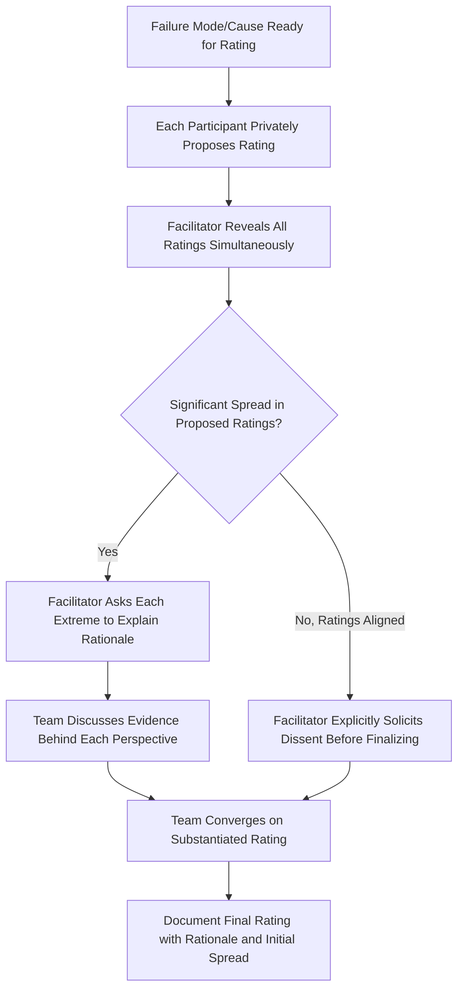

## Avoiding Groupthink in Group Ratings

### Definition and Purpose

Groupthink is a psychological phenomenon in which a group's desire for consensus or harmony leads participants to suppress dissenting views, critical evaluation, or alternative perspectives, resulting in premature or uncritical agreement. In the context of FMEA rating sessions, groupthink causes Severity, Occurrence, and Detection ratings to converge around a single early-stated opinion — often that of the most senior, most vocal, or most technically authoritative participant — rather than reflecting genuine, evidence-based team consensus. This topic addresses groupthink specifically as one of several documented rating biases discussed more broadly in common rating biases and inconsistencies, with a focus on the structural and facilitation techniques that prevent it.

### Why Groupthink Is Particularly Damaging to FMEA Ratings

- **Ratings are the analytical output that drives action**: Unlike a general design discussion where a suppressed opinion might simply go unrecorded, a groupthink-driven rating directly determines whether a failure mode receives mandatory corrective action, making the consequence of suppressed dissent concrete and measurable
- **Cross-functional value depends on genuine diversity of input**: FMEA teams are deliberately assembled to be cross-functional specifically because different disciplines see different failure modes and have different risk perspectives; groupthink defeats this purpose by collapsing multiple perspectives into one
- **Field and operator knowledge is especially vulnerable to suppression**: Participants with direct hands-on experience (machine operators, field service technicians) often hold relevant but less "authoritative-sounding" knowledge that is easily overridden by a confident senior engineer's early opinion
- **Groupthink is self-reinforcing across a multi-session FMEA**: Once a pattern of premature consensus is established early in a workshop series, it tends to persist and compound across subsequent sessions unless actively interrupted

### Recognizing Groupthink in FMEA Sessions

**Key Points**

- Ratings converge suspiciously quickly, especially immediately after a senior or vocal participant states an opinion
- Certain participants (often more junior, quieter, or from less "technical" functions) rarely speak or have their input incorporated into final ratings
- Dissenting views, when raised, are met with social pressure to conform ("let's not overthink this," "I think we're all in agreement") rather than substantive engagement
- The same numeric ratings appear repeatedly across dissimilar failure modes, suggesting the team is defaulting to a comfortable "default" rating rather than genuinely evaluating each case (related to the rating compression bias discussed in common rating biases and inconsistencies)
- Facilitators or note-takers observe that the recorded rating doesn't reflect the range of opinions actually expressed during discussion

### Structural Techniques to Prevent Groupthink

#### 1. Independent-Then-Reveal Rating

Require each participant to privately propose a rating — on paper, via a polling tool, or by writing it down — before any discussion occurs. Ratings are then revealed simultaneously rather than sequentially, preventing the first-spoken number from anchoring subsequent contributions. This technique, borrowed from Delphi-method and planning-poker practices, is the single most effective structural countermeasure to groupthink in rating exercises.

#### 2. Facilitator-Led Devil's Advocacy

The facilitator (or a rotating designated participant) deliberately raises the strongest counter-argument to an emerging consensus rating before it is finalized, ensuring at least one voice actively challenges the group's default direction rather than relying on organic dissent, which is often socially suppressed.

#### 3. Silent Written Input Before Verbal Discussion

Beyond just numeric ratings, having participants silently write down candidate failure modes, causes, or concerns before verbal brainstorming begins ensures ideas aren't lost to whoever speaks first or most confidently, and surfaces items that a purely verbal, sequential discussion might never reach.

#### 4. Explicit Solicitation of Dissent

The facilitator directly and specifically invites disagreement before closing a rating discussion ("Does anyone see this differently?" "What would make this rating wrong?") rather than simply asking if there are objections, since a passive "any objections?" tends to be met with silence even when private disagreement exists.

#### 5. Rotating Speaking Order

Deliberately varying who speaks first across different failure modes/causes — rather than always defaulting to the most senior or most technically central participant — prevents a consistent anchoring pattern from forming across the session.

### Facilitator Responsibilities Specific to Groupthink

**Key Points**

- Actively monitor participation balance across the session, noting which participants have contributed input and which have not
- Directly invite quieter participants by name ("[Name], from the operator perspective, does this match what you've seen on the line?") rather than relying on them to volunteer
- Treat rapid, unanimous agreement as a signal to slow down and probe further, not as evidence of a well-reasoned rating
- Separate the facilitator role from the technical authority role — a facilitator who is also the most senior technical voice in the room is structurally more likely to inadvertently anchor the group, making a neutral, non-content-owning facilitator preferable where feasible
- Document not just the final rating but the range of ratings initially proposed, providing a record that can be reviewed later if the rating is challenged or revisited

### Relationship to Calibration and Bias Mitigation

Groupthink prevention within a single session complements, but is distinct from, the cross-team calibration process described in calibrating ratings across teams. Independent-then-reveal rating techniques prevent groupthink from distorting a single session's ratings, while calibration exercises detect and correct systemic interpretation drift across multiple sessions or teams over time. An organization that prevents groupthink within sessions but never calibrates across teams can still end up with consistent-within-team but divergent-across-team ratings; both techniques are complementary parts of a rigorous rating discipline.

### Example

**Scenario:** A Design FMEA team is rating the Occurrence of a bearing failure cause. The lead design engineer states early in the discussion, "I think this is pretty unlikely — maybe a 2." Without a structured technique in place, the team quickly agrees and moves on.

**Applying the independent-then-reveal technique:** Instead, the facilitator asks each participant to silently write their proposed Occurrence rating before any verbal discussion. Ratings are revealed simultaneously: the design engineer proposes 2, but the reliability engineer proposes 6 and the field service representative proposes 7, citing three documented field returns for a similar bearing under comparable load conditions.

**Outcome:** The facilitator surfaces the discrepancy directly ("we have a significant spread here — let's understand why") rather than allowing the initial "2" to stand unchallenged. Discussion reveals the design engineer's estimate was based on bench testing under ideal conditions, while the field data reflected real-world load variation not captured in the test protocol. The team converges on a substantiated Occurrence rating of 6, informed by the field evidence that would likely have been suppressed under an open, sequential discussion format.

### Common Pitfalls

- Relying on open verbal discussion for every rating, allowing the first-spoken opinion to anchor the group by default
- Treating fast, unanimous agreement as a sign of an efficient session rather than a potential warning sign of suppressed dissent
- Allowing the most senior participant to also serve as facilitator, compounding authority bias with facilitation control
- Failing to specifically and individually invite input from quieter participants, allowing their silence to be interpreted as agreement
- Not documenting the initial spread of independently proposed ratings, losing the evidence needed to revisit a groupthink-influenced decision later
- Treating groupthink prevention as a one-time technique rather than a consistent practice applied across every rating decision in the session

### Diagram: Groupthink Prevention Technique Flow (svg_diagram)

**Related Topics**

- Common rating biases and inconsistencies
- Running effective FMEA workshops
- Calibrating ratings across teams
- Structured facilitation techniques for consensus building
- Severity rating scales and criteria
- Occurrence rating scales and criteria
- Detection rating scales and criteria
- Documenting rating rationale for audit defensibility