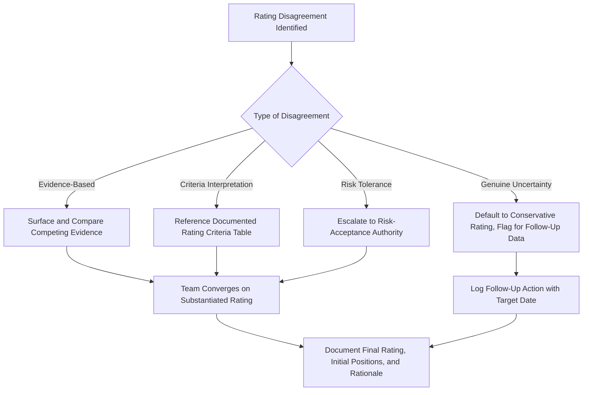

## Managing Disagreement on Severity and Occurrence

### Definition and Purpose

Managing disagreement on Severity and Occurrence refers to the facilitation techniques and resolution processes used when FMEA team members genuinely differ in their assessment of a failure effect's severity or a failure cause's likelihood, even after structured, independent rating techniques have been applied. Unlike groupthink — where disagreement is suppressed before it surfaces (see avoiding groupthink in group ratings) — this topic addresses the productive handling of disagreement that has already been made visible, ensuring it resolves into a well-substantiated rating rather than an arbitrary compromise.

### Why Disagreement Should Be Treated as Valuable, Not a Problem

- **Disagreement often reveals real information asymmetry**: A rating gap between two participants frequently reflects different underlying knowledge (e.g., a design engineer's bench-test assumptions vs. a field service representative's observed real-world conditions) rather than mere opinion difference — surfacing and resolving this gap improves the FMEA's accuracy
- **Disagreement can reveal ambiguous rating criteria**: When well-informed participants genuinely can't agree on a rating, the underlying criteria table language may be ambiguous, signaling a need to revisit the organization's rating scale definitions (see customizing rating tables for an organization)
- **Premature resolution by averaging loses information**: Splitting the difference between two proposed ratings (e.g., settling on a "5" between a proposed "3" and "7") discards the substantive reasoning behind each estimate without actually resolving which is correct
- **Unresolved disagreement, if suppressed, resurfaces later at higher cost**: A rating disagreement papered over during the FMEA session often reappears as a field failure, audit finding, or customer complaint that reveals the risk was underrated from the start

### Distinguishing Types of Disagreement

**Key Points**

- **Evidence-based disagreement**: Participants have different data or direct experience informing their estimates (e.g., field data vs. lab data) — resolved by surfacing and evaluating the competing evidence
- **Criteria-interpretation disagreement**: Participants agree on the underlying facts but interpret the rating scale's criteria language differently — resolved by clarifying or revising the criteria table wording
- **Risk-tolerance disagreement**: Participants agree on the facts and criteria but weigh acceptable risk differently (e.g., a quality representative favoring a more conservative rating than a design engineer under schedule pressure) — resolved through escalation to a pre-defined organizational risk tolerance standard rather than a facilitator or team vote
- **Genuine uncertainty**: Neither participant has strong evidence, and the disagreement reflects honest uncertainty about an unproven design or process — resolved by defaulting to the more conservative (higher-risk) rating until data becomes available, consistent with the principle that unproven designs/processes should not receive optimistic ratings

### Structured Resolution Techniques

#### 1. Evidence Surfacing

The facilitator asks each party to state the specific basis for their proposed rating — test data, field history, a documented standard, or direct observation — rather than allowing the discussion to remain at the level of unsupported opinion. This often reveals that one party has information the other lacks, resolving the disagreement through information-sharing rather than negotiation.

#### 2. Criteria Table Reference Check

When disagreement stems from differing interpretation of what a given rating level actually means, the facilitator redirects the discussion back to the organization's documented rating criteria table (see severity rating scales and criteria and occurrence rating scales and criteria), asking both parties to justify their rating against the specific published language rather than personal judgment.

#### 3. Escalation for Risk-Tolerance Conflicts

When disagreement reflects a genuine difference in acceptable risk tolerance rather than a factual or interpretive gap, the facilitator should avoid resolving it through team vote or facilitator override, and instead escalate to the organization's defined risk-acceptance authority (e.g., a quality or safety function with the mandate to make risk-tolerance calls), consistent with the escalation path defined in setting thresholds for required action.

#### 4. Default to Conservative Rating Under Genuine Uncertainty

When neither party has strong evidence and disagreement reflects honest uncertainty, the team should rate conservatively (toward higher Severity/Occurrence) rather than defaulting to an optimistic middle-ground compromise, and should flag the item for follow-up data collection (e.g., testing, monitoring) to resolve the uncertainty in a future FMEA revision.

#### 5. Parking for Follow-Up Data

When a disagreement cannot be resolved within the session — for example, when it hinges on data that isn't immediately available (a field failure report still being compiled, a test result pending) — the item should be explicitly flagged with an interim conservative rating and a follow-up action to revisit once the missing data is available, rather than being forced to a premature resolution.

### What NOT to Do When Resolving Disagreement

**Key Points**

- **Do not simply average the proposed ratings**: Averaging a "3" and a "7" into a "5" discards the reasoning behind both estimates and produces a rating substantiated by neither party's actual evidence
- **Do not default to the most senior participant's opinion**: This resolves disagreement through authority rather than evidence, reintroducing the authority bias that structured rating techniques are meant to counter (see avoiding groupthink in group ratings)
- **Do not resolve through majority vote among participants with unequal information**: A vote assumes all opinions carry equal evidentiary weight, which is rarely true when disagreement stems from information asymmetry
- **Do not suppress the disagreement to maintain session pace**: Artificially forcing consensus to keep the workshop schedule on track produces an unsubstantiated rating that undermines the FMEA's validity

### Documenting Resolved Disagreement

**Key Points**

- Record not just the final agreed rating, but the range of initial positions and the specific evidence or reasoning that resolved the disagreement, providing an auditable rationale if the rating is later questioned
- Where a criteria table ambiguity was identified as the root cause, log this as a candidate revision to the organization's rating criteria (feeding into the ongoing maintenance described in customizing rating tables for an organization)
- Where an item was resolved by defaulting to a conservative rating pending follow-up data, explicitly track this as an open action with a target date for revisiting the rating once data becomes available

### Example

**Scenario:** A Process FMEA team disagrees on the Occurrence rating for "inconsistent weld penetration due to fixture wear." The process engineer proposes Occurrence 2, citing the fixture's recent preventive maintenance schedule. The quality engineer proposes Occurrence 6, citing three documented in-process rejects over the past quarter attributable to fixture wear between maintenance intervals.

**Resolution process:** The facilitator identifies this as evidence-based disagreement, not a criteria interpretation gap or risk-tolerance conflict. The quality engineer's field/production data represents direct, relevant evidence of actual occurrence, while the process engineer's rating was based on the existence of a maintenance schedule rather than data confirming its effectiveness between intervals.

**Outcome:** The team converges on Occurrence 5–6, substantiated by the documented reject data, and logs a follow-up action to evaluate whether the maintenance interval needs to be shortened — directly linking the disagreement resolution to a concrete Optimization action (see step six optimization) rather than leaving the gap unresolved or averaged away.

### Common Pitfalls

- Resolving disagreement by averaging proposed ratings rather than investigating the underlying evidence
- Allowing the most senior or most confident participant's position to prevail by default rather than by substantiation
- Treating all disagreement as the same type, applying evidence-surfacing techniques to what is actually a risk-tolerance conflict that requires escalation instead
- Rushing to premature resolution to preserve session schedule, producing an unsubstantiated rating
- Failing to document the reasoning behind a resolved disagreement, leaving no audit trail if the rating is challenged later
- Not flagging genuine uncertainty for follow-up data collection, instead settling on an unsubstantiated middle-ground rating that neither reflects nor resolves the actual unknown

### Diagram: Disagreement Resolution Decision Flow (svg_diagram)

**Related Topics**

- Avoiding groupthink in group ratings
- Common rating biases and inconsistencies
- Running effective FMEA workshops
- Calibrating ratings across teams
- Severity rating scales and criteria
- Occurrence rating scales and criteria
- Customizing rating tables for an organization
- Setting thresholds for required action