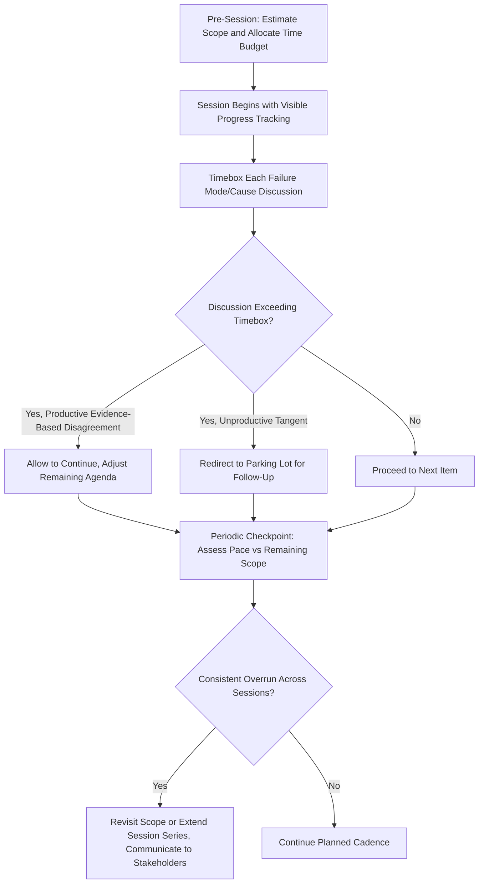

## Time Management During Sessions

### Definition and Purpose

Time management during sessions refers to the facilitation practices used to allocate, pace, and protect the limited time available in FMEA workshops so that the analysis achieves adequate depth and coverage without stalling, running over schedule, or degrading into superficial treatment of later agenda items. Because FMEA sessions compete with participants' primary job responsibilities for time and attention (see running effective FMEA workshops), disciplined time management is often the difference between a sustained, high-quality multi-session analysis and one that loses momentum, participant engagement, or analytical rigor partway through.

### Why Time Management Is a Distinct Facilitation Challenge

- **FMEA scope is often underestimated at the outset**: The number of functions, failure modes, and causes to analyze frequently exceeds initial estimates, particularly for complex systems, making time overrun a persistent risk without active management
- **Quality tends to degrade as time pressure increases**: Teams facing a shrinking time budget tend to rush ratings, skip evidence-gathering, and settle for premature consensus — directly increasing the rating biases discussed in common rating biases and inconsistencies
- **Uneven coverage across scope is a common failure pattern**: Without deliberate pacing, teams often spend disproportionate time on the first few items discussed and rush through remaining scope as the session runs long, producing inconsistent analytical depth across the FMEA
- **Participant fatigue directly affects judgment quality**: Rating decisions made in the final stretch of an overlong session are demonstrably less reliable than those made when participants are fresh, making session length and pacing a direct quality factor, not merely a scheduling convenience

### Pre-Session Time Planning

**Key Points**

- Estimate the number of functions, failure modes, and causes likely to be covered based on the structure and function analysis already completed (see step two structure analysis and step three function analysis), and allocate session time accordingly rather than scheduling a fixed duration without reference to actual scope
- Build in contingency time (commonly 15–20% of planned duration) for items that take longer than expected, rather than planning a schedule with zero slack
- Sequence the agenda to address higher-severity or higher-priority structural elements earlier in the session series, ensuring that if time runs short later, the most consequential items have already received adequate attention
- Communicate the session's planned scope and time budget to participants in advance so they can calibrate their own pacing expectations and flag known complexity areas ahead of time

### In-Session Pacing Techniques

#### Timeboxing Individual Items

Setting an approximate time limit per failure mode/cause discussion (commonly 5–10 minutes) signals to the team when a discussion is running long and creates a natural prompt to either resolve quickly or defer for follow-up, rather than allowing indefinite discussion.

#### Visible Time and Progress Tracking

Displaying remaining time and scope progress (e.g., "12 of 30 failure modes covered, 45 minutes remaining") keeps the team collectively aware of pacing throughout the session, rather than leaving time awareness solely to the facilitator.

#### Deferred/Parking Lot for Time-Consuming Items

When a specific failure mode or rating discussion is taking substantially longer than its timebox without resolving, the facilitator moves it to a parking lot for dedicated follow-up (a smaller working session, additional data-gathering, or a specific agenda slot in the next session) rather than allowing it to consume time budgeted for other scope items.

#### Periodic Checkpoint Reviews

At planned intervals within a longer session (e.g., every 45–60 minutes), briefly pausing to assess pace against the remaining agenda allows the facilitator to adjust — accelerating discussion, deferring lower-priority items, or extending the session if genuinely warranted — rather than discovering the mismatch only at the scheduled end time.

### Balancing Speed Against Rigor

**Key Points**

- Time management should never come at the cost of skipping the independent-then-reveal rating technique or other bias-mitigation practices (see avoiding groupthink in group ratings) — a faster session achieved by cutting corners on rating rigor produces a lower-quality FMEA, not merely a shorter one
- When genuine disagreement requires extended discussion (see managing disagreement on severity and occurrence), this is time well spent and should not be rushed merely to preserve the schedule; instead, the item should be deferred to protect both the current session's pace and the disagreement's proper resolution
- Distinguish between productive extended discussion (evidence-based rating disagreement, genuine failure mode discovery) and unproductive time consumption (tangential debates, scope creep, repetition of already-covered ground) — only the latter should be actively redirected by the facilitator

### Session Length and Cadence Considerations

**Key Points**

- Very short sessions (under 60 minutes) often lose significant time to context re-establishment at the start of each session, reducing effective working time
- Very long sessions (beyond 2–3 hours without breaks) risk participant fatigue and declining rating quality in later portions of the session
- Regular, moderate-length sessions (commonly 90 minutes to 2 hours, held weekly or biweekly) tend to balance continuity against fatigue better than either very short or marathon formats, though the right cadence depends on team availability and program timeline pressure
- Building in short breaks during longer sessions helps sustain judgment quality through the full session duration

### Handling Scope Overrun

**Key Points**

- If the team consistently runs over the planned agenda across multiple sessions, this is a signal to revisit the original scope estimate rather than repeatedly compressing later items — either by extending the session series, narrowing the FMEA's scope boundary (see step one planning and preparation), or reallocating session frequency
- Distinguish scope overrun caused by genuine complexity (more failure modes/causes than anticipated) from scope overrun caused by process inefficiency (unmanaged tangents, unresolved disagreement without escalation) — the appropriate response differs: the former may warrant a schedule adjustment, while the latter warrants improved facilitation discipline
- Communicate schedule adjustments transparently to program stakeholders and management sponsors rather than silently absorbing overrun through rushed, lower-quality analysis in later sessions

### Example

**Scenario:** A Design FMEA workshop series is planned as six weekly 90-minute sessions to cover a subsystem with an estimated 25 functions. By session three, the team has only covered 8 functions, running significantly behind the original pace.

**Facilitator response:** Rather than accelerating remaining sessions and risking rushed, lower-quality ratings for the remaining 17 functions, the facilitator reviews the pattern with the team and identifies that several sessions included extended, valuable evidence-based disagreement discussions (see managing disagreement on severity and occurrence) that were appropriately time-consuming rather than a sign of poor facilitation. The facilitator proposes extending the series by two additional sessions and communicates this schedule change, along with the reason, to the program's quality management sponsor.

**Outcome:** The team maintains consistent analytical rigor across all 25 functions rather than compressing the final third of the scope into rushed, lower-quality sessions, at the cost of a longer overall timeline — a trade-off made transparently rather than silently absorbed through degraded output quality.

### Common Pitfalls

- Scheduling session duration without reference to actual estimated scope, leading to chronic overrun or rushed coverage
- Compressing rating rigor (skipping independent-then-reveal techniques, cutting off legitimate evidence-based disagreement) to preserve session pace, trading quality for schedule adherence
- Failing to timebox individual items, allowing a single contentious failure mode to consume disproportionate session time
- Not distinguishing productive extended discussion from unproductive tangents, applying the same time-management response to both
- Silently absorbing repeated scope overrun through progressively rushed later sessions rather than adjusting the schedule or scope transparently
- Scheduling sessions too long without breaks, degrading rating quality in later portions of the session due to participant fatigue
- Not communicating schedule adjustments to program stakeholders, creating downstream program timeline surprises

### Diagram: Session Time Management Flow (svg_diagram)

**Related Topics**

- Running effective FMEA workshops
- Avoiding groupthink in group ratings
- Managing disagreement on severity and occurrence
- Common rating biases and inconsistencies
- Step one planning and preparation
- Step two structure analysis
- Step three function analysis
- Sustaining team engagement across multi-session analyses