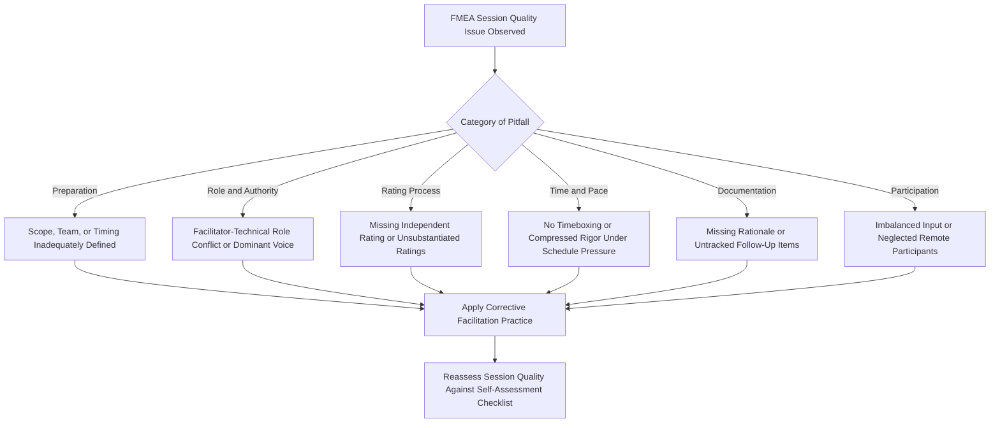

## Common Facilitation Pitfalls

### Definition and Purpose

Common facilitation pitfalls are the recurring mistakes made by FMEA session facilitators that undermine the quality, efficiency, or credibility of the resulting analysis. While the individual topics in this chapter — running effective FMEA workshops, avoiding groupthink in group ratings, managing disagreement on severity and occurrence, and time management during sessions — each address a specific facilitation discipline, this topic consolidates the recurring failure patterns that cut across all of them, serving as a diagnostic checklist for facilitators and program sponsors evaluating FMEA session quality.

### Why a Consolidated Pitfall View Matters

- **Pitfalls rarely occur in isolation**: A facilitator who struggles with time management often also struggles with groupthink prevention, since time pressure is itself a driver of premature consensus — recognizing the interconnection helps address root causes rather than symptoms
- **New facilitators benefit from a single reference checklist**: Rather than requiring a new facilitator to internalize each topic's pitfalls separately, a consolidated view supports faster onboarding and self-assessment
- **Program sponsors and quality auditors need a diagnostic lens**: When evaluating whether an FMEA program is functioning well, reviewing sessions against this consolidated pitfall list provides a practical assessment framework distinct from reviewing the FMEA document's content alone

### Preparation-Related Pitfalls

**Key Points**

- **Starting sessions without adequate scope, team, or timing definition**: Jumping into failure analysis before Planning and Preparation (step one planning and preparation) is genuinely complete leads to unfocused, inconsistent sessions
- **Failing to distribute reference materials in advance**: Forces session time to be spent on first-time reading rather than analysis, directly undermining the time management discipline
- **Underestimating scope when planning session count and duration**: A chronic driver of the overrun and quality-degradation patterns discussed in time management during sessions
- **Assembling a team without genuine cross-functional representation**: Missing key disciplines (particularly field/operator perspectives) removes an important check against groupthink and blind-spot failure modes from the outset

### Role and Authority Pitfalls

**Key Points**

- **Combining the facilitator role with primary technical ownership**: A facilitator who is also the most senior or most invested technical voice in the room structurally increases the risk of authority bias and groupthink (see avoiding groupthink in group ratings), since the same person controls both the discussion process and its technical content
- **Allowing a dominant participant to control pacing and conclusions**: Whether or not this person is the formal facilitator, permitting one voice to consistently drive both discussion content and session pace undermines cross-functional input
- **Facilitator passivity during disagreement**: Failing to actively intervene when genuine rating disagreement surfaces, allowing it to be resolved by default (senior opinion, averaging, or majority vote) rather than through the structured resolution techniques described in managing disagreement on severity and occurrence

### Rating Process Pitfalls

**Key Points**

- **Skipping independent-then-reveal rating techniques**: Defaulting to open verbal discussion for every rating reintroduces anchoring and groupthink risk that structured techniques are specifically designed to prevent
- **Accepting the first proposed rating without probing for evidence**: A facilitator who doesn't ask "what is this based on?" allows unsubstantiated, optimism-biased ratings to enter the record unchallenged (see common rating biases and inconsistencies)
- **Treating fast unanimous agreement as efficiency rather than a warning sign**: Rapid consensus is often a symptom of suppressed dissent rather than genuine alignment
- **Resolving disagreement by averaging or vote rather than evidence**: Discards the substantive reasoning behind differing estimates in favor of an arithmetic or social shortcut

### Time and Pace Pitfalls

**Key Points**

- **No timeboxing of individual discussion items**: Allows a single contentious failure mode to consume disproportionate time at the expense of covering the full planned scope
- **Compressing rating rigor to preserve schedule**: Cutting corners on evidence-gathering or bias-mitigation techniques to finish on time trades analytical quality for punctuality — a false economy, since the resulting FMEA is less defensible
- **Silently absorbing repeated scope overrun through progressively rushed later sessions**: Rather than transparently adjusting scope or schedule, later portions of the FMEA receive systematically less rigorous treatment than earlier portions
- **Scheduling sessions without breaks or appropriate length**: Leads to participant fatigue and declining judgment quality in later portions of longer sessions

### Documentation and Follow-Through Pitfalls

**Key Points**

- **Not documenting rating rationale in real time**: Capturing only the final numeric rating without the reasoning or evidence behind it removes the audit trail needed to defend or revisit the rating later
- **Losing track of parked/deferred items**: Failure modes or disagreements moved to a "parking lot" for follow-up are sometimes never actually revisited, effectively dropping them from the analysis
- **Failing to track action items to closure**: Optimization actions assigned during or after a session (see step six optimization) that aren't actively tracked tend to stall, undermining the FMEA's actual risk-reduction value
- **Inconsistent application of facilitation discipline across a multi-session series**: Rigor applied in early sessions but relaxed in later ones (often due to time pressure or fatigue) produces an FMEA with uneven analytical quality across its own scope

### Participation and Engagement Pitfalls

**Key Points**

- **Not actively balancing participation across disciplines**: Quieter or less senior participants' input is lost by default unless the facilitator specifically solicits it
- **Neglecting remote/hybrid participants**: Virtual attendees are easily sidelined in discussions dominated by co-located participants unless the facilitator deliberately manages hybrid dynamics
- **Allowing inconsistent attendance to go unaddressed**: A rotating cast of participants across sessions undermines both continuity and the cross-functional consistency the team composition was designed to provide
- **Failing to sustain engagement across a long multi-session series**: Not periodically summarizing progress or re-anchoring the team to the overall objective can lead to declining engagement and perfunctory participation in later sessions

### A Facilitator Self-Assessment Checklist

**Key Points**

- Did I separate my facilitation role from technical content ownership wherever possible?
- Did I use independent-then-reveal techniques for ratings rather than defaulting to open discussion?
- Did I specifically and individually solicit input from quieter or less senior participants?
- Did I probe for evidence behind every proposed rating rather than accepting the first number offered?
- Did I timebox discussions and use a parking lot for items running long, rather than letting pace erode later in the session?
- Did I document rating rationale, not just final numbers, in real time?
- Did I treat fast unanimous agreement as a signal to slow down rather than a sign of efficiency?
- Did I escalate risk-tolerance disagreements appropriately rather than resolving them through vote or averaging?
- Did I track deferred items and action assignments to actual closure rather than letting them lapse?

### Example

**Scenario:** A quality manager reviewing a completed Process FMEA notices that the first third of the worksheet contains detailed rating rationale, clear differentiation between multiple causes per failure mode, and evidence of resolved disagreement, while the final third shows uniform, sparsely-documented ratings with little variation in Occurrence scores across dissimilar causes.

**Diagnosis using the consolidated pitfall view:** This pattern is consistent with several interconnected pitfalls — likely scope underestimation at planning (time management during sessions), leading to schedule compression in later sessions, which in turn led the facilitator to skip independent-then-reveal rating techniques and evidence probing to preserve pace (rating process pitfalls), producing groupthink-driven, insufficiently substantiated ratings in the later scope (avoiding groupthink in group ratings).

**Corrective response:** Rather than treating this as a single documentation gap, the quality manager recommends revisiting the affected later-scope items in a dedicated follow-up session using full facilitation rigor, and adjusting the next FMEA program's session planning to better estimate scope upfront.

### Diagram: Facilitation Pitfall Diagnostic Map (svg_diagram)

**Related Topics**

- Running effective FMEA workshops
- Avoiding groupthink in group ratings
- Managing disagreement on severity and occurrence
- Time management during sessions
- Common rating biases and inconsistencies
- Step one planning and preparation
- Step six optimization
- Calibrating ratings across teams