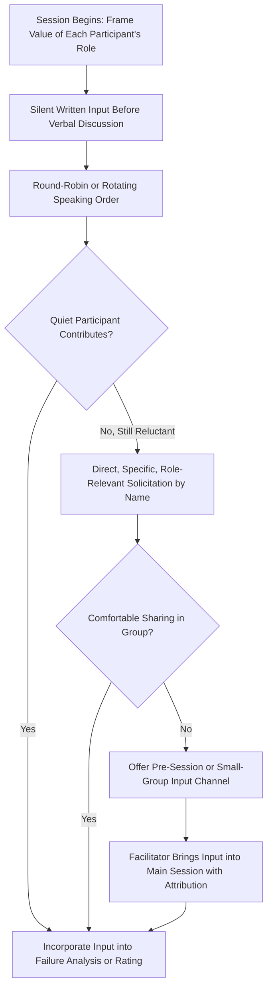

## Techniques for Engaging Quiet Participants

### Definition and Purpose

Techniques for engaging quiet participants are facilitation practices specifically designed to elicit meaningful contribution from FMEA team members who, for reasons of personality, seniority, role, or session dynamics, are less likely to volunteer input in open group discussion. Because FMEA quality depends on genuinely comprehensive cross-functional input (see running effective FMEA workshops), a facilitator who cannot draw out quiet participants effectively reduces the team to only its most vocal members — directly undermining the purpose of assembling a cross-functional team in the first place.

### Why Quiet Participants Often Hold Disproportionately Valuable Information

- **Field and operator knowledge frequently comes from less vocal roles**: Machine operators, field service technicians, and junior engineers often have direct, hands-on failure experience that senior design or program engineers lack, but these participants are also often the least likely to speak up unprompted in a room with more senior colleagues present
- **Quietness is not correlated with lower-quality insight**: Personality, cultural communication norms, seniority dynamics, and confidence in a specific setting all influence willingness to speak, none of which correlate with the actual value of the underlying knowledge
- **Silence is easily misread as agreement**: In the absence of active solicitation, a facilitator or team may interpret a quiet participant's silence as consent to an emerging consensus, when it may instead reflect unstated disagreement, uncertainty about whether their input is welcome, or simply not having found an opening to speak (see avoiding groupthink in group ratings)
- **Remote and hybrid dynamics compound the problem**: Virtual participants are structurally more likely to be quiet, or to have their input overlooked, than co-located participants in a room-dominated discussion

### Common Reasons Participants Stay Quiet

**Key Points**

- **Seniority or hierarchy dynamics**: Junior participants may feel their input is less authoritative or may be reluctant to contradict a senior colleague's stated opinion
- **Role-based social distance**: Participants from operational or support roles (operators, technicians) may perceive the FMEA session as an "engineering" activity where their input is less expected or valued, even when it's highly relevant
- **Uncertainty about relevance**: A participant may have relevant knowledge but be unsure whether it's directly applicable to the specific failure mode or rating being discussed
- **Discomfort with the format**: Open verbal brainstorming favors participants comfortable thinking and speaking extemporaneously; participants who process information more effectively in writing or with reflection time may be disadvantaged by a purely verbal format
- **Fatigue or disengagement**: In longer or later sessions, quiet participants may have disengaged due to session length or pacing issues (see time management during sessions) rather than lack of relevant input
- **Communication style and cultural factors**: Individual and cultural differences in communication norms can affect willingness to interject, particularly in mixed-seniority or mixed-culture teams

### Structural Techniques to Draw Out Quiet Participants

#### 1. Independent Written Input Before Verbal Discussion

Having all participants silently write down candidate failure modes, causes, or ratings before verbal discussion begins — the same technique used to prevent groupthink (see avoiding groupthink in group ratings) — inherently favors quiet participants by removing the requirement to interject into an already-flowing verbal discussion. Every participant's input is captured regardless of speaking confidence.

#### 2. Direct, Specific Solicitation by Name

Rather than a general "does anyone have anything to add?" (which quiet participants are unlikely to answer), the facilitator directly and specifically invites a named participant's perspective: "[Name], from the operator's perspective, have you seen this failure mode on the line?" Specific, role-relevant questions are far more effective than open invitations.

#### 3. Rotating Speaking Order

Deliberately varying who is asked to share first across different failure modes or agenda items — rather than always defaulting to the most senior or most vocal participant — ensures quiet participants regularly have the "first word" opportunity rather than always following an already-anchored discussion.

#### 4. Round-Robin Contribution

For key discussion points, explicitly going around the group in turn (rather than open floor) ensures every participant is asked to contribute, normalizing input from those who would not otherwise volunteer.

#### 5. Small-Group or Pre-Session Input Channels

For particularly quiet participants, offering a channel to provide input before or outside the main session — a brief one-on-one conversation, a written submission, or a smaller breakout discussion — can surface knowledge that the participant is unwilling or unable to share in the full group setting, which the facilitator then brings into the main session on their behalf (with attribution, to maintain transparency).

#### 6. Explicit Role Validation

The facilitator explicitly frames certain participants' expected contribution at the start of the session ("we specifically included operator representation because hands-on failure experience is critical to this analysis") to signal that their input is expected and valued, countering role-based social distance.

### Managing Hybrid and Remote Participation

**Key Points**

- Ensure the shared FMEA worksheet or visual materials are equally visible and interactive for remote participants, not just projected for the room
- Explicitly check in with remote participants at natural discussion breakpoints, since they cannot use in-room body language cues to signal a desire to speak
- Consider using chat or polling tools for independent written input from remote participants, paralleling the silent-writing technique used for co-located participants
- Be alert to audio/technical barriers that may silently exclude remote participants from following or contributing to fast-paced verbal discussion

### What NOT to Do

**Key Points**

- **Do not equate silence with agreement**: A quiet participant who hasn't spoken has not necessarily endorsed the emerging consensus
- **Do not put quiet participants on the spot in a way that increases discomfort**: Aggressive or embarrassing direct questioning can backfire, further reducing willingness to participate in future sessions — solicitation should be respectful and low-pressure
- **Do not rely solely on quiet participants volunteering once "warmed up"**: Waiting passively for confidence to build over multiple sessions is a slower and less reliable strategy than actively structuring participation from the outset
- **Do not treat engaging quiet participants as a one-time icebreaker exercise**: Sustained engagement requires consistent application of these techniques across the full session series, not a single opening activity

### Example

**Scenario:** In a Process FMEA workshop, a machine operator representative has said very little across the first two sessions, while the process engineer and quality engineer have driven most of the discussion. The facilitator notices the operator's silence.

**Applying the techniques:** In session three, before discussing a specific failure mode, the facilitator introduces a written silent-input step: each participant writes down any failure modes they've personally observed related to the current process step. The facilitator then goes round-robin, starting with the operator representative rather than defaulting to the process engineer.

**Outcome:** The operator's written note describes an intermittent fixture slippage issue observed during shift changes — a failure mode not previously identified by the design or process engineering team, since it only manifests under specific operational handoff conditions the operator experiences directly but the engineers do not observe. This becomes a new entry in the Failure Analysis (see step four failure analysis), directly demonstrating the value unlocked by actively structuring quiet-participant engagement rather than relying on organic volunteering.

### Common Pitfalls

- Relying on general, open-floor invitations ("anyone have thoughts?") that quiet participants are unlikely to respond to
- Interpreting a quiet participant's silence as agreement rather than as potentially unstated disagreement or unshared knowledge
- Defaulting to the same speaking order across every discussion, consistently privileging the same vocal participants
- Neglecting remote participants' engagement in hybrid sessions, allowing them to become passive observers
- Treating quiet-participant engagement as a single opening exercise rather than a sustained facilitation discipline applied throughout the session series
- Putting participants on the spot in an uncomfortable or embarrassing way, discouraging future participation rather than encouraging it
- Failing to validate the specific value of a quiet participant's role at the outset, leaving them uncertain whether their perspective is actually wanted

### Diagram: Quiet Participant Engagement Flow (svg_diagram)

**Related Topics**

- Running effective FMEA workshops
- Avoiding groupthink in group ratings
- Managing disagreement on severity and occurrence
- Time management during sessions
- Common facilitation pitfalls
- Step four failure analysis
- Cross-functional team composition in FMEA planning
- Managing remote and hybrid team collaboration