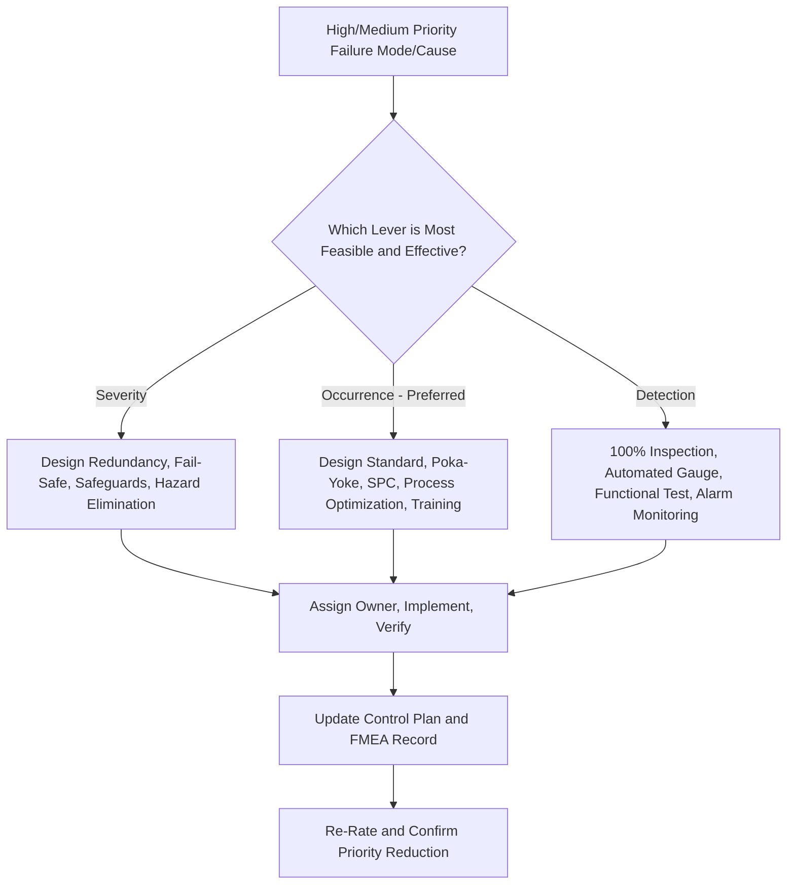

## Types of Recommended Actions

### Definition and Purpose

Types of recommended actions refers to the categories of corrective and preventive measures an FMEA team can select when addressing failure modes and causes classified for action during Risk Analysis (step 5). While step six optimization describes the overall workflow for selecting, assigning, and verifying actions, this topic provides a deeper taxonomy of the specific kinds of actions available, organized by which risk dimension they target and by their underlying engineering or process mechanism.

### The Three Risk-Dimension Categories

As established in step six optimization, every recommended action ultimately targets one of three levers: reducing Severity, reducing Occurrence, or improving Detection. This topic expands each category into its constituent action types.

### Severity-Reducing Actions

Severity reduction requires an actual design or process change that alters the consequence of the failure, not merely its likelihood or detectability. These actions are the least common but highest-value category.

**Key Points**

- **Design redundancy**: Adding a backup system or component so that a single failure no longer produces the full original consequence (e.g., a secondary brake circuit that maintains partial function if the primary circuit fails)
- **Fail-safe design**: Designing the system so that failure results in a safe state rather than a hazardous one (e.g., a valve that defaults to closed, not open, on power loss)
- **Physical safeguards and interlocks**: Adding a mechanical or electronic barrier that prevents a failure from reaching a hazardous outcome (e.g., a guard that prevents contact with a moving part even if the part fails)
- **Material or design margin changes**: Selecting a more robust material or increasing design margin so that even if the underlying cause still occurs, the resulting failure's consequence is less severe (e.g., a material that degrades gradually rather than fracturing suddenly)
- **Elimination of the hazard entirely**: Redesigning the function so the hazardous failure mode is no longer physically possible, which is the most fundamental (and often most resource-intensive) severity-reduction approach

### Occurrence-Reducing (Prevention) Actions

Occurrence reduction targets the root cause, generally preferred over Detection improvement since it prevents the failure from happening rather than catching it afterward.

**Key Points**

- **Design standard adoption**: Applying a proven, validated design standard or best practice known to reduce the likelihood of the specific failure cause
- **Material or component upgrade**: Substituting a more robust, higher-capability material or component that is inherently less prone to the identified cause
- **Design margin/tolerance improvement**: Widening design margins or tightening tolerances to reduce sensitivity to the variation that produces the cause
- **Process parameter optimization**: Adjusting process settings (speed, temperature, pressure, cycle time) based on engineering analysis or designed experiments to reduce variation in the causal mechanism
- **Poka-yoke (mistake-proofing)**: Physical or procedural design changes that make the cause physically impossible or highly unlikely to occur, such as asymmetric fixturing that prevents incorrect part orientation
- **Statistical Process Control (SPC) implementation**: Introducing ongoing process monitoring with control limits to detect and correct process drift before it produces an out-of-specification condition, functioning as a prevention mechanism when paired with a corrective response protocol
- **Supplier/incoming material control improvement**: Strengthening incoming inspection, supplier qualification, or certification requirements to reduce the likelihood that a material-related cause enters the process
- **Training and work instruction improvement**: Enhancing operator training or clarifying work instructions to reduce human-factor-related causes, where the cause stems from a Man element in the 4M framework (see step two structure analysis)

### Detection-Improving Actions

Detection improvement targets the ability to catch the cause or failure mode before it escapes, generally considered a lower-preference lever than Occurrence reduction but often more immediately achievable.

**Key Points**

- **Upgrading from sampling to 100% inspection**: Moving from a statistical sampling plan to full inspection of every unit, eliminating the risk that a defective unit passes through an uninspected sample gap
- **Automated inspection/gauging**: Replacing manual visual or measurement-based inspection with automated sensors, machine vision, or gauges that provide more consistent, higher-capability detection
- **In-process monitoring with automated alarms**: Adding real-time monitoring of a process parameter with an automatic alarm or shutdown when the parameter drifts outside acceptable limits, catching the cause before it produces a defect
- **Functional or end-of-line testing**: Adding or enhancing a functional test that directly verifies the product performs its intended function, rather than relying solely on dimensional or visual inspection
- **Error-proofed detection (interlocks that prevent progression)**: Physical mechanisms that prevent a defective part from physically advancing to the next operation, such as a go/no-go gauge integrated into the fixture itself
- **Enhanced inspector training and gauge capability studies**: For manual detection controls that must remain in place, improving inspector training and validating measurement system capability (gauge R&R) to increase confidence in the stated detection rating

### Cross-Cutting Action Types

Some actions don't map cleanly to a single risk dimension and instead support the broader FMEA and quality system infrastructure.

**Key Points**

- **Design of Experiments (DOE) or additional testing**: Actions aimed at resolving genuine uncertainty about a cause's likelihood or a control's effectiveness (see managing disagreement on severity and occurrence), generating the data needed to properly rate Occurrence or Detection rather than directly reducing risk themselves
- **Control plan updates**: Formal updates to the process control plan to reflect new or modified prevention/detection controls, ensuring the FMEA's optimization actions are institutionalized in ongoing process control documentation
- **Cross-functional design reviews**: Scheduling additional design review checkpoints specifically focused on the identified high-risk item, rather than a specific technical change
- **Field monitoring and data collection actions**: For newly-introduced designs or processes with limited history, an action may be to establish a field or production monitoring program to gather the data needed to validate (or revise) initial Occurrence ratings over time

### Selecting Among Action Types

**Key Points**

- Prefer Severity reduction where technically and economically feasible, since it delivers the most fundamental risk reduction, though this is often constrained by program timing, cost, or the physics of the system
- Prefer Occurrence reduction over Detection improvement when both are feasible, consistent with the general principle that preventing a failure is more effective than catching it after the fact
- Combine multiple action types where appropriate — as shown in the step six optimization example, addressing both Occurrence and Detection simultaneously often provides more robust risk reduction than either alone
- Match the action type to the underlying cause category (4M element) identified in Failure Analysis (step four failure analysis) — a Method-related cause is typically best addressed by a Method-targeted action (process parameter change), not a Detection-only fix that leaves the root cause unaddressed
- Consider action feasibility within program constraints (cost, timeline, technical risk) alongside the theoretical risk-reduction value, since an infeasible action provides no actual risk reduction

### Example

**Scenario:** Oversized bore diameter failure mode from the recurring CNC bore machining example (see step four failure analysis, step five risk analysis, step six optimization).

**Action types applied:**

- Occurrence-reducing (prevention): Tool-wear sensor with predictive replacement alert — a process parameter monitoring action targeting the Machine element identified as the cause
- Detection-improving: Automated in-process bore gauge with alarm, replacing sampling-based manual inspection — an automated inspection upgrade
- Cross-cutting: Control plan update to formally incorporate both the sensor and gauge into standard process documentation, ensuring the improvements are sustained beyond the initial FMEA action closure

This combination reflects the general preference for pairing Occurrence reduction with Detection improvement, while the control plan update ensures the changes are institutionalized rather than existing only as a one-time FMEA action.

### Common Pitfalls

- Defaulting to Detection-only actions (adding inspection) when a feasible Occurrence-reducing (prevention) action exists, missing the more fundamental risk-reduction opportunity
- Selecting an action type that doesn't match the actual cause category identified in Failure Analysis, leaving the root cause unaddressed
- Treating a data-gathering action (DOE, field monitoring) as equivalent to a risk-reducing action, when it only resolves rating uncertainty rather than reducing actual risk
- Failing to formalize process changes into the control plan, leaving improvements vulnerable to being lost when personnel or documentation ownership changes
- Pursuing Severity reduction actions without recognizing the potentially significant cost/timeline implications, causing program disruption when a smaller Occurrence or Detection action might have been sufficient for the item's classification
- Selecting a single action type when the item's risk classification (see high medium and low priority classification) warrants a combined, more robust approach

### Diagram: Recommended Action Type Selection (svg_diagram)

**Related Topics**

- Step six optimization
- Step four failure analysis
- Step five risk analysis
- High medium and low priority classification
- Managing disagreement on severity and occurrence
- Step two structure analysis
- Occurrence rating scales and criteria
- Detection rating scales and criteria