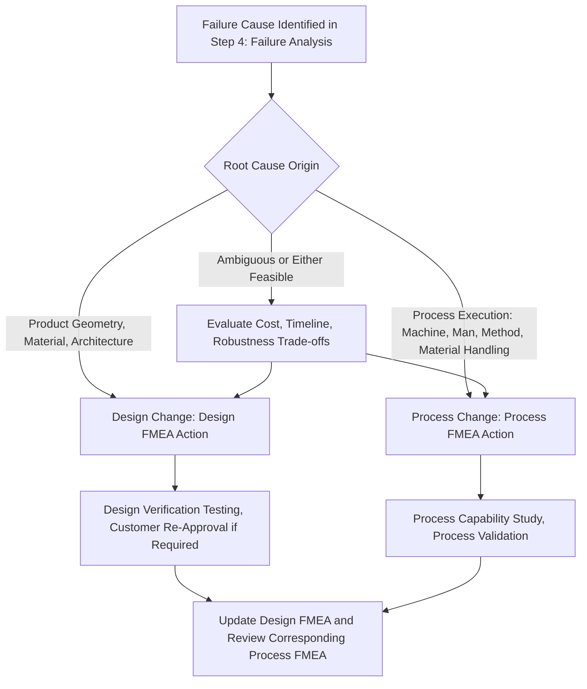

## Design Changes Versus Process Changes

### Definition and Purpose

Design changes versus process changes refers to the distinction between corrective and preventive actions that modify the product's design (its geometry, materials, tolerances, or architecture) versus those that modify how the product is manufactured, assembled, or handled without altering the product design itself. This distinction matters because Design FMEA and Process FMEA are separate analyses with separate teams, timelines, and approval mechanisms, and a recommended action's classification as a design change or a process change determines which FMEA, which team, and which change-control pathway governs its implementation.

### Why the Distinction Matters

- **Different FMEA ownership**: A Design FMEA is owned by design/product engineering and addresses failure modes rooted in the product's inherent design; a Process FMEA is owned by manufacturing/process engineering and addresses failure modes rooted in how the product is made, assembled, or handled — an action's classification determines which FMEA record it belongs in and which team is accountable for it
- **Different change-control rigor and cost**: Design changes typically require formal engineering change management, may affect tooling, require design validation/verification testing, and often carry longer lead times and higher implementation cost than process changes, which can frequently be implemented within existing tooling and validated through process capability studies
- **Different regulatory and customer approval requirements**: In regulated industries (automotive per IATF 16949, medical devices), design changes to an already-approved product configuration often require formal customer notification, re-approval, or re-certification (e.g., a new Production Part Approval Process/PPAP submission in automotive), while process changes within the approved design envelope may have a lighter-weight change process, though many customer agreements still require notification for significant process changes as well
- **Different applicability to the same root cause**: The same failure cause can sometimes be addressed through either a design change or a process change, and choosing between them involves distinct trade-offs in cost, timeline, and robustness that a team must explicitly weigh (see step six optimization for the general action-selection workflow)

### Design Changes: Definition and Scope

A design change modifies an element of the product itself — its geometry, dimensional tolerances, material specification, architecture, or functional design — independent of how it is subsequently manufactured.

**Key Points**

- **Geometric/dimensional changes**: Modifying a part's shape, size, or tolerance to reduce sensitivity to a failure cause (e.g., increasing wall thickness to reduce fracture risk)
- **Material specification changes**: Substituting a different material or material grade with improved properties relevant to the failure mode (e.g., a corrosion-resistant alloy)
- **Architectural changes**: Adding redundancy, changing how components interface, or restructuring the assembly to eliminate or mitigate a failure mode (see the Severity-reduction action types in types of recommended actions)
- **Functional design changes**: Modifying how the product achieves its intended function, potentially eliminating the failure mode's underlying mechanism entirely
- Design changes are addressed within the **Design FMEA** and typically require validation through design verification testing before implementation

### Process Changes: Definition and Scope

A process change modifies how an already-designed product is manufactured, assembled, tested, or handled, without altering the product's design specification itself.

**Key Points**

- **Process parameter changes**: Adjusting machine settings, cycle times, temperatures, pressures, or speeds within the process while the product design remains unchanged
- **Tooling and fixture changes**: Modifying fixtures, tooling, or equipment used to manufacture the part, without changing the part's own design
- **Inspection/control changes**: Adding, removing, or modifying inspection points, gauging methods, or process monitoring, corresponding to the Detection-improving actions described in types of recommended actions
- **Work instruction and training changes**: Modifying operator procedures, training requirements, or work instructions governing how the process is performed
- **Material handling and logistics changes**: Modifying how incoming material is stored, staged, or handled prior to or during processing
- Process changes are addressed within the **Process FMEA** and are typically validated through process capability studies (Cpk/Ppk) or process validation runs rather than product design verification testing

### Determining Which Applies to a Given Root Cause

**Key Points**

- Trace the failure cause back to its origin identified in Failure Analysis (step four failure analysis) — a cause rooted in the product's inherent geometry, material, or architecture typically requires a design change; a cause rooted in process execution (4M elements: Machine, Man, Material handling, Method) typically requires a process change
- Some causes can be addressed by either category — for example, a fracture-prone failure mode might be addressed by a design change (increasing wall thickness) or a process change (tightening a process parameter controlling wall thickness variation); the team should evaluate which pathway more robustly and cost-effectively addresses the root cause
- A cause that is fundamentally a design limitation cannot be fully resolved by a process change alone — tightening process control around a marginal design only reduces variation around an inherently risky nominal condition, and may leave residual risk that a design change would eliminate more fundamentally
- Conversely, a cause that is fundamentally a process execution issue is usually inefficient to resolve via a design change, since redesigning the product doesn't address inconsistent process execution

### Interaction Between Design FMEA and Process FMEA

**Key Points**

- Design FMEA and Process FMEA are linked but distinct analyses: a Design FMEA failure mode with a Severity rating typically carries that same Severity assessment into the corresponding Process FMEA failure mode, since the ultimate consequence to the end customer is the same regardless of which analysis identifies the risk
- A Design FMEA action that changes the product's design specification (e.g., a tighter dimensional tolerance) often necessitates a corresponding review of the Process FMEA, since the process must now be capable of reliably achieving the new, tighter specification — Occurrence and Detection ratings in the Process FMEA may need re-evaluation even though the Process FMEA action itself wasn't the source of the change
- Conversely, a Process FMEA finding that a process cannot reliably achieve a design specification (a capability gap) may trigger a design change request back to the Design FMEA team if the specification itself, rather than the process execution, is judged to be the underlying limitation
- Well-coordinated FMEA programs maintain explicit traceability between related Design FMEA and Process FMEA entries so that a change on one side prompts appropriate review on the other

### Example

**Scenario:** Continuing the recurring brake caliper example — oversized bore diameter failure mode traced to boring tool wear (see step four failure analysis).

**Process change already implemented (from step six optimization):** Tool-wear sensor with predictive replacement alert, and automated in-process bore gauge — both process changes, since they modify how the part is manufactured and inspected without changing the caliper housing's design specification (bore diameter target of 45.00mm ± 0.02mm remains unchanged).

**Design change alternative considered but not selected:** The team also considered whether widening the bore diameter tolerance itself (e.g., to ± 0.04mm) would reduce the Occurrence rating by making the process inherently easier to hold. This was evaluated as a Design FMEA action, since it modifies the product specification. The team determined this would require updating the mating piston seal design tolerance as well (an interface with another component), triggering a more extensive design change with validation testing and potential customer re-approval — a significantly higher-cost, longer-timeline pathway than the process changes already selected, which sufficiently reduced Occurrence and Detection without requiring a design specification change.

**Outcome:** The team documents in both the Design FMEA and Process FMEA that the process-change pathway was selected as more cost-effective for this cause, while noting the design-change alternative as a documented option should future process capability prove insufficient.

### Common Pitfalls

- Attempting to resolve a fundamentally design-limited failure mode through process tightening alone, leaving residual risk that only a design change would fully address
- Pursuing an unnecessarily costly design change when a process change would adequately address the root cause, without first evaluating the process-change alternative
- Failing to update the corresponding Process FMEA when a Design FMEA action changes a specification, leaving process capability unaddressed against the new requirement
- Not maintaining traceability between related Design FMEA and Process FMEA entries, causing changes on one side to go unnoticed on the other
- Treating a process change (e.g., an added inspection step) as sufficient risk reduction when it only improves Detection, without evaluating whether an Occurrence-reducing process or design change was also feasible
- Underestimating the change-control, validation, and customer approval burden associated with a design change relative to a process change, leading to unrealistic program timeline assumptions

### Diagram: Design Change vs. Process Change Decision Flow (svg_diagram)

**Related Topics**

- Types of recommended actions
- Step six optimization
- Step four failure analysis
- Step two structure analysis
- Design FMEA vs. Process FMEA structural differences
- Severity rating scales and criteria
- Occurrence rating scales and criteria
- Control plan alignment with Process FMEA functions