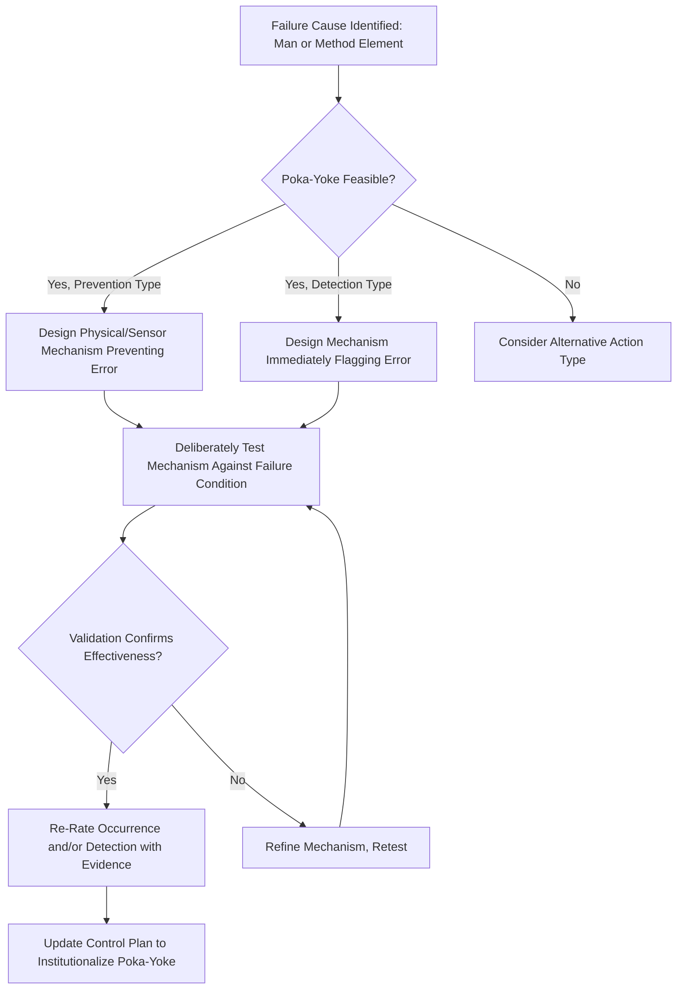

## Poka Yoke and Error Proofing Integration

### Definition and Purpose

Poka-yoke (Japanese for "mistake-proofing," from *poka* meaning inadvertent error and *yoke* meaning prevention) is a design or process technique that makes a specific error either physically impossible to commit or immediately and unmistakably obvious when it occurs. In the context of FMEA, poka-yoke integration refers to the systematic practice of identifying opportunities to apply mistake-proofing as a recommended action, and of explicitly reflecting a poka-yoke's effectiveness in the resulting Occurrence and Detection ratings once implemented.

### Why Poka-Yoke Is Distinct Within the FMEA Action Taxonomy

- **Poka-yoke can function as either a prevention or detection control, or both**: Unlike most actions cleanly classified under Occurrence-reducing or Detection-improving categories (see types of recommended actions), poka-yoke techniques span both roles depending on their specific mechanism — some physically prevent the error from occurring (affecting Occurrence), while others detect the error immediately after it occurs but before further processing (affecting Detection)
- **Poka-yoke typically achieves the most favorable achievable ratings**: A properly validated poka-yoke control is one of the few mechanisms capable of justifying the most favorable end of the Occurrence scale (error physically eliminated) or the Detection scale (near-certain detection), since it removes reliance on human vigilance or sampling
- **Poka-yoke directly addresses the preference for prevention over detection**: Where feasible, a poka-yoke that prevents the cause from occurring is preferred over one that merely detects it, consistent with the general Occurrence-over-Detection preference established in step six optimization

### The Two Functional Categories of Poka-Yoke

#### 1. Prevention (Control) Poka-Yoke

Physically prevents the error from occurring in the first place — the process cannot proceed, or the incorrect condition cannot physically arise.

**Key Points**

- Physically prevents an operator or machine from performing an action incorrectly (e.g., an asymmetric fixture that only accepts a part in the correct orientation)
- Eliminates the failure cause at its source, directly reducing the Occurrence rating, and in the most robust implementations can justify rating the cause as effectively eliminated
- Generally preferred over detection-based poka-yoke when technically and economically feasible, since it prevents the error rather than catching it after the fact

#### 2. Detection (Warning) Poka-Yoke

Allows the error to occur but immediately and reliably detects it before the part or process can advance further.

**Key Points**

- Provides an immediate signal (visual, audible, or a physical stop) the instant a defect or incorrect condition is created, preventing further processing of a defective unit
- Directly improves the Detection rating, since detection occurs at the point of error creation rather than relying on downstream inspection
- Useful when prevention-type poka-yoke isn't technically feasible for a given failure mechanism, but still substantially outperforms manual or sampling-based inspection

### Common Poka-Yoke Mechanisms

**Key Points**

- **Physical/geometric constraints**: Asymmetric or keyed fixtures, pins, or part geometries that make incorrect orientation or assembly physically impossible
- **Sensor-based interlocks**: Presence sensors, limit switches, or proximity sensors that prevent a process step from proceeding unless a precondition is verified (e.g., a press that won't cycle unless a part is correctly seated)
- **Counting and sequencing controls**: Mechanisms that verify the correct number of components have been used or that process steps occur in the correct sequence (e.g., a fastener-counting system that alerts if the expected torque count isn't reached)
- **Automated shutoffs and alarms**: Systems that immediately halt a process or sound an alarm when a monitored parameter exceeds acceptable limits, preventing continued production of defective units
- **Software/logic-based error prevention**: In processes with digital control systems, software interlocks that prevent an operation from proceeding unless input parameters or preceding steps meet defined criteria
- **Checklists and forcing functions in procedural contexts**: While less robust than physical mechanisms, structured procedural forcing functions (e.g., a system that requires a field to be completed before proceeding) provide a lighter-weight poka-yoke approach where physical mistake-proofing isn't feasible

### Integrating Poka-Yoke into the FMEA Workflow

**Key Points**

1. During Failure Analysis (step four failure analysis), identify causes that are fundamentally human-factor or process-execution errors (Man or Method elements in the 4M framework) — these are typically the strongest candidates for poka-yoke solutions
2. During Optimization (step six optimization), when evaluating candidate actions for a given cause, explicitly consider whether a prevention-type or detection-type poka-yoke mechanism is feasible before defaulting to a less robust manual control or inspection-based action
3. Determine whether the specific poka-yoke mechanism functions primarily as a prevention control (affecting Occurrence) or a detection control (affecting Detection), or both, and document this classification clearly to avoid the cross-dimensional contamination bias discussed in common rating biases and inconsistencies
4. Implement and validate the poka-yoke mechanism, including verification that it reliably performs its intended prevention or detection function (e.g., through a deliberate test of the failure condition to confirm the mechanism responds as designed)
5. Re-rate Occurrence and/or Detection based on verified evidence of the poka-yoke's effectiveness, following the same evidence-based re-rating discipline described in step six optimization — not based on the mechanism's theoretical design intent alone
6. Update the control plan (for Process FMEA) to formally document the poka-yoke as a standard process control, ensuring it is maintained and monitored going forward

### Rating Implications of Validated Poka-Yoke Controls

| Poka-Yoke Type | Risk Dimension Affected | Typical Rating Impact (Illustrative) |
| --- | --- | --- |
| Prevention (error physically impossible) | Occurrence | Can justify the most favorable Occurrence rating on the scale, reflecting elimination of the cause |
| Detection (immediate, reliable flag) | Detection | Can justify a strong Detection rating, reflecting near-certain catch before escape |
| Combined prevention + detection | Both | Both ratings may improve, though each should be substantiated independently against its own verified evidence |

**Note [Unverified]:** The specific numeric rating a validated poka-yoke justifies depends on the organization's customized rating table criteria (see customizing rating tables for an organization) and the rigor of the validation evidence; a poka-yoke claimed but not yet validated should not receive the improved rating until verification is complete.

### Example

**Scenario:** Continuing the recurring brake caliper example — the failure cause "incorrect tool offset programmed after tool change" from step four failure analysis.

**Poka-yoke solution considered:** Rather than relying solely on the automated in-process bore gauge (a detection-type control already implemented in step six optimization), the team evaluates a software-based prevention poka-yoke: the CNC controller is programmed to reject any tool-change confirmation where the entered offset value falls outside a pre-validated acceptable range, physically preventing the machine from running with an incorrect offset.

**Classification:** This is a prevention-type poka-yoke, since it stops the erroneous condition (incorrect offset) from being accepted by the machine at all, directly targeting Occurrence rather than merely detecting the resulting defect downstream.

**Validation:** The team deliberately tests the interlock by attempting to enter several out-of-range offset values, confirming the controller rejects each one and requires operator correction before the cycle can proceed.

**Re-rating:** Occurrence for this cause is re-rated from its prior value to reflect that the erroneous condition is now physically prevented from being accepted by the equipment, substantiated by the deliberate validation test rather than by design intent alone.

### Common Pitfalls

- Claiming a poka-yoke's rating benefit before the mechanism has been deliberately tested against the actual failure condition it's meant to address
- Misclassifying a detection-type poka-yoke as a prevention control (or vice versa), improperly affecting the wrong rating dimension (see common rating biases and inconsistencies)
- Defaulting to manual inspection or procedural controls (checklists, training) when a more robust physical or sensor-based poka-yoke is technically and economically feasible
- Failing to formalize the poka-yoke into the control plan, leaving it vulnerable to being bypassed, disabled, or lost over time without process ownership
- Treating a procedural forcing function (a checklist step) as equivalent in robustness to a physical or sensor-based mechanism, when the two provide meaningfully different levels of assurance
- Not periodically verifying that an installed poka-yoke remains functional and hasn't been defeated or degraded over time (e.g., a sensor disabled due to nuisance stoppages)

### Diagram: Poka-Yoke Integration and Rating Flow (svg_diagram)

**Related Topics**

- Types of recommended actions
- Step six optimization
- Step four failure analysis
- Design changes versus process changes
- Detection rating scales and criteria
- Occurrence rating scales and criteria
- Common rating biases and inconsistencies
- Step two structure analysis