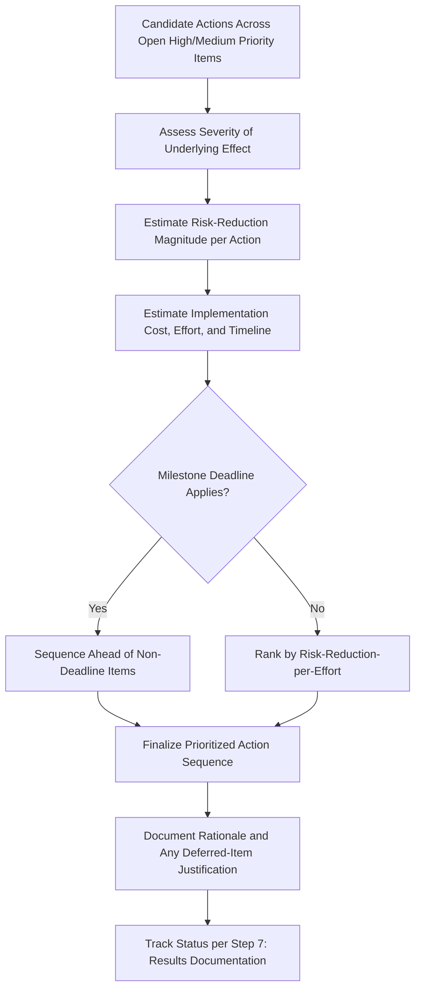

## Prioritizing Actions by Risk Reduction

### Definition and Purpose

Prioritizing actions by risk reduction is the decision-making process used to determine which recommended actions from types of recommended actions should be pursued first when an FMEA team has identified more candidate actions than can be simultaneously resourced. While setting thresholds for required action determines whether a given failure mode/cause requires action at all, this topic addresses the subsequent question: among all items requiring or warranting action, in what order should the team actually implement them, given finite engineering, quality, and program resources.

### Why Prioritization Among Actions Is Necessary

- **Resource constraints are universal**: Even a well-resourced program cannot simultaneously implement every recommended action across a complete FMEA, particularly when multiple failure modes are classified as High priority (see high medium and low priority classification)
- **Not all High-priority items carry equal actual risk-reduction potential per unit of effort**: Two items both classified High may differ substantially in how much risk reduction a feasible action actually achieves, and in how much effort that action requires
- **Program timing constraints compound resource limits**: Some actions must be completed before a specific milestone (design freeze, process validation, production launch) to be effective at all, creating a scheduling dimension that a simple risk ranking alone doesn't capture
- **Without deliberate prioritization, teams default to convenience or recency**: Absent a structured approach, teams tend to act on whichever items are easiest, most recently discussed, or most personally salient to whoever is driving the conversation — not necessarily the items delivering the greatest actual risk reduction

### Prioritization Dimensions Beyond Raw Risk Score

**Key Points**

- **Magnitude of risk reduction achievable**: Two items with similar current RPN or Action Priority classification may differ significantly in how much a feasible action can actually reduce Severity, Occurrence, or Detection — prioritize actions with the largest credible risk-reduction delta, not merely the highest current risk level
- **Implementation cost and resource requirement**: An action requiring extensive design change and validation testing consumes substantially more engineering resource than a targeted process parameter adjustment, even if both are theoretically available
- **Implementation timeline relative to program milestones**: An action that cannot be completed before design freeze or production launch may need to be either accelerated, descoped to a lower-cost interim measure, or explicitly flagged as an accepted residual risk with a post-launch follow-up plan
- **Confidence in the risk-reduction estimate**: An action supported by strong evidence (e.g., a validated poka-yoke, see poka yoke and error proofing integration) that reliably delivers its projected rating improvement should generally be prioritized over a more speculative action with uncertain effectiveness
- **Dependency and sequencing relationships**: Some actions are prerequisites for others (e.g., a design change must be finalized before a corresponding process change can be validated), requiring the prioritization sequence to respect technical dependencies, not just risk magnitude alone

### Structured Prioritization Approaches

#### 1. Severity-Gated Sequencing

Consistent with the severity-first logic underlying the AIAG-VDA Action Priority method (see AIAG VDA action priority tables), actions addressing the highest-Severity failure effects should generally be sequenced first, since a delay in addressing a safety-relevant risk carries disproportionate consequence relative to delaying a lower-severity item, even if the lower-severity item's action is technically simpler.

#### 2. Risk-Reduction-per-Effort Ranking

For items of comparable Severity, rank candidate actions by the ratio of projected risk reduction (the credible improvement in RPN, or movement across Action Priority tiers) to estimated implementation effort or cost, favoring actions that deliver substantial risk reduction efficiently over those requiring disproportionate resource for modest gain.

#### 3. Milestone-Driven Sequencing

Actions with a hard program deadline (must be validated before design freeze, process validation, or production launch) are sequenced ahead of actions without a comparable deadline, even if the deadline-driven action's risk magnitude is somewhat lower, since missing the window may foreclose the action entirely or force a costlier late-stage change.

#### 4. Portfolio-Level Trend Review

For organizations managing multiple concurrent FMEAs or programs, reviewing the aggregate set of open High-priority items across the portfolio — rather than optimizing each FMEA's action list in isolation — can reveal opportunities to prioritize actions that address a common root cause or control gap affecting multiple programs simultaneously, delivering broader risk reduction per unit of effort.

### Balancing Quick Wins Against Fundamental Fixes

**Key Points**

- A lower-cost, faster-to-implement Detection improvement can provide valuable interim risk reduction while a more fundamental, higher-value Occurrence-reducing or Severity-reducing action (see types of recommended actions) is still in development, particularly when the fundamental fix has a longer timeline
- This staged approach should be explicit and tracked as such — the interim action's residual risk should still be documented, and the team should confirm the more fundamental action remains planned and resourced, rather than treating the interim fix as a substitute for it
- Avoid the trap of perpetually deferring the more fundamental, higher-value action in favor of repeated "quick win" detection improvements, which can create a false sense of adequate risk management while the underlying cause remains unaddressed

### Documenting Prioritization Decisions

**Key Points**

- Record the rationale for the sequencing decision, not just the final action order, so that if program constraints change (e.g., additional resource becomes available, a milestone shifts), the team can revisit the prioritization with the original reasoning visible
- Where an item's action is deliberately deferred despite a High-priority classification, document the specific justification and the interim risk-acceptance rationale, consistent with the documentation discipline described in setting thresholds for required action
- Track prioritization decisions alongside the action status reporting described in step seven results documentation, ensuring management visibility into both what is being worked and why it was sequenced ahead of other open items

### Example

**Scenario:** An FMEA has identified three High-priority items competing for the same limited process engineering resource in a given program quarter.

**Item A:** Oversized bore diameter (Severity 8, current RPN 224) — feasible action (tool-wear sensor plus automated gauge) is well-defined, moderate cost, achievable within the quarter, and projected to reduce RPN to approximately 32 based on similar implementations elsewhere in the plant.

**Item B:** Fastener torque inconsistency (Severity 6, current RPN 180) — feasible action requires a new torque-monitoring system with a 4-month lead time, extending beyond the current quarter and requiring capital approval.

**Item C:** Surface finish defect (Severity 4, current RPN 140) — feasible action is a straightforward process parameter adjustment, low cost, quick to implement, but projected to reduce RPN only modestly to approximately 90.

**Prioritization decision:** Item A is sequenced first due to its combination of high Severity, strong projected risk-reduction magnitude, and feasibility within the current resource window. Item B, despite its own significant risk, is sequenced for the following quarter once capital approval and lead time can be accommodated, with an interim documented risk acceptance noting the existing (though imperfect) manual torque-check control remains in place. Item C's low-cost, low-effort action is implemented in parallel with Item A since it doesn't compete for the same specialized resource, delivering modest but genuine risk reduction without displacing higher-value work.

### Common Pitfalls

- Prioritizing actions purely by ease of implementation, favoring quick wins over higher-value but more resource-intensive fixes addressing greater actual risk
- Ignoring program milestone deadlines when sequencing actions, missing windows that force costlier late-stage changes or leave risk unaddressed at launch
- Treating an interim Detection-improvement action as a permanent substitute for a still-needed, more fundamental Occurrence-reducing or Severity-reducing action
- Failing to document the rationale for deferring a High-priority item's action, leaving no clear justification if the deferral is later questioned
- Optimizing each FMEA's action list in isolation without considering portfolio-level opportunities to address shared root causes across multiple programs
- Not revisiting prioritization decisions when program constraints change, leaving a stale sequencing plan in place after circumstances have shifted

### Diagram: Action Prioritization Decision Flow (svg_diagram)

**Related Topics**

- Types of recommended actions
- Design changes versus process changes
- Poka yoke and error proofing integration
- Setting thresholds for required action
- High medium and low priority classification
- Step six optimization
- Step seven results documentation
- AIAG VDA action priority tables