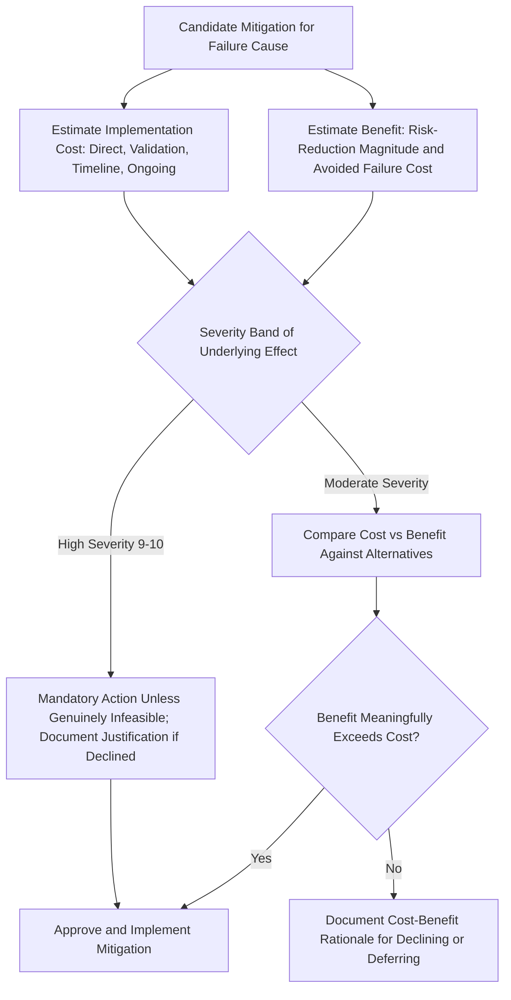

## Cost Benefit Analysis of Mitigations

### Definition and Purpose

Cost benefit analysis of mitigations is the structured economic evaluation of a candidate FMEA action's expected risk-reduction value against its implementation cost, used to determine whether a given mitigation is economically justified, to compare competing mitigation options for the same failure cause, and to support the documented engineering justification required when an organization elects not to pursue an available action (see setting thresholds for required action). While prioritizing actions by risk reduction addresses sequencing among already-approved actions, cost benefit analysis addresses the more fundamental question of whether and which mitigation should be pursued at all.

### Why Formal Cost Benefit Analysis Is Necessary

- **Risk reduction and cost are rarely proportional**: A mitigation's cost does not scale linearly with its risk-reduction benefit — some low-cost actions deliver disproportionately large risk reduction (see poka yoke and error proofing integration), while other high-cost actions deliver only marginal improvement, making cost alone or risk alone an insufficient basis for decision-making
- **Supports defensible documentation of accepted risk**: When a High-priority item's mitigation is not pursued, the AIAG-VDA methodology requires documented engineering justification (see high medium and low priority classification); a structured cost benefit analysis provides a defensible, auditable basis for that justification rather than an informal or unsubstantiated rationale
- **Enables comparison across dissimilar mitigation types**: A design change, a process change, and a detection-control upgrade (see design changes versus process changes) often have very different cost structures and risk-reduction mechanisms; a common cost-benefit framework allows the team to compare them on a consistent basis
- **Prevents both under-investment and over-investment in risk reduction**: Without formal analysis, organizations risk either declining cost-effective mitigations due to underestimated benefit, or over-investing in marginal mitigations due to overestimated benefit or unexamined cost

### Components of Mitigation Cost

**Key Points**

- **Direct implementation cost**: Engineering design/development time, tooling or equipment capital expenditure, material or component cost changes, software development for automated controls
- **Validation and testing cost**: Design verification testing, process capability studies, gauge R&R studies, and any required regulatory or customer re-approval testing
- **Implementation timeline cost**: Program delay risk if the mitigation's lead time threatens a milestone, potentially requiring schedule compression elsewhere or accepting a launch delay
- **Ongoing operational cost**: Recurring costs associated with a sustained control, such as additional inspection labor, consumables for an automated system, or maintenance of new equipment
- **Opportunity cost**: The value of alternative uses for the same engineering or program resource, particularly relevant when comparing multiple candidate mitigations competing for the same limited team capacity (see prioritizing actions by risk reduction)

### Components of Mitigation Benefit

**Key Points**

- **Direct risk-reduction value**: The credible improvement in Severity, Occurrence, or Detection rating, and the resulting movement in RPN or Action Priority classification (see calculating the risk priority number and AIAG VDA action priority tables)
- **Avoided cost of failure**: The estimated cost of the failure mode's consequence if it occurs and is not mitigated — warranty cost, field repair cost, recall cost, liability exposure, and reputational/brand impact, weighted by the failure's estimated probability of occurrence
- **Avoided cost of internal quality escapes**: For Process FMEA mitigations, the estimated cost of internal scrap, rework, and line stoppage avoided by improved prevention or detection
- **Regulatory and compliance value**: For safety- or regulation-relevant failure modes, the value of demonstrating adequate risk mitigation to regulators, auditors, or customers, which may carry value beyond the directly quantifiable failure-cost avoidance
- **Strategic and portfolio value**: Where a mitigation addresses a root cause or control gap common to multiple products or programs (see prioritizing actions by risk reduction), its benefit may extend beyond the single FMEA line item under analysis

### Structured Cost Benefit Evaluation Approaches

#### 1. Qualitative Cost-Benefit Comparison

For most FMEA actions, a structured qualitative comparison — cost tier (low/medium/high) against benefit tier (risk-reduction magnitude, typically expressed via projected RPN or Action Priority movement) — is sufficient to support a defensible prioritization or acceptance decision, without requiring detailed financial quantification for every item.

#### 2. Quantitative Expected-Cost-of-Failure Comparison

For higher-severity or higher-cost mitigation decisions, a more rigorous quantitative approach estimates the expected cost of failure (probability of occurrence × estimated consequence cost) and compares this against the mitigation's estimated implementation cost, favoring mitigations where the expected avoided cost meaningfully exceeds the mitigation cost.

**Note [Unverified]:** Precise probability-weighted cost estimates depend on the reliability of the organization's Occurrence rating data and consequence cost estimates; where field/warranty data is immature, quantitative estimates should be treated as directional rather than precise, and qualitative comparison may be more defensible.

#### 3. Marginal Cost-Benefit Comparison Across Alternatives

When multiple mitigation options exist for the same failure cause (e.g., a design change versus a process change, per design changes versus process changes), compare the marginal cost and marginal risk-reduction benefit of each option directly against one another, rather than evaluating each option's cost-benefit in isolation, to identify the most efficient path to an acceptable risk level.

### Cost Benefit Analysis and Threshold Decisions

**Key Points**

- Where an organization's Action Priority classification mandates action (High priority) but cost benefit analysis reveals no economically or technically feasible mitigation achieves a meaningfully better risk-reduction-to-cost ratio than the status quo, this becomes the substantive basis for the documented engineering justification required under the mandatory-action rule (see setting thresholds for required action)
- Cost benefit analysis should not be used to justify declining action on a genuinely feasible, reasonably-costed mitigation for a high-Severity (safety/regulatory) item — the severity-gated mandatory action principle generally overrides a purely cost-driven decision for the highest-severity band, consistent with the severity-first logic underlying AIAG-VDA's Action Priority method
- For Medium and Low priority items, cost benefit analysis more directly and appropriately governs the discretionary decision of whether to pursue an available but non-mandatory mitigation

### Example

**Scenario:** Continuing the recurring brake caliper bore machining example. The team has already implemented the tool-wear sensor and automated gauge (see step six optimization), reducing RPN from 224 to 32. A further candidate mitigation is proposed: replacing the CNC machine entirely with a newer model offering inherently tighter spindle tolerance.

**Cost evaluation:** Capital cost of machine replacement is substantial, with a multi-month installation and requalification timeline that would extend well beyond the current program's production launch date.

**Benefit evaluation:** The projected additional Occurrence improvement from the newer machine is modest (Occurrence 2 to Occurrence 1) given that the tool-wear sensor and gauge already address the dominant failure mechanisms; the resulting RPN improvement would be marginal (32 to approximately 16) relative to the already-achieved risk reduction.

**Decision:** The team documents that the machine replacement's substantial cost and program-incompatible timeline are not justified by the marginal additional risk reduction, given that the already-implemented actions have moved the item to Low priority classification. This decision, and its supporting cost-benefit rationale, is documented in the FMEA record per step seven results documentation, with the machine replacement noted as a candidate for future consideration during the next scheduled equipment refresh cycle rather than the current program.

### Common Pitfalls

- Using cost benefit analysis to justify declining a feasible, reasonably-costed mitigation for a high-Severity, safety-relevant failure mode, improperly overriding the severity-gated mandatory action principle
- Relying on precise quantitative cost-of-failure estimates when underlying Occurrence and consequence-cost data is too immature to support that level of precision, creating false confidence in the analysis
- Evaluating mitigation cost in isolation without considering the avoided cost of failure, understating the true benefit side of the comparison
- Failing to compare marginal cost and benefit across multiple candidate mitigation options for the same cause, missing a more cost-effective alternative
- Not documenting the cost-benefit rationale when a mitigation is declined, leaving an unsubstantiated justification that weakens audit defensibility
- Treating a cost-benefit decision as permanent rather than revisiting it when cost structures, technology, or risk tolerance change over time

### Diagram: Mitigation Cost Benefit Evaluation Flow (svg_diagram)

**Related Topics**

- Prioritizing actions by risk reduction
- Types of recommended actions
- Design changes versus process changes
- Setting thresholds for required action
- High medium and low priority classification
- Calculating the risk priority number
- Step six optimization
- Step seven results documentation