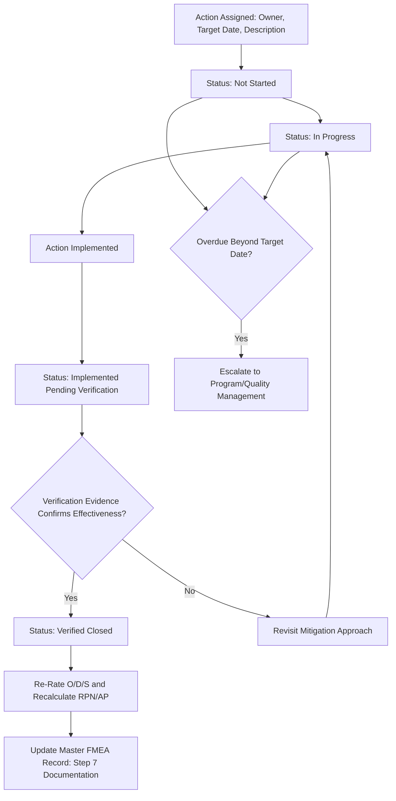

## Tracking and Closing Action Items

### Definition and Purpose

Tracking and closing action items is the discipline of formally monitoring recommended actions from assignment through verified completion, ensuring that mitigations identified during Optimization (step six optimization) and evaluated through cost benefit analysis of mitigations and prioritizing actions by risk reduction actually get implemented, verified, and reflected in updated risk ratings, rather than remaining as documented intentions that never materialize. This topic addresses the operational and governance mechanics of action tracking, distinct from the earlier steps of identifying and selecting which actions to pursue.

### Why Formal Action Tracking Is Necessary

- **An unclosed action delivers no actual risk reduction**: An FMEA record showing a planned action but no verified closure represents unrealized risk reduction — the analysis may correctly identify what should be done, but the product or process remains at its original risk level until the action is actually completed and verified
- **Actions without accountability tend to stall**: An action assigned to a functional group rather than a named individual, or without a target date, is significantly more likely to lose priority against competing demands and never reach closure
- **Verified closure, not just completion, is the meaningful milestone**: An action marked "complete" without verification evidence may not have actually achieved its intended risk-reduction effect, as discussed in step six optimization's distinction between planned and implemented-and-verified controls
- **Audit and customer submission defensibility depends on traceable action status**: Regulated industries and customer-mandated FMEA programs (automotive per IATF 16949, medical devices) expect a demonstrable, auditable record of action status, not merely a static list of intended mitigations

### Core Elements of an Action Tracking Record

**Key Points**

- **Unique action identifier**: A reference number or ID linking the action to its specific FMEA worksheet row (failure cause, mode, effect) for traceability
- **Action description**: A clear, specific statement of what will be done, distinguishing a genuine mitigation from a vague intention (e.g., "implement automated in-process bore gauge with alarm at ± 0.02mm tolerance" rather than "improve detection")
- **Responsible owner**: A named individual, not a functional group or department, accountable for driving the action to closure
- **Target completion date**: A specific date tied to relevant program milestones, not an open-ended or indefinite timeframe
- **Current status**: A defined status category (e.g., Not Started, In Progress, Implemented Pending Verification, Verified Closed, Deferred, Cancelled) reflecting the action's actual state
- **Verification evidence**: Documentation of the specific evidence (test data, process capability study, gauge R&R results, inspection records) confirming the action achieved its intended effect, required before an action can move to Verified Closed status
- **Updated ratings**: The revised Occurrence, Detection, and/or Severity ratings following verified implementation, along with the recalculated RPN and/or Action Priority classification

### Status Categories and Their Meaning

| Status | Definition | Required to Progress |
| --- | --- | --- |
| Not Started | Action assigned but work has not begun | Owner engagement, resource allocation |
| In Progress | Work underway but not complete | Continued execution toward target date |
| Implemented Pending Verification | Action physically/procedurally implemented but effectiveness not yet confirmed | Verification testing or data collection |
| Verified Closed | Action implemented and effectiveness confirmed with evidence | None — action is complete |
| Deferred | Action postponed with documented justification (see prioritizing actions by risk reduction) | Revisit date or triggering condition |
| Cancelled | Action will not be pursued, with documented cost-benefit or technical justification (see cost benefit analysis of mitigations) | None — decision is final pending future re-evaluation |

### Review Cadence and Governance

**Key Points**

- Establish a defined review cadence (e.g., weekly or biweekly for active programs) where action status is formally reviewed by the FMEA team or a designated action-tracking owner, distinct from the original FMEA rating sessions themselves
- Escalate stalled actions — those remaining in "Not Started" or "In Progress" status well beyond their target date — to program or quality management, rather than allowing them to persist indefinitely without visibility
- Maintain a single source of truth for action status, whether a dedicated FMEA software module, an integrated program management tool, or a controlled action log, to prevent status information from fragmenting across informal channels (email threads, meeting notes) where it becomes difficult to track or audit
- Link action tracking to the broader results documentation described in step seven results documentation, ensuring the action status report remains synchronized with the master FMEA record rather than existing as a disconnected parallel document

### Verification Before Closure

**Key Points**

- Closure requires evidence that the action achieved its intended effect, not merely evidence that the action was performed — for example, installing an automated gauge is implementation; confirming its detection capability through a gauge R&R study is verification
- The type of verification evidence should match the nature of the action: design changes typically require design verification/validation testing; process changes typically require process capability studies (Cpk/Ppk) or validated production runs; poka-yoke mechanisms require deliberate testing against the actual failure condition (see poka yoke and error proofing integration)
- Only after verification is confirmed should the Occurrence, Detection, or Severity rating be revised and the RPN/Action Priority recalculated, consistent with the discipline established in step six optimization
- If verification reveals the action did not achieve its intended effect (e.g., the projected Occurrence improvement isn't supported by subsequent data), the action should not be closed, and the team should revisit the mitigation approach rather than closing based on optimistic assumption

### Handling Actions That Cannot Be Closed as Planned

**Key Points**

- If an action proves technically infeasible after further investigation, or its cost benefit analysis of mitigations no longer supports proceeding, formally transition it to Cancelled status with documented rationale, rather than leaving it indefinitely open or silently dropping it from tracking
- If an action's timeline must be extended due to legitimate technical or resource constraints, update the target date with documented justification rather than allowing the original date to simply lapse without acknowledgment
- Where a High-priority item's action is deferred or cancelled, ensure the documented engineering justification required under the organization's action threshold policy (see setting thresholds for required action) is captured alongside the status change, maintaining the audit trail

### Example

**Scenario:** Continuing the recurring brake caliper example — the tool-wear sensor and automated gauge actions from step six optimization.

**Tracking record:**

- Action 1: Implement tool-wear sensor with predictive replacement alert — Owner: Process Engineer J. Alvarez — Target: 6 weeks prior to production launch — Status progression: Not Started → In Progress → Implemented Pending Verification (sensor installed) → Verified Closed (3 months of production data confirming zero tool-wear-related deviations)
- Action 2: Implement automated in-process bore gauge with alarm — Owner: Quality Engineer R. Chen — Target: concurrent with Action 1 — Status progression: Not Started → In Progress → Implemented Pending Verification (gauge installed) → Verified Closed (gauge R&R study confirming measurement system capability)

**Review cadence:** Both actions are reviewed at the program's biweekly FMEA action review meeting; when Action 2's gauge R&R study is delayed by two weeks due to metrology lab scheduling, the target date is formally updated with the documented reason rather than the delay going unacknowledged.

**Closure and rating update:** Only once both actions reach Verified Closed status are the Occurrence and Detection ratings revised (Occurrence 4→2, Detection 7→2), and the RPN recalculated (224→32), with the updated ratings and verification evidence references captured in the master FMEA worksheet per step seven results documentation.

### Common Pitfalls

- Marking an action "closed" based on implementation alone, without verification evidence confirming the action achieved its intended risk-reduction effect
- Assigning actions to a functional group rather than a named individual, diffusing accountability and increasing the likelihood of stalled progress
- Allowing action status to fragment across informal channels rather than maintaining a single authoritative tracking record
- Letting overdue actions persist without escalation, allowing high-priority risk items to remain effectively unaddressed indefinitely
- Silently dropping an infeasible action from tracking rather than formally cancelling it with documented rationale
- Failing to update Occurrence/Detection/Severity ratings and recalculate RPN or Action Priority after verified closure, leaving the FMEA record showing stale, pre-action risk levels
- Disconnecting action tracking from the master FMEA documentation, creating two out-of-sync records of risk status

### Diagram: Action Tracking and Closure Lifecycle (svg_diagram)

**Related Topics**

- Step six optimization
- Prioritizing actions by risk reduction
- Cost benefit analysis of mitigations
- Setting thresholds for required action
- Step seven results documentation
- Poka yoke and error proofing integration
- High medium and low priority classification
- Occurrence rating scales and criteria