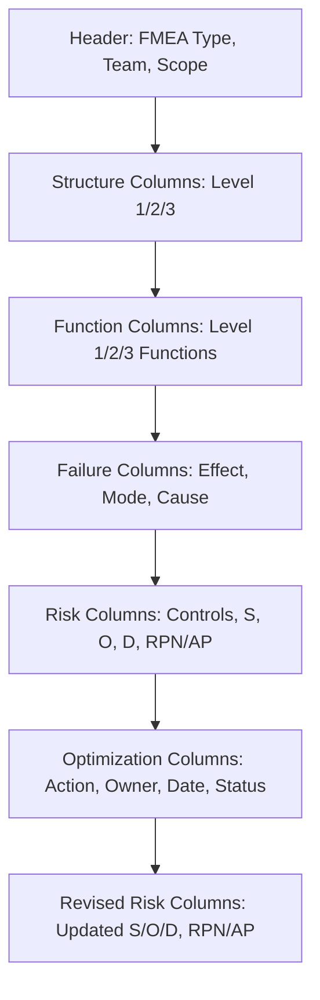

## Standard FMEA Worksheet Structure

### Definition and Purpose

The standard FMEA worksheet is the tabular document format used to capture, organize, and communicate the complete FMEA analysis — from structure and function through failure analysis, risk rating, and optimization actions — in a single structured record. While the seven-step method (see step one planning and preparation through step seven results documentation) describes the analytical process, the worksheet is the physical or digital artifact that instantiates that process, and its column structure directly reflects the AIAG-VDA methodology's data model.

### Why Worksheet Structure Matters

- **Enforces analytical completeness**: A properly structured worksheet requires an entry for every element of the failure chain (structure, function, failure mode, effect, cause, controls, ratings, actions), making gaps in the analysis visually apparent rather than easy to overlook
- **Supports traceability**: A well-structured worksheet allows any rated risk item to be traced back to its originating structural element and function, and any action to be traced to the specific cause it addresses
- **Enables consistent cross-team and cross-program comparison**: A standardized column structure allows different teams, plants, or programs to produce FMEAs that can be meaningfully compared and audited against a common format
- **Serves as the direct input to downstream tools**: FMEA software platforms, control plan generation, and portfolio-level risk reporting typically depend on a consistent underlying worksheet structure to function effectively

### Core Worksheet Sections (AIAG-VDA Harmonized Structure)

The AIAG-VDA standard worksheet format organizes columns to mirror the seven-step process, generally following this sequence:

#### 1. Header/Administrative Information

- FMEA type (Design FMEA, Process FMEA, System FMEA)
- FMEA number/identifier and revision level
- Item/system/process name and description
- Team members and facilitator
- Start date and revision date
- Customer/program reference (where applicable)

#### 2. Structure Analysis Columns

- Level 1 (next higher level/system)
- Level 2 (focus element/item under analysis)
- Level 3 (next lower level/component or process element)
- Corresponds directly to the three-level hierarchy established in step two structure analysis

#### 3. Function Analysis Columns

- Function of Level 1 (system function)
- Function of Level 2 (focus element function)
- Function of Level 3 (component/process element function)
- Corresponds directly to the function net established in step three function analysis

#### 4. Failure Analysis Columns

- Failure Effect (linked to Level 1 function)
- Failure Mode (linked to Level 2 function)
- Failure Cause (linked to Level 3 function)
- Corresponds directly to the failure chain established in step four failure analysis

#### 5. Risk Analysis Columns

- Current Prevention Control
- Current Detection Control
- Severity (S) rating
- Occurrence (O) rating
- Detection (D) rating
- RPN (S × O) and/or Action Priority (AP) classification
- Corresponds directly to step five risk analysis

#### 6. Optimization Columns

- Recommended Action(s)
- Responsible Person/Owner
- Target Completion Date
- Actions Taken (implemented action description)
- Status
- Revised Severity, Occurrence, Detection ratings (post-action)
- Revised RPN/AP classification
- Corresponds directly to step six optimization and tracking and closing action items

### Worksheet Layout Variants

**Key Points**

- **Row-per-cause structure**: The most common layout, where each row represents a single unique failure cause with its own Occurrence and Detection ratings, while Severity (tied to the shared effect) may repeat across multiple rows for the same failure mode — this structure directly supports the differentiated risk analysis described in step five risk analysis
- **Nested/grouped structure**: Some software tools display the worksheet with failure modes as parent rows and causes as indented child rows, visually reinforcing the one-to-many relationship between a failure mode and its multiple causes without repeating the effect/severity information redundantly
- **Linked Design FMEA/Process FMEA worksheets**: Organizations using both DFMEA and PFMEA often maintain them as separate but cross-referenced worksheets, with a shared failure effect/severity linkage as described in design changes versus process changes

### Design FMEA vs. Process FMEA Worksheet Differences

| Column Category | Design FMEA | Process FMEA |
| --- | --- | --- |
| Structure levels | System / Subsystem / Component | Process / Operation / 4M Element |
| Function description | Physical/functional requirement | Process outcome/characteristic achieved |
| Typical current controls | Design standards, simulation, validated materials | Poka-yoke, SPC, inspection, gauging |
| Typical action types | Redesign, material change, tolerance change | Process parameter change, tooling change, added control |

### Digital vs. Physical Worksheet Formats

**Key Points**

- **Spreadsheet-based worksheets**: Widely used for smaller-scope FMEAs or organizations without dedicated FMEA software, offering flexibility but requiring manual discipline to maintain structure consistency and version control
- **Dedicated FMEA software platforms**: Enforce the AIAG-VDA data model structurally, often auto-generating RPN/AP calculations, maintaining revision history, and supporting linked Design FMEA/Process FMEA relationships more robustly than spreadsheets
- **Database-backed enterprise systems**: For organizations managing large FMEA portfolios across many programs, database-backed systems support the portfolio-level trend and calibration analysis described in calibrating ratings across teams and prioritizing actions by risk reduction

### Supplementary Documentation Alongside the Worksheet

**Key Points**

- Structure and function diagrams (block diagrams, boundary diagrams, process flow diagrams) referenced in step two structure analysis, typically maintained as separate but linked documents
- Control plans, particularly for Process FMEA, which translate the worksheet's current and recommended controls into the formal production control documentation
- Revision history log capturing what changed, when, and why, as discussed in step seven results documentation

### Example

**Scenario:** A single worksheet row from the recurring CNC bore machining Process FMEA example, populated according to the standard structure:

| Column | Entry |
| --- | --- |
| Level 1 (Process) | Brake Caliper Machining Line |
| Level 2 (Operation) | CNC Bore Machining Operation |
| Level 3 (4M Element) | Machine — Boring Tool |
| Function (Level 2) | Achieve bore diameter 45.00mm ± 0.02mm |
| Failure Mode | Bore diameter exceeds 45.02mm |
| Failure Effect | Seal leakage at customer (local: piston assembly fit issue) |
| Failure Cause | Boring tool wear exceeding replacement interval |
| Current Prevention Control | Documented tool-change interval |
| Current Detection Control | Manual visual inspection, sampling-based |
| S / O / D | 8 / 4 / 7 |
| RPN / AP | 224 / High |
| Recommended Action | Tool-wear sensor with predictive alert; automated in-process gauge |
| Owner / Target Date | J. Alvarez / R. Chen — 6 weeks before launch |
| Status | Verified Closed |
| Revised S / O / D | 8 / 2 / 2 |
| Revised RPN / AP | 32 / Low |

This single row demonstrates how the worksheet structure captures the complete traceable chain from structure and function through final verified risk reduction, consistent with every preceding step of the seven-step method.

### Common Pitfalls

- Using an inconsistent or ad hoc column structure that doesn't map cleanly to the seven-step data model, making the worksheet difficult to audit or compare across teams
- Failing to maintain a row-per-cause structure, collapsing multiple distinct causes into a single row and losing differentiated Occurrence/Detection ratings
- Leaving Optimization columns (owner, target date, status, revised ratings) incomplete after action closure, resulting in a worksheet that shows stale pre-action risk levels
- Maintaining Design FMEA and Process FMEA worksheets without cross-referencing shared failure effects, losing the severity-linkage consistency described in design changes versus process changes
- Not preserving revision history when the worksheet is updated, undermining the audit trail expected under step seven results documentation
- Using a spreadsheet-based worksheet without disciplined version control for a large, long-running FMEA, increasing the risk of conflicting or lost updates across multiple contributors

### Diagram: Standard Worksheet Column Flow (svg_diagram)

**Related Topics**

- Step one planning and preparation through step seven results documentation
- Software platforms for FMEA management
- Design changes versus process changes
- Tracking and closing action items
- Step seven results documentation
- Calculating the risk priority number
- AIAG VDA action priority tables
- Customizing rating tables for an organization