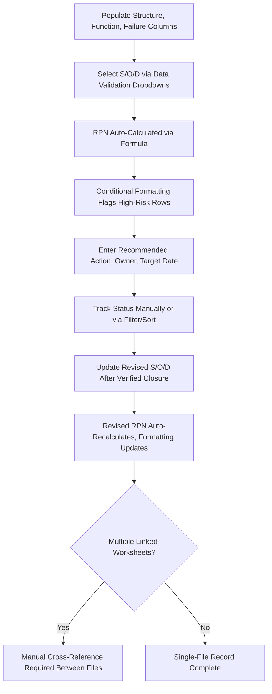

## Excel Based FMEA Templates

### Definition and Purpose

Excel-based FMEA templates are spreadsheet implementations of the standard FMEA worksheet structure (see standard FMEA worksheet structure), used by organizations to conduct, calculate, and document Failure Mode and Effects Analysis without dedicated FMEA software. Excel remains one of the most widely used tools for FMEA documentation, particularly among smaller organizations, teams new to formal FMEA practice, or programs where the scope doesn't justify the cost and implementation overhead of a dedicated platform.

### Why Excel Remains Widely Used for FMEA

- **Low barrier to entry**: Most organizations already have Excel or equivalent spreadsheet software available, avoiding the procurement, licensing, and training investment required for dedicated FMEA platforms
- **Flexibility for organization-specific customization**: Excel allows straightforward implementation of customized rating tables (see customizing rating tables for an organization) and organization-specific worksheet variants without vendor-imposed structural constraints
- **Familiar interface for cross-functional teams**: Most FMEA team participants already have baseline spreadsheet literacy, reducing the learning curve compared to specialized software
- **Suitable for smaller-scope or lower-complexity FMEAs**: For a single-component or single-process FMEA with a limited number of failure modes, the coordination and traceability challenges that dedicated software addresses are less pronounced

### Core Template Components

**Key Points**

- **Header section**: Cells or a dedicated header row capturing FMEA type, item description, team members, dates, and revision level, mirroring the administrative fields described in standard FMEA worksheet structure
- **Structure/Function/Failure columns**: Sequential columns implementing the Level 1/2/3 structure and function hierarchy and the failure chain (effect/mode/cause), typically as adjacent columns in a single flat table
- **Current controls columns**: Separate columns for prevention controls and detection controls, supporting the distinction emphasized in step five risk analysis
- **Rating columns with data validation**: Severity, Occurrence, and Detection columns typically implemented with Excel data validation (dropdown lists) constrained to the organization's defined 1–10 or 1–5 scale, reducing the risk of invalid or out-of-range entries
- **Calculated RPN column**: A formula column (typically `=S*O*D`) that automatically computes RPN from the three rating columns, ensuring calculation consistency and eliminating manual arithmetic errors
- **Action tracking columns**: Recommended action, responsible owner, target date, status, and revised ratings, mirroring the Optimization columns described in standard FMEA worksheet structure

### Common Excel Features Used in FMEA Templates

**Key Points**

- **Data validation dropdown lists**: Constrain Severity/Occurrence/Detection entries to the organization's defined rating scale values, preventing invalid entries and supporting consistent application of the customized rating tables described in customizing rating tables for an organization
- **Conditional formatting for visual risk highlighting**: Color-coding RPN values or Action Priority classifications (e.g., red/yellow/green) to make high-priority items visually apparent when scanning a long worksheet, functioning similarly to the visual communication purpose of a risk matrix (see risk matrices of severity versus occurrence)
- **Formulas for RPN and rating-change tracking**: Beyond the basic RPN calculation, formulas can compute the delta between original and revised RPN, providing an immediate visual indicator of achieved risk reduction following action closure
- **Data filtering and sorting**: Excel's native filter and sort capabilities allow the team to quickly view items above an RPN threshold (see setting thresholds for required action) or sorted by Action Priority classification
- **Pivot tables for portfolio-level summary**: For organizations managing multiple FMEA worksheets, pivot tables can aggregate open action counts, average ratings, or priority distributions across multiple files, providing a lightweight alternative to a dedicated database-backed system
- **Protected/locked cells for approved criteria tables**: Locking the rating criteria reference tables prevents inadvertent editing of the organization's approved Severity/Occurrence/Detection definitions while still allowing free entry in the working analysis columns

### Limitations of Excel-Based Templates

**Key Points**

- **Manual version control risk**: Without a dedicated document management system, multiple team members editing the same file, or working from outdated copies, can produce conflicting or lost updates — a persistent challenge for maintaining the single source of truth described in tracking and closing action items
- **Limited native traceability across linked Design FMEA/Process FMEA worksheets**: Excel doesn't natively enforce the cross-referencing between related DFMEA and PFMEA entries described in design changes versus process changes, requiring manual discipline to maintain consistency
- **Weaker audit trail than dedicated software**: While Excel supports basic change tracking, it generally provides a less robust, less tamper-evident revision history than purpose-built FMEA software, which can be a disadvantage in audit-sensitive or regulated environments
- **Scaling challenges for large or complex FMEAs**: A worksheet with hundreds of rows and many linked structure/function levels can become unwieldy to navigate and maintain in a flat spreadsheet format compared to hierarchical or database-backed tools
- **No native workflow/notification support**: Excel doesn't inherently support the automated status alerts, escalation reminders, or review-cadence workflows described in tracking and closing action items, requiring these to be managed through separate communication channels

### Best Practices for Excel-Based FMEA Templates

**Key Points**

- Lock or protect the rating criteria reference tables and formula cells to prevent accidental modification, while leaving analysis entry cells open
- Use data validation dropdowns for all rating fields rather than free-text entry, ensuring consistency with the organization's defined scale
- Maintain the file in a shared, version-controlled location (a document management system or cloud-based shared drive with version history) rather than relying on emailed copies, to reduce the risk of conflicting parallel edits
- Establish a clear file-naming and revision-numbering convention, consistent with the revision history discipline described in step seven results documentation
- Use conditional formatting to visually flag items above the organization's RPN or Action Priority threshold, supporting quick identification of high-priority items during review
- For organizations that outgrow a single-file approach, consider a structured migration path to a dedicated FMEA software platform rather than continuing to scale Excel-based practices indefinitely

### Example

**Scenario:** A mid-sized supplier uses an Excel-based Process FMEA template for the recurring CNC bore machining example.

**Template implementation:** The worksheet includes data validation dropdowns constrained to the organization's customized 1–10 Occurrence scale (see customizing rating tables for an organization), an RPN formula column automatically calculating `=Severity*Occurrence*Detection`, and conditional formatting that highlights any row with RPN greater than 150 in red.

**Workflow:** When the team enters the initial ratings for the oversized-bore failure cause (S=8, O=4, D=7), the RPN cell automatically calculates 224 and the conditional formatting flags the row in red, visually signaling the item for mandatory action review consistent with the organization's threshold policy (see setting thresholds for required action). After the tool-wear sensor and automated gauge actions are verified closed, the team updates the revised O and D columns (2 and 2 respectively), and the revised RPN formula automatically recalculates to 32, with the conditional formatting shifting the row to green.

**Limitation encountered:** Because the organization maintains separate DFMEA and PFMEA Excel files for this program, updating the Process FMEA's revised ratings does not automatically flag the corresponding Design FMEA entry for review — the team relies on a manual cross-reference note and a recurring calendar reminder to check consistency between the two files, illustrating the traceability limitation inherent to standalone spreadsheet-based templates.

### Common Pitfalls

- Using free-text entry for Severity/Occurrence/Detection ratings instead of data validation dropdowns, allowing inconsistent or invalid values to enter the record
- Maintaining multiple uncontrolled copies of the same FMEA file across team members' local drives, leading to conflicting or lost updates
- Failing to lock formula and reference-table cells, risking accidental corruption of RPN calculations or approved rating criteria
- Relying solely on manual processes to maintain consistency between linked Design FMEA and Process FMEA spreadsheet files
- Allowing a single Excel file to grow to an unwieldy size and complexity without considering a migration to more structured or database-backed tooling
- Not establishing a clear revision-numbering and file-naming convention, undermining the audit trail expected for regulated or customer-facing FMEA submissions

### Diagram: Excel-Based FMEA Template Workflow (svg_diagram)

**Related Topics**

- Standard FMEA worksheet structure
- Customizing rating tables for an organization
- Tracking and closing action items
- Setting thresholds for required action
- Risk matrices of severity versus occurrence
- Calculating the risk priority number
- Design changes versus process changes
- Step seven results documentation