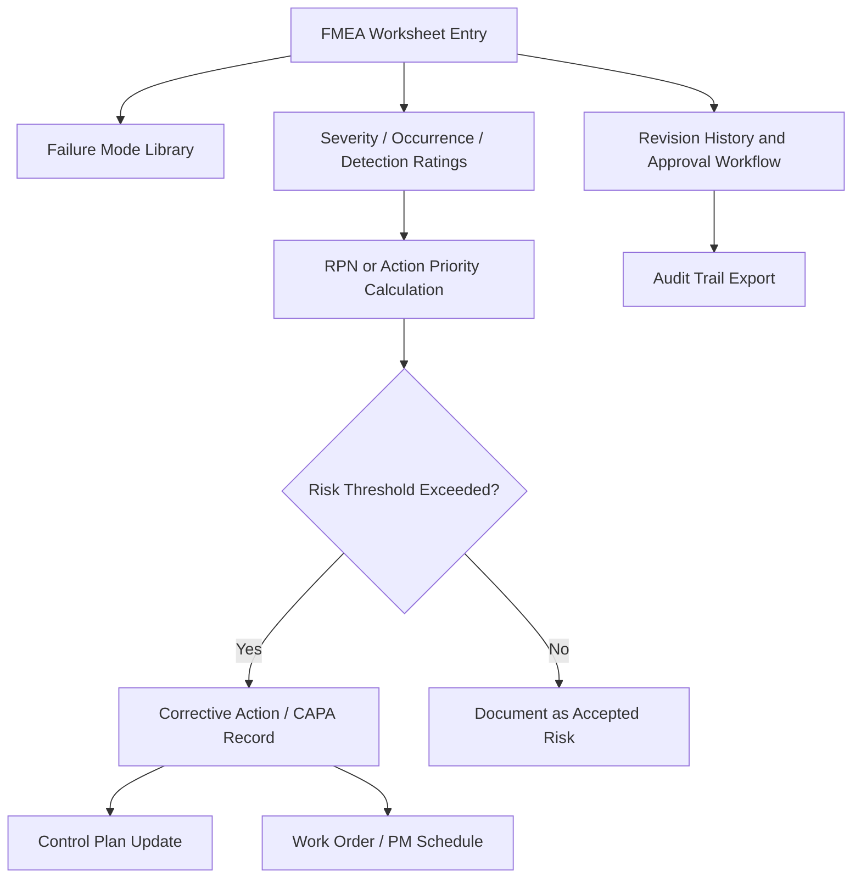

## Commercial FMEA Software Platforms

### Overview

Commercial FMEA software platforms replace static spreadsheet-based FMEA worksheets with structured, database-driven applications that manage failure modes, causes, effects, controls, and corrective actions as interconnected records rather than isolated cells. Modern FMEA software allows organizations to treat FMEA as a "living document" — connected to other documentation, continuously updated, and actively supporting decision-making, and the publication of the AIAG & VDA FMEA Handbook significantly raised expectations toward FMEA tools, with the 7-Step FMEA methodology and Action Priority (AP) evaluation system becoming audit standards. Companies increasingly look for solutions that not only digitize the form but actively ensure compliance with current requirements. [Centrum FMEA](https://fmea.com.pl/6-best-fmea-software/?lang=en)[Centrum FMEA](https://fmea.com.pl/6-best-fmea-software/?lang=en)

These platforms typically differ from spreadsheets in three structural ways: they enforce standardized rating scales and calculation logic, they maintain revision history and electronic approval trails, and they link FMEA records to adjacent quality artifacts (control plans, PFDs, CAPA, work orders) so that a change in one place propagates or flags related records elsewhere.

---

### Why Organizations Move Beyond Spreadsheets

**Key Points**

- Spreadsheet FMEAs are typically static: completed once during a design phase, then archived and rarely revisited.
- A spreadsheet cannot trigger downstream actions such as preventive maintenance work orders or CAPA records.
- Multi-site organizations need centralized libraries so failure modes, causes, and controls are reused consistently rather than re-invented per site.
- Audit and regulatory bodies (IATF 16949, ISO 14971, ISO 9001) increasingly expect traceable revision history and electronic sign-off, which spreadsheets handle poorly.

[Inference] The "spreadsheet fatigue" argument is a common vendor marketing narrative; the underlying operational problems it describes (lost revision history, disconnected action tracking) are well documented in quality management literature, though the framing itself is promotional.

---

### Major Commercial Platforms

#### Relyence FMEA

Relyence FMEA supports DFMEAs, PFMEAs, Boundary Diagrams, P-Diagrams, Process Flow Diagrams, Control Plans, DVP&R, piece-part FMECAs & FMEA-MSRs, with built-in templates supporting the most common FMEA standards including AIAG & VDA. The broader Relyence Studio platform's FMEA module covers DFMEA, PFMEA, FMECA, and FMEA-MSR with FMEA Nets, P-Diagrams, Process Flow Diagrams, and Process Control Plans, and names AIAG, AIAG & VDA, SAE, and MIL-STD-1629 as supported standards. [SourceForge](https://sourceforge.net/software/fmea/)[reliamag](https://reliamag.com/guides/best-reliability-engineering-software/)

- **Key Capabilities**: The platform shares a common Analysis Tree and cross-module Dashboards with an API interface, and modules pass data across each other so an FMEA can feed a fault tree or an RCM worksheet without re-keying. Its Action Library and customizable FMEA Workflow, Approvals, and Notifications features support closed-loop "living document" FMEAs, with role-based permissions, access control, and revision control. [reliamag](https://reliamag.com/guides/best-reliability-engineering-software/)[slashdot](https://slashdot.org/software/comparison/Relyence-FMEA-vs-Velosi-PHA/)
- **Deployment**: Relyence Studio is browser-based and can run hosted, in a private cloud, on an internal network, or fully on-premise, with a free trial requiring only a browser and no install. [reliamag](https://reliamag.com/guides/best-reliability-engineering-software/)
- **Best fit**: Organizations wanting one integrated analysis suite spanning FMEA, fault tree analysis, and reliability prediction rather than a single-purpose FMEA tool.

#### PTC Windchill FMEA

Windchill FMEA is part of PTC's Windchill Quality Solutions suite, integrated with PTC's broader PLM (Product Lifecycle Management) ecosystem.

- **Key Capabilities**: Tight linkage between FMEA records and CAD/PLM structure, allowing failure modes to be tied directly to part numbers and engineering change objects already managed in Windchill.
- **Best fit**: Organizations already standardized on PTC Windchill for PLM, where FMEA needs to inherit product structure and change-control workflows automatically rather than being maintained as a separate system.

#### Siemens Teamcenter Quality FMEA

Siemens Teamcenter Quality FMEA is positioned as fitting organizations whose PLM change control needs traceable DFMEA and PFMEA revisions through reviews and manufacturing updates. [wifitalents](https://wifitalents.com/best/fmea-software/)

- **Key Capabilities**: Deep integration with Teamcenter's change and configuration management, so FMEA revisions are versioned alongside the product structure they describe.
- **Best fit**: Large discrete manufacturers (notably automotive and aerospace) already running Teamcenter as their PLM backbone.

#### Sphera FMEA-Pro (formerly Dyadem)

Sphera is described as a veteran in the risk space, and Sphera's FMEA-Pro software provides a flexible framework that accommodates various FMEA methodologies, along with specialized features for managing risk data and ensuring appropriate controls are implemented, connecting quality information throughout design and manufacturing processes. Its "Smart Gestures" and library-based approach are designed to speed up the FMEA session, providing a consistent framework for dFMEA and pFMEA across multiple global sites. [6 Best FMEA Software for 2026 - Centrum FMEA +2](https://fmea.com.pl/6-best-fmea-software/?lang=en)

- **Key Capabilities**: Reusable failure-mode libraries; strong support for multi-site standardization.
- **Best fit**: Large, multi-site organizations — particularly in MedTech and pharma — needing a highly collaborative, standards-consistent FMEA environment. [visuresolutions](https://visuresolutions.com/?p=47781)

#### APIS IQ-FMEA / IQ-Software

- **Key Capabilities**: Listed among established FMECA-category tools alongside Xfmea, Isograph Reliability Workbench, and Windchill FMEA. Positioned as a lower-cost entry point for controlled baselines and action governance compared to full PLM-integrated suites. [ntnu](https://ntnu.edu/ross/info/software)[wifitalents](https://wifitalents.com/best/fmea-software/)
- **Best fit**: Automotive suppliers needing AIAG & VDA-compliant FMEA without the overhead of a full PLM quality suite.

#### ReliaSoft XFMEA (Hottinger Brüel & Kjær / HBK)

ReliaSoft XFMEA fits when engineering and quality teams need controlled, revisioned FMEA work with deep traceability. [wifitalents](https://wifitalents.com/best/fmea-software/)

- **Key Capabilities**: Part of the broader ReliaSoft reliability engineering suite, so FMEA data can connect to reliability prediction, RBD (reliability block diagram), and life-data analysis modules from the same vendor family.
- **Best fit**: Reliability engineering teams that want FMEA embedded within a wider quantitative reliability analysis toolchain.

#### Minitab Engage

Minitab Engage combines statistical analysis with dynamic FMEA capability, featuring a "Control Plan Wizard" that pulls directly from the PFMEA, and is widely used for Lean Six Sigma environments. [visuresolutions](https://visuresolutions.com/?p=47781)

- **Key Capabilities**: Intuitive integration for teams already using Minitab for statistical data analysis, with visual dashboards. [visuresolutions](https://visuresolutions.com/?p=47781)
- **Best fit**: Organizations running Lean Six Sigma programs where FMEA needs to connect directly to statistical process control and DMAIC project tracking.

#### SoftComply FMEA (for Jira)

SoftComply is positioned for Agile MedTech development, bringing ISO 14971 and FMEA workflows directly into Jira, adding a risk management layer to Jira tickets so that every software "bug" or "story" can be evaluated for risk, and automating RPN calculations within the development environment. [visuresolutions](https://visuresolutions.com/?p=47781)

- **Key Capabilities**: Zero tool-switching for developers, with low cost of entry for software-centric MedTech startups. [visuresolutions](https://visuresolutions.com/?p=47781)
- **Best fit**: Software/SaMD (Software as a Medical Device) teams practicing Agile development who need risk management embedded in existing engineering tooling rather than a separate standalone FMEA application.

#### Babtec FMEA

Babtec FMEA works well for engineering organizations needing controlled DFMEA and PFMEA baselines with review trails. [wifitalents](https://wifitalents.com/best/fmea-software/)

- **Best fit**: European (particularly German/automotive-supply-chain) manufacturers needing AIAG & VDA-aligned FMEA within a broader QMS suite.

#### DataLyzer FMEA

DataLyzer FMEA works well for regulated teams needing worksheet traceability and fast approval closure. [wifitalents](https://wifitalents.com/best/fmea-software/)

- **Best fit**: Regulated manufacturing environments prioritizing structured approval workflows over deep PLM integration.

#### Fabrico

Fabrico challenges the traditional standalone-tool view of FMEA, instead treating FMEA as the logic engine for a CMMS (Computerized Maintenance Management System): if an FMEA identifies a failure mode as high risk via a high RPN, Fabrico allows that failure mode to be linked to a preventive maintenance schedule instantly, and it is designed to capture real-world failure feedback from the shop floor rather than relying on estimated ratings alone. [Fabrico](https://www.fabrico.io/blog/best-fmea-software-tools/)

- **Best fit**: Manufacturers and maintenance-reliability teams wanting FMEA outputs to directly drive PM (preventive maintenance) scheduling rather than remain a design-phase-only document.

#### Intelex FMEA

Intelex FMEA is a module within the broader Intelex EHSQ (Environmental, Health, Safety, and Quality) management platform, designed for conducting FMEA in manufacturing, automotive, and regulated industries. [Gitnux](https://gitnux.org/best/fmea-software/)

- **Best fit**: Organizations wanting FMEA as one module within a broader unified EHS and Quality management system rather than a dedicated point solution.

#### Visure Solutions

Visure offers FMEA as one module within a broader QMS platform whose core modules include Audits, CAPA, Document Management, Inspections, Risk & Opportunities, Training, and related quality functions. [SourceForge](https://sourceforge.net/software/fmea/for-small-business/)

- **Best fit**: Small-to-mid organizations wanting an all-in-one QMS platform rather than a specialized FMEA tool.

---

### Comparison Table

| Platform | Primary Standard Focus | Deployment | Strongest Integration | Typical Industry Fit |
| --- | --- | --- | --- | --- |
| Relyence FMEA | AIAG & VDA, MIL-STD-1629 | Cloud/on-prem/browser | Fault tree, RCM, reliability prediction | Cross-industry, reliability engineering |
| PTC Windchill FMEA | AIAG & VDA | On-prem/cloud (PLM-tied) | PTC PLM/CAD structure | Automotive, discrete manufacturing |
| Siemens Teamcenter Quality FMEA | AIAG & VDA | On-prem/cloud (PLM-tied) | Teamcenter change control | Automotive, aerospace |
| Sphera FMEA-Pro | AIAG & VDA, ICH Q9 | Cloud | Document control, training modules | MedTech, pharma |
| APIS IQ-FMEA | AIAG & VDA | On-prem/cloud | Standalone baseline governance | Automotive suppliers |
| ReliaSoft XFMEA | MIL-STD, SAE | On-prem/cloud | Reliability prediction, RBD | Reliability/aerospace |
| Minitab Engage | Six Sigma-oriented | On-prem/cloud | Statistical/SPC tools, control plans | Lean Six Sigma programs |
| SoftComply | ISO 14971 | Jira plugin (cloud) | Jira issue tracking | SaMD/Agile MedTech |
| Fabrico | Maintenance/RCM-oriented | Cloud (CMMS) | PM scheduling, work orders | Manufacturing maintenance |
| Intelex FMEA | Multi-standard | Cloud (EHSQ suite) | EHS/Quality modules | Regulated manufacturing |

[Unverified] Exact pricing tiers, per-seat licensing models, and specific version numbers change frequently across vendors; figures should be confirmed directly with each vendor before procurement decisions.

---

### Common Architectural Pattern

This diagram represents the general pattern shared across most commercial platforms: a worksheet layer feeds a shared failure-mode library, ratings drive a calculated risk score, and that score conditionally triggers downstream action records, all wrapped in a revision-controlled approval workflow.

<svg viewBox="0 0 760 300" xmlns="http://www.w3.org/2000/svg">
<title>Commercial FMEA Platform Integration Layers (svg_diagram)</title>
<rect x="0" y="0" width="760" height="300" fill="#ffffff"/>
<rect x="20" y="20" width="720" height="60" rx="6" fill="#e8eef7" stroke="#3a5a8c" stroke-width="1.5"/>
<text x="380" y="55" text-anchor="middle" font-size="16" font-family="sans-serif" font-weight="bold" fill="#1f2d3d">Analysis Layer: DFMEA / PFMEA / FMEA-MSR Worksheets (svg_diagram)</text>
<rect x="20" y="100" width="220" height="60" rx="6" fill="#f7ecd9" stroke="#8c6d3a" stroke-width="1.5"/>
<text x="130" y="125" text-anchor="middle" font-size="13" font-family="sans-serif" fill="#1f2d3d">Shared Failure Mode</text>
<text x="130" y="143" text-anchor="middle" font-size="13" font-family="sans-serif" fill="#1f2d3d">Library / Taxonomy</text>
<rect x="270" y="100" width="220" height="60" rx="6" fill="#f7ecd9" stroke="#8c6d3a" stroke-width="1.5"/>
<text x="380" y="125" text-anchor="middle" font-size="13" font-family="sans-serif" fill="#1f2d3d">Risk Scoring Engine</text>
<text x="380" y="143" text-anchor="middle" font-size="13" font-family="sans-serif" fill="#1f2d3d">(RPN / Action Priority)</text>
<rect x="520" y="100" width="220" height="60" rx="6" fill="#f7ecd9" stroke="#8c6d3a" stroke-width="1.5"/>
<text x="630" y="125" text-anchor="middle" font-size="13" font-family="sans-serif" fill="#1f2d3d">Workflow / Approval</text>
<text x="630" y="143" text-anchor="middle" font-size="13" font-family="sans-serif" fill="#1f2d3d">& Revision Control</text>
<rect x="20" y="200" width="220" height="60" rx="6" fill="#e3f0e6" stroke="#3a7a4a" stroke-width="1.5"/>
<text x="130" y="225" text-anchor="middle" font-size="13" font-family="sans-serif" fill="#1f2d3d">PLM / CAD</text>
<text x="130" y="243" text-anchor="middle" font-size="13" font-family="sans-serif" fill="#1f2d3d">(Windchill, Teamcenter)</text>
<rect x="270" y="200" width="220" height="60" rx="6" fill="#e3f0e6" stroke="#3a7a4a" stroke-width="1.5"/>
<text x="380" y="225" text-anchor="middle" font-size="13" font-family="sans-serif" fill="#1f2d3d">CAPA / QMS</text>
<text x="380" y="243" text-anchor="middle" font-size="13" font-family="sans-serif" fill="#1f2d3d">(Sphera, Intelex)</text>
<rect x="520" y="200" width="220" height="60" rx="6" fill="#e3f0e6" stroke="#3a7a4a" stroke-width="1.5"/>
<text x="630" y="225" text-anchor="middle" font-size="13" font-family="sans-serif" fill="#1f2d3d">CMMS / Work Orders</text>
<text x="630" y="243" text-anchor="middle" font-size="13" font-family="sans-serif" fill="#1f2d3d">(Fabrico)</text>
<line x1="380" y1="80" x2="130" y2="100" stroke="#555" stroke-width="1.5"/>
<line x1="380" y1="80" x2="380" y2="100" stroke="#555" stroke-width="1.5"/>
<line x1="380" y1="80" x2="630" y2="100" stroke="#555" stroke-width="1.5"/>
<line x1="130" y1="160" x2="130" y2="200" stroke="#555" stroke-width="1.5"/>
<line x1="380" y1="160" x2="380" y2="200" stroke="#555" stroke-width="1.5"/>
<line x1="630" y1="160" x2="630" y2="200" stroke="#555" stroke-width="1.5"/>
</svg>

---

### Selection Criteria

**Key Points**

- **Standard alignment**: Confirm native support for AIAG & VDA (2019) methodology, including the Action Priority (AP) table, not just legacy RPN calculation, since full compliance with the AIAG-VDA FMEA Handbook is practically the standard in 2026. [Centrum FMEA](https://fmea.com.pl/6-best-fmea-software/?lang=en)
- **Integration surface**: Determine whether FMEA needs to live inside an existing PLM (Windchill, Teamcenter), QMS/EHSQ suite (Intelex, Sphera), issue tracker (Jira via SoftComply), or CMMS (Fabrico), since retrofitting integration after adoption is costly.
- **Multi-site library governance**: For organizations with multiple plants, verify whether failure-mode and control libraries can be centrally maintained and pushed to local sites versus manually duplicated.
- **Deployment model**: Browser-based/cloud versus on-premise affects data residency requirements common in regulated (medical device, defense) contexts.
- **Closed-loop action tracking**: Verify whether the tool auto-generates and tracks corrective actions to closure with due dates and owners, or only stores the FMEA as a static record.

### Example: Evaluating Two Platforms for a Multi-Plant Automotive Supplier

A Tier 1 automotive supplier with three plants needs AIAG & VDA-compliant PFMEAs linked to control plans and existing PLM change orders.

- **Windchill FMEA** would be favored if the supplier is already on PTC Windchill, since failure modes can inherit part structure directly from engineering change objects, avoiding duplicate data entry between PLM and FMEA.
- **Relyence FMEA** would be favored if the supplier is not tied to a specific PLM vendor, since its browser-based deployment can run hosted, in a private cloud, on an internal network, or fully on-premise, offering more deployment flexibility and cross-module linkage to fault tree and reliability prediction work the reliability team may also need. [reliamag](https://reliamag.com/guides/best-reliability-engineering-software/)

[Inference] The specific choice between PLM-embedded tools (Windchill, Teamcenter) and standalone specialist tools (Relyence, APIS) generally hinges on whether the organization's existing PLM investment outweighs the flexibility of a dedicated risk-analysis suite; this is an organizational trade-off rather than a universal technical superiority claim.

---

### Limitations and Considerations

- Vendor comparison rankings from review aggregator sites (such as Gitnux and WifiTalents) are commercially incentivized listings that may earn referral commissions, so rankings should be treated as directional rather than authoritative. [Gitnux](https://gitnux.org/best/fmea-software/)[wifitalents](https://wifitalents.com/best/fmea-software/)
- [Speculation] Adoption of AI-assisted failure-mode suggestion features (auto-populating candidate failure modes from historical data or component libraries) appears to be an emerging differentiator among vendors as of 2026, though the maturity and reliability of these features varies significantly and was not independently verified across all platforms listed.
- Licensing costs, per-user vs. per-site pricing, and implementation/consulting costs vary substantially and are typically not published; direct vendor engagement is required for accurate total cost of ownership comparisons.

---

**Related Topics**

- AIAG & VDA FMEA Handbook methodology (7-Step process, Action Priority tables)
- FMEA vs. FMECA vs. FRACAS: distinguishing related risk-analysis frameworks
- Integrating FMEA outputs with Control Plans and PFDs (Process Flow Diagrams)
- ISO 14971 risk management for medical devices and SaMD-specific FMEA tooling
- Closed-loop CAPA (Corrective and Preventive Action) system design
- PLM (Product Lifecycle Management) integration patterns for quality data
- Reliability-Centered Maintenance (RCM) and its relationship to PFMEA outputs
- Evaluating total cost of ownership for enterprise QMS/EHSQ software procurement