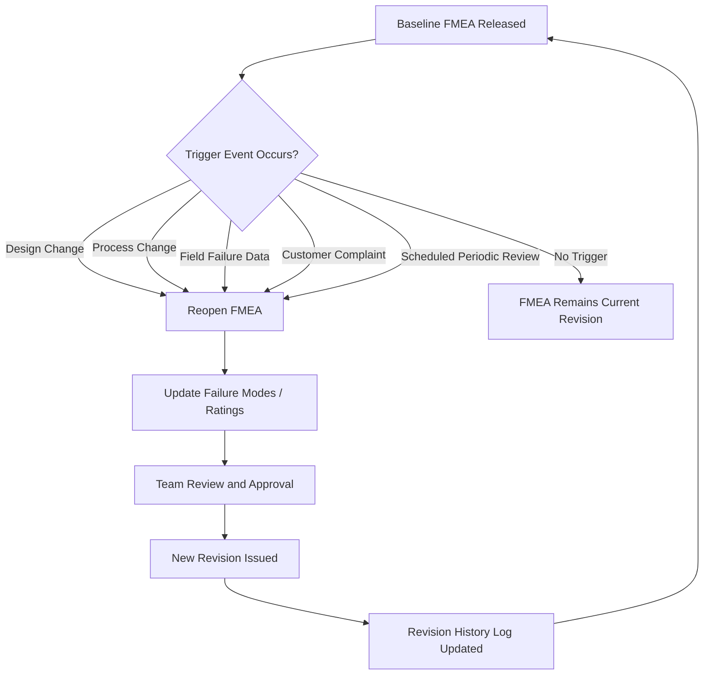
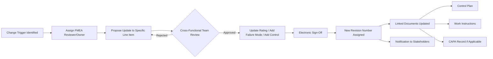

## Revision History and Living Document Practices

### Overview

Revision history and living document practices refer to the disciplines and tooling that keep an FMEA current, traceable, and auditable throughout a product or process lifecycle, rather than treating it as a one-time deliverable filed away after initial release. A "living" FMEA is continuously updated as designs change, field data arrives, and corrective actions close, with every change captured in a structured revision trail that shows what changed, who changed it, when, and why.

This practice sits at the intersection of document control (a quality system discipline) and risk management (the FMEA methodology itself). Without it, FMEAs degrade into static artifacts that no longer reflect the actual product or process and lose their value as a decision-support tool.

---

### Why FMEAs Must Be Living Documents

**Key Points**

- A completed FMEA reflects the team's knowledge at a single point in time; product designs, process parameters, supplier changes, and field failure data all evolve afterward.
- Regulatory and industry frameworks (IATF 16949, ISO 9001, ISO 14971, AIAG & VDA Handbook) expect FMEAs to be reviewed and updated in response to defined trigger events, not merely archived.
- A static FMEA that is never revisited cannot capture lessons learned from warranty claims, customer complaints, or manufacturing nonconformances, defeating its purpose as a preventive risk tool.
- Auditors frequently request evidence that an FMEA was updated following a specific change (engineering change order, process deviation, recall) — the revision history is that evidence.

---

### Triggers for FMEA Revision

An FMEA should be reopened and reassessed whenever any of the following occur:

- **Design changes**: New part revisions, material substitutions, tolerance changes, or new failure modes introduced by redesign.
- **Process changes**: New equipment, tooling changes, changed process parameters, new suppliers, or relocated production lines.
- **Field/warranty data**: Emergent failure modes discovered in the field that were not anticipated during the original analysis.
- **Customer complaints**: Specific complaint patterns that reveal a gap in the original risk assessment.
- **Internal nonconformances or scrap trends**: Recurring defects indicating an underestimated occurrence or detection rating.
- **Regulatory or standard changes**: Updates to applicable standards (e.g., a new AIAG & VDA handbook revision) that change rating scales or required content.
- **Periodic scheduled review**: Many quality systems mandate review at fixed intervals (e.g., annually) regardless of whether a specific trigger occurred.
- **Recall or safety incident**: Mandatory, often expedited, re-evaluation.

---

### Anatomy of a Revision History Log

A properly maintained revision history captures, at minimum, the following fields for every change:

| Field | Purpose |
| --- | --- |
| Revision number/letter | Unique, sequential identifier (e.g., Rev A, B, C or 1.0, 1.1, 2.0) |
| Date of change | When the revision was made |
| Author/Owner | Who made or requested the change |
| Description of change | What specifically changed (new failure mode, rating adjustment, added control) |
| Reason/trigger | Why the change was made (linked to a specific ECO, complaint number, or audit finding) |
| Approval signature | Who reviewed and authorized the revision (often electronic signature in commercial tools) |
| Affected sections | Which failure modes, process steps, or line items were touched |

**Example**

| Rev | Date | Author | Description | Reason | Approved By |
| --- | --- | --- | --- | --- | --- |
| A | 2025-03-10 | J. Alonzo | Initial PFMEA release | New process launch | M. Reyes |
| B | 2025-08-22 | J. Alonzo | Added failure mode: "seal misalignment during automated assembly" | Field complaint #FC-1187 | M. Reyes |
| C | 2026-02-14 | T. Nguyen | Revised occurrence rating for "bearing seizure" from 3 to 6; added PM control | Warranty trend analysis Q4 2025 | M. Reyes |

---

### Version Control Approaches

#### Manual/Spreadsheet-Based Version Control

- Relies on file naming conventions (e.g., `PFMEA_LineA_RevC_2026-02.xlsx`) and a manually maintained revision log tab.
- **Limitations**: High risk of version conflicts, no enforced approval workflow, difficult to prove which version was in effect at a given point in time during an audit.

#### Document Management System (DMS) Version Control

- FMEA files are checked in/out of a controlled document repository (e.g., a QMS document control module) that automatically increments version numbers and locks prior revisions from editing.
- Provides a defensible audit trail but does not connect the FMEA's internal content (individual failure mode line items) to the change — only the document as a whole.

#### Database-Driven FMEA Software Revision Control

- Commercial FMEA platforms (see prior chapter section on Commercial FMEA Software Platforms) store each failure mode as a discrete database record rather than a spreadsheet cell, so revision history can be tracked at the line-item level, not just the document level.
- Enables field-level audit trails: a reviewer can see exactly which rating changed, from what value to what value, and why, without needing to compare entire document versions side by side.
- Role-based permissions and access control typically govern who can propose versus approve changes, and workflow/notification features support closed-loop, living-document FMEAs where updates trigger review assignments automatically.

[Inference] Line-item-level revision tracking is generally considered a meaningful advantage of database-driven tools over spreadsheets for audit defensibility, since it removes the need to manually diff entire worksheet versions to identify what changed — though the practical benefit scales with how frequently a given FMEA is revised.

---

### Living Document Workflow Pattern

---

### Linking Revisions to Downstream Documents

A key living-document practice is ensuring that an FMEA revision does not exist in isolation. When a failure mode's occurrence or detection rating changes, or a new control is added, related documents should be flagged or updated in parallel:

- **Control Plans**: New or modified detection controls identified in the FMEA must be reflected in the corresponding control plan.
- **Work Instructions**: Process changes driven by FMEA findings should update operator-facing instructions.
- **CAPA records**: If the FMEA revision was triggered by a nonconformance, the CAPA record should reference the specific FMEA revision that closed it, and vice versa.
- **Maintenance/PM schedules**: In platforms that treat FMEA as a maintenance logic engine, a revised occurrence rating for a failure mode can automatically adjust the frequency of a linked preventive maintenance task.

This bidirectional linkage — rather than one-directional "FMEA informs other documents" — is what distinguishes a true living document ecosystem from a periodically updated static file.

---

### Governance Practices That Support Living Documents

**Key Points**

- **Defined ownership**: Every FMEA should have a named owner (often the responsible engineer or a cross-functional FMEA coordinator) accountable for triggering reviews.
- **Change control integration**: FMEA updates should be tied into the organization's broader engineering change management (ECM) process so that no design or process change can close out without an FMEA impact assessment.
- **Scheduled review cadence**: Even absent a specific trigger, many organizations mandate periodic re-review (commonly annual, or tied to production part approval process cycles) to catch drift.
- **Electronic signature and approval workflow**: Reduces the risk of unauthorized or undocumented changes and creates a defensible record for audits.
- **Retention policy**: Prior revisions must be retained (not deleted) per the organization's document retention requirements, since audits and legal discovery may require reconstructing the FMEA's state at a historical point in time.

---

### Common Failure Points in Revision Practice

- **Orphaned copies**: Engineers keep local spreadsheet copies outside the controlled system, creating conflicting "true" versions.
- **Silent edits**: Changes made without updating the revision log, breaking the audit trail even if the underlying platform supports one.
- **Trigger blindness**: No formal process exists to notify the FMEA owner when a triggering event (e.g., an ECO) occurs, so the FMEA update happens late or not at all.
- **Approval bottlenecks**: Overly heavy sign-off requirements discourage frequent small updates, leading teams to batch changes infrequently and lose the "living" characteristic.
- **Disconnected downstream documents**: FMEA is updated but the control plan or work instructions are not, leaving inconsistent documentation across the quality system.

---

**Next Steps**

- Document control system design for quality management systems (QMS)
- Engineering Change Order (ECO) / Engineering Change Management (ECM) integration with risk documents
- Control Plan development and its linkage to FMEA outputs
- CAPA (Corrective and Preventive Action) process design and closed-loop tracking
- Electronic signature and 21 CFR Part 11 compliance considerations for regulated industries
- Audit preparation: demonstrating FMEA revision traceability to auditors
- Periodic review scheduling and production part approval process (PPAP) cycle alignment