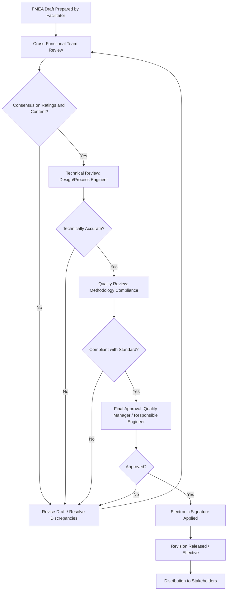

## Sign Off and Approval Workflows

### Overview

Sign off and approval workflows are the structured processes by which an FMEA (and its subsequent revisions) receives formal authorization from responsible stakeholders before it is considered released, effective, or officially updated. These workflows establish accountability, create a defensible audit trail, and ensure that no failure mode, rating, or corrective action becomes part of the official record without appropriate cross-functional review.

This discipline connects FMEA practice to the broader document control requirements found in quality management systems (IATF 16949, ISO 9001, ISO 13485, ISO 14971) and is typically one of the most heavily audited aspects of FMEA governance, since it demonstrates that risk assessments were not unilaterally authored but reviewed by the appropriate technical and quality functions.

---

### Purpose of Formal Sign Off

**Key Points**

- Prevents a single individual from unilaterally finalizing risk ratings or closing corrective actions without independent review.
- Creates a legally and contractually defensible record — particularly important in regulated industries (automotive safety-critical components, medical devices) where liability may hinge on demonstrating due diligence.
- Ensures cross-functional input (design, manufacturing, quality, reliability) is captured before the FMEA is treated as final, since failure modes and controls often span multiple disciplines.
- Provides a clear "point of truth": once signed off, a revision is the official current version until superseded, eliminating ambiguity about which draft is authoritative.

---

### Typical Roles in the Approval Chain

| Role | Responsibility |
| --- | --- |
| FMEA Facilitator/Moderator | Leads the FMEA session, ensures methodology is followed, compiles the draft for review |
| Design Engineer (for DFMEA) | Confirms failure modes, effects, and design controls are technically accurate |
| Process Engineer (for PFMEA) | Confirms process steps, causes, and process controls are technically accurate |
| Quality Engineer | Validates that rating scales and methodology align with applicable standards (AIAG & VDA, customer-specific requirements) |
| Reliability Engineer | Reviews severity/occurrence/detection logic against field and test data where available |
| Cross-functional team members | Contribute domain expertise (manufacturing, service, purchasing) during review, may co-sign |
| Quality Manager / Responsible Engineer | Final approval authority, accountable for the document's release |
| Customer representative (where required) | Some automotive OEM contracts require customer sign-off on supplier PFMEAs for safety-critical characteristics |

[Inference] The exact title and number of required approvers varies significantly by organization size, industry, and customer-specific requirements; the roles above represent commonly observed patterns rather than a universal mandate.

---

### Standard Approval Workflow Stages

---

### Electronic Signature Practices

Commercial FMEA and QMS platforms typically implement electronic signature as a core control, since role-based permissions and access control capabilities are a standard feature of enterprise FMEA tools, supporting notifications and approval workflows for closed-loop FMEAs.

**Key elements of a compliant electronic signature workflow:**

- **Unique user credentials**: Each approver has an individual login; shared credentials undermine the non-repudiation value of the signature.
- **Signature meaning binding**: The system records not just that a signature occurred, but what the signer was attesting to (e.g., "Approved as Technically Accurate" vs. "Approved for Release").
- **Timestamp and immutability**: Once signed, the associated content version is locked from further edits; any subsequent change requires a new revision and new signature cycle.
- **Audit trail retention**: The system retains a record of who signed, what was signed, and when, retrievable for the life of the record per retention policy.

[Unverified] Whether a given platform's electronic signature implementation satisfies specific regulatory frameworks (e.g., 21 CFR Part 11 for FDA-regulated environments, or EU Annex 11) depends on that platform's specific validation documentation and configuration; this should be confirmed against the vendor's compliance documentation and, where required, validated by the organization's own quality/regulatory function rather than assumed from general feature descriptions.

---

### Approval Workflow for Revisions vs. Initial Release

The rigor of the approval workflow often differs between the original FMEA release and subsequent revisions:

- **Initial release**: Typically requires the full cross-functional team review and sign-off chain, since the entire risk assessment is new and unvalidated.
- **Minor revision** (e.g., correcting a typo, clarifying wording without changing a rating): May follow an expedited approval path with a single reviewer, depending on organizational procedure.
- **Substantive revision** (e.g., new failure mode added, rating changed, control added/removed): Generally requires re-engaging the relevant technical reviewers, since a rating change can shift the calculated risk priority and downstream action requirements.
- **Emergency/safety-driven revision** (e.g., triggered by a recall or field safety issue): May follow an accelerated but still fully documented approval path, often with additional executive or safety-board sign-off layers not present in routine revisions.

---

### Example: Multi-Level Approval Configuration in an FMEA Tool

A typical configuration within a commercial FMEA platform's workflow engine might define approval stages as follows:

1. **Stage 1 — Technical Review**: Assigned automatically to the Design or Process Engineer of record when a line item's rating changes by more than a defined threshold.
2. **Stage 2 — Quality Review**: Triggered upon Stage 1 completion; assigned to the Quality Engineer role to confirm rating scale and methodology compliance.
3. **Stage 3 — Final Approval**: Triggered upon Stage 2 completion; assigned to the Responsible Engineer or Quality Manager, who applies the final electronic signature and releases the new revision.

Each stage typically generates automated notifications to the assigned approver, with escalation rules (e.g., reminder after 3 business days, escalation to a manager after 7) to prevent approvals from stalling indefinitely.

---

### Common Weaknesses in Approval Workflow Design

- **Rubber-stamping**: Approvers sign off without substantive review, often due to workload or unclear expectations of what "approval" is meant to verify — undermines the entire purpose of the control.
- **Bottlenecked single approver**: Relying on one individual for final sign-off creates a single point of failure that can delay releases when that person is unavailable.
- **Ambiguous approval scope**: Approvers unclear on whether they are attesting to technical accuracy, methodology compliance, or business acceptance of risk, leading to inconsistent review depth.
- **Missing re-approval triggers**: Systems that do not automatically require re-approval when a rating changes post-signature, allowing "silent" edits to bypass the workflow.
- **Approval without traceability to trigger**: Sign-off occurs without linkage to the specific change request, complaint, or ECO that prompted the revision, weakening audit defensibility.

---

### Approval Workflow and Audit Readiness

Auditors reviewing FMEA practice commonly request evidence of:

- A complete, unbroken chain of approvals for the current revision and prior revisions.
- Named individuals (not generic roles) tied to each signature, with dates.
- Consistency between the revision history log and the actual approval records (no gaps or out-of-sequence approvals).
- Evidence that approval occurred before the revision was distributed or acted upon, not retroactively.

$$\text{Audit Readiness Score} \propto \frac{\text{Fully Documented Approvals}}{\text{Total Revisions Issued}}$$

[Inference] The formula above is a conceptual illustration rather than a standardized industry metric; it is intended to convey that audit confidence scales with the completeness of the approval record relative to the total number of revisions, not a formal calculation prescribed by any specific standard.

---

**Related Topics**

- Document control system design and electronic document management (EDMS) integration
- 21 CFR Part 11 and Annex 11 electronic signature compliance requirements
- Cross-functional team composition and RACI matrices for FMEA governance
- Engineering Change Order (ECO) approval workflows and their linkage to FMEA sign-off
- Customer-specific requirements (CSRs) affecting supplier FMEA approval chains in automotive
- Escalation and notification design in workflow automation systems
- Audit preparation: reconstructing historical approval trails for regulatory inspection