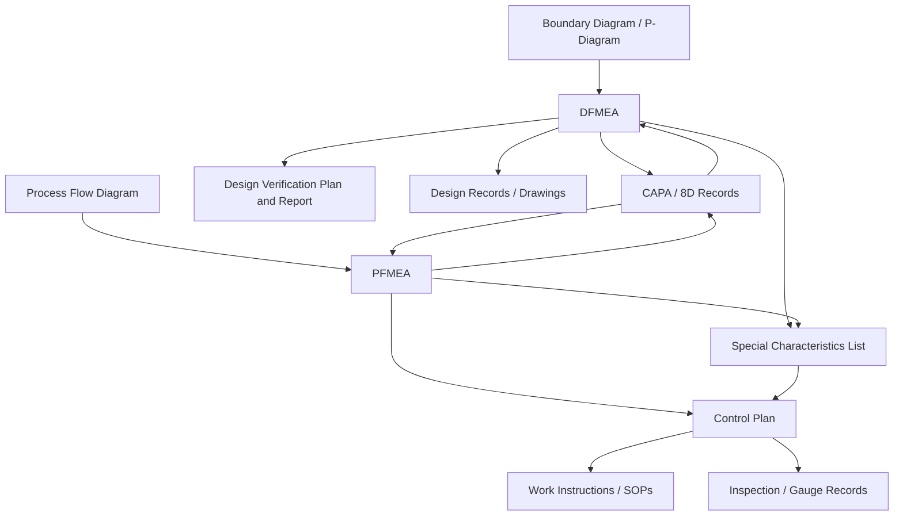

## Linking FMEA Records to Other Quality Documents

### Overview

Linking FMEA records to other quality documents refers to establishing traceable, bidirectional connections between individual FMEA line items (failure modes, causes, controls) and the broader ecosystem of documents that govern design, manufacturing, and quality within an organization. Rather than existing as an isolated risk-assessment artifact, a well-integrated FMEA functions as a hub that both informs and is informed by control plans, process flow diagrams, work instructions, CAPA records, and design verification documentation.

This linkage is what transforms FMEA from a compliance checkbox into an operationally useful risk-management tool, and it is a core expectation of the AIAG & VDA FMEA Handbook's emphasis on FMEA as a connected, living element of the broader quality system rather than a standalone worksheet.

---

### Why Document Linkage Matters

**Key Points**

- A failure mode's detection control is meaningless unless it is reflected in the actual control plan and work instructions the operator follows on the floor.
- Without traceable linkage, a change to one document (e.g., a control plan revision) can silently diverge from the FMEA that originally justified it, creating inconsistency that auditors specifically look for.
- Linkage enables root-cause investigations (CAPA, 8D) to quickly reference whether a failure mode was previously identified and assessed, informing whether the gap was a detection failure, an unanticipated failure mode, or an accepted risk that materialized.
- Regulatory and customer audits frequently trace a single nonconformance backward through this document chain to verify the quality system functioned as an integrated whole, not as disconnected paperwork.

---

### Core Document Relationships

#### FMEA ↔ Control Plan

The control plan is typically the most direct downstream consumer of PFMEA content. Each detection or prevention control identified in the PFMEA for a given failure mode should have a corresponding entry in the control plan specifying the control method, sample size, frequency, and reaction plan.

- **Forward linkage**: PFMEA identifies a control is needed → Control Plan documents how it is executed.
- **Backward linkage**: A control plan change (e.g., inspection frequency reduced) should trigger review of whether the originating PFMEA's detection rating remains valid.

#### FMEA ↔ Process Flow Diagram (PFD)

The Process Flow Diagram typically precedes and structurally anchors the PFMEA — each process step in the PFD becomes a row or section in the PFMEA, ensuring no process step is omitted from risk assessment.

- Process step numbering in the PFD is generally mirrored in the PFMEA to allow direct cross-referencing.

#### FMEA ↔ Design Verification Plan and Report (DVP&R)

For DFMEA, design controls identified as prevention or detection mechanisms should correspond to specific verification or validation activities documented in the DVP&R.

- Relyence FMEA, for example, explicitly supports DVP&R as a linked module alongside DFMEA within its platform architecture, reflecting this relationship as a standard tool feature rather than an ad hoc practice.

#### FMEA ↔ CAPA / 8D Records

When a failure mode identified in the FMEA actually occurs (or an unanticipated failure mode is discovered), the resulting corrective action record should reference the specific FMEA line item.

- If the failure mode was previously identified: the CAPA should reference why the existing control failed (detection escape) and trigger a rating/control update in the FMEA.
- If the failure mode was not previously identified: the CAPA should trigger addition of a new failure mode to the FMEA, closing the gap for future analyses.

#### FMEA ↔ Work Instructions / Standard Operating Procedures

Operator-facing instructions should reflect any process controls the PFMEA identifies as critical to failure prevention or detection, ensuring the documented control actually reaches the point of execution.

#### FMEA ↔ Boundary Diagrams and P-Diagrams

These upstream analysis tools frame the system boundaries and input/output relationships that inform which failure modes are considered in scope for the DFMEA, and are commonly supported as linked modules within commercial FMEA platforms.

---

### Document Relationship Map

---

### Special Characteristics as a Linking Mechanism

Special characteristics (critical, significant, key, or safety characteristics depending on customer nomenclature) function as a formal cross-reference point across multiple documents:

1. Identified during DFMEA/PFMEA as high-risk items requiring special controls.
2. Flagged on engineering drawings.
3. Carried into the Control Plan with designated symbols.
4. Reflected in inspection and measurement system analysis (MSA) records.
5. Often required to be traceable in the Production Part Approval Process (PPAP) submission package.

This creates a standardized identifier (a specific characteristic symbol or code) that ties the same risk item across five or more separate documents without requiring free-text cross-referencing.

---

### Technical Implementation Approaches

#### Manual Cross-Referencing

- Documents reference each other by file name, revision number, or line-item number in text (e.g., "See PFMEA line item 14").
- **Limitations**: No enforcement mechanism; references become stale when either document is revised independently, and there is no automated alert when a linked document changes.

#### Shared Identifier Systems

- A common numbering scheme (e.g., process step number, characteristic ID) is used consistently across the PFD, PFMEA, and Control Plan, allowing manual but reliable cross-document navigation.
- Commonly implemented via spreadsheet templates with matching column structures across documents.

#### Database-Driven Relational Linkage

- Commercial FMEA platforms store the FMEA, control plan, and related analyses as related database records rather than separate files, enabling genuine bidirectional traceability: a change to a failure mode's rating can automatically flag the linked control plan entry for review.
- The Relyence platform architecture illustrates this pattern: modules pass data across each other so an FMEA can feed a fault tree or an RCM worksheet without re-keying, reflecting a shared underlying data model rather than document-level file linking.
- PLM-integrated tools (PTC Windchill FMEA, Siemens Teamcenter Quality FMEA) extend this further by linking FMEA records directly to CAD-level part and revision objects, so an engineering change to a part automatically surfaces the FMEA records that reference it.

[Inference] Database-driven relational linkage is generally considered the most robust approach for maintaining traceability at scale, since it removes reliance on manual discipline to keep cross-references current; the tradeoff is higher implementation and licensing cost and dependency on a single vendor's data model.

---

### Example: Tracing a Single Failure Mode Across Documents

Consider a PFMEA line item identifying "seal misalignment during automated assembly" as a failure mode with an unacceptable Action Priority.

| Document | Linkage |
| --- | --- |
| Process Flow Diagram | Process step 40, "Automated Seal Placement," where the failure mode occurs |
| PFMEA | Failure mode row: cause = "fixture wear," control = "vision system inspection" |
| Control Plan | Entry for process step 40: control method = "100% vision inspection," reaction plan = "stop line, quarantine parts" |
| Work Instruction | WI-40, updated to specify vision system calibration check at shift start |
| Special Characteristics List | Seal position flagged as a significant characteristic, symbol carried to the drawing |
| CAPA Record | CAPA #2026-114, opened after a field complaint traced back to this failure mode, referencing PFMEA line item 40-2 |
| PPAP Package | Control plan and characteristic documentation submitted as part of Element 4 (control plan) |

This chain demonstrates how a single failure mode's risk assessment propagates through six or more distinct document types, each maintained by different owners but tied together by consistent references.

---

### Governance Practices for Maintaining Linkage Integrity

- **Change impact assessment**: Whenever any linked document (control plan, work instruction, drawing) is revised, a defined process should assess whether the FMEA requires corresponding review — not merely rely on someone remembering to check.
- **Consistent identifier schemes**: Process step numbers, failure mode IDs, and characteristic symbols should remain stable across documents and revisions to preserve traceability even when using manual or semi-automated linkage methods.
- **Periodic cross-document audits**: Independent of individual change triggers, periodic checks (e.g., during internal audits) should verify that FMEA content, control plans, and work instructions remain mutually consistent.
- **Single source of truth designation**: For each type of information (e.g., current detection method), one document should be designated authoritative, with others referencing rather than duplicating it, reducing the risk of contradictory information across the document set.

---

### Common Failure Points

- **Divergent revisions**: The control plan is updated to reflect a process change, but the PFMEA that justified the original control is never revisited, leaving the documented risk rationale out of date.
- **Orphaned characteristics**: A special characteristic is added to a drawing but never propagated back to the FMEA or control plan, leaving a gap in the risk-to-control chain.
- **CAPA/FMEA disconnection**: Corrective actions close out nonconformances without updating the FMEA, so the same undetected failure mode risk persists for future production or new product introductions.
- **Tool fragmentation**: PFD, FMEA, and Control Plan maintained in separate, non-integrated tools (e.g., separate spreadsheets by different owners), making relational integrity dependent entirely on manual diligence.

---

**Related Topics**

- Control Plan structure and its relationship to PFMEA detection controls
- Special Characteristics identification and cross-document symbol standards
- Production Part Approval Process (PPAP) documentation packages
- Design Verification Plan and Report (DVP&R) development
- CAPA and 8D problem-solving methodology integration with risk documents
- PLM (Product Lifecycle Management) data architecture for quality traceability
- Boundary Diagrams and P-Diagrams as DFMEA scoping tools