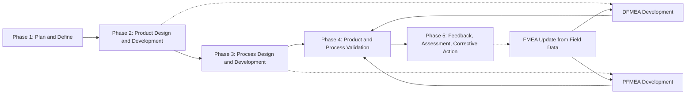

## FMEA within Advanced Product Quality Planning

### Overview

Advanced Product Quality Planning (APQP) is a structured, phase-gated framework used primarily in the automotive industry (formalized by AIAG) to plan and develop new products and processes with the goal of ensuring customer satisfaction from the earliest design stages through production launch. FMEA is embedded within APQP as one of its core risk-management tools, occurring at specific phases to identify and mitigate potential failures in both the product design and the manufacturing process before they reach the customer.

FMEA is not a standalone activity within APQP; it is a required input to, and output from, multiple other APQP deliverables, meaning its timing, content, and outputs are structurally dictated by the phase of the APQP cycle in which it occurs.

---

### The Five Phases of APQP and FMEA's Role

**Key Points**

- APQP is typically organized into five phases: Plan and Define, Product Design and Development, Process Design and Development, Product and Process Validation, and Feedback/Assessment/Corrective Action.
- DFMEA is developed primarily during the Product Design and Development phase.
- PFMEA is developed primarily during the Process Design and Development phase.
- Both FMEAs are expected to be substantially complete and reviewed before the Product and Process Validation phase, since validation activities are meant to confirm that identified risks have been adequately controlled.

---

### Phase 1: Plan and Define

- **Primary FMEA activity**: Minimal direct FMEA work occurs here, but this phase establishes the customer requirements, voice-of-customer inputs, and preliminary reliability/quality goals that will later inform severity ratings in the DFMEA.
- **Key inputs affecting later FMEA**: Customer specifications, warranty/field history from similar prior products, benchmarking data on known failure modes from comparable designs.

### Phase 2: Product Design and Development

- **Primary FMEA activity**: DFMEA is developed here, typically alongside the Design Failure Mode boundary diagrams, P-Diagrams, and Design Verification Plan and Report (DVP&R).
- **Purpose within phase**: Identify potential failure modes in the product design itself (material failure, geometric interference, tolerance stack-up issues) before tooling and process decisions are finalized, since design-stage changes are significantly less costly than changes discovered later.
- **Key outputs feeding forward**: Special characteristics identified in the DFMEA are carried into drawings and eventually into the Process Flow Diagram and PFMEA as items requiring specific process controls.

### Phase 3: Process Design and Development

- **Primary FMEA activity**: PFMEA is developed here, following the Process Flow Diagram and feeding directly into the Control Plan.
- **Purpose within phase**: Identify potential failure modes in the manufacturing and assembly process — not the product design itself — such as equipment malfunction, operator error, fixture wear, or environmental contamination during production.
- **Key outputs feeding forward**: Process controls identified in the PFMEA populate the Control Plan; special characteristics from the DFMEA must be reconciled with and addressed by corresponding PFMEA controls.

### Phase 4: Product and Process Validation

- **Primary FMEA activity**: FMEA is not newly created here but is validated — the Control Plan and DVP&R activities executed in this phase should demonstrate that the controls identified in the DFMEA and PFMEA actually function as intended, often through pilot runs, capability studies, and measurement systems analysis.
- **Purpose within phase**: Confirm that the risk mitigation strategies designed on paper hold up under real production and testing conditions; discrepancies here typically trigger FMEA revision before full production launch (PPAP submission).

### Phase 5: Feedback, Assessment, and Corrective Action

- **Primary FMEA activity**: Field and production data (warranty claims, customer complaints, scrap/rework trends) are fed back into both DFMEA and PFMEA to update ratings and identify previously unanticipated failure modes.
- **Purpose within phase**: This closes the loop, making FMEA a living document (see prior chapter section on Revision History and Living Document Practices) rather than a one-time deliverable, and directly supports continuous improvement for current and future programs.

---

### APQP Deliverables Directly Dependent on FMEA Output

| APQP Deliverable | FMEA Dependency |
| --- | --- |
| Design Verification Plan and Report (DVP&R) | Validates design controls identified in DFMEA |
| Process Flow Diagram | Provides structural input to PFMEA; special characteristics loop back from DFMEA |
| Control Plan | Directly populated by PFMEA-identified process controls and detection methods |
| Special Characteristics List | Jointly derived from DFMEA and PFMEA risk assessments |
| Measurement Systems Analysis (MSA) Plan | Informed by detection controls and gauges identified in PFMEA |
| Process Capability Studies | Target processes/characteristics identified as high risk in PFMEA |
| PPAP Submission Package | Requires evidence that DFMEA/PFMEA were completed and controls validated |

---

### FMEA Timing Relative to Program Milestones

A critical APQP principle is that FMEA work must precede, not follow, key design and tooling commitment decisions:

- DFMEA should be substantially developed before design freeze, since identified failure modes may require design changes that become prohibitively expensive after tooling is committed.
- PFMEA should be substantially developed before process/tooling finalization and before the pilot production run, since process-related failure modes may require equipment, fixture, or layout changes.
- Both should be reviewed and updated based on pilot run and validation results before the Production Part Approval Process (PPAP) submission, since PPAP is meant to demonstrate that the production process reliably produces parts meeting all specifications, including those flagged as special characteristics by the FMEA process.

[Inference] Organizations that develop FMEA late (e.g., after tooling is already committed) are generally understood within quality engineering practice to lose much of FMEA's preventive value, since the primary benefit of FMEA is influencing design and process decisions before they become costly to change; this is a widely cited rationale in APQP training material rather than a directly measurable universal law.

---

### Cross-Functional Team Alignment within APQP

FMEA development within APQP is expected to involve the same cross-functional structure that governs the broader APQP process:

- Design engineering (for DFMEA content accuracy)
- Manufacturing/process engineering (for PFMEA content accuracy)
- Quality engineering (for rating methodology and special characteristic designation)
- Reliability engineering (where available, for severity and occurrence rating calibration against field/test data)
- Purchasing/supplier quality (where the FMEA scope includes purchased components or supplier processes)
- Customer representatives, in cases where customer-specific requirements mandate their participation or review

This mirrors the sign-off and approval structure discussed in the prior chapter section, since APQP milestone reviews (often called "gate reviews" or "phase-gate reviews") typically require documented FMEA completion and cross-functional sign-off as an exit criterion for advancing to the next phase.

---

### Example: APQP Timing for a New Automotive Component Program

A supplier developing a new sensor bracket assembly for an automotive OEM might structure FMEA activity as follows:

1. **Phase 1 (Quote/Program Award)**: Preliminary risk review using historical failure data from similar bracket designs to inform the quote and initial feasibility assessment.
2. **Phase 2 (Design)**: DFMEA developed alongside the boundary diagram and P-Diagram; special characteristics (e.g., a critical mounting hole tolerance) identified and flagged on drawings.
3. **Phase 3 (Process Design)**: PFMEA developed following the process flow diagram for stamping, welding, and inspection operations; control plan populated with the vision inspection control identified for the critical mounting hole.
4. **Phase 4 (Validation)**: Pilot run executed; capability study confirms the mounting hole tolerance is controlled within specification, validating the PFMEA's detection control; any gaps trigger PFMEA revision before PPAP submission.
5. **Phase 5 (Launch and Feedback)**: Post-launch warranty data monitored; any unanticipated failure mode (e.g., bracket fatigue cracking under field vibration not previously modeled) triggers DFMEA revision and informs the next-generation program's Phase 1 risk review.

---

### Common Pitfalls in FMEA-APQP Integration

- **Sequencing failure**: PFMEA started only after process/tooling decisions are already locked in, reducing it to a documentation exercise rather than a genuine risk-mitigation input.
- **Disconnected DFMEA and PFMEA**: Special characteristics identified in the DFMEA are not properly reconciled with PFMEA process controls, leaving a gap between what the design assumes is controlled and what the process actually controls.
- **Gate review rubber-stamping**: FMEA completion is checked as a binary "done/not done" box at phase-gate reviews without substantive technical review of content quality.
- **Feedback loop neglect**: Phase 5 field data is collected but never systematically fed back into the DFMEA/PFMEA for the current or future programs, losing the continuous-improvement value APQP is designed to capture.

---

**Related Topics**

- Control Plan development and its direct dependency on PFMEA outputs
- Production Part Approval Process (PPAP) documentation requirements
- Design Verification Plan and Report (DVP&R) structure and execution
- Special Characteristics identification and cross-document propagation
- Phase-gate review governance and exit criteria design
- Measurement Systems Analysis (MSA) planning informed by PFMEA detection controls
- Supplier quality management and FMEA requirements in customer-specific requirements (CSRs)