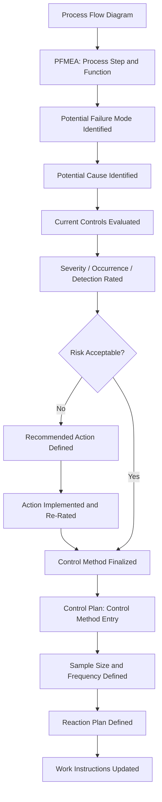

## Relationship to Control Plans

### Overview

The Control Plan is a structured document that describes the systems and processes required to control product and process characteristics, and it is one of the most direct and tightly coupled downstream outputs of the PFMEA within the quality system. Where the PFMEA identifies *what* can fail and *why*, and evaluates the risk of each failure mode, the Control Plan specifies *how* that risk is actually managed on the production floor — the specific method, frequency, sample size, and reaction plan for each control. This relationship is one of the most heavily audited linkages in automotive and manufacturing quality systems, since a disconnect between the two documents indicates that identified risks may not actually be controlled in practice.

---

### Structural Correspondence Between PFMEA and Control Plan

**Key Points**

- Each significant process step and characteristic addressed in the PFMEA should have a corresponding line in the Control Plan.
- The Control Plan does not repeat the full risk analysis (severity, occurrence, detection ratings) — it operationalizes the specific control identified as necessary based on that analysis.
- Both documents typically share the same process step numbering, inherited from the Process Flow Diagram, so that a reviewer can move between the three documents using a consistent reference.
- The Control Plan is expected to evolve across the same three stages as the broader APQP process: Prototype, Pre-Launch, and Production, with increasing rigor at each stage.

---

### Mapping PFMEA Elements to Control Plan Elements

| PFMEA Element | Corresponding Control Plan Element |
| --- | --- |
| Process step / function | Process step (same numbering) |
| Potential failure mode | (Not directly repeated; implied by the characteristic being controlled) |
| Potential cause of failure | Process/machine/material/method variable being controlled |
| Current process control (prevention) | Control method — prevention side |
| Current process control (detection) | Control method — detection side, including gauge/method used |
| Detection rating | Sample size and frequency of the control |
| Special characteristic designation | Special characteristic symbol carried onto the Control Plan |
| Recommended action (if risk unacceptable) | New or revised control method once implemented |
| Action Priority / RPN | Informs the rigor (frequency, sample size) of the corresponding control |

---

### Data Flow from PFMEA to Control Plan

---

### Reaction Plans: The Control Plan's Distinct Contribution

A key element present in the Control Plan but not typically detailed within the PFMEA itself is the **reaction plan** — the specific, actionable steps an operator or process owner must take when a control indicates a characteristic is out of specification or a control has failed.

- The PFMEA identifies that detection is necessary and assigns a detection rating based on the *effectiveness* of the planned control.
- The Control Plan specifies what happens *after* detection: containment of suspect product, escalation to whom, and corrective steps before resuming production.

**Example**

For a PFMEA failure mode of "seal misalignment during automated assembly" with a vision-system detection control:

- **PFMEA detection rating**: Reflects the likelihood the vision system catches a misaligned seal before the part proceeds downstream.
- **Control Plan reaction plan**: "Stop line, quarantine all parts produced since last verified good check, notify shift supervisor, perform 100% re-inspection of quarantined lot before resuming production."

This reaction plan does not appear in the PFMEA's rating logic but is essential for the control to function as intended.

---

### Why Detection Ratings Should Drive Control Plan Rigor

The detection rating assigned in the PFMEA is meant to reflect the actual capability of the control method that will be specified in the Control Plan — creating a logical dependency that should not be broken:

- A PFMEA detection rating assuming 100% automated inspection is only valid if the Control Plan actually specifies 100% inspection frequency, not a reduced sampling rate.
- If the Control Plan is later revised to reduce inspection frequency (e.g., for cost or cycle-time reasons) without revisiting the PFMEA, the original detection rating becomes invalid and the calculated risk priority is no longer accurate.

[Inference] This dependency is widely treated as a core integrity requirement of FMEA-driven quality systems — a Control Plan change that isn't reflected back in the PFMEA effectively invalidates part of the original risk assessment, even though the FMEA document itself remains unchanged and may appear current to a casual reviewer.

---

### Special Characteristics as the Formal Bridge

Special characteristics (critical, significant, key, or safety characteristics, depending on customer terminology) serve as the standardized identifier connecting PFMEA risk findings to Control Plan rigor:

1. A characteristic identified as high-risk in the PFMEA (typically high severity combined with elevated occurrence/detection concerns) is flagged as a special characteristic.
2. The special characteristic symbol is carried onto engineering drawings.
3. The Control Plan applies elevated control rigor (tighter sample size, higher frequency, statistical process control) specifically to characteristics bearing this designation.
4. Measurement Systems Analysis (MSA) is typically required for gauges used to control special characteristics, adding a further linked document.

This mechanism ensures Control Plan rigor is proportional to PFMEA-assessed risk without requiring the Control Plan to reproduce the full rating rationale.

---

### Control Plan Stages Relative to FMEA Development

| Control Plan Stage | Typical Timing | Relationship to FMEA |
| --- | --- | --- |
| Prototype | Early design/process development | May precede a fully mature PFMEA; controls are preliminary |
| Pre-Launch | After process design, before full production | Should reflect a substantially complete PFMEA, incorporating pilot-run findings |
| Production | Ongoing serial production | Should reflect the fully validated PFMEA, including any revisions from validation-phase findings |

Each stage transition is an appropriate trigger to verify that the Control Plan and PFMEA remain synchronized, particularly as pilot-run and validation data may drive PFMEA rating revisions that the Control Plan has not yet incorporated.

---

### Common Points of Divergence

- **Frequency mismatch**: PFMEA assumes a certain inspection frequency for its detection rating, but the Control Plan specifies a different (often reduced) frequency, typically due to a later cost or cycle-time optimization that was not fed back into the FMEA.
- **Missing reaction plans**: A Control Plan entry exists with a control method but lacks a defined reaction plan, leaving ambiguity in how detected nonconformances are actually handled.
- **Orphaned special characteristics**: A characteristic is flagged special on the drawing or PFMEA but the Control Plan does not apply the elevated control rigor the designation implies.
- **Stale synchronization**: The PFMEA is revised (new failure mode, changed rating) following field feedback, but the Control Plan is not updated to reflect any resulting control changes, breaking the intended traceability.
- **Gauge/method inconsistency**: The Control Plan specifies a measurement method or gauge that does not match what was assumed when the PFMEA detection rating was assigned.

---

### Governance Practices for Maintaining Synchronization

- **Joint review**: PFMEA and Control Plan revisions should be reviewed together, ideally by the same cross-functional team, rather than treated as independently owned documents.
- **Consistent process step numbering**: Maintaining identical step numbering across the Process Flow Diagram, PFMEA, and Control Plan preserves traceability even in manual, non-database-driven environments.
- **Change trigger propagation**: Any trigger that requires PFMEA revision (see prior chapter section on Revision History and Living Document Practices) should be defined to also require Control Plan review, and vice versa.
- **Database-driven linkage**: Commercial FMEA platforms that support Control Plans as a linked module (as referenced in the Commercial FMEA Software Platforms section) allow control method data to be shared or cross-referenced directly between the PFMEA and Control Plan records, reducing the risk of manual synchronization failure.

---

**Related Topics**

- Special Characteristics identification and symbol standardization across documents
- Reaction plan design and escalation procedures for out-of-control conditions
- Measurement Systems Analysis (MSA) requirements for special characteristic gauges
- Process Flow Diagram structure and its role as the shared numbering backbone
- Statistical Process Control (SPC) implementation for high-risk characteristics
- Production Part Approval Process (PPAP) Control Plan submission requirements
- Revision history and living document practices (cross-document synchronization)