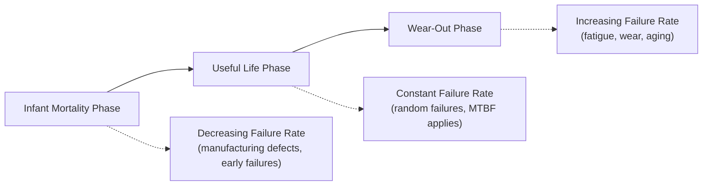
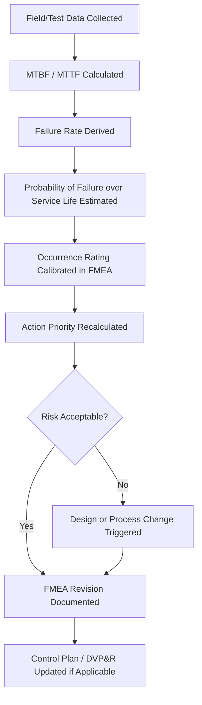

## Reliability Metrics MTBF and MTTF

### Overview

MTBF (Mean Time Between Failures) and MTTF (Mean Time To Failure) are quantitative reliability metrics that express the expected operating time of a system or component before failure occurs. Within FMEA practice, these metrics serve as an important bridge between qualitative risk assessment (severity, occurrence, detection ratings) and quantitative reliability engineering — providing empirical or predicted data that can calibrate occurrence ratings, validate design decisions, and support field-failure trend analysis that feeds back into living FMEA documents.

While FMEA itself is fundamentally a qualitative/semi-quantitative risk prioritization tool, MTBF and MTTF bring statistical rigor to the occurrence dimension of risk, and are commonly generated by dedicated reliability prediction modules within commercial reliability software suites (such as those referenced in the Commercial FMEA Software Platforms section) that sit alongside FMEA modules.

---

### Defining MTTF and MTBF

**MTTF (Mean Time To Failure)** applies to **non-repairable** items — components or systems that are discarded or replaced (not repaired) upon failure. It represents the average time until the first (and only) failure.

$$\text{MTTF} = \frac{\text{Total Operating Time of All Units}}{\text{Number of Units}}$$

**MTBF (Mean Time Between Failures)** applies to **repairable** systems — systems that are restored to operation after a failure. It represents the average time between successive failures over the system's operating life.

$$\text{MTBF} = \frac{\text{Total Operating Time}}{\text{Number of Failures}}$$

**Key Points**

- MTTF is used for items like light bulbs, bearings, or single-use components that are replaced, not repaired, upon failure.
- MTBF is used for repairable systems like a production line, a vehicle, or a piece of industrial equipment that continues operating after maintenance or repair.
- Both metrics describe an *average*, not a guarantee — individual units may fail significantly earlier or later than the mean.
- Neither metric alone describes the *shape* of the failure distribution (e.g., whether failures cluster early, randomly, or late in life), which is why they are often supplemented with reliability distribution modeling (such as Weibull analysis) for deeper analysis.

---

### Mathematical Relationship to Failure Rate

For a system exhibiting a constant failure rate (typically assumed during the "useful life" phase of the bathtub curve, following the exponential distribution), MTBF and failure rate are reciprocals:

$$\text{MTBF} = \frac{1}{\lambda}$$

Where $\lambda$ is the failure rate (failures per unit time).

[Inference] This reciprocal relationship strictly holds only under the assumption of a constant failure rate (exponential distribution); it does not hold during infant mortality or wear-out phases where the failure rate itself changes over time, which is a standard caveat in reliability engineering rather than a claim specific to any single methodology.

---

### The Bathtub Curve and Its Relevance to FMEA Occurrence Ratings

The bathtub curve illustrates that failure rate is generally not constant across a product's life, which has direct implications for FMEA occurrence ratings: an occurrence rating calibrated against field MTBF data collected during the useful-life phase may understate risk for failure modes that are actually wear-out-driven and will increase in frequency later in the product's service life.

---

### How MTBF/MTTF Data Informs FMEA Occurrence Ratings

**Key Points**

- Occurrence ratings in a DFMEA or PFMEA are ideally anchored to actual field or test data rather than purely subjective team judgment; MTBF/MTTF figures from similar prior designs or components provide this anchor.
- When component-level MTTF/MTBF data exists (e.g., from supplier reliability data or internal test data), it can be converted into an estimated probability of failure over the product's intended service life, which maps to the occurrence rating scale.
- The AIAG & VDA occurrence rating tables typically define ranges in terms of failure rate or failures-per-vehicle/failures-per-thousand, which corresponds directly to the inverse of MTBF over a defined operating period.

**Example**

If a component has a demonstrated MTBF of 50,000 hours and the product's intended field life is 5,000 hours, the approximate probability of failure within the service life (assuming constant failure rate) is:

P(\text{failure}) \approx 1 - e^{-t/\text{MTBF}} = 1 - e^{-5000/50000} \approx 0.095 \text{ (approximately 9.5%)}

This calculated probability can then be mapped to the appropriate occurrence rating tier on the FMEA's rating scale (e.g., AIAG & VDA's 1–10 occurrence scale), replacing a purely subjective estimate with a data-derived one.

[Inference] This mapping approach is a widely used practice in reliability-mature organizations to reduce subjectivity in occurrence ratings, though the specific occurrence scale thresholds used to bucket a calculated probability into a 1–10 rating are organization- or standard-specific and should be confirmed against the applicable FMEA handbook or customer-specific requirement in use.

---

### Sources of MTBF/MTTF Data for FMEA Use

| Source | Characteristics |
| --- | --- |
| Field warranty/service data | Most representative of actual use conditions; requires sufficient field population and time to accumulate |
| Accelerated life testing (ALT) | Faster to obtain; requires extrapolation models (e.g., Arrhenius) to translate accelerated conditions to normal-use life |
| Supplier-provided reliability data | Convenient but should be validated against the specific application's use conditions, which may differ from the supplier's test conditions |
| Reliability prediction standards (e.g., MIL-HDBK-217, Telcordia, IEC 61709, SN 29500) | Used when empirical data is unavailable, particularly for electronic components; provides estimated failure rates based on component type, stress factors, and environment |
| Historical data from similar prior designs | Common in automotive/industrial FMEA practice when the current design shares significant commonality with a predecessor |

Reliability engineering suites referenced earlier (e.g., ReliaSoft, Relyence Studio) typically include dedicated Reliability Prediction modules supporting standards such as MIL-HDBK-217, Telcordia, 217Plus, SN 29500, IEC 61709, and NPRD/EPRD databases, allowing predicted MTBF/MTTF figures to be generated and then referenced when calibrating FMEA occurrence ratings within the same platform.

---

### Limitations of MTBF/MTTF as FMEA Inputs

- **Average masks distribution**: A high MTBF does not preclude early failures if the failure distribution is not exponential (e.g., a bimodal distribution with a subset of defective units failing early); relying solely on MTBF may understate near-term risk.
- **Field data lag**: Field MTBF data is only available after sufficient product exposure, making it inherently a lagging indicator relative to the FMEA's ideal role as a preventive, pre-launch tool — reinforcing the importance of the living-document feedback loop discussed in prior chapter sections.
- **Constant failure rate assumption**: Applying MTBF-derived occurrence ratings without considering where the product sits on the bathtub curve can misstate risk for wear-out-dominated failure modes.
- **Aggregation risk**: System-level MTBF does not directly indicate which specific failure mode is driving the failure rate, requiring failure mode-level data (not just system-level) to be genuinely useful for occurrence rating calibration at the individual FMEA line-item level.
- **Use-condition mismatch**: Data collected under one operating environment (e.g., a supplier's bench test) may not transfer validly to the field-use conditions the FMEA is actually assessing.

---

### MTBF/MTTF in the Broader Reliability-FMEA Feedback Loop

---

### Distinguishing MTBF/MTTF from FMEA's Own Occurrence Scale

It is a common point of confusion that FMEA occurrence ratings (typically a 1–10 ordinal scale) are themselves a form of reliability metric equivalent to MTBF. They are related but distinct:

- MTBF/MTTF are continuous, quantitative time-based measures derived from data.
- FMEA occurrence ratings are ordinal categories (often mapped to failure rate ranges) used specifically to prioritize risk within the FMEA's structured worksheet format.
- The occurrence rating is, ideally, *informed by* MTBF/MTTF data where available, but the rating itself is a simplification designed for cross-functional team consensus and risk prioritization, not a substitute for full reliability analysis.

[Inference] In organizations without mature reliability data pipelines, occurrence ratings are often assigned by team consensus/expert judgment rather than calculated from MTBF data; this is a commonly observed practical gap between the ideal (data-driven occurrence ratings) and common practice, though the extent of this gap varies significantly by industry maturity and is not something that can be universally quantified.

---

**Related Topics**

- Weibull analysis and failure distribution modeling beyond constant-failure-rate assumptions
- Reliability prediction standards (MIL-HDBK-217, Telcordia, IEC 61709, SN 29500)
- Accelerated Life Testing (ALT) methodology and extrapolation models
- Occurrence rating scale calibration using field and test data
- Bathtub curve analysis and its implications for warranty and service life planning
- Fault Tree Analysis (FTA) as a complementary quantitative reliability tool
- Reliability-Centered Maintenance (RCM) and its use of MTBF for maintenance interval planning