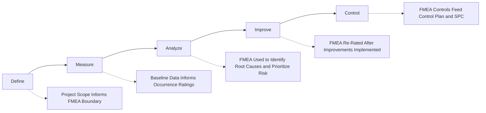
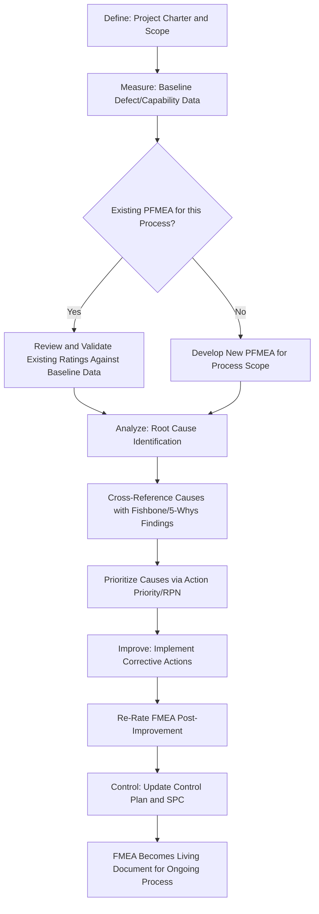

## Six Sigma and DMAIC Integration

### Overview

DMAIC (Define, Measure, Analyze, Improve, Control) is the core problem-solving framework of Six Sigma methodology, used to improve existing processes by systematically reducing variation and defects. FMEA integrates into DMAIC as a structured risk-identification tool that can be deployed at multiple phases of the cycle, most prominently during Analyze and Improve, but its use extends into Measure and Control as well. Unlike APQP (which governs new product/process development), DMAIC is typically applied to existing processes experiencing a known performance gap, meaning the FMEA's role within DMAIC is oriented toward diagnosing and mitigating risk in a process that already exists rather than designing risk out of a process from scratch.

---

### DMAIC Phases and FMEA's Role in Each

#### Define Phase

- **FMEA role**: Minimal direct FMEA activity, but the project charter and scope defined here establish the boundaries of what the eventual FMEA will assess (which process, which characteristics, which customer requirements are at stake).
- **Key connection**: The problem statement and Voice of the Customer (VOC) inputs gathered here inform which failure modes are likely to be prioritized as severity-relevant once the FMEA is developed.

#### Measure Phase

- **FMEA role**: Baseline process performance data collected here (defect rates, Cpk/Ppk capability indices, current failure frequency) provides empirical grounding for occurrence ratings once the FMEA is built or revisited.
- **Key connection**: If a PFMEA already exists for the process under study, Measure-phase data can be used to validate or correct its existing occurrence and detection ratings against actual performance, rather than relying on the original estimates from initial process design.

#### Analyze Phase

- **FMEA role**: This is typically where FMEA is most actively used within DMAIC. The team develops or reviews the PFMEA to systematically identify potential and actual causes of the defect/variation being studied, using it alongside complementary root-cause tools.
- **Complementary tools commonly paired with FMEA in this phase**: Fishbone/Ishikawa diagrams (to brainstorm candidate causes), 5 Whys (to drill into root cause depth), Pareto analysis (to prioritize which failure modes/causes account for the majority of defects), and statistical hypothesis testing (to confirm suspected causes are statistically significant).
- **Key connection**: The FMEA's Action Priority or RPN ranking helps the DMAIC team prioritize which root causes to address first in the Improve phase, particularly when multiple candidate causes have been identified.

#### Improve Phase

- **FMEA role**: As process changes are implemented (new controls, revised parameters, equipment changes, poka-yoke devices), the FMEA is updated to reflect the new state — occurrence and/or detection ratings are re-rated to demonstrate the quantified impact of the improvement.
- **Key connection**: The reduction in calculated risk priority (RPN or Action Priority) before-and-after the improvement provides a quantifiable justification for the project's effectiveness, often presented in the DMAIC project's final report.

#### Control Phase

- **FMEA role**: The finalized FMEA controls feed directly into the Control Plan (see prior chapter section on Relationship to Control Plans) and into Statistical Process Control (SPC) charting for characteristics identified as high-risk.
- **Key connection**: This phase closes the loop by ensuring the FMEA's identified controls are not just implemented but sustained — SPC control charts, control plan sign-off, and standard work updates all trace back to the FMEA's risk findings.

---

### FMEA as a Root Cause Analysis Tool within Analyze

A common practical integration point is using the PFMEA's "Potential Cause of Failure" column as a structured input to, or output from, more free-form root-cause brainstorming techniques used in Analyze:

1. **Fishbone diagram** generates candidate causes across categories (Man, Machine, Method, Material, Measurement, Environment).
2. Candidate causes are cross-referenced against the existing PFMEA to check whether they were previously identified, rated, and controlled.
3. **Newly identified causes** (not previously in the PFMEA) are added as new failure mode/cause line items, closing a gap in the original risk assessment.
4. **Previously identified causes with inadequate controls** (i.e., the FMEA correctly anticipated the cause but the control proved ineffective) are flagged for the detection or occurrence rating to be revised and a new corrective action initiated.

This reconciliation step is valuable because it distinguishes between two fundamentally different DMAIC findings: an unanticipated failure mode (a gap in the original risk assessment) versus an anticipated failure mode whose control failed in practice (a control effectiveness problem) — each implying a different type of corrective action.

---

### Quantifying Improve-Phase Impact via FMEA Re-Rating

**Example**

A DMAIC project targets a packaging line experiencing an elevated defect rate for mislabeled cartons.

| Metric | Before Improvement | After Improvement |
| --- | --- | --- |
| Failure mode | Mislabeled carton ships to customer | Mislabeled carton ships to customer |
| Occurrence rating | 6 (moderate, based on Measure-phase defect data) | 2 (reduced after implementing barcode verification) |
| Detection rating | 7 (manual visual check only) | 2 (automated barcode scan with line stop) |
| Severity rating | 8 (unchanged; customer impact severity doesn't change) | 8 (unchanged) |
| RPN (S×O×D) | 336 | 32 |

The re-rated FMEA after the Improve-phase change (adding automated barcode verification) demonstrates a substantial calculated risk reduction, which serves as both a technical justification for the change and a quantifiable metric for the DMAIC project's business case.

[Inference] Using RPN reduction as a project success metric is a common DMAIC practice, though it carries the same general limitations as RPN itself (the multiplicative scale can produce similar RPN values from very different risk profiles), so many practitioners supplement it with the direct defect-rate or Cpk improvement as the primary quantified result, with RPN reduction as a secondary, complementary metric.

---

### DMAIC-FMEA Integration Workflow

---

### Software and Tooling Integration

Several commercial platforms explicitly combine Six Sigma statistical tools with FMEA functionality, reflecting this integration as a standard product category rather than an ad hoc practice:

- **Minitab Engage** combines statistical analysis with dynamic FMEA capability, featuring a Control Plan Wizard that pulls directly from the PFMEA, and is described as widely used in Lean Six Sigma environments, offering intuitive integration for teams already using Minitab for statistical data analysis with visual dashboards.
- Other reliability/quality suites referenced in the Commercial FMEA Software Platforms section (Relyence, ReliaSoft) provide FMEA modules that can share data with capability analysis and statistical modules, though their primary orientation tends toward reliability engineering rather than DMAIC-specific tooling.

[Inference] The degree of native DMAIC-workflow support (e.g., built-in project charter templates, phase-gate tracking alongside FMEA) varies by platform; organizations should verify specific DMAIC-project-management features against current vendor documentation rather than assuming feature parity across all FMEA-capable tools.

---

### Distinguishing DMAIC-FMEA Use from APQP-FMEA Use

| Aspect | APQP Context | DMAIC Context |
| --- | --- | --- |
| Typical trigger | New product/process development | Existing process with a known performance gap |
| FMEA starting point | Built from scratch alongside new Process Flow Diagram | Often an existing FMEA reviewed/revised, or newly created for an established process |
| Primary phase of use | Product/Process Design and Development phases | Analyze and Improve phases |
| Success measure | Risk mitigated before launch | Quantified defect/variation reduction, often including RPN reduction |
| Document lifecycle | Feeds into PPAP and production launch documentation | Feeds into project closure report and updated Control Plan/SPC |

---

### Common Pitfalls in DMAIC-FMEA Integration

- **Treating FMEA as a checkbox deliverable**: Completing an FMEA solely because the DMAIC methodology template calls for it, without genuinely using it to prioritize root causes identified during Analyze.
- **Failing to re-rate after Improve**: Skipping the post-improvement FMEA update, losing the quantified evidence of risk reduction and leaving the FMEA out of sync with the now-improved process.
- **Disconnected root-cause tools**: Running Fishbone/5-Whys analysis in parallel with the FMEA without reconciling findings, leading to duplicated or contradictory cause identification across documents.
- **Ignoring existing FMEA history**: Starting a DMAIC project without reviewing whether a PFMEA already exists and has relevant historical data, duplicating analysis effort unnecessarily.
- **Control-phase drop-off**: Improve-phase FMEA updates are made but not propagated to the Control Plan or SPC charting, breaking the linkage discussed in the prior chapter section on Relationship to Control Plans.

---

**Related Topics**

- Fishbone/Ishikawa diagram and 5 Whys root cause analysis techniques
- Statistical Process Control (SPC) chart selection and implementation
- Process capability analysis (Cp, Cpk, Pp, Ppk) and its relationship to occurrence ratings
- Pareto analysis for failure mode and defect prioritization
- Lean Six Sigma project charter and DMAIC gate review structure
- Relationship to Control Plans (Control-phase FMEA output linkage)
- Design for Six Sigma (DFSS) and its relationship to DFMEA in new product development