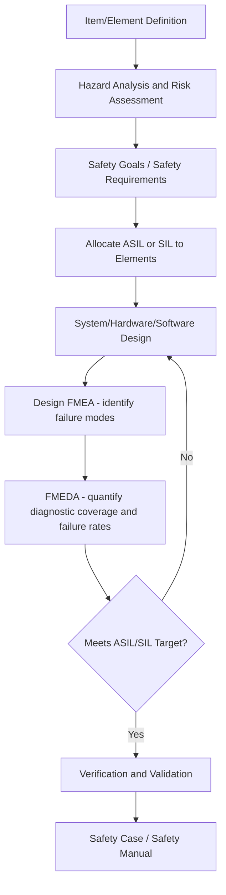
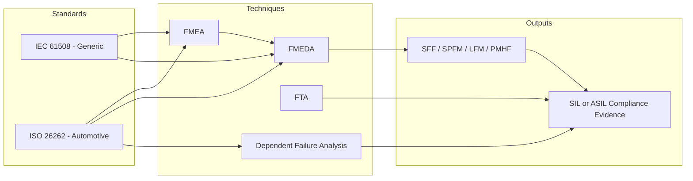

## Functional Safety Standards ISO 26262 and IEC 61508

### Overview

ISO 26262 and IEC 61508 are functional safety standards that govern how safety-related systems must be designed, verified, and maintained so that malfunctions do not result in unacceptable risk. Both standards embed Failure Mode and Effects Analysis (FMEA) — and its extension FMEDA (Failure Mode, Effects, and Diagnostic Analysis) — as core analytical techniques within their safety lifecycles. Understanding how FMEA integrates with these standards is essential for automotive, industrial, medical, and process-control engineers who must demonstrate compliance.

### IEC 61508: The Foundational Standard

IEC 61508 ("Functional Safety of Electrical/Electronic/Programmable Electronic Safety-related Systems") is the generic, sector-agnostic parent standard published by the International Electrotechnical Commission. It applies across industries — process control, machinery, rail (via EN 50128/50129), medical devices, and more — and many sector-specific standards, including ISO 26262, derive from it.

**Key Points**

- Defines the overall safety lifecycle: concept, hazard and risk analysis, safety requirements allocation, design, verification, validation, installation, operation, and decommissioning.
- Introduces **Safety Integrity Levels (SIL 1–4)**, which quantify the required risk reduction a safety function must provide. SIL 4 is the most stringent.
- Requires quantitative and qualitative failure analysis techniques (FMEA, FMEDA, Fault Tree Analysis) to demonstrate that hardware failure rates meet the target SIL.
- Split into seven parts (IEC 61508-1 through -7), with Part 6 providing guidelines on applying Parts 2 and 3, and Part 7 cataloging techniques including FMEA.

**SIL Determination Table (illustrative)**

| SIL | PFD (avg) — Low Demand | RRF (Risk Reduction Factor) |
| --- | --- | --- |
| 1 | $10^{-2}$ to $10^{-1}$ | 10–100 |
| 2 | $10^{-3}$ to $10^{-2}$ | 100–1,000 |
| 3 | $10^{-4}$ to $10^{-3}$ | 1,000–10,000 |
| 4 | $10^{-5}$ to $10^{-4}$ | 10,000–100,000 |

Where PFD is Probability of Failure on Demand.

### ISO 26262: Automotive Functional Safety

ISO 26262 ("Road Vehicles — Functional Safety") adapts IEC 61508 principles specifically for electrical and electronic (E/E) systems in production road vehicles (excluding mopeds). First published in 2011, with a significantly expanded second edition in 2018 covering trucks, buses, motorcycles, and semiconductor-specific guidance (Part 11).

**Key Points**

- Uses **Automotive Safety Integrity Levels (ASIL A, B, C, D)**, plus QM (Quality Managed, i.e., no safety relevance), determined from a combination of **Severity (S)**, **Exposure (E)**, and **Controllability (C)** during Hazard Analysis and Risk Assessment (HARA).
- ASIL D is the most stringent (e.g., loss of braking), ASIL A the least stringent among safety-relevant classifications.
- Structured across 12 parts, covering management (Part 2), concept phase (Part 3), product development at system (Part 4), hardware (Part 5), and software (Part 6) levels, supporting processes (Part 8), and ASIL-oriented/safety analysis (Part 9).
- Part 9 explicitly addresses **ASIL decomposition**, **dependent failure analysis**, and safety analysis methods including FMEA and Fault Tree Analysis (FTA).
- Part 10 is a non-normative guideline explaining concepts; Part 11 (added in the 2018 edition) gives semiconductor-specific application guidance.

**ASIL Determination (conceptual)**

$$ASIL = f(S, E, C)$$

Where $S \in \{0,1,2,3\}$, $E \in \{0,1,2,3,4\}$, and $C \in \{0,1,2,3\}$ combine via a standardized lookup table (ISO 26262-3, Annex B) rather than a simple formula — the mapping is table-driven, not arithmetic. [Inference: the exact ASIL outcome for a given S/E/C combination should always be verified against the current edition's official table rather than recalculated, since intermediate combinations are standard-defined, not computed.]

### Where FMEA Fits in the Safety Lifecycle

Both standards mandate a hazard-driven safety lifecycle in which FMEA is one of several analytical techniques used to verify that the design meets its allocated integrity target.

**Key Points**

- **Concept phase**: Hazard and risk analysis defines *what* must not fail and *how badly* — this sets severity ratings that FMEA later reuses or aligns with.
- **Design phase**: Design FMEA is applied at the system, hardware architecture, and component level to identify failure modes, effects on the safety function, and existing mitigations.
- **Hardware metrics phase**: FMEDA extends FMEA by adding failure rate data (from sources like SN 29500, IEC TR 62380, or MIL-HDBK-217) and diagnostic coverage per failure mode, producing the quantitative metrics both standards require.
- **Software**: FMEA is generally less applicable to software (which fails systematically, not randomly); instead, standards call for software FMEA variants or complementary techniques like software Fault Tree Analysis.

### Hardware Metrics Required by the Standards

IEC 61508 and ISO 26262 both require hardware architectural metrics that are direct outputs of an FMEDA:

- **SFF (Safe Failure Fraction)** — IEC 61508 metric.
- **SPFM (Single-Point Fault Metric)** and **LFM (Latent Fault Metric)** — ISO 26262 equivalents.
- **PMHF (Probabilistic Metric for random Hardware Failures)** — ISO 26262 Part 5 target, expressed in failures per hour (FIT).

$$SFF = \frac{\lambda_{safe} + \lambda_{DD}}{\lambda_{safe} + \lambda_{dangerous}}$$

Where $\lambda_{safe}$ is the safe failure rate, $\lambda_{DD}$ is the dangerous detected failure rate, and $\lambda_{dangerous}$ is the total dangerous failure rate.

**Example**

For an ASIL D braking control module, an FMEDA might classify a resistor's short-circuit failure mode as "dangerous undetected" (contributing to $\lambda_{DU}$), while a diagnostic circuit's failure to trigger a fault flag on an ADC would be a "safe detected" mode contributing to $\lambda_{SD}$. Aggregating these across all components yields the module's PMHF, which must fall below the ASIL D threshold (typically $<10^{-8}$ per hour, per ISO 26262-5 Annex).

### Failure Classification Categories in FMEDA

| Category | Meaning | Standard Reference |
| --- | --- | --- |
| Safe Detected (SD) | Failure has no safety impact and is detected by diagnostics | IEC 61508-2 |
| Safe Undetected (SU) | Failure has no safety impact, not detected | IEC 61508-2 |
| Dangerous Detected (DD) | Failure could violate safety goal but is caught by diagnostics | ISO 26262-5 / IEC 61508-2 |
| Dangerous Undetected (DU) | Failure could violate safety goal and is NOT caught — most critical category | ISO 26262-5 / IEC 61508-2 |

### Dependent Failure Analysis and Common Cause Failures

Both standards require analysis of failures that violate independence assumptions between redundant channels or safety mechanisms — this is closely related to but distinct from FMEA.

**Key Points**

- **Common Cause Failure (CCF)**: A single root cause (e.g., temperature, EMI, shared power supply) triggers failures in multiple otherwise-independent elements.
- **Cascading failure**: One component's failure propagates and induces failure in another.
- ISO 26262-9 Clause 7 (Dependent Failure Analysis, DFA) requires this to be assessed wherever ASIL decomposition or redundancy claims are made — FMEA alone cannot capture this, since classical FMEA assumes single, independent failure modes.
- IEC 61508-6 Annex D provides a scoring method (the "beta factor" method) to estimate CCF susceptibility in redundant architectures.

### ASIL Decomposition and Its FMEA Implications

**Key Points**

- ASIL decomposition allows a high ASIL requirement to be split across two or more redundant elements with lower ASILs (e.g., ASIL D → ASIL B(D) + ASIL B(D)), provided sufficient independence is demonstrated.
- FMEA at the decomposed-element level must explicitly examine whether a single failure mode could defeat both redundant paths — if so, decomposition is invalid until the dependency is removed or mitigated.
- This is a frequent audit finding: teams perform FMEA per component but omit the cross-channel dependency check required by Part 9.

### Documentation and Work Products

| Work Product | Standard Clause | Content |
| --- | --- | --- |
| Hazard Analysis and Risk Assessment (HARA) | ISO 26262-3 | Hazards, ASIL ratings, safety goals |
| Design FMEA | ISO 26262-9 / IEC 61508-7 (Annex A) | Failure modes, effects, causes, current controls |
| FMEDA Report | ISO 26262-5, Annex | Failure rates, SPFM, LFM, PMHF |
| Dependent Failure Analysis | ISO 26262-9 Clause 7 | CCF and cascading failure justification |
| Safety Case / Safety Manual | ISO 26262-2 / IEC 61508-1 | Argument that residual risk is acceptable; assumptions for integrators |

### Confirmation Measures and Independence

**Key Points**

- IEC 61508 and ISO 26262 both require **confirmation reviews**, **functional safety audits**, and **functional safety assessments** performed with a degree of independence that scales with the target SIL/ASIL (e.g., ASIL D typically requires assessment by a person or team organizationally independent from the development team).
- FMEA sessions themselves are often required to include a cross-functional, moderated team (design, safety, quality, test) to avoid single-perspective blind spots — this is a process requirement layered on top of the technical FMEA method itself.

### Relationship Diagram: Standards, Metrics, and FMEA

### Common Pitfalls When Integrating FMEA into a Safety Case

**Key Points**

- Treating FMEA as a checkbox exercise disconnected from the HARA severity ratings, producing inconsistent risk prioritization between the concept phase and design phase.
- Omitting diagnostic coverage justification — claiming a failure mode is "detected" without a traceable diagnostic mechanism and its own verified effectiveness.
- Failing to update FMEA/FMEDA after a late-stage design change, leaving the safety case stale relative to the as-built product. [Unverified: the specific audit consequences of a stale FMEA vary by certification body and program, so this should be checked against the applicable assessment scheme.]
- Confusing ASIL decomposition with true redundancy without performing the mandated dependent failure analysis.

### Related Topics

- FMEDA (Failure Mode, Effects, and Diagnostic Analysis) methodology in depth
- Hazard Analysis and Risk Assessment (HARA) under ISO 26262-3
- Safe Failure Fraction (SFF), SPFM, LFM, and PMHF calculation methods
- ASIL decomposition rules and independence criteria (ISO 26262-9)
- Dependent Failure Analysis and the beta-factor method (IEC 61508-6 Annex D)
- Fault Tree Analysis (FTA) as a complement to FMEA
- Software FMEA and its limitations for systematic failure analysis
- ISO/PAS 21448 (SOTIF) and its relationship to ISO 26262 for AI/ADAS systems
- IATF 16949 and AIAG-VDA FMEA handbook alignment with ISO 26262