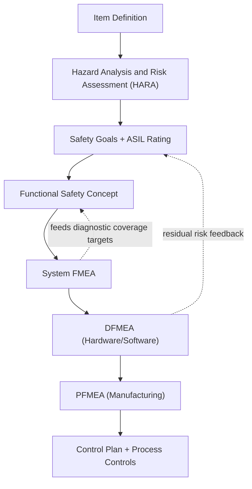

## Automotive Industry Applications

### Overview

The automotive industry is widely regarded as the birthplace of modern, standardized FMEA practice, having adapted the methodology from aerospace and defense (MIL-P-1629, 1949) into a formalized supplier-quality requirement beginning with Ford's internal adoption in the late 1970s following the Pinto fuel-tank litigation, and later codified industry-wide through AIAG (Automotive Industry Action Group) publications. Today, automotive FMEA practice is governed primarily by the harmonized **AIAG-VDA FMEA Handbook (1st Edition, 2019)**, which merged the U.S. AIAG methodology with the German VDA Volume 4 methodology to create a single global reference for OEMs and their supply chains.

### Regulatory and Standards Context

**Key Points**

- IATF 16949 is the mandatory quality management standard for automotive suppliers and requires DFMEA and PFMEA as part of Advanced Product Quality Planning (APQP).
- FMEA is a required element of the Production Part Approval Process (PPAP) submission package (typically PPAP element 4 or referenced within the design records/process flow package).
- ISO 26262 (Road Vehicles — Functional Safety) extends FMEA concepts into safety-critical electrical/electronic (E/E) systems, layering Automotive Safety Integrity Level (ASIL) classification atop traditional severity/occurrence/detection analysis.
- SAE J1739 is the historical U.S. reference standard for automotive FMEA, now largely superseded by AIAG-VDA but still referenced in legacy programs.

### The AIAG-VDA 7-Step Process

Automotive FMEA follows a structured seven-step process, distinct from the older 4-step AIAG methodology:

1. **Planning and Preparation** — Define project scope, FMEA type (System/DFMEA/PFMEA), team, and timing relative to program milestones.
2. **Structure Analysis** — Decompose the system into system, subsystem, and component levels (block diagrams, boundary diagrams).
3. **Function Analysis** — Define functions and requirements at each structural level, often visualized as a function tree or function net.
4. **Failure Analysis** — Identify failure effects, failure modes, and failure causes at each level, forming failure chains (cause → mode → effect).
5. **Risk Analysis** — Assign Severity (S), Occurrence (O), and Detection (D) ratings; determine Action Priority (AP: High/Medium/Low) rather than relying solely on a multiplicative RPN.
6. **Optimization** — Define, assign, and track actions to reduce risk, re-evaluating S/O/D post-action.
7. **Results Documentation** — Summarize the FMEA in a report suitable for management review and customer submission.

### DFMEA in Automotive Design

Design FMEA addresses failure modes arising from design deficiencies rather than manufacturing variation. In automotive practice, DFMEA typically parallels the V-model development cycle and feeds directly into the Design Verification Plan and Report (DVP&R).

**Example**

For an electronic power steering (EPS) control module:

- **Function**: Deliver assist torque proportional to driver steering input and vehicle speed.
- **Failure Mode**: Torque sensor signal drifts out of calibrated range.
- **Effect (local)**: Assist torque miscalculated.
- **Effect (end user)**: Steering feels heavier or lighter than expected; in severe cases, unintended steering assist — a potential ASIL-rated hazard under ISO 26262.
- **Cause**: Sensor thermal drift not compensated in firmware; inadequate EMC shielding.
- **Current Controls**: Design-stage HALT/HASS testing, sensor redundancy (dual-channel torque sensor), plausibility checks in software.
- **Recommended Action**: Add cross-channel plausibility diagnostic with fail-safe torque limiting.

### PFMEA in Automotive Manufacturing

Process FMEA addresses failure modes in the manufacturing and assembly process itself, structured around the process flow diagram and directly linked to the control plan.

**Example**

For a weld-nut installation process in body-in-white assembly:

- **Process Step**: Resistance spot-weld nut to bracket.
- **Failure Mode**: Insufficient weld penetration (cold weld).
- **Effect**: Nut detaches under torque load during downstream fastener installation, risking loose attachment of a safety-relevant component (e.g., seatbelt anchor bracket) — typically assigned high severity due to safety relevance.
- **Cause**: Electrode wear, incorrect weld current/time parameters, poor part fit-up.
- **Current Controls (Prevention)**: Weld parameter lockout via PLC recipe control.
- **Current Controls (Detection)**: In-line weld monitor with real-time current/resistance curve analysis; destructive peel-test sampling per shift.
- **Recommended Action**: Add automated weld-quality vision inspection; reduce peel-test sampling interval pending monitor validation data.

### Severity Rating Conventions in Automotive FMEA

Automotive severity scales (typically 1–10 under AIAG-VDA) place special emphasis on safety and regulatory compliance at the top of the scale:

| Rating | Description (typical automotive convention) |
| --- | --- |
| 9–10 | Failure affects safe vehicle operation or involves noncompliance with government regulation, without/with warning |
| 7–8 | Loss of primary function or significant degradation, vehicle operable but at reduced performance level |
| 4–6 | Loss of secondary function or comfort/convenience items; customer dissatisfaction |
| 1–3 | Minor, barely noticeable effect on the customer |

[Unverified] Exact rating-table wording differs slightly between the AIAG-VDA handbook, individual OEM customer-specific requirements (CSRs), and legacy SAE J1739 tables, so practitioners should default to the current customer-specified rating table rather than a generic version when working a real program.

### Linkage to Functional Safety (ISO 26262)

Automotive E/E systems increasingly require FMEA to interface with ISO 26262's Hazard Analysis and Risk Assessment (HARA) process. While HARA determines ASIL classification (A through D, or QM for non-safety-relevant items) at the vehicle/system level, System FMEA and DFMEA operate at lower levels of abstraction to identify and mitigate specific failure mechanisms that could violate a safety goal.

### FMEA-MSA and Special Characteristics

Automotive PFMEA has a unique linkage absent in many other industries: **Special Characteristics** (Critical Characteristics, Significant Characteristics, or OEM-specific symbols) identified during DFMEA/PFMEA must propagate into:

- The **Control Plan**, with mandatory statistical process control or 100% inspection.
- The **Measurement Systems Analysis (MSA)** plan, to ensure the gauge used for detection is itself capable (Gage R&R) of the tolerance being monitored.
- Supplier PPAP submissions, where special characteristics require specific capability study evidence (Cpk/Ppk).

### Multi-Tier Supply Chain Considerations

**Key Points**

- OEMs typically flow down FMEA requirements contractually to Tier 1 suppliers via Customer-Specific Requirements (CSRs); Tier 1s in turn flow requirements to Tier 2/3 sub-suppliers.
- Interface FMEAs (sometimes called "Interface Analysis" within Structure Analysis) are used to manage failure modes arising at the boundary between components supplied by different tiers — e.g., connector mating between a Tier 1 wiring harness and a Tier 2 connector supplier.
- Many OEMs (e.g., via AIAG or proprietary portals) require electronic FMEA submission in structured formats to enable database-level risk aggregation across a vehicle program.

### Common Automotive-Specific Pitfalls

- **Generic Severity Assignment**: Using default severity values rather than OEM CSR-specific tables, risking misclassification of safety-relevant failure modes.
- **RPN-Only Prioritization**: Continued reliance on legacy RPN threshold gating (e.g., "action required if RPN > 100") despite AIAG-VDA's shift to the Action Priority table, which explicitly discourages pure RPN thresholding because it can under-prioritize high-severity/low-occurrence combinations.
- **Disconnected Boundary Diagrams**: Structure Analysis performed without an accurate, current boundary/interface diagram, leading to missed interface failure modes — a frequent finding in customer-led FMEA audits.
- **Late-Stage FMEA**: FMEA developed after process/tooling design is finalized rather than concurrently, reducing its influence on preventive design decisions and effectively converting it into a documentation exercise rather than a risk-reduction tool.

### Related Topics

- AIAG-VDA 7-Step Methodology and Action Priority Tables (deep dive)
- ISO 26262 HARA and ASIL Decomposition
- Interface/Boundary Diagram Construction in Structure Analysis
- Control Plan Development for Special Characteristics
- PPAP Element Requirements and FMEA Submission Formats
- Gage R&R / Measurement Systems Analysis for Special Characteristics
- Supplier FMEA Flow-Down and Customer-Specific Requirements (CSR) Management