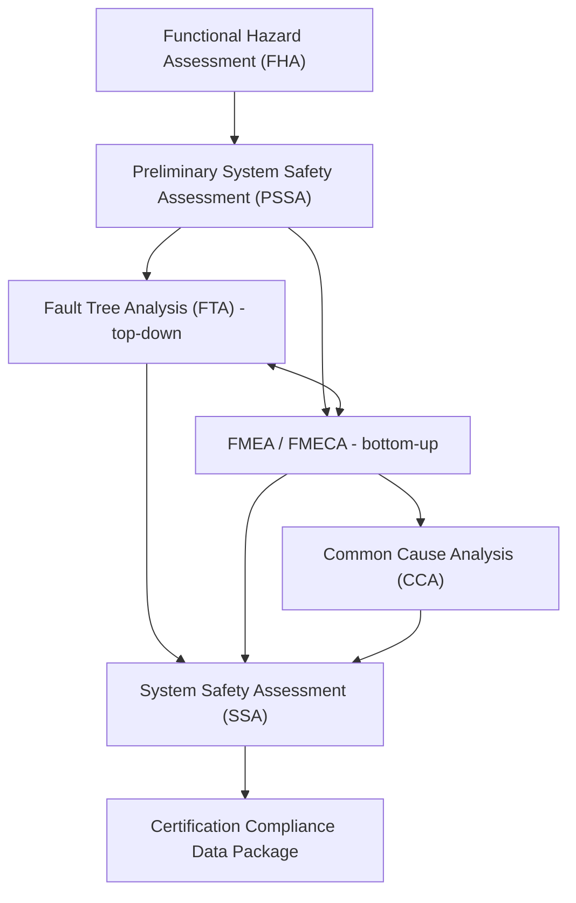

## Aerospace Industry Applications

### Overview

Aerospace holds historical primacy in FMEA's origin, tracing to U.S. military standard MIL-P-1629 ("Procedures for Performing a Failure Mode, Effects and Criticality Analysis," 1949) and later NASA's adoption during the Apollo program, where the discipline expanded into **FMECA** — Failure Mode, Effects, and Criticality Analysis — by adding a formal criticality ranking dimension atop the traditional failure-mode/effect structure. Modern aerospace FMEA/FMECA practice sits inside a safety-and-reliability ecosystem governed by ARP4761 (Aerospace Recommended Practice), AS9100 (aerospace QMS), and program-specific certification requirements from the FAA, EASA, or military airworthiness authorities.

### Regulatory and Standards Context

**Key Points**

- **SAE ARP4761** ("Guidelines and Methods for Conducting the Safety Assessment Process on Civil Airborne Systems and Equipment") defines how FMEA/FMECA integrates with Fault Tree Analysis (FTA), Common Cause Analysis (CCA), and the overall Functional Hazard Assessment (FHA) at aircraft, system, and item levels.
- **SAE ARP4754A** governs the development assurance process for highly integrated/complex aircraft systems and establishes the Development Assurance Level (DAL) framework that FMEA severity classifications must align with.
- **AS9100** (built on ISO 9001) is the aerospace-industry QMS standard; it does not mandate FMEA by name but requires risk-based thinking and configuration control that most aerospace organizations satisfy via formal FMECA processes.
- **MIL-STD-1629A** remains the reference standard for defense programs, defining the classic FMECA worksheet format still used across many military and space programs.
- Certification authorities (FAA under 14 CFR Part 25/23, EASA under CS-25/23) require safety assessment evidence — of which FMEA/FMECA is typically a core input — as part of the Type Certification data package.

### FMECA: The Aerospace-Specific Extension

Unlike general-industry FMEA, aerospace practice typically adds a formal **Criticality Analysis** step, producing a Criticality Number ($C_r$) or Risk Priority Number specific to failure-rate data rather than subjective occurrence ranking.

$$C_r = \beta \times \alpha \times \lambda_p \times t$$

Where:

- $\beta$ = conditional probability of loss (failure effect probability)
- $\alpha$ = failure mode ratio (fraction of the part's total failure rate attributable to this specific mode)
- $\lambda_p$ = part failure rate (from a reliability data source, e.g., MIL-HDBK-217 or field data)
- $t$ = operating time or mission duration

This quantitative basis distinguishes aerospace FMECA from the more qualitative 1–10 ordinal scales common in automotive FMEA, reflecting aerospace's greater reliance on actuarial reliability data and mission-duration-based risk quantification. [Inference] The availability of mature component failure-rate databases (military and commercial) in aerospace, relative to newer industries, is likely a primary reason this quantitative approach became standard practice there specifically.

### Severity Classification Alignment with DAL

Aerospace severity categories are tightly coupled to certification consequence classes, distinct from automotive's customer-satisfaction-weighted scales:

| Failure Condition Classification | Effect | Typical DAL |
| --- | --- | --- |
| Catastrophic | Multiple fatalities, usually loss of aircraft | DAL A |
| Hazardous/Severe-Major | Serious/fatal injury to small number of occupants; large reduction in safety margins | DAL B |
| Major | Significant reduction in safety margins; discomfort or injury to occupants | DAL C |
| Minor | Slight reduction in safety margins; nuisance to occupants | DAL D |
| No Safety Effect | No effect on safety | DAL E |

Each failure mode identified in an FMEA/FMECA must trace to a Functional Hazard Assessment (FHA) classification, which in turn justifies the Development Assurance Level assigned to the hardware/software item under ARP4754A.

### System Safety Assessment Process Integration

FMEA/FMECA does not stand alone in aerospace certification; it is one analysis within a broader, interlocking safety assessment hierarchy defined by ARP4761.

FMEA/FMECA's role in this architecture is explicitly bottom-up (component-to-system), complementing FTA's top-down (undesired-event-to-cause) approach; ARP4761 requires cross-validation between the two to ensure no failure paths are missed by either method alone.

### Example: Aircraft Hydraulic Actuator System

**Example**

For a primary flight control hydraulic actuator:

- **Item/Function**: Provide commanded aileron deflection via hydraulic power.
- **Failure Mode**: Internal seal degradation causing hydraulic fluid bypass (reduced actuator authority).
- **Local Effect**: Reduced actuator response rate/force.
- **Next Higher Level Effect**: Degraded roll control authority.
- **End Effect**: Potential reduction in aircraft controllability, severity dependent on redundancy architecture.
- **Failure Detection Method**: Hydraulic pressure sensor monitored by flight control computer; crew alerting via EICAS/ECAM.
- **Compensating Provisions**: Triplex-redundant actuator architecture; automatic reversion to alternate hydraulic system.
- **Criticality**: Assessed via $C_r$ calculation using seal failure-rate data and mission-time exposure, factoring in the probability that redundancy fails to compensate.

This illustrates the aerospace convention of explicitly separating **local effect**, **next higher level effect**, and **end effect** — a three-tier effect hierarchy less commonly formalized in automotive or general-industry FMEA worksheets.

### Software Considerations (DO-178C Interface)

Aerospace systems increasingly integrate software-intensive functions, where traditional hardware-failure-rate-based FMECA does not directly apply (software does not "wear out" or fail randomly). In these cases, FMEA/FMECA at the system level identifies hardware failure modes and their software-mitigation dependencies, while software assurance itself is governed separately by **DO-178C** (software) and **DO-254** (complex electronic hardware), with the DAL derived from the same FHA/PSSA process feeding both hardware FMECA and software assurance activities.

### Common Aerospace-Specific Pitfalls

- **Redundancy Masking**: Overreliance on redundant architecture assumptions without adequately analyzing common-cause failure modes that could defeat redundancy (addressed via the dedicated CCA step, including Zonal Safety Analysis and Particular Risk Analysis).
- **Failure Rate Data Provenance**: Using generic or outdated part failure-rate databases (e.g., legacy MIL-HDBK-217 data) without validating applicability to the specific operating environment, which can materially skew Criticality Number calculations.
- **FMEA/FTA Divergence**: Bottom-up FMEA and top-down FTA analyses performed independently without reconciliation, risking gaps where neither method captures a particular failure path — ARP4761 explicitly requires cross-checking between the two.
- **Late Safety Assessment Integration**: FMECA conducted as a certification-deadline deliverable rather than concurrently with PSSA/SSA development, reducing its influence on architecture decisions such as redundancy level selection.

### Related Topics

- ARP4761 Safety Assessment Process (FHA, PSSA, SSA) in Depth
- Fault Tree Analysis (FTA) and FMEA/FTA Cross-Validation
- Common Cause Analysis: Zonal Safety Analysis and Particular Risk Analysis
- Development Assurance Level (DAL) Determination under ARP4754A
- Criticality Number Calculation Methods and Failure-Rate Data Sources
- DO-178C/DO-254 Interfaces with System-Level Safety Analysis
- MIL-STD-1629A FMECA Worksheet Conventions for Defense Programs