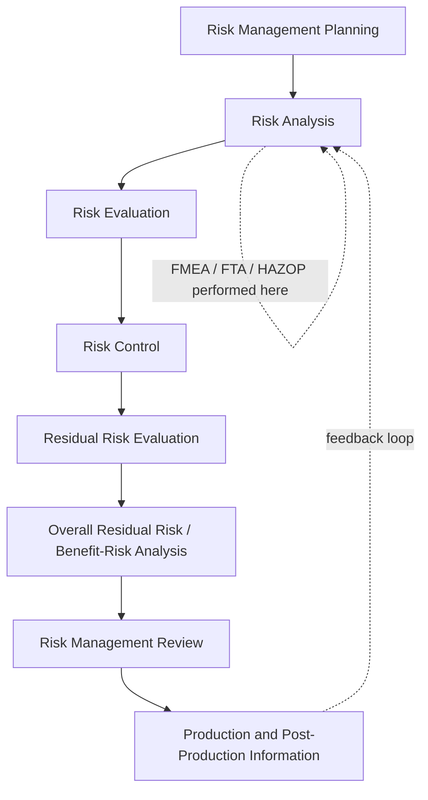

## Medical Device Applications and ISO 14971

### Overview

Medical device FMEA operates within a regulatory paradigm distinct from automotive and aerospace: rather than FMEA being the central risk artifact, it functions as one *technique* subordinate to a broader, legally mandated risk management process defined by **ISO 14971** ("Medical devices — Application of risk management to medical devices"). ISO 14971 does not prescribe FMEA by name; it defines a risk management framework that FMEA (or alternative techniques such as Fault Tree Analysis or Hazard and Operability Study) can be used to satisfy. This distinction — risk management process versus risk analysis technique — is foundational to understanding how FMEA is positioned in medical device development.

### Regulatory and Standards Context

**Key Points**

- **ISO 14971:2019** (plus its guidance companion **ISO/TR 24971:2020**) is the internationally harmonized standard for medical device risk management, recognized by the FDA, EU Medical Device Regulation (MDR 2017/745), and most global regulators.
- **ISO 13485** (medical device QMS) requires that risk management be integrated throughout the QMS per ISO 14971, with FMEA outputs feeding the Design History File (DHF) and Risk Management File (RMF).
- The FDA does not mandate ISO 14971 by regulatory citation in the same way IATF 16949 mandates automotive FMEA, but recognizes it as a consensus standard, and premarket submissions (510(k), PMA, De Novo) are strongly expected to demonstrate a risk management process consistent with it.
- **IEC 62366-1** (usability engineering) and **IEC 60601** (electrical medical equipment safety) intersect with FMEA where use-error and electrical/mechanical failure modes overlap with clinical risk.
- Post-2019 revisions to ISO 14971 shifted emphasis toward **benefit-risk analysis** — requiring that residual risk be weighed explicitly against clinical benefit, not simply reduced "as low as reasonably practicable" in isolation.

### The ISO 14971 Risk Management Process

ISO 14971 defines a full lifecycle process, of which FMEA typically satisfies the risk analysis and risk evaluation stages:

**Risk Analysis** (Step B) is where DFMEA, PFMEA, or Use FMEA is typically executed. Critically, ISO 14971 requires this analysis to be **hazard-based**, not purely failure-mode-based — meaning the process must trace from hazard, to hazardous situation, to harm, a structure that shapes how medical device FMEA worksheets are typically organized.

### Hazard-Based Risk Terminology (ISO 14971 vs. Traditional FMEA)

| ISO 14971 Term | Definition | Rough FMEA Equivalent |
| --- | --- | --- |
| Hazard | Potential source of harm | Root cause or failure mechanism |
| Hazardous Situation | Circumstance where people/property/environment are exposed to hazard(s) | Failure mode manifesting under specific use conditions |
| Harm | Injury or damage to health, property, or environment | Failure effect |
| Severity | Measure of possible consequences of harm | Severity (S) rating |
| Probability of Occurrence of Harm | Likelihood a hazardous situation leads to harm | Combined Occurrence (O) x Detection (D), often decomposed further |

[Unverified] Organizations vary in how strictly they map traditional S-O-D FMEA columns onto this hazard/hazardous-situation/harm chain; some maintain a hybrid worksheet with both structures side by side, while others fully replace S-O-D terminology with ISO 14971-native language, and the "correct" approach depends on internal procedure and notified-body/auditor expectations.

### DFMEA, PFMEA, and Use FMEA in Medical Devices

Medical device programs commonly execute three parallel FMEA streams, more explicitly separated than in automotive practice:

1. **Design FMEA (DFMEA)**: Addresses failure modes in device design — mechanical, electrical, software (where applicable, often coordinated with IEC 62304 software lifecycle risk activities).
2. **Process FMEA (PFMEA)**: Addresses manufacturing and sterilization process failure modes, particularly critical for implantables and sterile-barrier-dependent devices.
3. **Use FMEA (uFMEA)**: A medical-device-specific variant addressing use-error risks under IEC 62366-1, analyzing failure modes arising from user interaction (e.g., misreading a dosage display, incorrect device assembly) rather than component failure.

**Example**

For an infusion pump's dosage-setting interface (Use FMEA):

- **Task Step**: User enters infusion rate via touchscreen.
- **Use Error / Failure Mode**: User enters rate in mL/hr when device defaults to units of mL/kg/hr, or transposes digits under time pressure.
- **Hazardous Situation**: Infusion delivered at significantly incorrect rate.
- **Harm**: Over-infusion causing drug toxicity, or under-infusion causing therapeutic failure — severity typically rated at or near the maximum on the device's severity scale given potential for serious injury or death.
- **Risk Control**: Mandatory unit confirmation screen with hard-stop interlock, dosage range plausibility checking (soft/hard dose limits), formative and summative usability testing per IEC 62366-1.
- **Residual Risk**: Re-evaluated post-mitigation; interlock and range-checking are assessed for their own new-failure-mode potential (a control introducing a new hazard, which ISO 14971 explicitly requires evaluating).

### Risk Acceptability and the ALARP-Adjacent Framework

Unlike automotive's RPN/Action-Priority thresholding, ISO 14971 requires each individual risk to be evaluated against **pre-defined risk acceptability criteria** established in the Risk Management Plan *before* analysis begins — avoiding the practice of setting acceptability thresholds after seeing results, which the standard treats as a bias risk. A typical risk matrix:

|  | Negligible | Minor | Serious | Critical | Catastrophic |
| --- | --- | --- | --- | --- | --- |
| **Frequent** | Medium | High | High | Unacceptable | Unacceptable |
| **Probable** | Low | Medium | High | High | Unacceptable |
| **Occasional** | Low | Medium | Medium | High | High |
| **Remote** | Low | Low | Medium | Medium | High |
| **Improbable** | Low | Low | Low | Medium | Medium |

Risks landing in "Unacceptable" or "High" zones typically require design-level risk control (inherently safe design preferred over protective measures, per ISO 14971's mandated control hierarchy) before a device can proceed to market, and cannot be closed via labeling/warning alone if a design or protective-measure alternative exists.

### Risk Control Hierarchy

ISO 14971 mandates a strict priority order for risk control measures, distinct from FMEA's typically unordered "recommended actions" column:

1. **Inherent safety by design** (eliminate the hazard or reduce its severity/probability through design change) — highest priority.
2. **Protective measures** in the device itself or manufacturing process (e.g., alarms, interlocks, redundancy).
3. **Information for safety** (labeling, instructions for use, training) — lowest priority, used only when the above are impractical or to address residual risk.

A common audit/notified-body finding is over-reliance on labeling-based risk controls (tier 3) where a design change (tier 1) was feasible but not pursued — this hierarchy is one of the most frequently cited nonconformities in medical device risk file reviews. [Inference] This is likely because labeling controls are typically faster and cheaper to implement than design changes, creating an incentive misalignment that ISO 14971's hierarchy is specifically structured to counteract.

### Benefit-Risk Analysis Requirement

Where individual or overall residual risk is not acceptable per the pre-defined criteria, ISO 14971:2019 requires a formal **benefit-risk analysis**, weighing the clinical benefit of the device against the residual risk, with the analysis and its rationale documented in the Risk Management Report — this is a meaningfully different closure mechanism than automotive/aerospace practice, where an unacceptable risk generally must be reduced rather than "argued acceptable" via benefit justification.

### Linkage to the Risk Management File and DHF

FMEA worksheets in medical device programs are not standalone documents; each is referenced within the **Risk Management File (RMF)**, which aggregates:

- Risk Management Plan
- All risk analyses (DFMEA, PFMEA, Use FMEA, and any supplementary FTA)
- Risk evaluation records and acceptability determinations
- Risk control implementation verification
- Residual risk and benefit-risk analysis
- Risk Management Report (summary/closure document, required at each design freeze and pre-submission milestone)
- Post-market surveillance data feeding back into risk re-evaluation (per ISO 14971's explicit post-production information requirement)

### Common Medical-Device-Specific Pitfalls

- **Treating FMEA as the Entire Risk Process**: Performing FMEA without wrapping it in the ISO 14971 plan/evaluate/control/report structure, resulting in a technically complete FMEA that does not satisfy regulatory risk management file expectations.
- **Post-Hoc Acceptability Criteria**: Defining "acceptable" risk levels after seeing FMEA results rather than in the Risk Management Plan beforehand — a frequently cited audit nonconformity.
- **Skipping New-Risk Evaluation for Controls**: Failing to assess whether a risk control measure itself introduces new hazards (explicitly required by ISO 14971 Clause 7.4 and its 2019 revision emphasis).
- **Static Risk Files**: Not updating the Risk Management File with post-market surveillance and complaint data, breaking the standard's required feedback loop back into risk analysis.
- **Conflating Use FMEA with Usability Testing**: Treating uFMEA as a substitute for, rather than an input to, formal formative/summative usability testing under IEC 62366-1.

### Related Topics

- ISO 14971:2019 Risk Management Plan and Report Structure
- Use FMEA and IEC 62366-1 Usability Engineering File Development
- Risk Control Hierarchy: Inherent Safety, Protective Measures, Information for Safety
- Benefit-Risk Analysis Methodologies for Unacceptable Residual Risk
- IEC 62304 Software Lifecycle Risk Integration with Device-Level FMEA
- Post-Market Surveillance Feedback into Risk Management Files
- Risk Acceptability Matrix Design and Pre-Definition Best Practices