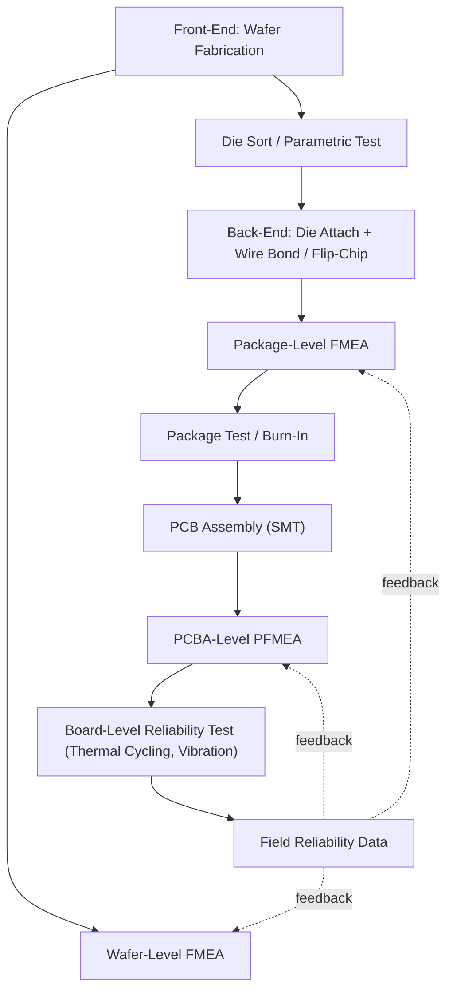

## Semiconductor and Electronics Applications

### Overview

Semiconductor and electronics FMEA applies the general methodology to failure mechanisms unique to microelectronics: wafer fabrication defects, packaging-level failures, and field-level reliability degradation governed by physics-of-failure models rather than purely empirical occurrence estimates. The discipline draws on standards distinct from automotive/aerospace practice — primarily **JEDEC** reliability qualification standards, **AEC-Q100/Q101** (automotive-grade semiconductor qualification, where electronics FMEA intersects with automotive supply chains), and **IPC** standards for electronics assembly — while still fitting within the general Design FMEA / Process FMEA structural split.

### Standards and Governance Context

**Key Points**

- **JEDEC JESD** series standards (e.g., JESD47 for stress-test-driven qualification, JESD22 series for individual stress tests) define the reliability qualification tests whose failure data feeds semiconductor FMEA occurrence estimates.
- **AEC-Q100** (integrated circuits) and **AEC-Q101** (discrete semiconductors) are automotive-electronics qualification standards that require FMEA/FMECA-informed failure mode coverage as part of qualification evidence, bridging semiconductor manufacturing and automotive supply-chain FMEA requirements.
- **IPC-A-610** and **IPC-7711/7721** govern electronics assembly acceptability and rework, informing PFMEA failure modes at the PCB assembly (PCBA) level.
- **MIL-STD-883** remains relevant for military/aerospace-grade microelectronics, paralleling JEDEC's role in commercial semiconductor qualification.
- Failure mechanism physics-of-failure references (e.g., JEP122 for silicon device reliability physics) provide the underlying failure-rate and activation-energy data used in semiconductor FMECA criticality calculations.

### Failure Mechanism Taxonomy in Semiconductor FMEA

Semiconductor FMEA differs from general electronics FMEA in that failure modes are frequently traced to specific, well-characterized **failure mechanisms** with established physics-based acceleration models, rather than generic "component fails" entries.

| Failure Mechanism | Typical Failure Mode | Acceleration Factor Model |
| --- | --- | --- |
| Electromigration | Open circuit / resistance increase in metal interconnect | Black's Equation (current density, temperature) |
| Time-Dependent Dielectric Breakdown (TDDB) | Gate oxide short | E-model / power-law voltage acceleration |
| Hot Carrier Injection (HCI) | Threshold voltage shift, transistor degradation | Empirical power-law (current, voltage) |
| Negative Bias Temperature Instability (NBTI) | PMOS threshold voltage drift | Power-law (voltage, temperature) |
| Electrostatic Discharge (ESD) | Junction/gate oxide damage | Human Body Model / Charged Device Model stress levels |
| Package-level: Solder Joint Fatigue | Intermittent/open connection | Coffin-Manson equation (thermal cycling) |
| Package-level: Wire Bond Fatigue | Open circuit | Thermal/mechanical cycling fatigue models |
| Whisker Growth (tin) | Short circuit between leads | Empirical, humidity/stress dependent |

**Example**

Electromigration lifetime is commonly modeled via Black's Equation:

$$MTTF = A \cdot J^{-n} \cdot e^{\frac{E_a}{kT}}$$

Where $MTTF$ is mean time to failure, $A$ is a process-dependent constant, $J$ is current density, $n$ is the current density exponent (typically ~2), $E_a$ is activation energy, $k$ is Boltzmann's constant, and $T$ is absolute temperature. In a semiconductor DFMEA, this model directly informs the Occurrence rating for an "interconnect electromigration failure" failure mode by allowing engineers to project field-failure rates from accelerated test data at elevated current density and temperature — a level of quantitative rigor generally unavailable in industries lacking mature physics-of-failure models for their dominant failure mechanisms.

### Wafer Fabrication (Front-End) DFMEA/PFMEA

Front-end semiconductor manufacturing FMEA addresses process-induced defects at the wafer level, tightly coupled to yield engineering.

**Example**

For a chemical-mechanical planarization (CMP) process step:

- **Process Step**: CMP of interlayer dielectric.
- **Failure Mode**: Dishing/erosion exceeding process window in dense metal regions.
- **Effect**: Subsequent lithography defocus; potential short/open in overlying metal layer.
- **Cause**: Pad conditioning drift, slurry flow rate variation, pattern density mismatch not compensated by dummy fill.
- **Current Controls (Prevention)**: Design rule enforcement for metal density uniformity; dummy fill insertion in physical design.
- **Current Controls (Detection)**: In-line metrology (profilometry, optical CD measurement) with SPC control limits; electrical test (parametric wafer sort).
- **Recommended Action**: Tighten dummy fill density rules; add real-time endpoint detection to CMP tool.

Front-end PFMEA is unusually tightly coupled to **Statistical Process Control** relative to other industries, given the extreme process-window sensitivity of sub-micron and nanometer-scale fabrication.

### Package-Level and Assembly (Back-End) FMEA

Back-end (packaging and PCB assembly) FMEA addresses failure modes distinct from wafer-level mechanisms — primarily thermomechanical and interconnect-related.

### Reliability Qualification and FMEA Interaction

Semiconductor DFMEA is unusually tightly integrated with formal reliability qualification testing, since JEDEC/AEC standards prescribe specific stress tests whose pass/fail outcomes directly validate (or invalidate) FMEA occurrence assumptions:

| Qualification Test | Purpose | Relevant Failure Mechanism |
| --- | --- | --- |
| HTOL (High Temperature Operating Life) | Long-term operating reliability | Electromigration, HCI, NBTI |
| TC (Temperature Cycling) | Thermomechanical fatigue | Solder joint fatigue, wire bond fatigue |
| THB / HAST (Temp-Humidity-Bias / Highly Accelerated Stress Test) | Moisture-induced corrosion/degradation | Corrosion, electrochemical migration |
| ESD (HBM/CDM) | Electrostatic discharge robustness | Gate oxide/junction damage |
| Latch-up Test | Parasitic thyristor triggering | CMOS latch-up |
| Autoclave / PCT (Pressure Cooker Test) | Moisture ingress, package integrity | Delamination, popcorn cracking |

A semiconductor DFMEA's "Current Controls (Detection)" column will frequently cite a specific qualification test by name (e.g., "verified via JESD22-A104 temperature cycling to 1000 cycles"), giving the worksheet a traceable, standards-referenced detection basis less common in other industries' FMEA practice.

### AEC-Q100/Q101 Bridge to Automotive FMEA

**Key Points**

- AEC-Q100/Q101 qualification does not replace a component-level DFMEA; it provides the underlying stress-test evidence that automotive Tier 1/Tier 2 semiconductor suppliers cite as "Current Controls" or "Prevention Controls" within their own DFMEA worksheets.
- Automotive-grade semiconductor FMEA must additionally account for AEC's defined temperature grades (Grade 0 through Grade 3, covering -40°C to +150°C ambient depending on grade), since occurrence ratings for thermally-driven failure mechanisms are highly temperature-dependent.
- Zero-defect programs increasingly common in automotive semiconductor supply chains (driven by ISO 26262 ASIL requirements) push semiconductor FMEA toward more rigorous, quantitative occurrence justification than typical consumer-electronics FMEA practice.

### Common Semiconductor/Electronics-Specific Pitfalls

- **Generic Occurrence Ratings Without Physics-of-Failure Basis**: Assigning subjective 1–10 occurrence scores rather than deriving them from acceleration-model-projected field failure rates, underutilizing the industry's mature reliability physics toolkit.
- **Front-End/Back-End FMEA Disconnection**: Treating wafer-fab FMEA and package-level FMEA as fully independent exercises without accounting for interaction effects (e.g., a front-end process change altering die stress sensitivity to back-end thermal cycling).
- **Neglecting Latent Defects**: Failing to distinguish infant-mortality failure modes (screenable via burn-in) from wear-out failure modes (requiring lifetime/derating margin) in the same FMEA line item, conflating two mechanisms with very different detection strategies.
- **Insufficient PCBA-Level Interaction Analysis**: Component-level DFMEA performed without corresponding board-level PFMEA addressing solder joint reliability, tin whisker risk (particularly relevant post-RoHS lead-free transition), and thermal management at the assembly level.
- **Qualification-as-Compliance-Checkbox**: Treating AEC-Q100/JEDEC qualification test completion as automatically closing an FMEA action item, without confirming the test conditions actually bound the field-use envelope assumed in the FMEA's occurrence justification.

### Related Topics

- Physics-of-Failure Modeling: Black's Equation, Coffin-Manson, and Acceleration Factors
- JEDEC JESD47/JESD22 Qualification Test Suite Structure
- AEC-Q100/Q101 Temperature Grades and Automotive Semiconductor Qualification
- Wafer-Level Statistical Process Control and Yield-FMEA Integration
- Tin Whisker Risk Mitigation and RoHS Lead-Free Reliability Considerations
- Burn-In Screening vs. Wear-Out Failure Mode Differentiation
- PCBA-Level Process FMEA and IPC-A-610 Acceptability Criteria