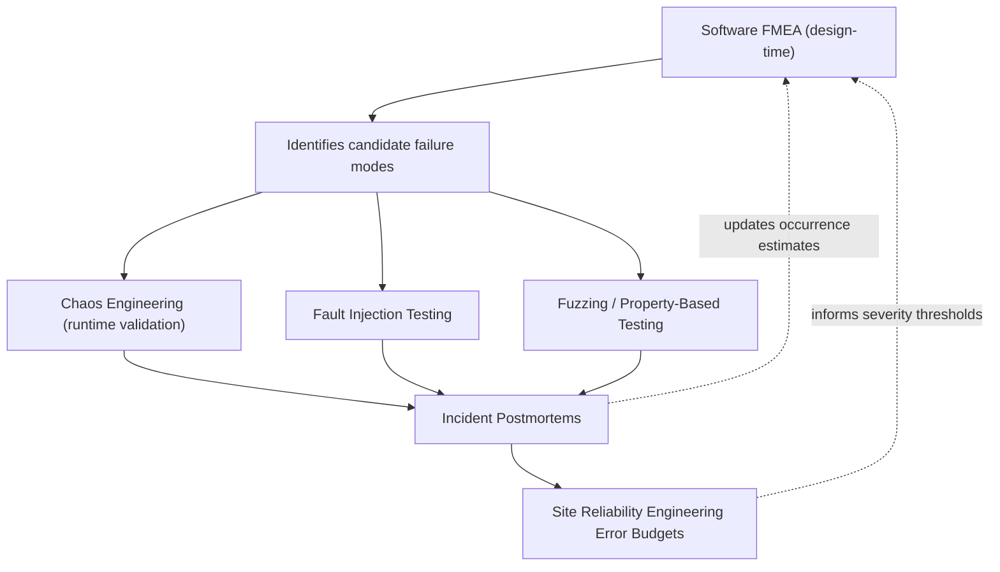

## Software and IT Systems Applications

### Overview

FMEA's application to software and IT systems is the most methodologically contested of the industry-specific adaptations, because the technique's founding assumption — that failure modes arise from physical degradation with a meaningful probability-of-occurrence distribution — does not map cleanly onto software, which does not wear out and whose defects are latent design/logic errors present from the moment of deployment rather than probabilistically emergent over time. Software FMEA (SFMEA) and IT-systems FMEA therefore require deliberate reinterpretation of the classic Severity-Occurrence-Detection framework, and are frequently supplemented or replaced by software-native reliability techniques.

### Why Classic FMEA Requires Adaptation for Software

**Key Points**

- **Occurrence** in hardware FMEA represents a physical failure rate (e.g., mean time between failures derived from wear-out physics); in software, a defect either exists in the code path or does not — "occurrence" is more accurately reinterpreted as the *probability that a given input/state combination triggers the latent defect* during operation, not a wear-driven failure rate.
- **Detection** in hardware FMEA often refers to physical sensing (pressure, temperature, vibration); in software, detection refers to verification and validation activities — code review coverage, static analysis findings, test coverage, and runtime exception handling/logging.
- Software failure modes are frequently **systemic and state-dependent** (race conditions, memory leaks accumulating over uptime, cache invalidation errors) rather than component-localized, complicating the hardware-derived "part fails, causes X" causal chain structure.
- [Inference] Because of this mismatch, software FMEA is generally regarded within reliability engineering practice as most effective when scoped to well-bounded functional units (a specific API, a specific state machine, a specific safety interlock) rather than applied broadly across an entire software system, though organizational practice varies considerably on this point.

### Software FMEA Variants

Software FMEA is typically decomposed into sub-variants analogous to hardware DFMEA/PFMEA:

| Variant | Focus | Typical Trigger Points |
| --- | --- | --- |
| SFMEA (Design) | Logic/algorithm design defects | Requirements review, architecture design phase |
| Interface FMEA | API/data-interface failure modes | Integration points between modules/services |
| Detection FMEA | Adequacy of error handling/logging/monitoring | Post-design, pre-deployment |
| Process FMEA (Software) | CI/CD pipeline, deployment, configuration management failures | DevOps/release engineering review |

### Failure Mode Taxonomy for Software

Unlike hardware, where failure modes trace to physical mechanisms (fatigue, corrosion, electromigration), software failure modes are typically categorized by defect class:

- **Logic Errors**: Incorrect conditional branching, off-by-one errors, incorrect boolean logic.
- **Data Errors**: Type mismatches, null/undefined reference handling, boundary value mishandling, encoding/serialization defects.
- **Concurrency Errors**: Race conditions, deadlocks, improper lock ordering, non-atomic read-modify-write sequences.
- **Resource Management Errors**: Memory leaks, unclosed file handles/connections, unbounded queue growth.
- **Interface/Contract Errors**: API version mismatches, schema drift between producer/consumer, incorrect error-code propagation.
- **Configuration Errors**: Environment-specific misconfiguration, missing/incorrect feature flags, secrets/credential mismanagement.
- **Timing/Sequencing Errors**: Incorrect assumptions about message ordering, timeout misconfiguration, retry-storm conditions.

**Example**

For a distributed order-processing microservice (Interface FMEA):

- **Function**: Consume "order-created" event and reserve inventory.
- **Failure Mode**: Duplicate event processed due to at-least-once delivery semantics without idempotency key checking.
- **Effect (local)**: Inventory reserved twice for a single order.
- **Effect (system)**: Inventory count drifts negative or falsely depleted; downstream fulfillment discrepancy.
- **Cause**: Message broker redelivery after consumer processed but failed to acknowledge before a timeout; no deduplication logic implemented.
- **Current Controls (Detection)**: None at design time — identified as a gap during SFMEA review, not caught by existing unit tests (which mock the broker and do not exercise redelivery scenarios).
- **Recommended Action**: Implement idempotency key check against a processed-events store before applying inventory reservation logic; add integration test simulating broker redelivery.

### Severity, Occurrence, and Detection Reinterpretation

| Dimension | Hardware FMEA Basis | Software FMEA Reinterpretation |
| --- | --- | --- |
| Severity | Physical/safety consequence of failure | Business/data-integrity/security impact; often weighted by blast radius (single user vs. system-wide) |
| Occurrence | Failure rate from wear/stress physics | Likelihood the triggering condition/input arises in production (informed by traffic patterns, edge-case frequency, historical incident data) |
| Detection | Sensor/inspection capability | Test coverage, static/dynamic analysis tooling, observability (logging, tracing, alerting) maturity |

Because software Occurrence cannot be derived from physical acceleration models, practitioners commonly substitute **historical incident/defect-density data**, code complexity metrics (cyclomatic complexity as a rough defect-likelihood proxy), or expert judgment calibrated against past post-mortems — a materially weaker evidentiary basis than semiconductor or aerospace occurrence justification, which is a frequently cited limitation of software FMEA in reliability engineering literature.

### Integration with Software-Native Reliability Techniques

Software and IT organizations frequently pair or substitute FMEA with techniques better suited to software's failure characteristics:

- **Chaos Engineering** (e.g., fault-injection practices popularized by Netflix's Chaos Monkey lineage) validates FMEA-predicted failure modes empirically in production or production-like environments, closing the gap left by software's lack of physical accelerated-life testing.
- **Fault Tree Analysis (FTA)** is often considered complementary for safety-critical or highly available software systems, providing the top-down counterpart to FMEA's bottom-up analysis, mirroring the aerospace FTA/FMEA pairing pattern.
- **Site Reliability Engineering (SRE) Error Budgets** provide a quantitative severity/acceptability framework (allowable downtime/error rate) that can inform FMEA severity thresholds in a way loosely analogous to ISO 14971's pre-defined risk acceptability criteria.

### IT Systems and Infrastructure FMEA

IT-systems-level FMEA (as distinct from application-software FMEA) addresses infrastructure, network, and operational failure modes:

**Example**

For a multi-region cloud database deployment:

- **Component/Function**: Primary-replica database failover mechanism.
- **Failure Mode**: Failover does not trigger automatically upon primary node network partition (split-brain scenario).
- **Effect**: Two nodes both accept writes believing themselves primary, causing data divergence.
- **Cause**: Health-check mechanism relies on a single network path without independent quorum verification.
- **Current Controls (Prevention)**: None — identified as architectural gap.
- **Current Controls (Detection)**: Monitoring alerts on replication lag, but does not distinguish partition from ordinary lag.
- **Recommended Action**: Implement quorum-based leader election (e.g., Raft/Paxos-based consensus) rather than single-path health checks; add split-brain detection alerting distinct from lag alerting.

### Regulatory and Compliance Touchpoints

- **IEC 62304** governs medical device software lifecycle risk management, requiring software risk analysis (often SFMEA-based) integrated with the device-level ISO 14971 risk management file.
- **DO-178C** governs airborne software assurance, where software-level FMEA/failure analysis feeds the broader ARP4761 safety assessment process alongside hardware FMECA.
- **ISO 26262 Part 6** addresses software-level functional safety in automotive systems, requiring software safety analysis techniques (including software FMEA variants) tied to ASIL classification.
- General enterprise/IT systems have no single unifying regulatory mandate for FMEA, though frameworks like **ITIL** (service management) and **NIST SP 800-53** (security controls) encourage structured risk analysis that organizations frequently implement via FMEA-derived worksheets.

### Common Software/IT-Specific Pitfalls

- **Misapplied Occurrence Quantification**: Treating software Occurrence ratings with the same numerical confidence as hardware failure-rate-derived ratings, when the underlying data (defect density, historical incidents) is typically far less rigorous.
- **Static, Pre-Deployment-Only Analysis**: Performing SFMEA once during design and never revisiting it as the system evolves, despite software systems changing far more rapidly post-deployment than most hardware systems change post-manufacture.
- **Ignoring Emergent/Systemic Failure Modes**: Focusing FMEA analysis on individual component/module failure modes while missing emergent failure modes arising from component interactions under load (a known limitation of decompositional analysis techniques applied to distributed systems).
- **No Runtime Validation Loop**: Treating design-time SFMEA as sufficient without pairing it to chaos engineering, fault injection, or production incident feedback to validate whether identified failure modes actually manifest as predicted.
- **Conflating Bug Tracking with FMEA**: Using an SFMEA worksheet as a disguised defect backlog rather than a forward-looking risk-identification exercise addressing failure modes not yet observed.

### Related Topics

- Chaos Engineering and Fault Injection as FMEA Validation Techniques
- Fault Tree Analysis for Distributed and Safety-Critical Software Systems
- IEC 62304 Software Risk Management for Medical Device Software
- Site Reliability Engineering Error Budgets and Severity Threshold Design
- Interface FMEA for Microservice and API-Based Architectures
- Defect Density and Code Complexity Metrics as Occurrence Proxies
- Postmortem-Driven FMEA Occurrence Recalibration Processes