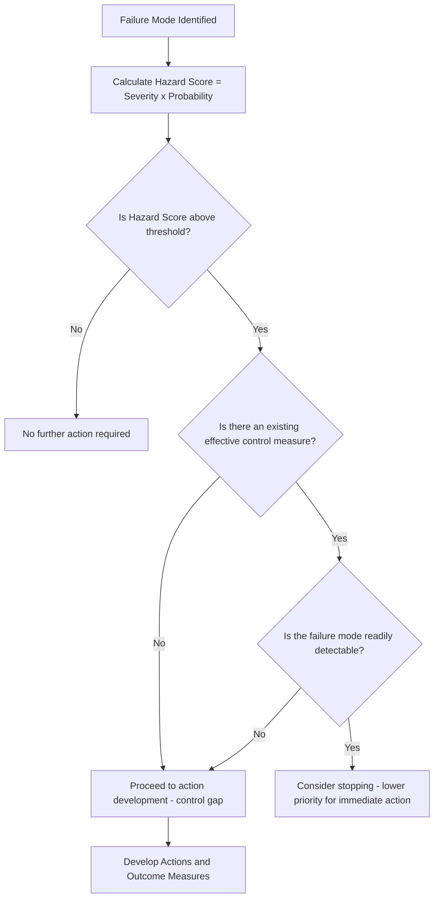
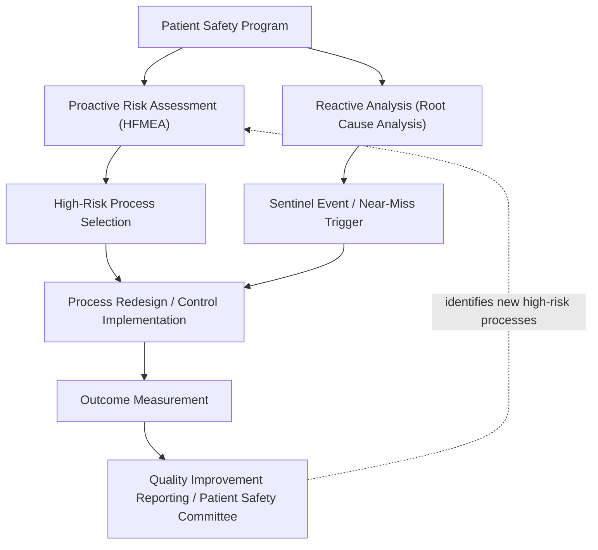

## Healthcare Process Improvement Applications

### Overview

Healthcare process FMEA (often designated **HFMEA — Healthcare Failure Mode and Effects Analysis**) applies the FMEA methodology not to a manufactured product or device, but to clinical and administrative *processes* — medication administration, surgical procedures, patient handoffs, laboratory workflows — where failure modes represent process breakdowns capable of causing patient harm. This distinguishes it sharply from medical device FMEA under ISO 14971 (covered separately), which addresses device design/manufacturing risk rather than care-delivery process risk. Healthcare process FMEA is most closely associated with the **VA National Center for Patient Safety (NCPS)**, which developed the HFMEA methodology in 2001 by adapting the U.S. Department of Defense's healthcare FMEA approach specifically for clinical process application.

### Regulatory and Accreditation Context

**Key Points**

- **The Joint Commission** (the primary U.S. hospital accreditation body) requires accredited organizations to conduct at least one proactive risk assessment of a high-risk process annually, and explicitly cites FMEA/HFMEA as an acceptable methodology to satisfy this requirement under its Leadership (LD) and Patient Safety standards.
- HFMEA is typically positioned as the **proactive** counterpart to **Root Cause Analysis (RCA)**, which is reactive (performed after a sentinel event or near-miss has already occurred); Joint Commission expectations often reference both techniques as complementary halves of a comprehensive patient safety program.
- The **Institute for Healthcare Improvement (IHI)** and the **Agency for Healthcare Research and Quality (AHRQ)** both publish supporting guidance and toolkits referencing FMEA/HFMEA as a recommended proactive safety technique, though neither mandates it as a regulatory requirement in the way IATF 16949 mandates automotive FMEA.
- ISO 9001-accredited healthcare organizations (less common in the U.S., more common internationally) may additionally reference FMEA under general QMS risk-based-thinking clauses.

### The HFMEA Five-Step Process

HFMEA modifies the classic FMEA sequence into a five-step process, with several structural elements distinct from industrial FMEA:

1. **Define the Topic**: Select and scope a high-risk process for proactive analysis (often chosen based on high volume, high risk, problem-prone history, or new-process introduction).
2. **Assemble the Team**: Multidisciplinary team explicitly required to include frontline staff who actually perform the process — a stronger emphasis on frontline participation than is typical in industrial FMEA teams.
3. **Graphically Describe the Process**: Construct a detailed process flow diagram breaking the process into sequential steps and sub-steps — analogous to the process flow diagram required upstream of automotive PFMEA, but generally more granular for clinical workflows.
4. **Conduct Hazard Analysis**: For each process step, identify potential failure modes, then apply a **Decision Tree** (distinctive to HFMEA) to determine which failure modes warrant further action.
5. **Develop Actions and Outcome Measures**: Define risk-reduction actions, assign responsibility, and establish outcome measures to confirm the action was effective — HFMEA places explicit emphasis on measuring whether an implemented action actually reduced risk, rather than treating action closure alone as sufficient.

### The HFMEA Decision Tree — A Key Structural Difference

Unlike classic RPN-based prioritization, HFMEA employs a branching **Decision Tree** to determine whether a given failure mode requires further action, reducing reliance on a single multiplied numeric score:

This decision-tree gate is HFMEA's signature departure from industrial FMEA's RPN or Action Priority table: rather than ranking all failure modes numerically and setting a cutoff, HFMEA asks a sequence of yes/no questions (Is the hazard score high? Does an effective control already exist? Is the failure mode detectable before harm occurs?) to determine whether a specific failure mode proceeds to action development — explicitly designed to prevent teams from expending limited resources on failure modes that are already adequately controlled or are inherently low-priority despite a superficially concerning severity rating.

### Severity and Probability Scales in Healthcare

HFMEA typically uses a 4-point Severity scale (Catastrophic, Major, Moderate, Minor) rather than the 10-point scales common in automotive/aerospace, reflecting the VA NCPS origin's alignment with its companion RCA severity categorization:

| Severity | Description (typical HFMEA convention) |
| --- | --- |
| Catastrophic | Death or major permanent loss of function not related to the natural course of illness |
| Major | Permanent lessening of bodily function, disfigurement, extended hospital stay |
| Moderate | Increased length of stay or level of care for 1–2 patients |
| Minor | No injury, or minimal injury not requiring intervention |

Probability is similarly often scaled 4 points (Frequent, Occasional, Uncommon, Rare), with the Hazard Score matrix (Severity × Probability) determining Decision Tree entry rather than driving a purely numeric RPN cutoff.

### Example: Medication Administration Process

**Example**

For an inpatient IV medication administration process:

- **Process Step**: Nurse programs infusion pump rate from physician order.
- **Failure Mode**: Manual transcription error — decimal point misplacement when entering rate (e.g., 10.0 mL/hr entered as 100 mL/hr).
- **Effect**: Medication over-infusion; severity rated Catastrophic for high-alert medications (e.g., insulin, opioids, anticoagulants).
- **Cause**: Manual data entry without independent verification; illegible or ambiguous physician order; lack of smart-pump dose-range checking.
- **Hazard Score**: High (Catastrophic severity × Occasional-to-Frequent probability given known transcription-error base rates in manual systems).
- **Decision Tree Path**: No existing effective control (smart-pump library not yet implemented) → proceed to action development.
- **Recommended Action**: Implement smart infusion pump with dose-error-reduction software (DERS) and hard/soft dose limits; require independent double-check by second clinician for high-alert medications per institutional high-alert medication policy.
- **Outcome Measure**: Track programming-error interception rate via smart pump alert logs pre/post implementation; monitor adverse drug event reporting for the medication class.

This illustrates HFMEA's characteristic emphasis on **outcome measures** — Step 5 explicitly requires defining how the team will know the action worked, a formalized verification step less uniformly emphasized in industrial FMEA's "recommended action" column.

### Common Healthcare Process FMEA Applications

- **Surgical/Procedural Workflows**: Wrong-site surgery prevention (Universal Protocol compliance), surgical instrument/sponge counting processes, anesthesia medication preparation.
- **Medication Management**: Prescribing, dispensing, and administration processes, particularly for high-alert medications.
- **Patient Handoff/Transitions of Care**: Shift-change handoff communication, inter-facility transfer processes, discharge planning.
- **Laboratory and Diagnostic Processes**: Specimen labeling and chain-of-custody, critical-value reporting workflows.
- **New Technology/Process Introduction**: Proactive analysis prior to deploying new equipment, EHR workflow changes, or new clinical protocols — analogous to DFMEA's role preceding a design launch.
- **Infection Control Processes**: Central line insertion/maintenance bundles, sterile processing department workflows.

### Integration with the Broader Patient Safety Program

HFMEA findings typically feed into an institution's Patient Safety Committee or Quality Improvement structure alongside RCA findings, and both are commonly cross-referenced when a near-miss event reveals a failure mode that a prior HFMEA either did or did not anticipate — a discrepancy itself often triggering HFMEA re-analysis of the process.

### Common Healthcare-Specific Pitfalls

- **Team Composition Gaps**: Conducting HFMEA without frontline staff (the nurses, technicians, or pharmacists who actually perform the process daily), producing a theoretically complete but practically inaccurate process map — a frequently cited failure mode of the HFMEA exercise itself.
- **Skipping the Decision Tree**: Reverting to pure numeric Hazard Score ranking without applying the Decision Tree's control-adequacy and detectability questions, which can misallocate action-development effort toward already-controlled risks.
- **No Outcome Measurement**: Implementing recommended actions without defining or tracking outcome measures, leaving the organization unable to confirm whether the action actually reduced risk (as opposed to merely being implemented).
- **One-Time Analysis**: Treating HFMEA as a single accreditation-cycle deliverable rather than revisiting it when the process changes (new technology, new staff, new regulatory requirement) or when related incidents/near-misses occur.
- **Process Scope Too Broad**: Selecting an overly broad process for a single HFMEA (e.g., "medication administration" hospital-wide rather than a specific high-alert medication subprocess), diluting the analysis and making the resulting process flow diagram unwieldy.

### Related Topics

- VA National Center for Patient Safety HFMEA Methodology and Toolkit
- Root Cause Analysis (RCA) and its Relationship to Proactive HFMEA
- Joint Commission Proactive Risk Assessment Requirements
- High-Alert Medication Risk Reduction Strategies
- Smart Infusion Pump Dose-Error-Reduction Software (DERS) Implementation
- Process Flow Mapping Techniques for Clinical Workflows
- Outcome Measure Design for Patient Safety Interventions