## Differences Between FMEA and FMECA

### Overview

FMEA (Failure Mode and Effects Analysis) and FMECA (Failure Mode, Effects, and **Criticality** Analysis) are frequently used interchangeably in casual practice, but they represent distinct scopes of analysis. FMECA is formally an extension of FMEA that adds a quantitative or semi-quantitative **Criticality Analysis (CA)** step, ranking failure modes by their combined severity and probability of occurrence using a defined mathematical or matrix-based method — rather than relying on the more qualitative or ordinal-scale prioritization (RPN, Action Priority tables) common in general-industry FMEA. The distinction traces to the methodology's origin: **MIL-P-1629 (1949)** and its successor **MIL-STD-1629A** define the combined FMECA procedure, while general-industry adaptations (AIAG, AIAG-VDA) largely dropped the formal criticality-number calculation in favor of simpler ordinal ranking schemes.

### Core Structural Comparison

**Key Points**

- FMEA identifies failure modes, their causes, and their effects, then ranks relative risk using ordinal scales (Severity, Occurrence, Detection) and either a multiplicative RPN or a lookup-table-based Action Priority.
- FMECA performs all the same steps as FMEA, then adds a distinct **Criticality Analysis** step that calculates a quantitative Criticality Number, typically grounded in actual component failure-rate data rather than subjective occurrence estimates.
- FMECA is most strongly associated with industries possessing mature, standardized part failure-rate data sources (aerospace, defense, nuclear) — the criticality calculation's value is directly proportional to the quality of the reliability data feeding it.
- Not all FMECA implementations use the same criticality calculation method — MIL-STD-1629A itself defines two distinct approaches (Qualitative and Quantitative Criticality Analysis), described further below.

### Side-by-Side Comparison Table

| Dimension | FMEA | FMECA |
| --- | --- | --- |
| Core Steps | Function, Failure Mode, Effect, Cause, Controls, Risk Ranking | Same steps, plus formal Criticality Analysis |
| Prioritization Basis | Ordinal S-O-D ratings; RPN or Action Priority table | Criticality Number ($C_r$ or $C_m$) from failure-rate data |
| Governing Standard(s) | AIAG-VDA Handbook, SAE J1739 (automotive/general industry) | MIL-STD-1629A (defense/aerospace origin) |
| Occurrence Basis | Often subjective/expert-judgment ordinal scale | Quantitative part failure rate ($\lambda$) from reliability databases |
| Typical Industries | Automotive, general manufacturing, software | Aerospace, defense, nuclear, space systems |
| Output Granularity | Relative risk ranking among failure modes within one FMEA | Criticality ranking additionally comparable across different FMEAs/systems when failure-rate data is consistent |
| Effect Hierarchy | Typically single "Effect" column (sometimes local/end split) | Formally requires Local Effect, Next Higher Level Effect, and End Effect |

### The Criticality Analysis Step in Detail

FMECA's defining addition is the calculation of a Criticality Number, typically using one of two MIL-STD-1629A-defined approaches:

**Quantitative Criticality Analysis**, used when reliable failure-rate data exists:

$$C_r = \beta \times \alpha \times \lambda_p \times t$$

Where $\beta$ is the conditional probability that the failure effect results in the stated criticality classification (loss of mission, loss of system, etc.), $\alpha$ is the failure mode ratio (fraction of the component's total failure rate attributable to this specific failure mode), $\lambda_p$ is the part failure rate (failures per unit time, from a source such as a military handbook or field-return database), and $t$ is the operating time or mission duration.

**Qualitative Criticality Analysis**, used when failure-rate data is unavailable or unreliable, substitutes a **Criticality Matrix** — plotting failure modes on a severity-versus-qualitative-probability-of-occurrence grid (using descriptive occurrence levels such as "Frequent," "Reasonably Probable," "Occasional," "Remote," "Extremely Unlikely" rather than a numeric failure rate) to achieve a broadly comparable prioritization without requiring actuarial data.

### Visual Comparison of Process Flow

```mermaid
flowchart TD
    subgraph FMEA["FMEA Process"]
    A1["Define Function"] --> A2["Identify Failure Mode"]
    A2 --> A3["Identify Effect(s)"]
    A3 --> A4["Identify Cause(s)"]
    A4 --> A5["Rate Severity, Occurrence, Detection"]
    A5 --> A6["Calculate RPN / Action Priority"]
    A6 --> A7["Recommend and Track Actions"]
    end

    subgraph FMECA["FMECA Process"]
    B1["Define Function"] --> B2["Identify Failure Mode"]
    B2 --> B3["Identify Local / Next-Higher / End Effects"]
    B3 --> B4["Identify Cause(s)"]
    B4 --> B5["Rate Severity Classification"]
    B5 --> B6["Criticality Analysis: Quantitative (Cr) or Qualitative Matrix"]
    B6 --> B7["Rank by Criticality Number"]
    B7 --> B8["Recommend and Track Actions"]
    end
```

### Why the Distinction Matters in Practice

**Example**

Consider two failure modes on an aircraft component, both rated identically under a simplified ordinal FMEA scheme as "Severity 9, Occurrence 3":

- **Failure Mode A**: A failure mechanism with a well-characterized field failure rate of $\lambda = 0.0001$ failures/hour, contributing $\alpha = 0.1$ of the component's total failure rate, with $\beta = 1.0$ (certain loss if it occurs), evaluated over a $t = 5,000$ hour mission life.
- **Failure Mode B**: A different mechanism on the same component with $\lambda = 0.00005$ failures/hour, $\alpha = 0.4$, $\beta = 1.0$, same mission life.

Under simple ordinal FMEA, both might receive the same RPN-equivalent ranking if occurrence was estimated as a single "3" on a 1–10 scale for the component overall. Under FMECA's quantitative Criticality Analysis:

$$C_{r,A} = 1.0 \times 0.1 \times 0.0001 \times 5000 = 0.05$$

$$C_{r,B} = 1.0 \times 0.4 \times 0.00005 \times 5000 = 0.10$$

FMECA reveals Failure Mode B as twice as critical despite a lower absolute failure rate, because its higher failure-mode-ratio ($\alpha$) means it represents a larger share of the component's overall risk contribution — a distinction that ordinal FMEA's coarser occurrence scale would likely obscure. [Inference] This kind of resolution difference is generally the primary practical argument for FMECA over FMEA in programs with access to genuine component-level failure-rate data, though the added rigor comes at the cost of requiring that data to exist and be trustworthy in the first place.

### When FMECA's Added Rigor Is (and Isn't) Justified

**Key Points**

- FMECA's quantitative approach provides genuine value when a program has access to credible, applicable failure-rate data (military handbooks, extensive field-return databases, or component-specific qualification testing) — conditions most reliably met in mature aerospace/defense supply chains.
- FMECA's added complexity is often not justified in industries or programs lacking such data, where forcing a quantitative Criticality Number calculation using estimated or extrapolated failure rates can create a false sense of precision — a documented risk that some reliability engineering literature refers to as spurious quantification.
- Automotive practice under AIAG-VDA deliberately moved *away* from a pure RPN multiplication (which shares some of FMECA's "single number to rank everything" character) toward the Action Priority table specifically because a single multiplied score can mask high-severity/low-occurrence combinations — a critique that also applies to naively interpreted Criticality Numbers if $\beta$, $\alpha$, and $\lambda_p$ are not independently examined.
- Many organizations describe their process as "FMEA" while performing something closer to a simplified qualitative FMECA (using a Criticality Matrix rather than true quantitative calculation) — the terminology boundary in casual industry usage is considerably blurrier than the formal MIL-STD-1629A definitions suggest.

### Terminology Usage Note

[Unverified] Industry usage of "FMEA" versus "FMECA" is not fully standardized in casual practice — many organizations, standards documents, and even some regulatory guidance use "FMEA" as a generic umbrella term covering both the basic technique and criticality-extended variants, while reserving "FMECA" specifically for contexts requiring MIL-STD-1629A-compliant documentation (typically defense contracts with an explicit FMECA deliverable requirement in the contract's Statement of Work). Practitioners working across industries should confirm which specific standard and terminology convention a given customer or contract expects rather than assuming universal definitions.

### Related Topics

- MIL-STD-1629A Quantitative vs. Qualitative Criticality Analysis Procedures
- Failure Rate Data Sources: Military Handbooks and Field-Return Databases
- Criticality Matrix Construction for Qualitative Analysis
- AIAG-VDA Action Priority Tables vs. RPN vs. Criticality Number Comparison
- Local, Next-Higher-Level, and End Effect Classification in Aerospace FMECA
- Beta (Conditional Probability of Loss) Determination Methods
- Spurious Quantification Risk in Reliability Engineering Analyses