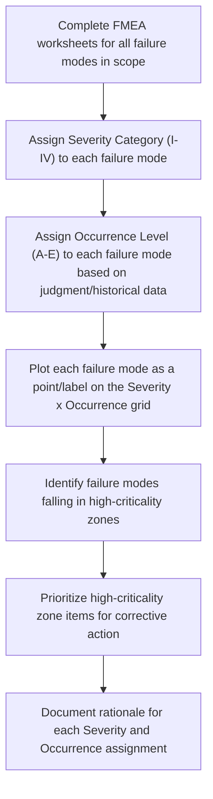

## Constructing a Criticality Matrix

### Overview

The Criticality Matrix is the primary tool of **Qualitative Criticality Analysis** under MIL-STD-1629A, used when reliable component failure-rate data is unavailable to support the fully quantitative Criticality Number calculation ($C_r = \beta \times \alpha \times \lambda_p \times t$). Rather than producing a single quantitative score, the matrix plots each failure mode's **Severity Classification** against a qualitative **Probability of Occurrence Level**, producing a visual, two-dimensional risk-ranking grid that allows analysts to prioritize failure modes for corrective action without requiring actuarial failure-rate data as an input.

### Prerequisite Inputs

**Key Points**

- Each failure mode entering the matrix must already have a completed FMEA/FMECA worksheet entry, including identified cause(s) and Local/Next-Higher-Level/End Effects.
- Severity Classification must be assigned per MIL-STD-1629A's four standard categories (or an equivalent program-specific scheme), independent of occurrence likelihood.
- Occurrence must be assigned using qualitative descriptors grounded in engineering judgment, historical experience with similar items, or analogous system data — explicitly *not* requiring a numeric failure rate, which is the matrix's key advantage over the quantitative approach.
- The matrix is typically constructed at the system or subsystem level, aggregating failure modes across multiple FMEA worksheets to enable comparative prioritization.

### Standard Severity Classification Categories (MIL-STD-1629A)

| Category | Classification | Description |
| --- | --- | --- |
| I | Catastrophic | Failure causing death or system loss |
| II | Critical | Failure causing severe injury, major property damage, or major system damage resulting in mission loss |
| III | Marginal | Failure causing minor injury, minor property damage, or minor system damage resulting in delay or loss of availability, or mission degradation |
| IV | Minor | Failure not serious enough to cause injury, property damage, or system damage, but resulting in unscheduled maintenance or repair |

### Standard Qualitative Occurrence (Probability) Levels

| Level | Descriptor | Typical Qualitative Definition |
| --- | --- | --- |
| A | Frequent | High probability of occurrence during the item's operating time interval |
| B | Reasonably Probable | Moderate probability of occurrence |
| C | Occasional | Occasional probability of occurrence |
| D | Remote | Unlikely, but possible, probability of occurrence |
| E | Extremely Unlikely | Probability of occurrence is essentially zero |

[Unverified] Exact wording of these occurrence-level definitions varies somewhat between MIL-STD-1629A editions and program-specific tailoring documents; some programs define these levels with associated approximate numeric ranges (e.g., Level A corresponding to probability greater than 0.20 over the item's life) even when full quantitative failure-rate data is unavailable for individual failure modes, using rough order-of-magnitude judgment instead.

### Constructing the Matrix Grid

The matrix is a grid with Severity Category on one axis and Occurrence Level on the other, with each cell representing a criticality zone:

The resulting grid is typically rendered as a table with Severity Category as columns and Occurrence Level as rows (or vice versa), with each failure mode plotted as an identifier (e.g., its FMEA line-item number) within the appropriate cell:

| Occurrence Level | Category I (Catastrophic) | Category II (Critical) | Category III (Marginal) | Category IV (Minor) |
| --- | --- | --- | --- | --- |
| **A (Frequent)** | Highest criticality zone | High criticality zone | Medium criticality zone | Lower criticality zone |
| **B (Reasonably Probable)** | Highest criticality zone | High criticality zone | Medium criticality zone | Lower criticality zone |
| **C (Occasional)** | High criticality zone | Medium criticality zone | Lower criticality zone | Lowest criticality zone |
| **D (Remote)** | Medium criticality zone | Lower criticality zone | Lowest criticality zone | Lowest criticality zone |
| **E (Extremely Unlikely)** | Lower criticality zone | Lowest criticality zone | Lowest criticality zone | Lowest criticality zone |

The diagonal banding pattern (upper-left cells representing highest criticality, lower-right cells representing lowest) reflects the same severity-times-likelihood logic underlying quantitative Criticality Numbers, but expressed as zone membership rather than a calculated value — analysts prioritize corrective action starting from the upper-left zones and working outward.

### Worked Example: Constructing a Matrix Entry

**Example**

For a ground support equipment hydraulic system, consider three failure modes already documented in the FMEA worksheet:

- **FM-1**: Hydraulic line rupture under normal operating pressure. Effect: loss of lifting capability during a lift operation, potential for dropped load causing injury. Severity assigned: **Category I (Catastrophic)**. Occurrence assigned: **Level D (Remote)** — based on the line's rated burst pressure providing substantial margin over operating pressure and no failure history in the fleet to date.
- **FM-2**: Hydraulic fluid seepage at a fitting, gradually reducing system pressure. Effect: reduced lift speed, operational delay pending seal replacement. Severity assigned: **Category IV (Minor)**. Occurrence assigned: **Level B (Reasonably Probable)** — based on known seal wear patterns observed across the fleet.
- **FM-3**: Pressure relief valve fails to open at set point. Effect: potential over-pressurization of the system, risk of secondary component rupture. Severity assigned: **Category II (Critical)**. Occurrence assigned: **Level C (Occasional)** — based on valve failure history from similar equipment in the maintenance database.

Plotting these three:

| Occurrence Level | Category I | Category II | Category III | Category IV |
| --- | --- | --- | --- | --- |
| **A** |  |  |  |  |
| **B** |  |  |  | FM-2 |
| **C** |  | FM-3 |  |  |
| **D** | FM-1 |  |  |  |
| **E** |  |  |  |  |

Despite FM-1 carrying the highest severity classification (Catastrophic), its Remote occurrence places it in a moderate criticality zone, while FM-3's Critical severity combined with Occasional occurrence places it in a comparably or more urgent zone — illustrating the matrix's core function of preventing severity alone from dominating prioritization, consistent with the same principle underlying AIAG-VDA's Action Priority table in automotive practice.

### Assigning Occurrence Levels Without Failure-Rate Data

**Key Points**

- **Analogous system data**: Occurrence level informed by the failure history of a similar component or system already fielded, adjusted qualitatively for known design or environmental differences.
- **Engineering/expert judgment**: Structured expert elicitation (often using a multidisciplinary team consensus process) when no analogous data exists, typically the least rigorous but sometimes only available basis.
- **Test and qualification results**: Pass/fail outcomes and margin observed during design qualification testing, even without a full statistical failure-rate derivation.
- **Physics-based reasoning**: Qualitative assessment grounded in stress margins, safety factors, or known degradation mechanisms (e.g., "operating well within rated fatigue life" supporting a Remote or Extremely Unlikely assignment) without requiring a numeric fatigue-life calculation.

### Using the Matrix to Drive Action Prioritization

Once populated, the Criticality Matrix functions analogously to the Action Priority table in AIAG-VDA methodology or the Hazard Score Decision Tree in HFMEA: it directs limited corrective-action resources toward the failure modes whose combination of severity and occurrence places them in the matrix's highest-criticality zones, while explicitly documenting that lower-zone items received a conscious risk-acceptance decision rather than simply being omitted from analysis.

**Example**

A typical output from matrix-based prioritization:

- **Highest/High Criticality Zone Items**: Mandatory corrective action required prior to program milestone (e.g., design review, qualification test, or field release); action tracked with defined closure criteria and, where feasible, re-assessed via updated matrix placement post-mitigation.
- **Medium Criticality Zone Items**: Corrective action recommended but may be deferred with documented risk-acceptance rationale and management sign-off.
- **Lower/Lowest Criticality Zone Items**: Generally accepted as-is; periodically reviewed if occurrence assumptions change (e.g., new field data suggesting occurrence was underestimated) or if the item is included in a broader program risk register for monitoring.

### Common Pitfalls in Matrix Construction

- **Severity/Occurrence Conflation**: Allowing a high-severity failure mode's perceived importance to inflate its occurrence rating (or vice versa) rather than assessing the two dimensions independently — undermining the matrix's core value of separating these considerations.
- **Undocumented Rationale**: Assigning occurrence levels without recording the basis (analogous data, test results, expert judgment) for the assignment, making the matrix difficult to defend during customer or certification audits and impossible to meaningfully update later.
- **Static Matrix**: Failing to revisit occurrence assignments as new field data, test results, or design changes emerge — the matrix should be treated as a living document analogous to the broader FMEA it summarizes.
- **Inconsistent Occurrence Definitions Across Analysts**: Different team members applying differing internal thresholds for what constitutes "Occasional" versus "Remote" without a calibrated team discussion, producing an internally inconsistent matrix across failure modes analyzed by different individuals.
- **Treating Matrix Zones as Precise Rather than Directional**: Over-interpreting zone boundaries as sharply quantitative when the underlying occurrence assignments are inherently qualitative judgment calls — the matrix is a prioritization aid, not a substitute for quantitative analysis where quantitative data genuinely exists.

### Related Topics

- MIL-STD-1629A Severity Classification Categories in Detail
- Quantitative Criticality Number Calculation ($C_r = \beta \alpha \lambda_p t$)
- Structured Expert Elicitation Methods for Occurrence Estimation
- Risk Acceptance Documentation and Sign-Off Processes
- Comparing Criticality Matrices, RPN, and Action Priority Tables
- Analogous System Data Analysis for Reliability Estimation
- Living Document Practices for FMECA Revision Control