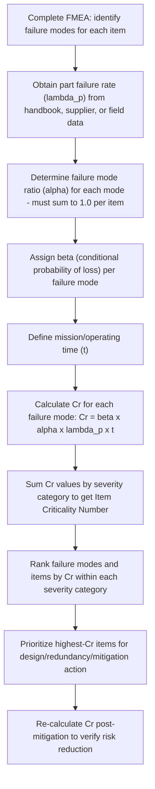

## Quantitative Criticality Analysis

### Overview

Quantitative Criticality Analysis is the failure-rate-data-driven method of ranking failure modes under MIL-STD-1629A's FMECA framework, calculating a numeric **Criticality Number** ($C_r$) for each failure mode and, when aggregated, an **Item Criticality Number** ($C_r$ at the item level, summing across all failure modes of that item) for the component or assembly as a whole. Unlike the Qualitative Criticality Matrix — which substitutes judgment-based occurrence descriptors when failure-rate data is unavailable — Quantitative Criticality Analysis requires genuine part-level failure-rate data and produces a continuously-valued ranking that permits finer-grained prioritization and, notably, direct numeric comparison across failure modes on different components, not merely within a single item's FMEA.

### Prerequisite Data Requirements

**Key Points**

- A credible **part failure rate** ($\lambda_p$), typically sourced from a reliability prediction handbook (historically MIL-HDBK-217, though its use has declined in favor of field-return data, supplier-provided FIT rates, or program-specific test-derived rates), a component supplier's published reliability data, or an organization's own field-return database.
- A **failure mode ratio** ($\alpha$) for each distinct failure mode of the part, representing what fraction of the part's total failure rate is attributable to that specific mode — these ratios across all failure modes of a given part must sum to 1.0.
- A **conditional probability of loss** ($\beta$), representing the likelihood that the failure mode, given that it occurs, actually results in the stated end effect (loss of mission, loss of system, etc.) rather than being successfully mitigated by redundancy, operator action, or automatic protective function.
- An **operating time or mission duration** ($t$), consistent with the mission profile the analysis is scoped to (a single flight, a full service life, an operating cycle, etc.).

### The Criticality Number Formula

$$C_r = \beta \times \alpha \times \lambda_p \times t$$

Each factor addresses a distinct question in the failure chain:

| Factor | Question Answered | Typical Source |
| --- | --- | --- |
| $\beta$ | Given this failure mode occurs, how likely is the stated severe effect? | Engineering analysis of redundancy/mitigation effectiveness |
| $\alpha$ | Of all the ways this part can fail, what fraction is this specific mode? | Failure mode distribution data (test failures, field returns, generic part-family data) |
| $\lambda_p$ | How often does this part fail overall (any mode)? | Reliability prediction handbook, supplier data, field MTBF |
| $t$ | Over what duration is risk being assessed? | Mission profile, service life, maintenance interval |

### Standard Beta Values

MIL-STD-1629A provides conventional ranges for $\beta$ based on the certainty of the loss, which analysts select from based on engineering judgment of the failure's actual consequence given any redundancy or protective function present:

| Failure Effect Probability | $\beta$ Range | Description |
| --- | --- | --- |
| Actual loss | 1.0 | Failure mode will certainly result in the stated end effect |
| Probable loss | 0.10 to <1.0 | Failure mode will probably (more likely than not) result in the stated end effect |
| Possible loss | 0 to <0.10 | Failure mode may possibly result in the stated end effect |
| No effect | 0 | Failure mode has no effect on the stated criticality outcome |

### Item Criticality Number

Beyond individual failure mode $C_r$ values, MIL-STD-1629A defines an **Item Criticality Number** ($C_r$ at the item level, sometimes denoted $C_{r(item)}$), summing the Criticality Numbers of all failure modes of that item that fall within a given severity classification:

$$C_{r(item)} = \sum_{n=1}^{N} (\beta_n \times \alpha_n \times \lambda_{p} \times t)$$

Where $N$ is the total number of failure modes for the item being considered within a given severity category. This item-level aggregation allows analysts to rank entire components (not just individual failure modes) by their total contribution to a specific severity-category risk, which is particularly useful when prioritizing redesign or redundancy investment at the component level rather than the failure-mode level.

### Worked Example

**Example**

Consider an avionics cooling fan with an overall failure rate $\lambda_p = 15$ failures per million hours (from supplier reliability data), assessed over a mission duration of $t = 8$ hours. The fan has two distinct failure modes identified during FMEA:

**Failure Mode 1 — Bearing seizure (complete stoppage)**

- $\alpha_1 = 0.65$ (65% of all fan failures are attributed to bearing seizure, based on supplier failure-mode distribution data)
- $\beta_1 = 1.0$ (complete stoppage certainly causes loss of cooling function — no redundant fan present)

$$C_{r,1} = 1.0 \times 0.65 \times (15 \times 10^{-6}) \times 8 = 7.8 \times 10^{-5}$$

**Failure Mode 2 — Blade imbalance (reduced airflow, not complete stoppage)**

- $\alpha_2 = 0.35$ (35% of all fan failures are attributed to blade imbalance/damage)
- $\beta_2 = 0.20$ (reduced airflow probably does not cause immediate loss of cooling function given thermal margin in the system design, but has some possibility of contributing to an over-temperature condition under worst-case ambient conditions)

$$C_{r,2} = 0.20 \times 0.35 \times (15 \times 10^{-6}) \times 8 = 8.4 \times 10^{-6}$$

**Item Criticality Number** (summing both modes, assuming both fall within the same severity category, e.g., Category II – Critical):

$$C_{r(item)} = 7.8 \times 10^{-5} + 8.4 \times 10^{-6} = 8.64 \times 10^{-5}$$

This result shows that although blade imbalance is the more frequent failure mode by raw occurrence share ($\alpha_2 = 0.35$ vs $\alpha_1 = 0.65$ is actually higher for bearing seizure, but blade imbalance's lower $\beta$ meaningfully reduces its contribution), bearing seizure dominates the item's overall criticality by roughly a factor of nine, because its near-certain consequence ($\beta_1 = 1.0$) outweighs blade imbalance's more moderate consequence probability. A design team using this analysis would correctly prioritize bearing reliability improvement (or fan redundancy) over blade-balance tolerance tightening as the higher-leverage risk-reduction investment.

### Process Flow for Quantitative Criticality Analysis

### Interpreting and Comparing Criticality Numbers

**Key Points**

- $C_r$ values are only directly comparable **within the same severity classification** — a Category I (Catastrophic) $C_r$ of 0.001 is not meaningfully comparable to a Category III (Marginal) $C_r$ of 0.001, since they represent risk contributions to entirely different consequence tiers; ranking is typically performed separately within each severity category.
- Because $C_r$ is directly proportional to mission time $t$, comparing failure modes evaluated over different mission durations without normalizing $t$ produces misleading rankings — a common analytical error when combining FMECA worksheets from subsystems with different duty cycles.
- The absolute numeric value of $C_r$ is less important than its **relative ranking** against other failure modes in the same category; $C_r$ is a prioritization metric, not typically presented to stakeholders as a standalone probability-of-mission-loss figure without additional context.
- Sensitivity of the final ranking to the $\beta$ assignment is often significant, since $\beta$ can span a full order of magnitude (0.10 to nearly 1.0) within the "Probable loss" band alone — analysts should document the specific rationale for each $\beta$ selection, as it is frequently the most judgment-dependent input in an otherwise data-driven calculation.

### Relationship to the Qualitative Matrix

Quantitative Criticality Analysis and the Qualitative Criticality Matrix are not mutually exclusive within a single FMECA — MIL-STD-1629A explicitly allows a mixed approach, where items with credible failure-rate data receive full quantitative $C_r$ calculation, while items lacking such data (new designs without field history, or components sourced from a supplier unable to provide failure-mode-level data) are instead placed on the qualitative matrix using engineering-judgment occurrence levels. [Inference] In practice, most large aerospace/defense programs likely use this hybrid approach rather than achieving full quantitative coverage across every part, given that failure-mode-ratio data ($\alpha$) in particular is often incomplete even when overall part failure rate ($\lambda_p$) is well characterized.

### Common Pitfalls

- **Failure Mode Ratios Not Summing to 1.0**: Omitting minor or poorly understood failure modes when assigning $\alpha$ values, causing the sum across all modes of a part to fall short of 1.0 and understating that part's total criticality contribution.
- **Beta Assigned by Default Rather Than Analysis**: Defaulting to $\beta = 1.0$ for convenience or conservatism without actually evaluating whether redundancy, protective functions, or crew/operator intervention genuinely reduce the conditional loss probability — inflating criticality rankings and potentially misdirecting mitigation resources.
- **Mixing Failure Rate Data Sources Inconsistently**: Using MIL-HDBK-217-derived $\lambda_p$ for some parts and field-return-derived $\lambda_p$ for others within the same analysis without noting the different underlying assumptions (MIL-HDBK-217 in particular has been criticized in reliability engineering literature for producing failure rate estimates that diverge substantially from observed field data for modern components).
- **Ignoring Mission-Time Normalization**: Comparing $C_r$ values calculated at different $t$ values across subsystems without normalizing to a common reference mission duration.
- **Treating $C_r$ as a Final Answer Rather Than a Prioritization Input**: Using the Criticality Number ranking as the sole basis for design decisions without integrating it with qualitative engineering judgment, cost/schedule constraints, and cross-checks against Fault Tree Analysis results per the broader ARP4761-style safety assessment process.

### Related Topics

- MIL-STD-1629A Full Procedure and Worksheet Formats
- Failure Rate Data Sources: MIL-HDBK-217 Limitations and Field-Return Alternatives
- Beta Value Determination Through Redundancy and Protective Function Analysis
- Item Criticality Number Ranking Across Severity Categories
- Qualitative Criticality Matrix Construction (hybrid analysis approach)
- Fault Tree Analysis Cross-Validation of Criticality Rankings
- Failure Mode Ratio (Alpha) Data Collection from Field Returns and Test Programs