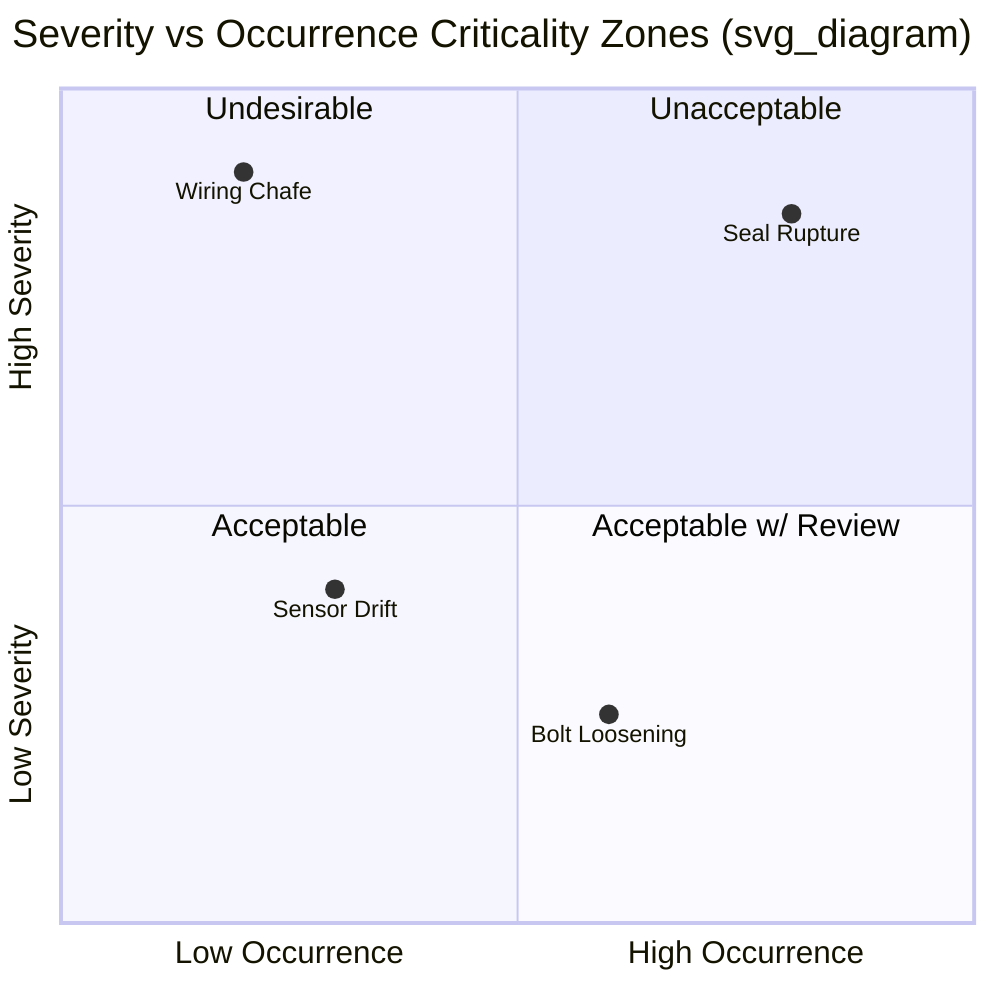

## Combining Severity and Probability of Occurrence

### Overview

FMECA (Failure Mode, Effects, and Criticality Analysis) extends standard FMEA by systematically combining two independent risk dimensions — **severity (S)** and **probability of occurrence (O)** — into a single criticality measure. This combination allows analysts to rank failure modes not merely by how bad their consequences are, but by how likely those consequences are to actually manifest, producing a prioritized action list rather than a flat inventory of failure modes.

Two standard combination methodologies exist, defined primarily by MIL-STD-1629A: the **Criticality Number (Cm) approach** (quantitative) and the **Risk Priority Number (RPN) approach** (semi-quantitative, borrowed from FMEA practice but often folded into FMECA reporting). A third approach, the **Criticality Matrix**, is qualitative/visual rather than purely arithmetic.

### Core Concept: Why Combine the Two Dimensions

A failure mode with catastrophic severity but astronomically low occurrence probability may represent less overall risk than a moderate-severity failure mode that occurs frequently. Neither severity nor occurrence alone gives decision-makers a defensible prioritization; combining them produces a **criticality score** that better reflects expected risk exposure.

$$\text{Criticality} = f(S, O)$$

The function $f$ differs depending on the chosen method — multiplication (RPN-style), weighted multiplication with failure mode ratio and operating time (Cm-style), or matrix placement (qualitative).

### Method 1: The MIL-STD-1629A Criticality Number ($C_m$)

This is the formal quantitative method used in aerospace, defense, and safety-critical industries.

**Formula:**

$$C_m = \beta \cdot \alpha \cdot \lambda_p \cdot t$$

Where:

- $\beta$ = conditional probability of loss (failure effect probability) — the likelihood that the failure effect results in the identified criticality classification, given the failure mode occurs
- $\alpha$ = failure mode ratio — the fraction of the component's total failure rate attributable to this specific failure mode ($\sum \alpha = 1$ across all modes of that item)
- $\lambda_p$ = part failure rate (failures per unit time, e.g., failures per $10^6$ hours), often adjusted for the specific application/environment
- $t$ = operating time or duration of the mission/phase being analyzed

**Item Criticality Number** (aggregated across all failure modes of a single item leading to the same severity classification):

$$C_r = \sum_{n=1}^{N} C_{m_n}$$

**Standard $\beta$ values (MIL-STD-1629A conditional probability table):**

| Failure Effect | β Value | Description |
| --- | --- | --- |
| Actual loss | 1.00 | Loss is certain given the failure occurs |
| Probable loss | 0.10 – 1.00 | Loss is likely but not certain |
| Possible loss | 0 – 0.10 | Loss is conceivable but unlikely |
| No effect | 0 | Failure mode has no bearing on the defined loss |

**Worked Example:**

A hydraulic actuator has a part failure rate $\lambda_p = 5 \times 10^{-6}$ failures/hour. One failure mode — "seal rupture" — accounts for 30% of total failures ($\alpha = 0.30$), and when it occurs, catastrophic loss is probable ($\beta = 0.8$). Mission duration $t = 10$ hours.

$$C_m = 0.8 \times 0.30 \times (5 \times 10^{-6}) \times 10 = 1.2 \times 10^{-5}$$

This $C_m$ is then compared against $C_m$ values of other failure modes for the same item and severity class to rank them.

### Method 2: Risk Priority Number (RPN)

Widely used in automotive (AIAG-VDA), manufacturing, and general industrial FMEA/FMECA, RPN is simpler and more accessible than $C_m$ but is ordinal/index-based rather than a true probabilistic quantity.

**Formula:**

$$RPN = S \times O \times D$$

Where:

- $S$ = Severity rating (typically 1–10 scale)
- $O$ = Occurrence rating (typically 1–10 scale, mapped from failure rate bands)
- $D$ = Detection rating (1–10 scale; inverted — 10 means "very hard to detect")

**Key Points**

- $S \times O$ alone (without Detection) is sometimes used as a pure "criticality" sub-score in FMECA-style analysis before Detection is factored in, since Detection relates to control effectiveness rather than intrinsic risk.
- RPN ranges from 1 (S=1, O=1, D=1) to 1000 (10×10×10), but the scale is **not linear or interval-scaled** — an RPN of 200 is not "twice as bad" as 100 in any rigorous statistical sense. [Inference: this is a well-documented critique in reliability literature, not a universal mathematical property, but it is the standard criticism raised against RPN methodology.]
- Newer AIAG-VDA (2019) guidance replaces raw RPN multiplication with an **Action Priority (AP) table** — a lookup matrix cross-referencing S, O, and D bands directly into High/Medium/Low priority, avoiding the false precision of multiplication.

**Typical Occurrence Rating Table (10-point scale):**

| Rating | Failure Rate | Qualitative Description |
| --- | --- | --- |
| 10 | ≥ 1 in 2 | Very High — failure almost inevitable |
| 8–9 | 1 in 20 to 1 in 8 | High — repeated failures |
| 5–7 | 1 in 2,000 to 1 in 80 | Moderate — occasional failures |
| 2–4 | 1 in 150,000 to 1 in 15,000 | Low — relatively few failures |
| 1 | < 1 in 1,500,000 | Remote — failure unlikely |

### Method 3: Criticality Matrix (Qualitative)

Instead of arithmetic combination, severity categories (rows) are plotted against occurrence/probability levels (columns) in a matrix, with each cell pre-assigned a criticality zone (e.g., Low/Medium/High/Unacceptable). This is the approach favored in MIL-STD-1629A Task 105 and many safety-standard frameworks (e.g., ARP4761 for aerospace).

**Typical structure:**

| Severity ↓ / Probability → | Frequent | Probable | Occasional | Remote | Improbable |
| --- | --- | --- | --- | --- | --- |
| Catastrophic | Unacceptable | Unacceptable | Unacceptable | Undesirable | Acceptable w/ review |
| Critical | Unacceptable | Unacceptable | Undesirable | Undesirable | Acceptable |
| Marginal | Undesirable | Undesirable | Acceptable w/ review | Acceptable | Acceptable |
| Negligible | Acceptable w/ review | Acceptable | Acceptable | Acceptable | Acceptable |

The matrix avoids implying false numerical precision but requires organizational consensus on what qualifies as "Frequent" vs "Remote" and where the zone boundaries fall — this classification is itself a policy decision, not a derived fact.

### Criticality Matrix Diagram (svg_diagram)

### Comparing the Two Quantitative Approaches

| Aspect | Criticality Number ($C_m$) | RPN ($S \times O \times D$) |
| --- | --- | --- |
| Basis | Failure rate data, mission time, failure mode ratio | Ordinal expert-judgment ratings |
| Data requirement | Requires reliability data (λ, α, β) | Requires only rating scales |
| Includes Detection | No (detection handled separately) | Yes |
| Standard origin | MIL-STD-1629A (defense/aerospace) | AIAG/SAE J1739 (automotive) |
| Output type | Continuous probabilistic value | Discrete ordinal index (1–1000) |
| Typical use case | Safety-critical, hardware reliability programs | General manufacturing, process FMEA |

### Practical Workflow for Combining S and O

1. **Assign Severity** independently, based on worst-case credible effect of the failure mode (system-level consequence), using a fixed severity classification scheme (e.g., MIL-STD-882 categories: Catastrophic, Critical, Marginal, Negligible).
2. **Establish Occurrence** independently, from field data, test data, reliability prediction models (e.g., MIL-HDBK-217, published component failure rates), or, absent data, expert-elicited ordinal ratings.
3. **Select combination method** based on data availability and industry convention — use $C_m$ when failure rate/mission data exists; use RPN or the AP table when only ordinal judgment is available.
4. **Compute the combined score** ($C_m$, $S \times O$, or matrix placement).
5. **Rank and threshold** — sort failure modes descending by criticality score, and apply an organizationally defined action threshold (e.g., "any item in the Unacceptable zone requires design mitigation before release").
6. **Iterate post-mitigation** — after corrective action, recompute O (and sometimes S, if the design change reduces consequence severity) to demonstrate risk reduction.

**Example**

Two failure modes on the same item, both Severity = Critical (S=8 on a 10-point scale):

- Failure Mode A: Occurrence = 2 (rare), RPN-style score $S \times O = 16$
- Failure Mode B: Occurrence = 7 (frequent), RPN-style score $S \times O = 56$

Despite identical severity, Failure Mode B is prioritized for corrective action first because its occurrence likelihood is substantially higher, illustrating why severity alone is an inadequate prioritization criterion.

### Common Pitfalls

- **Treating RPN as a true risk value**: RPN is an index for relative sorting within one analysis, not a probability or expected-loss figure; comparing RPNs across different FMECA studies with different rating scales is invalid.
- **Double-counting Detection in $C_m$**: The $C_m$ formula has no Detection term by design; Detection effectiveness is normally addressed via a separate risk-reduction or design-verification argument, not folded into criticality arithmetic.
- **Inconsistent $\alpha$ allocation**: Failure mode ratios ($\alpha$) across all modes of an item must sum to 1; errors here silently distort every $C_m$ calculation for that item.
- **Ignoring mission time sensitivity**: $C_m$ scales linearly with $t$, so comparing criticality numbers computed over different mission durations without normalizing $t$ produces misleading rankings. [Unverified: whether an organization's specific FMECA procedure mandates a normalized reference time varies by program and standard revision.]

**Next Steps**

- Failure Mode Ratio (α) determination methods
- Conditional Probability of Loss (β) classification criteria
- Constructing and populating the Criticality Matrix per MIL-STD-1629A Task 105
- Risk Priority Number vs. Action Priority (AP) tables in AIAG-VDA FMEA Handbook
- Integrating criticality rankings into Design Verification Plans (DVP&R)
- Sensitivity analysis of criticality rankings under data uncertainty