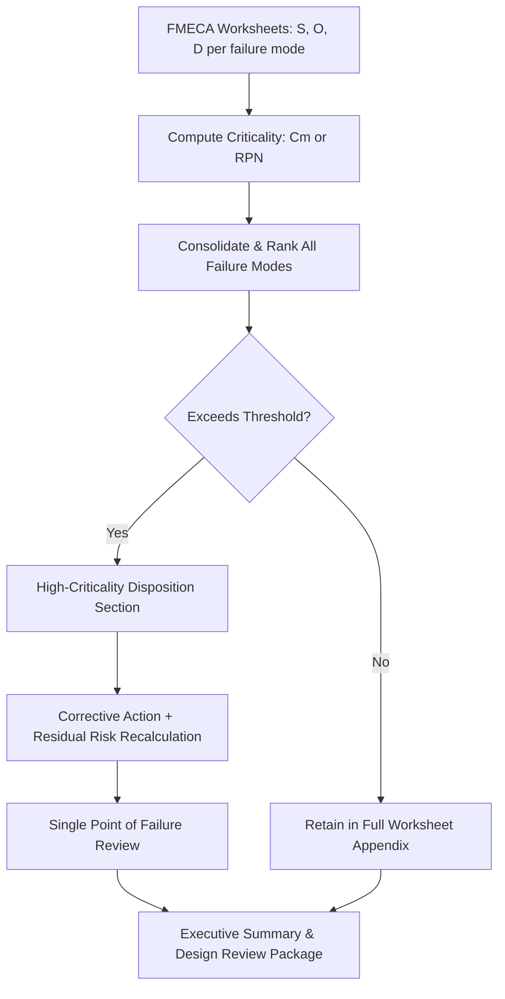

## Criticality Analysis Reporting

### Overview

Criticality analysis reporting is the formal documentation stage of FMECA in which the calculated criticality values ($C_m$, $C_r$, RPN, or matrix rankings) are compiled, contextualized, and presented to enable engineering, safety, and program management decisions. Unlike the analytical worksheets used during the FMECA process itself, the criticality report is a decision-support artifact — it must translate numerical rankings into actionable risk communication for stakeholders who may not have participated in the underlying analysis.

MIL-STD-1629A formalizes this through **Task 105 (Criticality Analysis)**, which specifies both the analytical method and the reporting structure expected as a contract deliverable in defense and aerospace programs. Civil and commercial standards (SAE ARP5580, IEC 60812, AIAG-VDA FMEA Handbook) impose similar but less rigid reporting expectations.

### Purpose of the Report

- Provide traceability from failure mode to system-level consequence to numerical ranking to recommended action
- Support **design reviews** (PDR, CDR) by surfacing which failure modes drive the highest risk exposure at each design maturity milestone
- Feed **maintenance planning** (RCM — Reliability-Centered Maintenance) by identifying which items warrant scheduled inspection, redundancy, or built-in test
- Serve as **objective evidence** for certification bodies (FAA, EASA, MIL-STD compliance audits) that safety-critical failure modes were identified and dispositioned
- Establish a **baseline for re-analysis** — later design changes, field failure data, or corrective actions are compared against this report to demonstrate risk reduction over time

### Standard Report Structure

**1. Executive Summary**

High-level statement of scope, methodology used (qualitative matrix vs. quantitative $C_m$ vs. RPN), and headline findings — typically the count of items falling into each criticality category and any items requiring immediate design action.

**2. Scope and Ground Rules**

- System/item boundary definition
- Indenture level analyzed (system, subsystem, component, part)
- Failure definitions and mission phase(s) considered
- Severity classification scheme used (reference to MIL-STD-882 categories or project-specific equivalent)
- Data sources for failure rates ($\lambda_p$) — field data, MIL-HDBK-217, vendor data, or engineering estimate
- Assumptions and exclusions (e.g., "software-induced failures excluded from this hardware FMECA")

**3. Criticality Analysis Worksheets**

The detailed, item-by-item tabulation. This is the analytical core of the report and typically follows the MIL-STD-1629A Task 105 worksheet columns:

| Item ID | Function | Failure Mode | Failure Cause | Mission Phase | Failure Effect (Local/Next/End) | Severity Class | λp | α | β | t | Cm | Compensating Provisions | Remarks |
| --- | --- | --- | --- | --- | --- | --- | --- | --- | --- | --- | --- | --- | --- |

**4. Criticality Ranking / Matrix**

A consolidated, sorted view — either:

- A **ranked table** listing all failure modes in descending $C_m$ or RPN order, independent of which item/subsystem they belong to, so the highest-risk items across the entire system are visible together
- A **Criticality Matrix plot** (severity vs. occurrence) showing item placement, often color-coded by zone (red/amber/green)

**5. High-Criticality Item Disposition**

For every item exceeding the criticality threshold (organizationally defined, e.g., "$C_r > 1\times10^{-4}$" or "any item in the Unacceptable matrix zone"), the report documents:

- Root cause summary
- Recommended corrective action (design change, redundancy, derating, inspection interval)
- Responsible party and target closure date
- Residual risk after mitigation (recomputed $C_m$/RPN)

**6. Single Point of Failure (SPOF) List**

A dedicated section — often mandatory for safety certification — listing every failure mode where $\beta = 1.0$ (actual/certain loss) and no redundancy or compensating provision exists. This list receives disproportionate review attention because SPOFs bypass the averaging effect of probability weighting.

**7. Appendices**

- Full FMEA/FMECA worksheets (all severity classes, not just high-criticality items)
- Failure rate data sources and derating factors applied
- Revision history / change log against prior report baseline

### Report Content Flow (svg_diagram)

### Key Points

- **Traceability is non-negotiable**: every number in the ranked table must trace back to a worksheet row with documented severity classification, failure rate source, and $\alpha$/$\beta$ derivation. A criticality report without this backing is not auditable and typically fails certification review.
- **Living document convention**: the report is baselined at each major design milestone and revised as field/test data replaces engineering estimates; the revision history section exists specifically to show whether risk trended up or down between baselines.
- **Separate treatment of SPOFs**: because a single point of failure with certain loss ($\beta=1.0$) can have a deceptively low $C_m$ if its failure rate is very small, some review processes flag SPOFs independent of their numerical ranking, since a low-probability catastrophic single point of failure may still be organizationally unacceptable regardless of score. [Inference: this is standard defense/aerospace safety practice reflected in ARP4761 and MIL-STD-882 philosophy, though the specific threshold policy is organization-defined.]
- **Avoid false precision in presentation**: when reporting RPN-based rankings, many organizations explicitly caveat in the report text that RPN differences below a certain margin (e.g., RPN 120 vs. 135) should not be treated as materially different risk levels, given the ordinal nature of the input scales.

### Example Ranked Summary Table (Excerpt)

| Rank | Item | Failure Mode | Severity Class | $C_m$ | Status |
| --- | --- | --- | --- | --- | --- |
| 1 | Hydraulic Actuator | Seal rupture | Catastrophic | $1.2\times10^{-5}$ | Open — redesign in progress |
| 2 | Flight Control Sensor | Signal drift | Critical | $6.5\times10^{-6}$ | Closed — redundant sensor added |
| 3 | Fastener Assembly | Bolt loosening | Marginal | $2.1\times10^{-6}$ | Accepted — inspection interval defined |

### Common Pitfalls

- **Reporting only the worst-case items**: omitting the full worksheet appendix undermines auditability; reviewers need to verify that lower-ranked items were genuinely analyzed and not simply excluded.
- **Mixing $C_m$ and RPN in one ranked list**: because the two are mathematically incompatible (probabilistic value vs. ordinal index), consolidating both into a single sorted table without clear labeling misleads reviewers into false quantitative comparison.
- **Static, one-time reporting**: treating the criticality report as a one-off deliverable rather than a maintained baseline defeats its purpose as an evidence trail for design maturity and risk burn-down. [Unverified: specific update cadence requirements vary by contract and applicable standard revision.]
- **Under-specifying compensating provisions**: a high-severity item marked "acceptable" without a documented compensating provision (redundancy, monitoring, procedural control) is a common finding in certification audits.

**Related Topics**

- MIL-STD-1629A Task 105 deliverable requirements
- Single Point of Failure (SPOF) analysis and elimination strategies
- Linking criticality reports to Reliability-Centered Maintenance (RCM) planning
- Risk burn-down tracking across design review milestones
- Integrating criticality analysis reporting with safety case documentation (ARP4761, DO-178C interfaces)
- Software tools for FMECA reporting automation (Relex, Windchill Quality Solutions, ReliaSoft XFMEA)