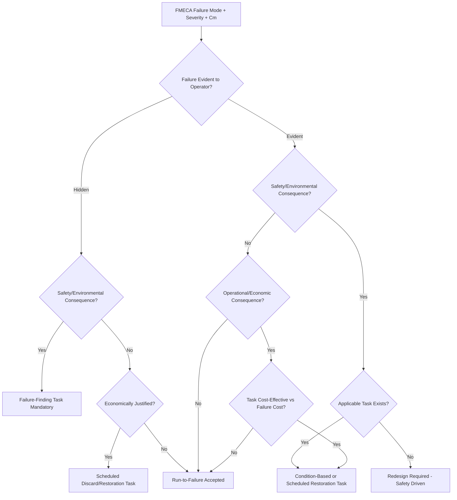

## Reliability Centered Maintenance Linkage

### Overview

Reliability-Centered Maintenance (RCM) is a structured analytical process for determining the most effective maintenance strategy for a physical asset, and it depends directly on the outputs of FMEA/FMECA as its primary analytical input. Where FMECA identifies *what* can fail, *how severe* the consequence is, and *how likely* it is to occur, RCM answers the downstream question: *what should be done about it, proactively, before it happens?* The linkage between the two disciplines is formalized in SAE JA1011 (RCM standard) and SAE JA1012 (RCM guide), and originates historically from the MSG-3 process developed for commercial aviation maintenance programs.

FMECA without an RCM linkage produces a prioritized risk list with no maintenance action; RCM without FMECA has no defensible technical basis for its failure mode inputs. The two are designed to function as a continuous pipeline.

### The Conceptual Linkage

$$\text{FMECA Output} \rightarrow \text{RCM Decision Logic} \rightarrow \text{Maintenance Task}$$

FMECA supplies three specific data elements that RCM decision logic consumes directly:

1. **Failure modes and causes** — RCM does not re-derive failure modes; it inherits them from the FMECA worksheet's Failure Mode and Failure Cause columns.
2. **Failure effects and severity classification** — RCM's decision tree branches primarily on consequence category (safety, operational, economic, hidden), which maps directly onto the FMECA severity classification scheme.
3. **Criticality/probability data** ($C_m$, $\lambda_p$, occurrence rating) — used to determine whether a proactive task is technically justified and cost-effective versus a run-to-failure strategy.

### RCM Decision Logic Tree (svg_diagram)

### The Four RCM Consequence Categories and Their FMECA Mapping

| RCM Consequence Category | Corresponds to FMECA Severity Concept | Typical Maintenance Response |
| --- | --- | --- |
| Hidden failure, safety/environmental | Catastrophic/Critical, but failure is undetected by normal operation | Mandatory failure-finding task (scheduled function test) |
| Evident failure, safety/environmental | Catastrophic/Critical severity, β near 1.0 | Proactive task required if technically feasible, else redesign |
| Evident failure, operational | Marginal severity, affects output/cost/schedule | Task justified only if cost of task < cost of failure |
| Evident/hidden failure, non-operational | Negligible severity | Run-to-failure generally acceptable |

### Task Selection Logic Driven by Criticality Data

RCM does not simply assign "do maintenance" to every high-$C_m$ item — it applies a feasibility and effectiveness test derived from the failure mode's characteristics, which are themselves FMECA-sourced:

- **Age-exploration data** (from FMECA failure cause analysis) determines whether the failure exhibits an age-related wear-out pattern (justifying scheduled restoration/discard) or a random failure pattern (favoring condition monitoring or failure-finding instead).
- **Detectability of degradation** (related to FMECA's Detection rating, where used) determines whether a condition-based task (vibration analysis, oil analysis, NDT inspection) is technically feasible.
- **$C_m$/RPN magnitude** determines whether the cost of a proactive task is justified relative to the expected cost of failure — this is the direct quantitative handoff point between the two methodologies.

$$\text{Task justified if: } \text{Cost}_{\text{task}} < C_m \times \text{Cost}_{\text{failure consequence}}$$

[Inference: this cost-benefit framing is the standard economic logic underlying RCM task justification per SAE JA1011, though exact cost modeling conventions vary by organization and are not rigidly specified in the standard itself.]

### Practical Workflow for Establishing the Linkage

1. **Complete FMECA at the appropriate indenture level** — RCM is typically performed at the "significant item" level (assemblies whose failure has a meaningful consequence), so the FMECA must be conducted at a level of detail that resolves individual, distinguishable failure modes rather than only system-level effects.
2. **Filter FMECA output for RCM-relevant items** — not every FMECA line item requires RCM analysis; items below a criticality threshold or with clearly negligible severity are typically excluded to focus RCM effort where it adds value (the "significant item" screening step).
3. **Map each failure mode through the RCM decision logic tree** — using the FMECA-derived severity class and hidden/evident determination as the tree's primary branch points.
4. **Select and document the maintenance task** — scheduled restoration, scheduled discard, on-condition (predictive) task, failure-finding task, or run-to-failure, each tied back to the originating FMECA failure mode ID for traceability.
5. **Feed maintenance task outcomes back into FMECA as field data** — actual task intervals, inspection findings, and failure occurrences observed during maintenance execution should update the FMECA's occurrence ratings and failure rate estimates ($\lambda_p$) in the next analysis cycle, closing the loop.

### Traceability Table Example

| FMECA Item ID | Failure Mode | Severity Class | $C_m$ | Hidden/Evident | RCM Task Type | Task Interval |
| --- | --- | --- | --- | --- | --- | --- |
| FM-014 | Bearing seizure | Critical | $4.3\times10^{-6}$ | Evident | On-condition (vibration monitoring) | Continuous/monthly trend review |
| FM-027 | Backup pump fails to start | Critical | $1.1\times10^{-6}$ | Hidden | Failure-finding test | Quarterly functional test |
| FM-031 | Gasket seepage | Negligible | $8.0\times10^{-8}$ | Evident | Run-to-failure | N/A |

### Key Points

- **RCM is a consumer, not a duplicate, of FMECA**: re-deriving failure modes independently within RCM analysis wastes effort and risks inconsistency between the two documents; the failure mode taxonomy should be authored once, in the FMECA, and referenced by ID in the RCM output.
- **Hidden failures require FMECA to explicitly flag detectability**, since this determination is what routes a failure mode toward a mandatory failure-finding task rather than economic optimization — an FMECA that does not capture whether a failure is evident to the operator during normal duty is missing a field RCM needs.
- **The feedback loop is bidirectional**: RCM task execution generates real failure and interval data that should periodically update the FMECA's occurrence probability inputs, improving the accuracy of $C_m$ over the equipment lifecycle rather than treating the original FMECA as static.
- **Redesign escalation**: when RCM logic reaches a safety-consequence branch with no technically feasible task available, the standard requires escalation back to design (redesign recommendation), which becomes a new input into the next FMECA revision — closing the loop at the design level as well as the maintenance level.

### Common Pitfalls

- **Performing RCM at a mismatched indenture level to the FMECA**: if FMECA was done at the system level and RCM attempts component-level task assignment, the severity and criticality data will not resolve to the correct level of maintenance granularity.
- **Ignoring the hidden-failure branch**: teams that treat all failures as "evident" default many hidden dangerous failures (e.g., protective device failures) into run-to-failure by omission, when a mandatory failure-finding task was actually required.
- **Failing to close the feedback loop**: treating RCM task history as operationally separate from the FMECA rather than as a data source for FMECA revision causes the criticality analysis to become stale relative to actual field reliability performance. [Unverified: the specific update cadence and formal feedback mechanism vary significantly by organizational maintenance management system maturity.]
- **Conflating cost-justification with safety-justification**: applying the economic cost-benefit test (task cost vs. failure cost) to a safety/environmental consequence branch, where SAE JA1011 requires a task if technically feasible regardless of cost.

**Related Topics**

- SAE JA1011 / JA1012 RCM standard requirements
- MSG-3 analysis process (commercial aviation maintenance linkage)
- Age-exploration and P-F interval determination for condition-based tasks
- Hidden failure and failure-finding task interval calculation
- Integrating RCM outputs into Computerized Maintenance Management Systems (CMMS)
- Reliability growth analysis using field data feedback into FMECA revisions