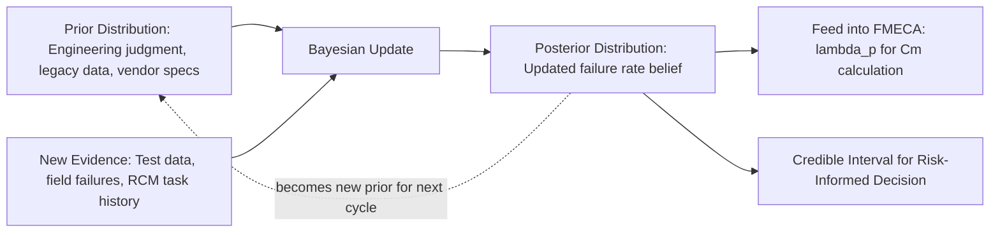

## Bayesian Approaches to Failure Probability

### Overview

Bayesian approaches to failure probability estimation provide a formal mathematical framework for updating failure rate and reliability estimates as new evidence (test data, field failures, expert judgment) becomes available, rather than relying solely on fixed historical failure rate tables (e.g., MIL-HDBK-217) or classical frequentist point estimates. In FMECA and reliability engineering, Bayesian methods are particularly valuable when failure data is sparse — common in new designs, low-volume production, or early-life field deployments — because the framework allows prior engineering knowledge to be combined coherently with limited observed data.

### Core Mathematical Foundation

Bayes' theorem, applied to reliability parameter estimation, updates a prior belief about a failure rate parameter $\lambda$ using observed failure data:

$$P(\lambda \mid D) = \frac{P(D \mid \lambda) \, P(\lambda)}{P(D)}$$

Where:

- $P(\lambda)$ = **prior distribution** — the engineer's belief about the failure rate before observing new data (derived from similar components, vendor specifications, or expert elicitation)
- $P(D \mid \lambda)$ = **likelihood** — the probability of observing the actual test/field data $D$ given a particular failure rate $\lambda$
- $P(\lambda \mid D)$ = **posterior distribution** — the updated belief about $\lambda$ after incorporating the observed data
- $P(D)$ = **normalizing constant** (marginal likelihood), ensuring the posterior integrates to 1

### Why Bayesian Methods Matter for FMECA

Classical FMECA severity/occurrence combination (as in $C_m = \beta \alpha \lambda_p t$) treats $\lambda_p$ as a fixed point value drawn from a handbook or test report. This has two well-known limitations:

1. **No mechanism to incorporate small-sample field data** — if a new design accumulates only 3 test failures in 10,000 hours, a classical maximum-likelihood estimate ($\hat\lambda = 3/10{,}000$) ignores that this estimate is highly uncertain and could be refined using knowledge of similar legacy components.
2. **No formal uncertainty quantification** — a single $\lambda_p$ value gives no sense of confidence bounds, whereas a posterior distribution naturally yields credible intervals.

Bayesian updating addresses both by treating $\lambda$ as a random variable with a full probability distribution, updated incrementally as evidence accumulates — which is especially relevant to the RCM feedback loop, where field maintenance data should progressively refine FMECA occurrence estimates over the equipment lifecycle.

### Common Prior/Likelihood Model Pairs in Reliability

**Exponential failure model with Gamma prior (conjugate pair)**

For components assumed to fail at a constant hazard rate (exponential lifetime distribution), the Gamma distribution is the conjugate prior for $\lambda$, meaning the posterior remains a Gamma distribution — closed-form, no numerical integration required.

- Prior: $\lambda \sim \text{Gamma}(\alpha_0, \beta_0)$
- Likelihood (given $n$ failures observed over total time $T$): $P(D\mid\lambda) \propto \lambda^n e^{-\lambda T}$
- Posterior: $\lambda \mid D \sim \text{Gamma}(\alpha_0 + n, \, \beta_0 + T)$

**Worked Example:**

A component's prior belief (from similar legacy hardware) is $\lambda \sim \text{Gamma}(\alpha_0=2, \beta_0=100{,}000\text{ hrs})$, implying a prior mean failure rate of $\alpha_0/\beta_0 = 2\times10^{-5}$/hr. New qualification testing observes $n=1$ failure over $T=50{,}000$ hours.

$$\text{Posterior: } \lambda \mid D \sim \text{Gamma}(2+1,\ 100{,}000+50{,}000) = \text{Gamma}(3,\ 150{,}000)$$

$$\text{Posterior mean } = \frac{3}{150{,}000} = 2.0\times10^{-5}\text{/hr}$$

The posterior mean shifts only modestly from the prior because the new test data, while informative, is weighted proportionally against the accumulated prior evidence — this is the essential Bayesian behavior of "data updates belief, weighted by relative information content."

**Binomial model with Beta prior (conjugate pair)**

Used when tracking pass/fail outcomes (e.g., proportion of units failing a stress test) rather than time-to-failure:

- Prior: $p \sim \text{Beta}(a, b)$
- Likelihood (given $k$ failures in $n$ trials): $P(D\mid p) \propto p^k(1-p)^{n-k}$
- Posterior: $p \mid D \sim \text{Beta}(a+k, \, b+n-k)$

This model pair is common in FMECA when the "occurrence" input is derived from a fixed number of test units or sample audits rather than a continuous time-based failure rate.

### Bayesian Updating Flow (svg_diagram)

### Selecting Priors in Practice

| Prior Type | When Used | Data Source |
| --- | --- | --- |
| Informative prior | Similar/legacy component exists with known field history | Prior generation FMECA data, field returns |
| Weakly informative prior | General engineering expectation exists but not precise | Vendor MTBF estimates, handbook ranges treated as loose bounds |
| Non-informative (flat/Jeffreys) prior | No meaningful prior knowledge; let data dominate | Used cautiously — early in analysis before any test data exists |
| Expert-elicited prior | No historical data at all (novel technology) | Structured expert judgment elicitation (e.g., using the Delphi method) |

[Inference: the specific elicitation protocol and prior selection method is a matter of organizational or program-specific policy, not something rigidly mandated by any single reliability standard.]

### Applying Bayesian Posteriors to Criticality Calculations

Once a posterior distribution for $\lambda_p$ is obtained, it can be propagated directly into the FMECA criticality formula, replacing the point estimate with a distribution:

$$C_m(\lambda) = \beta \cdot \alpha \cdot \lambda \cdot t, \quad \lambda \sim \text{Gamma}(\alpha_0+n,\ \beta_0+T)$$

This yields a **distribution over $C_m$** rather than a single value, from which analysts can report:

- The posterior mean $C_m$ (point estimate for ranking, comparable to classical usage)
- A credible interval (e.g., 90% credible interval) expressing the range of plausible criticality values
- The probability that $C_m$ exceeds a defined risk acceptance threshold, $P(C_m > C_{threshold})$

This last quantity is particularly useful in risk-informed decision-making frameworks, since it directly answers "how confident are we that this failure mode is unacceptable?" rather than relying on a single point value crossing a hard line.

### Key Points

- **Bayesian methods do not replace FMECA's qualitative structure** — failure mode identification, effects analysis, and severity classification remain unchanged; Bayesian inference specifically refines the *occurrence* input ($\lambda_p$, $\alpha$) with formal uncertainty quantification.
- **Conjugate priors (Gamma-Exponential, Beta-Binomial) are preferred in practice** because they permit closed-form posterior updates without requiring simulation, making them tractable for routine engineering use; non-conjugate models typically require numerical methods such as Markov Chain Monte Carlo (MCMC).
- **The posterior from one analysis cycle becomes the prior for the next**, creating a naturally iterative, self-correcting estimation process well-suited to the RCM feedback loop described in reliability program lifecycles.
- **Bayesian credible intervals differ conceptually from frequentist confidence intervals** — a 90% credible interval is interpreted as "there is a 90% probability the true parameter lies in this range given the data and prior," a direct probabilistic statement not available in classical frequentist inference.

### Common Pitfalls

- **Overly informative priors masking real degradation**: if a strong prior from a legacy component is applied to a genuinely different or degraded design, the posterior may be pulled toward an inaccurate historical estimate, understating true risk. [Inference: this is a recognized general risk in Bayesian prior selection, not specific to any one industry standard.]
- **Treating non-conjugate models as conjugate for convenience**: forcing a Gamma-Exponential framework onto data that does not follow a constant hazard rate (e.g., wear-out failures better modeled by Weibull) produces a mathematically tractable but physically inaccurate posterior.
- **Ignoring prior-data conflict**: when new evidence strongly contradicts the prior, a naive weighted-average posterior can mask the conflict rather than flagging it; robust Bayesian methods or explicit conflict diagnostics are needed to catch this.
- **Reporting only the posterior mean**: discarding the full posterior distribution and reporting only a single point estimate for $C_m$ forfeits the primary advantage of the Bayesian approach — the uncertainty quantification itself.

**Related Topics**

- Weibull-Bayesian models for wear-out (non-constant hazard) failure modes
- Markov Chain Monte Carlo (MCMC) methods for non-conjugate reliability models
- Bayesian Belief Networks (BBNs) for multi-failure-mode dependency modeling
- Expert elicitation protocols (Delphi method, Cooke's Classical Model) for prior construction
- Reliability growth modeling (Duane model, AMSAA-Crow) and its Bayesian extensions
- Risk-informed decision-making frameworks using posterior credible intervals