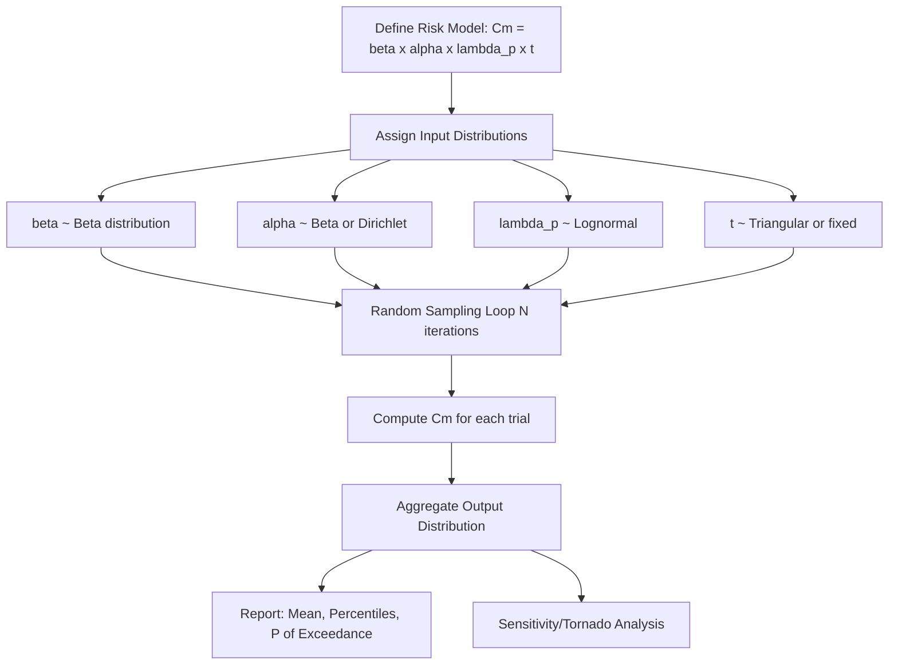

## Monte Carlo Simulation for Risk Modeling

### Overview

Monte Carlo simulation is a computational technique that estimates the behavior of a system by repeatedly sampling random values from probability distributions assigned to its uncertain inputs, then aggregating the results to characterize the distribution of possible outcomes. In FMECA and reliability engineering, Monte Carlo methods address a core limitation of deterministic criticality calculations ($C_m = \beta\alpha\lambda_p t$, or RPN = $S \times O \times D$): both treat every input as a fixed point value, when in reality severity, occurrence, failure rate, and detection effectiveness are all uncertain quantities with their own distributions. Monte Carlo simulation propagates that input uncertainty through the entire risk model to produce a distribution of possible criticality/risk outcomes, rather than a single number.

### Core Concept

Rather than computing $C_m$ once using point estimates, Monte Carlo simulation:

1. Assigns a **probability distribution** to each uncertain input variable (e.g., $\lambda_p \sim \text{Lognormal}$, $\alpha \sim \text{Beta}$, mission time $t \sim \text{Triangular}$)
2. **Randomly samples** one value from each input distribution
3. **Computes the output** (e.g., $C_m$) using that sampled combination
4. **Repeats** the sample-and-compute cycle thousands to millions of times
5. **Aggregates** all computed outputs into an empirical output distribution, from which summary statistics, percentiles, and probability-of-exceedance values are derived

$$C_{m,i} = \beta_i \cdot \alpha_i \cdot \lambda_{p,i} \cdot t_i, \quad i = 1, 2, \dots, N$$

where each subscript $i$ denotes one simulation trial's randomly sampled input set, and $N$ is the total number of simulation iterations (commonly $10^4$–$10^6$).

### Why Monte Carlo Matters for FMECA/Risk Modeling

- **Captures compounding uncertainty**: when multiple uncertain inputs multiply together (as in $C_m$), the output uncertainty is not a simple sum of individual input uncertainties — Monte Carlo correctly propagates this through repeated sampling rather than requiring closed-form error propagation formulas.
- **Reveals tail risk**: a deterministic point estimate can hide the probability that a failure mode's true criticality lies far above the nominal calculated value; Monte Carlo output distributions expose this directly via percentiles (e.g., 95th percentile $C_m$).
- **Supports correlated inputs**: failure rate and mission severity are sometimes correlated (e.g., harsher operating environments increase both failure rate and consequence severity); Monte Carlo frameworks can sample from correlated joint distributions, which point-estimate methods cannot represent at all.
- **Enables sensitivity analysis**: by tracking which input variables' sampled values correlate most strongly with high output values across all trials, analysts identify which uncertain parameter is the dominant driver of risk — informing where further data collection or design margin would have the greatest risk-reduction payoff.

### Simulation Workflow (svg_diagram)

### Selecting Input Distributions for Reliability Parameters

| Parameter | Common Distribution | Rationale |
| --- | --- | --- |
| Failure rate ($\lambda_p$) | Lognormal | Failure rates are strictly positive and often exhibit multiplicative uncertainty (order-of-magnitude spread) |
| Failure mode ratio ($\alpha$) | Beta or Dirichlet (multi-mode) | Bounded on [0,1]; Dirichlet used when multiple $\alpha$ values for one item must sum to 1 |
| Conditional loss probability ($\beta$) | Beta | Naturally bounded on [0,1], flexible shape for expert-elicited ranges |
| Mission/operating time ($t$) | Triangular or Uniform | Simple to elicit from engineers as (minimum, most likely, maximum) |
| Severity/consequence cost | Lognormal or PERT | Cost impacts often right-skewed (occasional very high-cost outcomes) |

**PERT distribution** (Program Evaluation and Review Technique) is frequently preferred over Triangular for expert-elicited inputs because its smoothed, beta-based shape avoids the artificial sharp peak of the Triangular distribution while still only requiring three elicited parameters (min, most likely, max).

### Worked Example (Conceptual)

A criticality analysis for a hydraulic actuator seal rupture failure mode has:

- $\beta \sim \text{Beta}(8, 2)$ (mean ≈ 0.8, reflecting probable-loss classification)
- $\alpha \sim \text{Beta}(3, 7)$ (mean ≈ 0.3, fraction of total item failures attributable to this mode)
- $\lambda_p \sim \text{Lognormal}(\mu=\ln(5\times10^{-6}), \sigma=0.4)$ (order-of-magnitude uncertainty around the handbook value)
- $t = 10$ hours (fixed, known mission duration)

Running $N=100{,}000$ trials produces an empirical distribution of $C_m$ values. Rather than reporting the single deterministic value ($1.2\times10^{-5}$, as computed in point-estimate FMECA), the Monte Carlo output might report:

- Mean $C_m \approx 1.3\times10^{-5}$
- 5th–95th percentile range: $4\times10^{-6}$ to $3.1\times10^{-5}$
- $P(C_m > 2\times10^{-5}) \approx 18\%$ — the probability the failure mode's true criticality exceeds a defined risk-acceptance threshold

This last figure directly supports risk-informed decision-making: rather than a binary "above/below threshold" call based on a single point value, management sees the probability of unacceptable risk.

### Sensitivity Analysis via Monte Carlo (Tornado Diagrams)

A standard byproduct of Monte Carlo risk modeling is a **tornado diagram**, which ranks input variables by their correlation (or contribution to variance) with the output. This is typically produced by computing rank correlation coefficients (e.g., Spearman's $\rho$) between each sampled input and the resulting output across all trials.

**Example (Illustrative) Sensitivity Ranking:**

| Input Variable | Correlation with Output $C_m$ | Interpretation |
| --- | --- | --- |
| $\lambda_p$ (failure rate) | 0.71 | Dominant driver of output uncertainty — refine this estimate first |
| $\beta$ (conditional loss) | 0.38 | Secondary driver |
| $\alpha$ (failure mode ratio) | 0.19 | Minor contributor |
| $t$ (mission time) | 0.02 | Negligible — was treated as fixed anyway |

This ranking directs engineering effort: if $\lambda_p$ dominates output uncertainty, further reliability testing to tighten the failure rate estimate yields more risk-reduction value than refining $\alpha$ or $\beta$ elicitation.

### Relationship to Bayesian Methods

Monte Carlo simulation and Bayesian inference are complementary rather than competing techniques. A Bayesian posterior distribution for $\lambda_p$ (as derived from a Gamma-Exponential conjugate update) is a natural direct input to a Monte Carlo risk model — the posterior *is* the distribution to sample from, rather than an assumed Lognormal or expert-elicited shape. Monte Carlo simulation is also the standard numerical method used to approximate Bayesian posteriors that are not analytically tractable (non-conjugate models), via Markov Chain Monte Carlo (MCMC) sampling.

### Key Points

- **Monte Carlo does not require input distributions to be conjugate or closed-form** — any distribution shape (empirical, multimodal, correlated) can be sampled numerically, which is its primary advantage over analytical uncertainty propagation methods.
- **Convergence requires sufficient iterations**: the empirical output distribution's accuracy improves with $\sqrt{N}$, meaning quadrupling iteration count only halves the sampling error — practitioners typically run convergence checks (comparing output statistics at increasing $N$) rather than assuming a fixed iteration count is always sufficient.
- **Correlated inputs must be modeled explicitly**: naive independent sampling of correlated variables (e.g., using a Cholesky decomposition or copula to induce correlation) understates or overstates output variance if the true dependency structure is ignored.
- **Output percentiles, not just the mean, drive risk decisions**: reporting only the mean $C_m$ discards the tail-risk information that is Monte Carlo's primary value-add over deterministic point estimates.

### Common Pitfalls

- **Garbage-in distributions**: assigning arbitrary or poorly justified distribution shapes/parameters to inputs produces a precise-looking but meaningless output distribution; distribution selection should be grounded in actual data or documented expert elicitation, not convenience.
- **Ignoring input correlation structure**: treating $\lambda_p$ and severity as independent when field data suggests they co-vary with operating environment understates true tail risk.
- **Insufficient iteration count**: stopping simulation too early (e.g., $N=100$) produces unstable percentile estimates, particularly at the tails (5th/95th percentiles), which are often the figures decision-makers care most about.
- **Conflating simulation output with validated prediction**: a Monte Carlo output distribution is only as credible as its input distributions; it does not independently validate that the underlying risk model structure ($C_m$ formula, dependency assumptions) itself is correct. [Unverified: the degree of model-structure validation performed varies significantly by program maturity and is not standardized across industries.]

**Related Topics**

- Latin Hypercube Sampling as a variance-reduction alternative to naive Monte Carlo
- Markov Chain Monte Carlo (MCMC) for non-conjugate Bayesian posterior approximation
- Correlation modeling with copulas for dependent risk inputs
- Tornado diagram and sensitivity analysis interpretation in risk models
- Fault Tree Analysis (FTA) integration with Monte Carlo system reliability modeling
- Software tools for Monte Carlo risk simulation (@RISK, Crystal Ball, Python/NumPy-based custom frameworks)