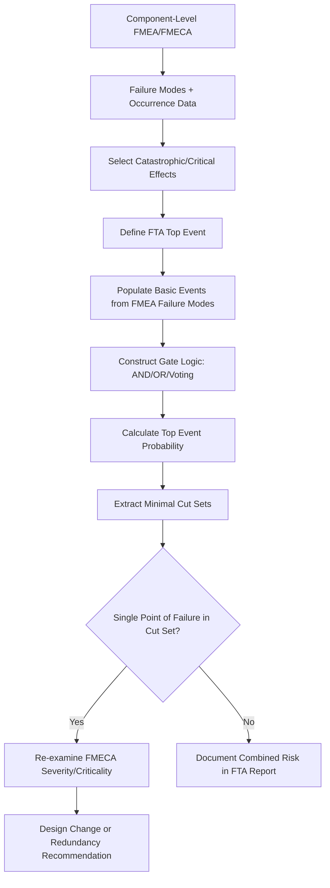

## Combining FMEA with Fault Tree Analysis

### Overview

FMEA (Failure Mode and Effects Analysis) and Fault Tree Analysis (FTA) are complementary reliability techniques that approach system risk from opposite analytical directions. FMEA is a **bottom-up, inductive** method — it starts from individual component/failure modes and traces forward to determine system-level effects. FTA is a **top-down, deductive** method — it starts from a defined undesired system-level event (the "top event") and works backward to identify the combinations of lower-level failures that could cause it. Combining the two provides both breadth (FMEA's exhaustive component-level coverage) and depth (FTA's rigorous logical modeling of failure combinations, redundancy, and common-cause effects), which neither technique alone fully achieves.

### Directional Contrast

$$\text{FMEA: Component Failure} \rightarrow \text{Local Effect} \rightarrow \text{System Effect}$$

$$\text{FTA: Top Event} \rightarrow \text{Intermediate Causes} \rightarrow \text{Basic Events (Component Failures)}$$

| Aspect | FMEA | FTA |
| --- | --- | --- |
| Direction | Bottom-up (inductive) | Top-down (deductive) |
| Starting point | Individual failure mode | Defined undesired top event |
| Strength | Exhaustive coverage of all failure modes | Models logical combinations (AND/OR gates), redundancy |
| Weakness | Does not natively model multi-failure combinations | Does not natively guarantee exhaustive component coverage |
| Typical output | Ranked list (RPN, $C_m$) of failure modes | Probability of top event; minimal cut sets |
| Handles redundancy well | No — treats each failure mode independently | Yes — AND gates natively represent redundant paths |
| Handles common-cause failure | Difficult | Yes — explicit common-cause basic events |

### Why Combine Them

FMEA's independence assumption is its principal limitation: standard FMEA criticality calculations ($C_m = \beta\alpha\lambda_p t$) evaluate each failure mode as though it acts alone. In reality, many catastrophic system failures require the **simultaneous or sequential failure of multiple components** (e.g., primary system fails AND backup system fails). FTA's Boolean logic gates (AND, OR, NOT, voting gates) are purpose-built to represent exactly this — redundancy, backup paths, and combined failure conditions that FMEA structurally cannot express on its own.

Conversely, FTA analysts constructing a fault tree from scratch risk **missing basic events** — failure modes that were never considered because no systematic bottom-up survey of the hardware was performed. A completed FMEA supplies a validated, exhaustive failure mode inventory that populates the fault tree's basic events with confidence that the component-level failure space has been fully surveyed.

### Integration Workflow

**Step 1 — Conduct FMEA at the component/part level**

Produces the exhaustive list of failure modes, their local/next-level/end effects, and (in FMECA) their occurrence probabilities ($\lambda_p$).

**Step 2 — Define the FTA top event**

Typically the most severe (Catastrophic/Critical) system-level effects identified during the FMEA's severity classification become candidate FTA top events (e.g., "Loss of hydraulic pressure to primary flight control surface").

**Step 3 — Populate FTA basic events from FMEA failure modes**

Each FMEA failure mode whose "end effect" contributes to the defined top event becomes a **basic event** in the fault tree, inheriting its occurrence probability directly from the FMEA/FMECA's $\lambda_p$ or occurrence rating — eliminating duplicate data derivation between the two analyses.

**Step 4 — Construct the logic structure**

Analysts add the Boolean gate structure (AND/OR/voting logic) representing how basic events combine — this is the information FMEA cannot supply, since it evaluates failure modes independently.

**Step 5 — Calculate top event probability and identify minimal cut sets**

$$P(\text{Top Event}) = f(\text{gate logic}, \, P(\text{basic events}))$$

For an OR gate: $P_{\text{top}} \approx \sum P_i$ (for small probabilities)

For an AND gate: $P_{\text{top}} = \prod P_i$ (assuming independence)

**Minimal cut sets** — the smallest combinations of basic events whose simultaneous occurrence causes the top event — are extracted algorithmically and ranked by probability, directly identifying which combinations of FMEA-sourced failure modes pose the greatest combined risk.

**Step 6 — Feed FTA results back into FMECA**

Failure modes appearing in low-order cut sets (especially single-basic-event cut sets, representing single points of failure that bypass redundancy) should have their FMECA severity/criticality re-examined, since FTA has revealed they carry system-level consequence not fully apparent from independent FMEA analysis alone.

### Integration Flow (svg_diagram)

### Worked Example (Conceptual)

**FMEA-derived failure modes** for a dual-redundant fuel pump system:

- FM-101: Pump A mechanical seizure, $\lambda_p = 3\times10^{-6}$/hr
- FM-102: Pump B mechanical seizure, $\lambda_p = 3\times10^{-6}$/hr
- FM-103: Shared power supply failure, $\lambda_p = 1\times10^{-5}$/hr

**FTA top event**: "Loss of fuel delivery"

**Gate structure**:

- Top event = (Pump A fails **AND** Pump B fails) **OR** (Shared power supply fails)

Even though the FMEA might individually classify FM-101 and FM-102 as lower criticality (since each pump alone is redundant), the FTA reveals that FM-103 (shared power supply) is a **single point of failure** bypassing the pump redundancy entirely — a system-level insight that independent FMEA analysis of FM-103 alone might under-weight if its local effect ("one power feed lost") doesn't obviously look catastrophic in isolation from the redundancy architecture.

$$P(\text{Top Event}) \approx [P(\text{FM-101}) \times P(\text{FM-102})] + P(\text{FM-103})$$

$$\approx [(3\times10^{-6})(3\times10^{-6})] + (1\times10^{-5}) \approx 1.0\times10^{-5}\text{ per hour}$$

The shared power supply term dominates the top event probability by roughly three orders of magnitude over the dual-pump AND-gate term — precisely the kind of single-point-of-failure dominance that FTA is designed to surface and that FMEA alone would not have quantified.

### Key Points

- **Data should flow one direction to avoid duplication**: occurrence/failure rate data is authored once in the FMECA and referenced (not re-derived) in the FTA basic events, preserving a single source of truth and traceability between the two documents.
- **FTA is the natural tool for validating FMEA's independence assumption**: any FMEA failure mode whose consequence depends on the state of another component (redundancy, shared resources, common-cause) is a candidate for FTA modeling rather than standalone FMEA criticality scoring.
- **Common-cause failures are FTA's distinct contribution**: a shared basic event appearing in multiple branches of the fault tree (e.g., the same power supply feeding two "independent" pumps) is how FTA formally captures common-cause failure — a phenomenon that per-failure-mode FMEA scoring cannot represent at all.
- **The combination is bidirectional and iterative**: FMEA seeds FTA with basic events and probabilities; FTA's minimal cut set analysis feeds back into FMEA by flagging failure modes whose true system-level criticality was underestimated in isolation.

### Common Pitfalls

- **Treating FMEA and FTA as fully independent deliverables**: performing both without deliberately cross-referencing failure mode IDs and occurrence data creates two internally inconsistent risk pictures of the same system, undermining the traceability that certification reviews expect.
- **Missing common-cause basic events**: constructing a fault tree with "independent" AND-gate branches that actually share an unmodeled common dependency (power, cooling, software) produces an artificially low top-event probability. [Inference: this is one of the most frequently cited FTA modeling errors in reliability engineering practice, though its prevalence in any specific program is not something that can be generically quantified.]
- **Skipping the FTA-to-FMECA feedback step**: identifying a critical minimal cut set in FTA but not updating the corresponding FMECA severity/criticality entries leaves the two documents inconsistent and denies the FMECA's design-review audience visibility into the system-level risk FTA uncovered.
- **Assuming basic event independence without justification**: the AND-gate probability multiplication formula ($P = \prod P_i$) is only valid under a true independence assumption; applying it to basic events with any shared dependency understates the actual top event probability. [Unverified: whether a specific fault tree's independence assumptions have been formally validated depends on the rigor of that program's peer review process.]

**Related Topics**

- Minimal cut set algorithms and qualitative/quantitative FTA analysis
- Common-cause failure analysis and beta-factor modeling
- Event Tree Analysis (ETA) as a complementary forward-consequence technique
- Integrating FMEA/FTA outputs into a formal safety case (ARP4761, IEC 61508)
- Reliability Block Diagrams (RBD) as an alternative redundancy modeling notation
- Software tools for combined FMEA/FTA analysis (Windchill, ReliaSoft BlockSim, isograph)